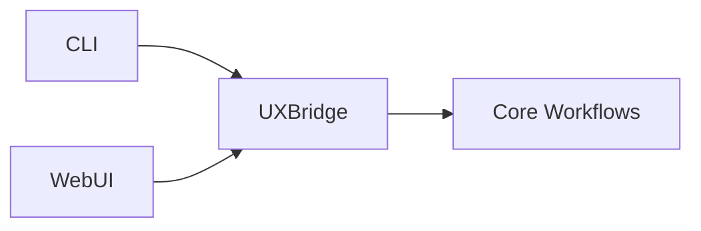

---

author: DevSynth Team
date: '2025-06-15'
last_reviewed: "2025-07-10"
status: draft
tags:

- analysis
- cli
- usability

title: DevSynth CLI and UI Improvement Plan
version: "0.1.0a1"
---
<div class="breadcrumbs">
<a href="../index.md">Documentation</a> &gt; <a href="index.md">Analysis</a> &gt; DevSynth CLI and UI Improvement Plan
</div>

# DevSynth CLI and UI Improvement Plan

This document summarizes the current operating modes of the DevSynth tool and outlines areas needing improvement along with concrete action items. The goal is to reduce the learning curve and provide clearer feedback during the development process.

## Current Operating Modes and UI

- **Entry point**: Typer-based CLI exposing commands such as `init`, `spec`, `test`, and `code`.
- **Interactive options**: e.g. `devsynth inspect --interactive` for manual inspection flows.
- **Configuration**: YAML-based project files with feature flags for capabilities like dialectical reasoning and WSDE collaboration. Flags can be toggled via CLI or during `devsynth init`.
- **Usability requirements**: Basic progress indicators and minimal error handling.
- **Dialectical evaluation**: Documentation notes a steep learning curve, no GUI, complex configuration, and limited guidance.
- **Offline fallback**: Described in specifications but not fully implemented.


## Areas Needing Improvement

1. CLI output lacks rich progress feedback.
2. The guided setup wizard is implemented but needs refinement.
3. Error messages provide little recovery guidance.
4. Collaboration features need further polish.
5. No GUI or dashboard for monitoring EDRR cycles or sprint progress.
6. Offline mode works but offers only basic functionality.


## Action Items

1. **Enhance Guided Setup Wizard**
   - Streamline the interactive flow triggered by `devsynth init`.
   - Provide inline help and improved defaults for memory backend, offline mode, and optional features.
2. **Enhance CLI Feedback**
   - Rich progress indicators for long-running commands.
   - Clear success/failure reporting with next steps.
3. **Improve Error Experience**
   - Standardized messages with exit codes and contextual hints.
   - Command validation and argument checking.
4. **Add Optional GUI/Web Dashboard**
   - Simple interface for EDRR status and sprint metrics.
   - CLI remains primary; GUI provides at-a-glance information.
5. **Enhance Offline/Minimal Modes**
 - Improve local LLM fallback performance when internet is unavailable.
 - Expand documentation of offline limitations and best practices.
    - Offline mode still disables remote LLM calls, so advanced model features such

      as streaming completions or external search integrations remain unavailable.
      The built-in provider offers deterministic but lower quality responses
      suitable for testing and repeatable pipelines.

6. **Expose EDRR Metrics**
   - Commands like `devsynth metrics` and `devsynth report` to surface history.
   - Export results to HTML or Markdown.
7. **User Experience Testing**
   - Recruit beta users and gather onboarding feedback.
   - Track metrics for user success and adoption.


These steps align with the documented requirements and recommendations, helping DevSynth evolve from a CLI-heavy prototype into a more approachable tool with clearer feedback, better error handling, and optional graphical interfaces.

## Pseudocode: Init Wizard Prompts

```python
def run_init_wizard():
    # Ask for the project root directory
    root = Prompt.ask("Project root", default=os.getcwd())

    # Determine project structure type
    structure = Prompt.ask(
        "Project structure",
        choices=["single_package", "monorepo"],
        default="single_package",
    )

    # Ask for the primary programming language
    language = Prompt.ask("Primary language", default="python")

    # Optional constraints file
    constraints = Prompt.ask(
        "Path to constraint file (optional)", default="", show_default=False
    ) or None

    return {
        "project_root": root,
        "structure": structure,
        "language": language,
        "constraints": constraints,
    }
```

## Unified CLI and WebUI

The CLI and the WebUI share the same workflow logic via the `UXBridge` abstraction.



## Implementation Status

This improvement plan is **implemented**. Ongoing enhancements are tracked in
[issue 102](../../issues/archived/CLI-and-UI-improvements.md).
