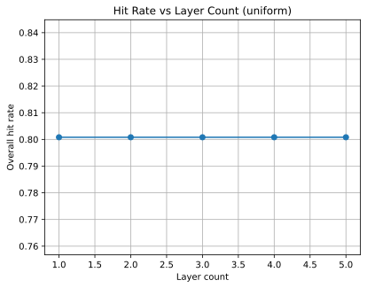
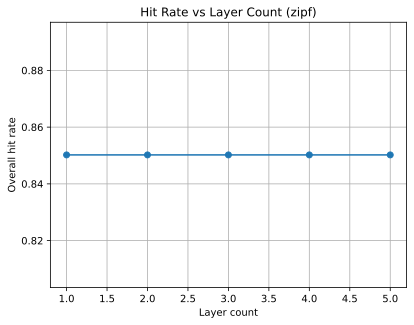

<a href="../index.md">Documentation</a> &gt; <a href="index.md">Analysis</a> &gt; Layered Cache Analysis

# Layered Cache Analysis

## Complexity
- **Set:** \(O(L)\) where *L* is the number of layers because writes propagate to each tier.
- **Get:** Worst-case \(O(L)\) when the item resides in the deepest layer; promotions add constant overhead per hop.

## Hit-Rate Formulae
Let \(A\) denote total accesses and \(H_i\) the hits served by layer *i* (0-indexed).
- **Overall hit rate:** \(\frac{\sum_i H_i}{A}\).
- **Per-layer hit rate:** \(\frac{H_i}{A}\).

## Assumptions
- Access patterns are independent and identically distributed.
- Promotion copies items to all preceding layers upon access.
- Cache layers are dictionary-backed with \(O(1)\) lookups and writes.
- Eviction policies are not modeled in this analysis.
## Simulation Results

The following table shows overall hit rates for different layer counts under uniform and Zipf access patterns using 5,000 accesses across 1,000 distinct items.

| Layers | Uniform | Zipf |
| ------ | ------- | ---- |
| 1 | 0.8008 | 0.8502 |
| 2 | 0.8008 | 0.8502 |
| 3 | 0.8008 | 0.8502 |
| 4 | 0.8008 | 0.8502 |
| 5 | 0.8008 | 0.8502 |

