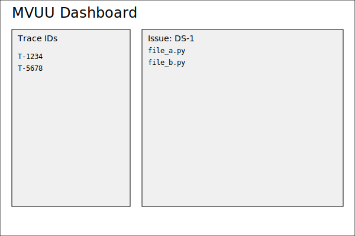

# MVUU Dashboard

The MVUU dashboard provides an interactive view of commit traceability data
stored in a local `traceability.json` file (not committed to the repository). It
lists available TraceIDs and shows the linked issue and affected files for each
entry.



## Usage

To populate the dashboard, DevSynth generates a fresh traceability report:

```bash
$ devsynth mvu report --output traceability.json
```

The `mvuu-dashboard` command runs this step automatically and then launches a
NiceGUI application that reads `traceability.json` and displays TraceIDs,
affected files, and related issues:

```bash
$ devsynth mvuu-dashboard
```

If report generation fails, the dashboard falls back to any existing
`traceability.json`.

## Autoresearch Enhancements

Autoresearch workflows extend the dashboard with optional overlays:

- **Research Timeline Layer** — displays knowledge graph queries, agent role
  transitions, and MVUU TraceIDs along a shared timeline so reviewers can follow
  how investigations evolved.
- **Provenance Filters** — add toggles that isolate traces involving research
  artefacts, letting teams focus on Autoresearch outcomes without losing standard
  traceability views.
- **Integrity Checks** — surface checksum and signature fields emitted by the
  CLI so reviewers can verify that research artefacts rendered in the dashboard
  match the underlying knowledge graph data.

These overlays are disabled by default; teams enable them via the `--research-metrics` CLI flag or a dashboard toggle. When active, the dashboard queries the
knowledge graph to fetch supporting artefacts and annotates TraceIDs with
bibliographic context, ensuring Autoresearch remains auditable without
sacrificing day-to-day usability.

## Autoresearch Personas

Repeatable `--research-persona` options on `devsynth mvuu-dashboard` activate
optional overlays for any combination of Research Lead, Bibliographer,
Synthesist, Synthesizer, Contrarian, Fact Checker, Planner, and Moderator. Each
flag is additive, letting teams compose the facilitation mix that suits a given
investigation. The command persists the chosen set to
`DEVSYNTH_EXTERNAL_RESEARCH_PERSONAS` (legacy: `DEVSYNTH_AUTORESEARCH_PERSONAS`),
so the WSDE collaboration layer and telemetry writers can respect persona-aware
governance even when the CLI is not driving the session. Configuration files or
environment variables may pre-populate the same comma-delimited list, ensuring
overlays remain opt-in and reversible without code changes.

### Prompt-driven instrumentation

The Autoresearch overlays now consume structured prompt templates defined in
`templates/prompts/autoresearch_personas.json`. Each persona declares the
baseline instructions, fallback behaviour, and success criteria that the WSDE
team expects during an investigation. Companion training exemplars in
`templates/prompts/autoresearch_persona_training.jsonl` demonstrate how those
expectations appear in MVUU telemetry: the JSONL rows capture prompt text,
record the fallback path taken when a domain expert is unavailable, and list the
fields (`prompt_template`, `fallback_behavior`, `success_criteria`) that the
dashboard must persist for audits.

The telemetry writer attaches the enriched persona payload (prompt template,
fallback notes, and success checks) to every MVUU bundle. When reviewers open
the dashboard, each persona overlay includes the exact text issued to the agent
alongside the rationale for any expertise-based primus rotation. This makes
Autoresearch sessions reproducible—stakeholders can trace how the Research Lead
or Bibliographer responded when sources were missing, and they can confirm that
the Synthesist logged residual risks before closing the trace.
