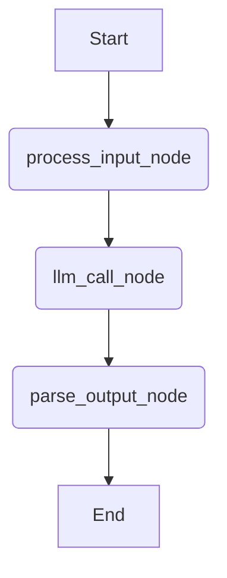
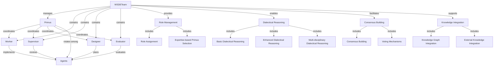

<div class="breadcrumbs">
<a href="../index.md">Documentation</a> &gt; <a href="index.md">Architecture</a> &gt; DevSynth Agent System Architecture
</div>

# DevSynth Agent System Architecture

## Overview

The DevSynth agent system leverages LangGraph to create modular, stateful, and resilient AI agents. This architecture allows for the construction of complex workflows where agents can perform tasks, make decisions, and interact with other DevSynth components like the memory system and provider system.

**Implementation Status:** Core agent orchestration is implemented, but advanced WSDE collaboration features remain in progress.

The agent system is organized according to the WSDE (WSDE) model, which provides a non-hierarchical, collaborative framework for agent interaction. This model ensures that agents work together as peers with complementary capabilities, with leadership (Primus role) rotating based on task expertise.

This document outlines the foundational components of the agent system, including the WSDE model, `AgentState`, and the `base_agent_graph`.

## Core Concepts

- **LangGraph**: A library for building stateful, multi-actor applications with LLMs. It allows defining agentic workflows as graphs where nodes represent actions or computations and edges represent the flow of control.
- **WSDE Model**: WSDE model that provides a framework for agent collaboration with rotating leadership.
- **AgentState**: A `TypedDict` that defines the structure of the data passed between nodes in a LangGraph. It maintains the current context and results of the agent's operations.
- **Nodes**: Functions that perform specific tasks within the agent workflow (e.g., processing input, calling an LLM, parsing output).
- **Edges**: Define the sequence of operations, connecting nodes to form a directed graph.


### UXBridge Interaction Layer

User interaction is unified through the ``UXBridge`` abstraction.  Each
front‑end (CLI, WebUI and Agent API) implements this interface so workflow
functions remain UI agnostic.  ``UXBridge`` defines four core methods:

- ``ask_question(message, choices=None, default=None, show_default=True)`` –

  return a string answer.

- ``confirm_choice(message, default=False)`` – return ``True`` when confirmed.
- ``display_result(message, highlight=False)`` – output a message without

  returning a value.

- ``create_progress(description, total=100)`` – return a progress indicator with

  ``update`` and ``complete`` methods.

These methods provide a consistent user experience across all bridges while
allowing each implementation to use its own presentation logic.  Every
front‑end bridge (CLI, WebUI, Agent API or others) **must** implement the four
methods ``ask_question``, ``confirm_choice``, ``display_result`` and
``create_progress`` so workflow functions remain UI agnostic.  Unit tests
instantiate each bridge to verify these methods are present and callable.

## AgentState (`graph_state.py`)

The `AgentState` is crucial for managing the information flow within an agent. It typically includes:

```python
from typing import TypedDict, Optional, List

class AgentState(TypedDict):
    input_request: str
    processed_input: Optional[str]
    llm_response: Optional[str]
    intermediate_steps: Optional[List[str]] # For tools or multi-step reasoning
    final_output: Optional[str]
    error: Optional[str]
```

- `input_request`: The initial query or task given to the agent.
- `processed_input`: The input after any initial cleaning or transformation.
- `llm_response`: The raw output from an LLM call.
- `intermediate_steps`: A list to store outputs from tools or intermediate reasoning steps, useful for complex agents.
- `final_output`: The agent's final answer or result after all processing.
- `error`: A field to capture any errors that occur during the workflow, allowing for graceful error handling.


## Base Agent Graph (`base_agent_graph.py`)

A foundational `base_agent_graph` provides a template for simple request-response agent workflows. It demonstrates the core pattern of input processing, LLM interaction, and output parsing.

### Workflow Diagram



### Key Nodes in `base_agent_graph`:

1.  **`process_input_node`**:
    *   Takes the `input_request` from the `AgentState`.
    *   Performs basic processing (e.g., stripping whitespace).
    *   Updates the `processed_input` field in the state.
    *   Can set an error if input is invalid.

2.  **`llm_call_node`**:
    *   Uses the `processed_input` as the prompt for an LLM.
    *   Leverages the DevSynth `provider_system` (`devsynth.adapters.provider_system.complete`) to make the LLM call. This ensures that the agent can use either OpenAI or LM Studio, with automatic fallback.
    *   Stores the LLM's raw response in the `llm_response` field.
    *   Handles potential errors during the LLM call.

3.  **`parse_output_node`**:
    *   Takes the `llm_response`.
    *   Performs basic parsing (e.g., stripping whitespace) to produce the final output.
    *   Stores the result in the `final_output` field.


### Graph Definition:

The graph is defined using `langgraph.graph.StateGraph` and compiled:

```python

# Simplified from base_agent_graph.py

from langgraph.graph import StateGraph, END

# ... import nodes and AgentState ...

workflow = StateGraph(AgentState)

workflow.add_node("process_input", process_input_node)
workflow.add_node("llm_call", llm_call_node)
workflow.add_node("parse_output", parse_output_node)

workflow.set_entry_point("process_input")
workflow.add_edge("process_input", "llm_call")
workflow.add_edge("llm_call", "parse_output")
workflow.add_edge("parse_output", END)

base_agent_graph = workflow.compile()
```

## WSDE Model Implementation

The WSDE (WSDE) model is implemented in `domain/models/WSDE.py` and provides a sophisticated framework for agent collaboration with rotating leadership, dialectical reasoning, consensus building, and knowledge integration. This model is inspired by non-hierarchical, democratic workplace structures and ensures that agents work together as peers with complementary capabilities.

### WSDE Model Diagram



### WSDE Roles

The WSDE organization model consists of the following roles:

- **Worker**: Performs the actual implementation work (e.g., coding, test writing)
- **Supervisor**: Oversees the work and provides guidance and feedback
- **Designer**: Plans and designs the approach to solving problems
- **Evaluator**: Evaluates the output and provides quality assessment
- **Primus**: The lead role that rotates among agents based on task expertise


### WSDETeam Class

The `WSDETeam` class manages a team of agents organized according to the WSDE model with extensive functionality:

```python
@dataclass
class WSDETeam:
    agents: List[Any] = None  # List of Agent objects
    primus_index: int = 0  # Index of the current Primus agent
    solutions: List[Dict[str, Any]] = None  # Solutions proposed by agents
    critiques: List[Dict[str, Any]] = None  # Critiques of solutions
    voting_history: List[Dict[str, Any]] = None  # History of voting decisions

    # Role Management Methods
    def add_agent(self, agent: Any) -> None: ...
    def rotate_primus(self) -> None: ...
    def select_primus_by_expertise(self, task: Dict[str, Any]) -> None: ...
    def get_primus(self) -> Optional[Any]: ...
    def get_worker(self) -> Optional[Any]: ...
    def get_supervisor(self) -> Optional[Any]: ...
    def get_designer(self) -> Optional[Any]: ...
    def get_evaluator(self) -> Optional[Any]: ...
    def assign_roles(self) -> None: ...

    # Team Collaboration Methods
    def can_propose_solution(self, agent: Any, task: Dict[str, Any]) -> bool: ...
    def can_provide_critique(self, agent: Any, solution: Dict[str, Any]) -> bool: ...
    def add_solution(self, task: Dict[str, Any], solution: Dict[str, Any]) -> None: ...

    # Consensus and Voting Methods
    def vote_on_critical_decision(self, task: Dict[str, Any]) -> Dict[str, Any]: ...
    def _apply_majority_voting(self, task: Dict[str, Any], voting_result: Dict[str, Any]) -> Dict[str, Any]: ...
    def _handle_tied_vote(self, task: Dict[str, Any], voting_result: Dict[str, Any], vote_counts: Dict[str, int], tied_options: List[str]) -> Dict[str, Any]: ...
    def _apply_weighted_voting(self, task: Dict[str, Any], voting_result: Dict[str, Any], domain: str) -> Dict[str, Any]: ...
    def build_consensus(self, task: Dict[str, Any]) -> List[Dict[str, Any]]: ...

    # Dialectical Reasoning Methods
    def apply_dialectical_reasoning(self, task: Dict[str, Any], critic_agent: Any = None) -> Dict[str, Any]: ...
    def apply_enhanced_dialectical_reasoning(self, task: Dict[str, Any], critic_agent: Any = None) -> Dict[str, Any]: ...
    def apply_enhanced_dialectical_reasoning_multi(self, task: Dict[str, Any], critic_agent: Any = None) -> Dict[str, Any]: ...
    def apply_dialectical_reasoning_with_knowledge_graph(self, task: Dict[str, Any], critic_agent: Any, wsde_memory_integration: Any) -> Dict[str, Any]: ...
    def apply_enhanced_dialectical_reasoning_with_knowledge(self, task: Dict[str, Any], critic_agent: Any, external_knowledge: Dict[str, Any]) -> Dict[str, Any]: ...
    def apply_multi_disciplinary_dialectical_reasoning(self, task: Dict[str, Any], critic_agent: Any, disciplinary_knowledge: Dict[str, Any], disciplinary_agents: List[Any]) -> Dict[str, Any]: ...
```

### Role Management and Team Collaboration

The WSDE model provides sophisticated role management capabilities:

- **Dynamic Role Assignment**: Roles are assigned based on agent capabilities and expertise
- **Expertise-based Primus Selection**: The Primus (lead) role can be assigned to the agent with the most relevant expertise for a specific task
- **Solution Proposal Control**: The system controls which agents can propose solutions based on their roles and expertise
- **Critique Management**: The system manages which agents can provide critiques of solutions


### Dialectical Reasoning

The WSDE model implements multiple levels of dialectical reasoning:

1. **Basic Dialectical Reasoning**: A thesis-antithesis-synthesis approach where:
   - A thesis (initial solution) is proposed
   - An antithesis (critique) is generated
   - A synthesis (improved solution) is created by reconciling the thesis and antithesis

2. **Enhanced Dialectical Reasoning**: Extends basic dialectical reasoning with:
   - More sophisticated analysis of the thesis
   - Structured critique generation
   - Comprehensive synthesis that addresses all critique points
   - Formal evaluation of the synthesis

3. **Multi-solution Dialectical Reasoning**: Applies dialectical reasoning across multiple proposed solutions:
   - Analyzes each solution individually
   - Generates a comparative analysis
   - Creates a synthesis that incorporates the best aspects of all solutions
   - Produces a comprehensive evaluation

4. **Knowledge-enhanced Dialectical Reasoning**: Integrates external knowledge sources:
   - Knowledge graph integration for context-aware reasoning
   - External knowledge integration for standards compliance
   - Multi-disciplinary perspectives for comprehensive analysis


### Consensus Building and Voting

The WSDE model implements sophisticated consensus building and voting mechanisms:

1. **Consensus Building**: A structured approach to reaching agreement:
   - Each agent contributes ideas based on their expertise
   - Ideas are consolidated and refined
   - The team works together to create a unified approach

2. **Voting Mechanisms**: Multiple voting approaches for critical decisions:
   - **Majority Voting**: Simple majority rule
   - **Weighted Voting**: Votes weighted by agent expertise in the relevant domain
   - **Tie-breaking**: Sophisticated mechanisms for resolving tied votes
   - **Voting History**: Tracking of voting decisions for accountability


### Knowledge Integration

The WSDE model supports integration with various knowledge sources:

1. **Knowledge Graph Integration**: Leverages semantic knowledge graphs for:
   - Retrieving relevant context for decisions
   - Identifying relationships between concepts
   - Enhancing reasoning with structured knowledge

2. **External Knowledge Integration**: Incorporates domain-specific knowledge:
   - Best practices and standards
   - Compliance requirements
   - Historical precedents

3. **Multi-disciplinary Integration**: Combines perspectives from different disciplines:
   - Identifies conflicts between disciplinary perspectives
   - Resolves conflicts through structured reasoning
   - Creates syntheses that address all disciplinary concerns


### Collaborative Workflow

The WSDE model enables a sophisticated collaborative workflow where:

1. The **Designer** creates plans and specifications
2. The **Worker** implements the plans
3. The **Supervisor** reviews and provides feedback
4. The **Evaluator** assesses the quality and alignment with requirements
5. The **Primus** coordinates the process and makes final decisions


This workflow is enhanced by:

- Dialectical reasoning for continuous improvement
- Consensus building for team alignment
- Voting mechanisms for critical decisions
- Knowledge integration for informed decision-making


## Integration with Provider System

The agent system is tightly integrated with the `provider_system`. The `llm_call_node` in `base_agent_graph.py` directly uses the `complete` function from the provider system. This ensures:

-   Access to configured LLM providers (OpenAI, LM Studio).
-   Automatic fallback between providers if one is unavailable.
-   Consistent LLM interaction logic across different agents.
-   Unified embedding support across providers. Previously, LM Studio only offered placeholder embedding behavior; the provider now exposes a working embedding API.


## Extensibility

This base agent architecture is designed for extensibility:

-   **Specialized Agents**: New agents for specific tasks (e.g., code generation, requirement analysis, self-analysis) can be created by:
    *   Defining new nodes for specialized logic.
    *   Adding new fields to `AgentState` if required.
    *   Constructing new graphs or extending the base graph with conditional edges and more complex flows.
-   **Tool Usage**: The `intermediate_steps` field in `AgentState` is a placeholder for integrating tools. Future agents can use LangGraph's built-in support for tool calling nodes.
-   **Checkpointing**: LangGraph supports checkpointing, allowing the state of long-running agents to be saved and resumed. This is a planned enhancement for DevSynth.


## Error Handling

The `AgentState` includes an `error` field. Nodes in the graph can populate this field if an issue occurs. Subsequent nodes can check this field to decide whether to proceed, attempt recovery, or terminate the workflow gracefully.

## Current Limitations

WSDE collaboration and dialectical reasoning are only partially implemented. These capabilities are disabled by default via the `features.wsde_collaboration` and `features.dialectical_reasoning` flags in `config/default.yml`. Refer to the [Feature Status Matrix](../implementation/feature_status_matrix.md) for progress tracking.

## Future Enhancements (as per Comprehensive Plan)

-   Development of specialized agent workflows (code generation, analysis, Dialectical Reasoning).
-   Implementation of state management and checkpointing for long-running operations.
-   Integration with NetworkX for code analysis agents.
-   Self-analysis and tuning capabilities driven by agents.


---

_Last updated: May 28, 2025_
