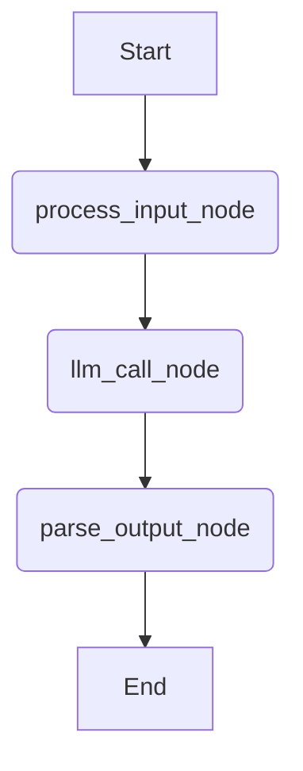
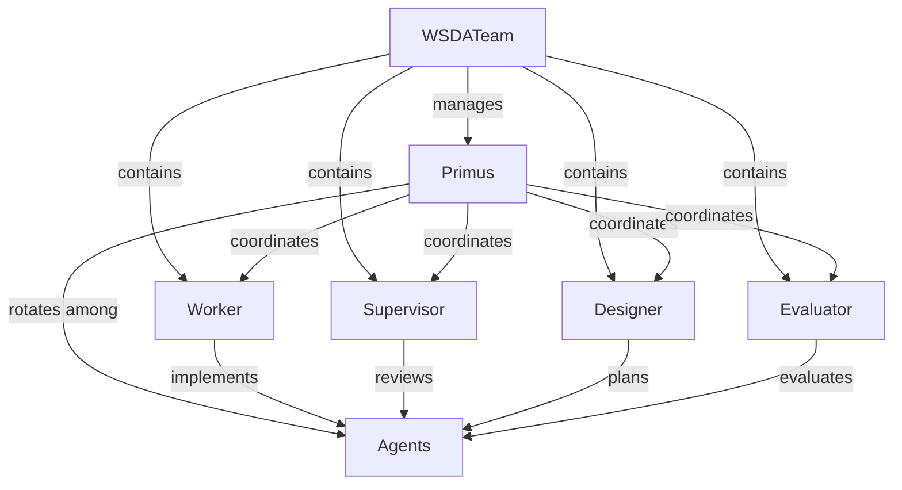

# DevSynth Agent System Architecture

## Overview

The DevSynth agent system leverages LangGraph to create modular, stateful, and resilient AI agents. This architecture allows for the construction of complex workflows where agents can perform tasks, make decisions, and interact with other DevSynth components like the memory system and provider system.

The agent system is organized according to the Worker Self-Directed Enterprise (WSDE) model, which provides a non-hierarchical, collaborative framework for agent interaction. This model ensures that agents work together as peers with complementary capabilities, with leadership (Primus role) rotating based on task expertise.

This document outlines the foundational components of the agent system, including the WSDE model, `AgentState`, and the `base_agent_graph`.

## Core Concepts

- **LangGraph**: A library for building stateful, multi-actor applications with LLMs. It allows defining agentic workflows as graphs where nodes represent actions or computations and edges represent the flow of control.
- **WSDE Model**: Worker Self-Directed Enterprise model that provides a framework for agent collaboration with rotating leadership.
- **AgentState**: A `TypedDict` that defines the structure of the data passed between nodes in a LangGraph. It maintains the current context and results of the agent's operations.
- **Nodes**: Functions that perform specific tasks within the agent workflow (e.g., processing input, calling an LLM, parsing output).
- **Edges**: Define the sequence of operations, connecting nodes to form a directed graph.

## AgentState (`graph_state.py`)

The `AgentState` is crucial for managing the information flow within an agent. It typically includes:

```python
from typing import TypedDict, Optional, List

class AgentState(TypedDict):
    input_request: str
    processed_input: Optional[str]
    llm_response: Optional[str]
    intermediate_steps: Optional[List[str]] # For tools or multi-step reasoning
    final_output: Optional[str]
    error: Optional[str]
```

- `input_request`: The initial query or task given to the agent.
- `processed_input`: The input after any initial cleaning or transformation.
- `llm_response`: The raw output from an LLM call.
- `intermediate_steps`: A list to store outputs from tools or intermediate reasoning steps, useful for complex agents.
- `final_output`: The agent's final answer or result after all processing.
- `error`: A field to capture any errors that occur during the workflow, allowing for graceful error handling.

## Base Agent Graph (`base_agent_graph.py`)

A foundational `base_agent_graph` provides a template for simple request-response agent workflows. It demonstrates the core pattern of input processing, LLM interaction, and output parsing.

### Workflow Diagram



### Key Nodes in `base_agent_graph`:

1.  **`process_input_node`**: 
    *   Takes the `input_request` from the `AgentState`.
    *   Performs basic processing (e.g., stripping whitespace).
    *   Updates the `processed_input` field in the state.
    *   Can set an error if input is invalid.

2.  **`llm_call_node`**: 
    *   Uses the `processed_input` as the prompt for an LLM.
    *   Leverages the DevSynth `provider_system` (`devsynth.adapters.provider_system.complete`) to make the LLM call. This ensures that the agent can use either OpenAI or LM Studio, with automatic fallback.
    *   Stores the LLM's raw response in the `llm_response` field.
    *   Handles potential errors during the LLM call.

3.  **`parse_output_node`**: 
    *   Takes the `llm_response`.
    *   Performs basic parsing (e.g., stripping whitespace) to produce the final output.
    *   Stores the result in the `final_output` field.

### Graph Definition:

The graph is defined using `langgraph.graph.StateGraph` and compiled:

```python
# Simplified from base_agent_graph.py
from langgraph.graph import StateGraph, END
# ... import nodes and AgentState ...

workflow = StateGraph(AgentState)

workflow.add_node("process_input", process_input_node)
workflow.add_node("llm_call", llm_call_node)
workflow.add_node("parse_output", parse_output_node)

workflow.set_entry_point("process_input")
workflow.add_edge("process_input", "llm_call")
workflow.add_edge("llm_call", "parse_output")
workflow.add_edge("parse_output", END)

base_agent_graph = workflow.compile()
```

## WSDE Model Implementation

The WSDE (Worker Self-Directed Enterprise) model is implemented in `domain/models/wsde.py` and provides a framework for agent collaboration with rotating leadership. This model is inspired by non-hierarchical, democratic workplace structures and ensures that agents work together as peers with complementary capabilities.

### WSDE Model Diagram



### WSDE Roles

The WSDE organization model consists of the following roles:

- **Worker**: Performs the actual implementation work (e.g., coding, test writing)
- **Supervisor**: Oversees the work and provides guidance and feedback
- **Designer**: Plans and designs the approach to solving problems
- **Evaluator**: Evaluates the output and provides quality assessment
- **Primus**: The lead role that rotates among agents based on task expertise

### WSDATeam Class

The `WSDATeam` class manages a team of agents organized according to the WSDE model:

```python
@dataclass
class WSDATeam:
    agents: List[Any] = None  # List of Agent objects
    primus_index: int = 0  # Index of the current Primus agent

    # Methods for managing agents and roles
    def add_agent(self, agent: Any) -> None: ...
    def rotate_primus(self) -> None: ...
    def get_primus(self) -> Optional[Any]: ...
    def get_worker(self) -> Optional[Any]: ...
    def get_supervisor(self) -> Optional[Any]: ...
    def get_designer(self) -> Optional[Any]: ...
    def get_evaluator(self) -> Optional[Any]: ...
    def assign_roles(self) -> None: ...
```

### Collaborative Workflow

The WSDE model enables a collaborative workflow where:

1. The **Designer** creates plans and specifications
2. The **Worker** implements the plans
3. The **Supervisor** reviews and provides feedback
4. The **Evaluator** assesses the quality and alignment with requirements
5. The **Primus** coordinates the process and makes final decisions

This workflow is not strictly sequential; agents can propose solutions or critiques at any stage, fostering autonomous collaboration and leveraging the strengths of each agent.

### Future Enhancements

As outlined in the Development Plan, the WSDE model implementation will be refined to:

- Make leadership context-driven rather than rotation-based
- Enable more autonomous collaboration
- Implement consensus or voting mechanisms for critical decisions
- Create a more flexible peer-based structure

## Integration with Provider System

The agent system is tightly integrated with the `provider_system`. The `llm_call_node` in `base_agent_graph.py` directly uses the `complete` function from the provider system. This ensures:
-   Access to configured LLM providers (OpenAI, LM Studio).
-   Automatic fallback between providers if one is unavailable.
-   Consistent LLM interaction logic across different agents.

## Extensibility

This base agent architecture is designed for extensibility:

-   **Specialized Agents**: New agents for specific tasks (e.g., code generation, requirement analysis, self-analysis) can be created by:
    *   Defining new nodes for specialized logic.
    *   Adding new fields to `AgentState` if required.
    *   Constructing new graphs or extending the base graph with conditional edges and more complex flows.
-   **Tool Usage**: The `intermediate_steps` field in `AgentState` is a placeholder for integrating tools. Future agents can use LangGraph's built-in support for tool calling nodes.
-   **Checkpointing**: LangGraph supports checkpointing, allowing the state of long-running agents to be saved and resumed. This is a planned enhancement for DevSynth.

## Error Handling

The `AgentState` includes an `error` field. Nodes in the graph can populate this field if an issue occurs. Subsequent nodes can check this field to decide whether to proceed, attempt recovery, or terminate the workflow gracefully.

## Future Enhancements (as per Comprehensive Plan)

-   Development of specialized agent workflows (code generation, analysis, dialectic reasoning).
-   Implementation of state management and checkpointing for long-running operations.
-   Integration with NetworkX for code analysis agents.
-   Self-analysis and tuning capabilities driven by agents.

---

_Last updated: May 28, 2025_
