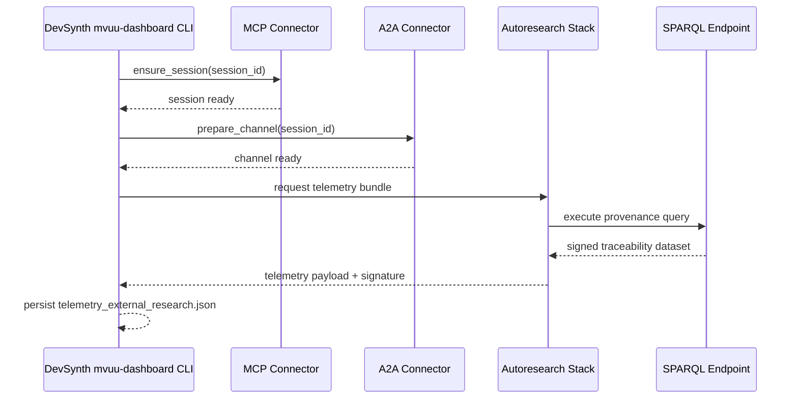

# Autoresearch Integration Architecture

The Autoresearch integration expands DevSynth's telemetry pipeline to fetch
external research overlays using a staged MCP → A2A → SPARQL negotiation. The
naming policy reserves the Autoresearch label for these client integrations,
while local telemetry helpers live under `src/devsynth/interface/research_telemetry.py`.

## Components

- **DevSynth CLI (mvuu-dashboard)** – triggers traceability exports and invokes
the external research telemetry builder.
- **MCP Connector** – negotiates session identifiers and exposes capability
metadata for Autoresearch.
- **A2A Connector** – binds persona context to the MCP session and forwards
requests to the Autoresearch orchestration layer.
- **Autoresearch SPARQL Gateway** – executes provenance queries and delivers
signed telemetry payloads.

## Sequence Overview

## Dialectical Reasoning Snapshot

- **Thesis**: External telemetry should replace local fixtures to increase
traceability confidence.
- **Antithesis**: External dependencies introduce latency and failure modes that
could delay MVUU reviews.
- **Synthesis**: Maintain feature flags and verified fixture fallbacks while the
Autoresearch handshake hardens. The new `integrations` stubs allow dependency
injection during testing so DevSynth can validate flows before live rollout.

## Next Steps

1. Implement the MCP and A2A clients once Autoresearch exposes the sandbox.
2. Extend the SPARQL query catalog with audit-focused filters.
3. Update the MVUU dashboard to surface live telemetry status indicators.
