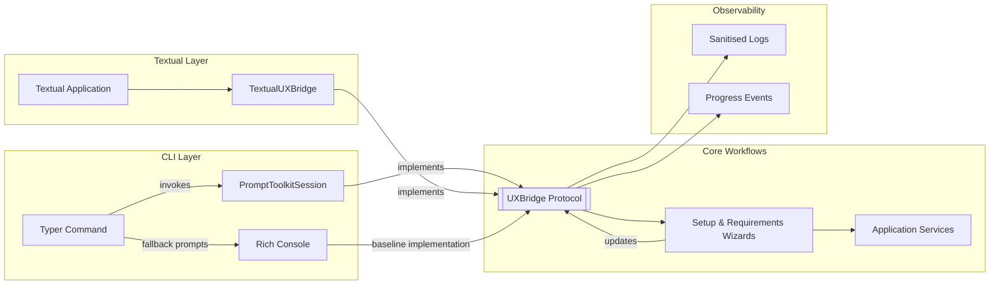

<a href="../index.md">Documentation</a> &gt; <a href="index.md">Architecture</a> &gt; CLI and Textual UXBridge Integration

# CLI and Textual UXBridge Integration

This diagram and narrative explain how the enhanced CLI, prompt-toolkit adapter, and Textual TUI reuse shared workflows through the `UXBridge` abstraction while delivering richer user experiences.

## Sequence Overview

## Key Points

1. **Capability Negotiation** – `PromptToolkitSession` and `TextualUXBridge` advertise capabilities (`supports_multi_select`, `supports_layout_panels`) so wizards can tailor prompts without branching logic.
2. **Shared Workflows** – Setup and requirements wizards remain unaware of presentation details, calling only the `UXBridge` protocol while receiving navigation events from any bridge.
3. **Observability Alignment** – Structured Rich layouts and Textual panes emit sanitised logs and telemetry events to maintain parity with existing diagnostics.

## Related Documents

- [Specification: CLI UX Enhancements](../specifications/cli-ux-enhancements.md)
- [Specification: Shared UXBridge across CLI, Textual TUI, and WebUI](../specifications/shared-uxbridge-across-cli-and-webui.md)
- [Requirements: FR-90 – FR-93](../system_requirements_specification.md#311-multi-channel-user-experience)
