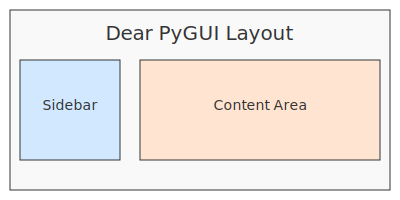

<a href="../index.md">Documentation</a> &gt; <a href="index.md">Architecture</a> &gt; CLI to WebUI and Dear PyGUI Command Mapping

# CLI to WebUI and Dear PyGUI Command Mapping

The table below maps each DevSynth CLI command to the WebUI page or action and
the Dear PyGUI widget that execute the same workflow. `N/A` indicates that no
equivalent UI element is currently available. All interfaces use the `UXBridge`
abstraction to reuse the CLI's backend functions.

| CLI Command / Subcommand  | WebUI Page / Action                                   | Dear PyGUI Widget / Action               |
|---------------------------|-------------------------------------------------------|------------------------------------------|
| `init`                    | **Onboarding** – Initialize Project form             | **Init** button                           |
| `spec`                    | **Requirements** – Generate Specs form               | **Spec** button                          |
| `test`                    | **Synthesis** – Generate Tests form                  | **Test** button                          |
| `code`                    | **Synthesis** – Generate Code button                 | **Code** button                          |
| `run-pipeline`            | **Synthesis** – Run Pipeline button                  | **Run Pipeline** button                  |
| `config`                  | **Config** – Update/View Configuration               | **Config** button                        |
| `config enable-feature`   | **Config** – Manage Feature Flags                    | **Enable Feature** button                |
| `inspect`                 | **Requirements** – Inspect Requirements form         | **Inspect** button                        |
| `gather`                  | **Requirements** – Requirements Plan Wizard          | **Gather** button                         |
| `wizard`                  | **Requirements** – Requirements Wizard               | **Wizard** button                        |
| `inspect-code`            | **Analysis** – Inspect Code form                     | **Inspect Code** button                  |
| `refactor`                | **Analysis** – Refactor Suggestions page             | **Refactor** button                      |
| `webapp`                  | **Web App** – Web App Helper page                    | **Webapp** button                        |
| `serve`                   | **Serve** – API Server management page               | **Serve** button                         |
| `dbschema`                | **Database** – Database Schema page                  | **DbSchema** button                      |
| `doctor` / `check`        | **Doctor** – Diagnostics page                        | **Doctor** / **Check** buttons           |
| `EDRR-cycle`              | **EDRR** – Cycle execution page                      | **EDRR Cycle** button                    |
| `align`                   | **Alignment** – SDLC consistency checks              | **Align** button                         |
| `alignment-metrics`       | **Alignment Metrics** – Metrics reporting page       | **Alignment Metrics** button             |
| `inspect-config`          | **Inspect Config** – Configuration analysis page     | **Inspect Config** button                |
| `validate-manifest`       | **Validate Manifest** – Configuration validation page | **Validate Manifest** button             |
| `validate-metadata`       | **Validate Metadata** – Metadata validation page     | **Validate Metadata** button             |
| `test-metrics`            | **Test Metrics** – Test metrics reporting page       | **Test Metrics** button                  |
| `generate-docs`           | **Generate Docs** – Documentation generation page    | **Generate Docs** button                 |
| `ingest`                  | **Ingest** – Project ingestion page                  | **Ingest** button                        |
| `apispec`                 | **API Spec** – API specification page                | **API Spec** button                      |
| `webui`                   | Launches the WebUI                                   | **WebUI** button                         |
| `dpg`                     | N/A                                                   | Launches the Dear PyGUI interface        |

All CLI commands now have corresponding WebUI pages. The Dear PyGUI desktop
client exposes buttons for common workflows. Each interface calls workflow
functions through the `UXBridge` layer, ensuring consistent behaviour between
the CLI and graphical front‑ends.

Because each interface invokes workflow functions through the `UXBridge`
layer, adding UI support for commands later only requires new widgets that
call the same shared functions.

Terminology across the CLI, WebUI, and Dear PyGUI is kept consistent. For
example, the interactive workflow started by `gather` is called the *Requirements
Plan Wizard* in all interfaces.

## Implementation Status

This mapping is **implemented** for all major WebUI workflows and the core
Dear PyGUI buttons. Several lesser‑used commands remain planned for future
releases, as noted in the table above.
