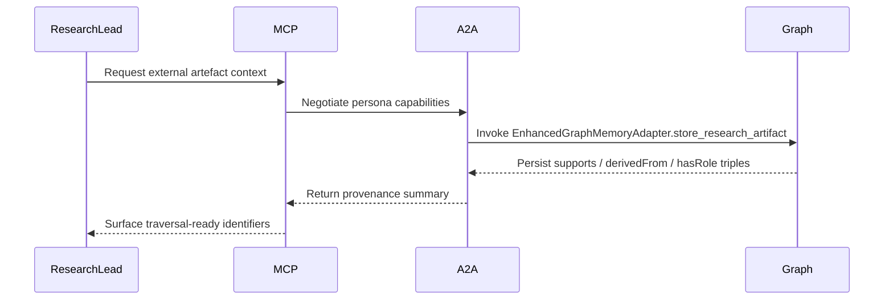
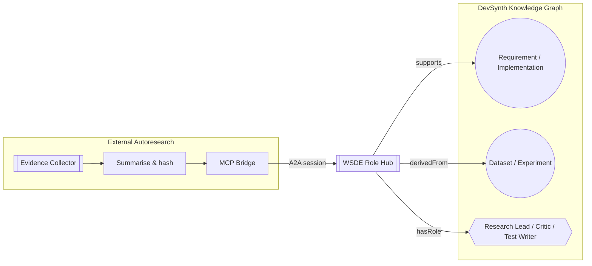

# MCP → A2A → SPARQL Knowledge Graph Flows

The following diagrams highlight how the Autoresearch bridge stages metadata
before it lands inside the enhanced graph memory adapter.

```mermaid
sequenceDiagram
    participant ResearchLead
    participant MCP
    participant A2A
    participant Graph

    ResearchLead->>MCP: Request external artefact context
    MCP->>A2A: Negotiate persona capabilities
    A2A->>Graph: Invoke EnhancedGraphMemoryAdapter.store_research_artifact
    Graph-->>A2A: Persist supports / derivedFrom / hasRole triples
    A2A-->>MCP: Return provenance summary
    MCP-->>ResearchLead: Surface traversal-ready identifiers
```

```mermaid
flowchart LR
    subgraph External Autoresearch
        direction TB
        Collector[[Evidence Collector]] --> HashedSummary[Summarise & hash]
        HashedSummary --> MCPBridge[MCP Bridge]
    end

    MCPBridge -->|A2A session| WSDERoleHub[[WSDE Role Hub]]
    WSDERoleHub -->|supports| MemoryItemNode
    WSDERoleHub -->|derivedFrom| UpstreamNode
    WSDERoleHub -->|hasRole| PersonaRegistry

    subgraph DevSynth Knowledge Graph
        MemoryItemNode((Requirement / Implementation))
        UpstreamNode((Dataset / Experiment))
        PersonaRegistry{{Research Lead / Critic / Test Writer}}
    end
```
