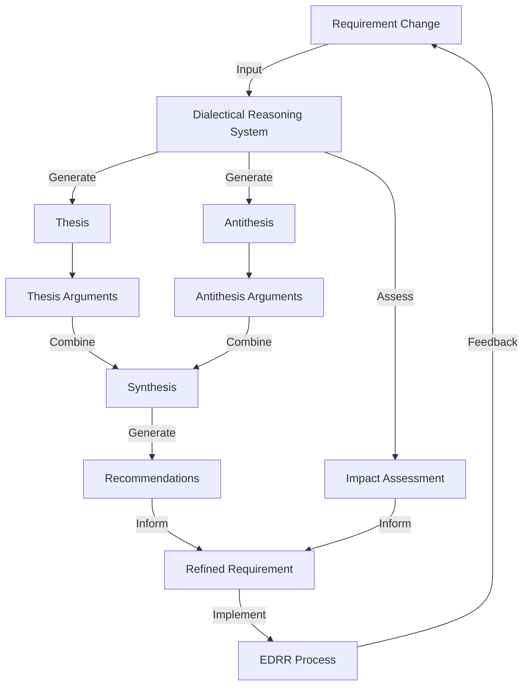

# Dialectical Reasoning System for Requirements Management

## Overview

The Dialectical Reasoning System is a component of DevSynth that enables intelligent evaluation of proposed changes to requirements. It uses dialectical reasoning—a method of examining ideas by juxtaposing opposing arguments (thesis and antithesis) to arrive at a resolution (synthesis)—to assess the impact and validity of requirement changes.

## Key Features

- **Dialectical Evaluation**: Analyzes requirement changes by generating thesis, antithesis, arguments, synthesis, and recommendations
- **Impact Assessment**: Identifies affected requirements and components, assesses risk levels, and estimates effort
- **Chat Interface**: Provides an interactive dialogue system for discussing requirement changes
- **Notification System**: Alerts stakeholders about proposed changes, approvals, rejections, and impact assessments

## Architecture

The Dialectical Reasoning System follows the hexagonal architecture pattern of DevSynth:

### Domain Layer

- **Models**: 
  - `Requirement`: Represents a system requirement
  - `RequirementChange`: Represents a proposed change to a requirement
  - `DialecticalReasoning`: Represents the dialectical reasoning process and results
  - `ImpactAssessment`: Represents the impact assessment of a change
  - `ChatSession` and `ChatMessage`: Represent chat interactions with the reasoning system

### Ports Layer

- **Inbound Ports**:
  - `DialecticalReasonerPort`: Interface for the dialectical reasoning service
  - `ChatPort`: Interface for the chat interaction service

- **Outbound Ports**:
  - `RequirementRepositoryPort`: Interface for requirement storage
  - `ChangeRepositoryPort`: Interface for change storage
  - `DialecticalReasoningRepositoryPort`: Interface for reasoning storage
  - `ImpactAssessmentRepositoryPort`: Interface for impact assessment storage

## Implementation Details

### Dialectical Reasoning Process

The dialectical reasoning process consists of the following steps:

1. **Thesis Formation**: Generate an initial proposal based on the requirement change
2. **Antithesis Formation**: Generate opposing viewpoints to the thesis
3. **Argumentation**: Generate supporting arguments for both thesis and antithesis
4. **Synthesis**: Combine the thesis and antithesis to form a balanced resolution
5. **Recommendation**: Generate actionable recommendations based on the synthesis

```python
class DialecticalReasoningService:
    """Service for performing dialectical reasoning on requirement changes."""
    
    def __init__(self, 
                 llm_provider: LLMProviderPort,
                 requirement_repository: RequirementRepositoryPort,
                 reasoning_repository: DialecticalReasoningRepositoryPort):
        """Initialize the dialectical reasoning service."""
        self.llm_provider = llm_provider
        self.requirement_repository = requirement_repository
        self.reasoning_repository = reasoning_repository
        
    async def analyze_change(self, requirement_change: RequirementChange) -> DialecticalReasoning:
        """Analyze a requirement change using dialectical reasoning."""
        # Retrieve the original requirement
        requirement = await self.requirement_repository.get_by_id(requirement_change.requirement_id)
        
        # Generate thesis
        thesis = await self._generate_thesis(requirement, requirement_change)
        
        # Generate antithesis
        antithesis = await self._generate_antithesis(requirement, requirement_change, thesis)
        
        # Generate arguments for thesis and antithesis
        thesis_arguments = await self._generate_arguments(thesis, True)
        antithesis_arguments = await self._generate_arguments(antithesis, False)
        
        # Generate synthesis
        synthesis = await self._generate_synthesis(thesis, antithesis, 
                                                thesis_arguments, antithesis_arguments)
        
        # Generate recommendations
        recommendations = await self._generate_recommendations(synthesis)
        
        # Create and persist reasoning result
        reasoning = DialecticalReasoning(
            requirement_id=requirement.id,
            change_id=requirement_change.id,
            thesis=thesis,
            antithesis=antithesis,
            thesis_arguments=thesis_arguments,
            antithesis_arguments=antithesis_arguments,
            synthesis=synthesis,
            recommendations=recommendations,
            timestamp=datetime.now()
        )
        
        await self.reasoning_repository.save(reasoning)
        return reasoning
        
    async def _generate_thesis(self, requirement: Requirement, 
                              requirement_change: RequirementChange) -> str:
        """Generate thesis for the proposed change."""
        prompt = f"""
        You are analyzing a proposed change to a software requirement.
        
        Original requirement: {requirement.description}
        Proposed change: {requirement_change.description}
        
        Generate a thesis statement that supports this change. 
        Consider the following aspects:
        1. The benefits of implementing this change
        2. How the change aligns with system goals
        3. Why the change is necessary or valuable
        
        Provide a concise thesis statement (2-3 paragraphs).
        """
        
        return await self.llm_provider.generate(prompt)
    
    # Additional private methods for generating antithesis, arguments, synthesis, and recommendations...
```

### Impact Assessment

The impact assessment process analyzes the potential effects of implementing a requirement change:

```python
class ImpactAssessmentService:
    """Service for assessing the impact of requirement changes."""
    
    def __init__(self, 
                 requirement_repository: RequirementRepositoryPort,
                 component_repository: ComponentRepositoryPort):
        """Initialize the impact assessment service."""
        self.requirement_repository = requirement_repository
        self.component_repository = component_repository
        
    async def assess_impact(self, requirement_change: RequirementChange) -> ImpactAssessment:
        """Assess the impact of implementing a requirement change."""
        # Identify affected requirements
        affected_requirements = await self._identify_affected_requirements(requirement_change)
        
        # Identify affected components
        affected_components = await self._identify_affected_components(requirement_change, affected_requirements)
        
        # Assess risk level
        risk_level = await self._assess_risk(requirement_change, affected_requirements, affected_components)
        
        # Estimate effort
        effort_estimate = await self._estimate_effort(requirement_change, affected_components)
        
        # Create and return impact assessment
        return ImpactAssessment(
            change_id=requirement_change.id,
            affected_requirements=affected_requirements,
            affected_components=affected_components,
            risk_level=risk_level,
            effort_estimate=effort_estimate,
            timestamp=datetime.now()
        )
```

### Chat Interface

The interactive chat interface for the dialectical reasoning system:

```python
class DialecticalReasoningChatService:
    """Service for interactive discussions about requirement changes."""
    
    def __init__(self, 
                 llm_provider: LLMProviderPort,
                 reasoning_repository: DialecticalReasoningRepositoryPort,
                 session_repository: ChatSessionRepositoryPort):
        """Initialize the chat service."""
        self.llm_provider = llm_provider
        self.reasoning_repository = reasoning_repository
        self.session_repository = session_repository
        
    async def start_session(self, requirement_change_id: str) -> ChatSession:
        """Start a new discussion session about a requirement change."""
        # Retrieve the reasoning results for the requirement change
        reasoning = await self.reasoning_repository.get_by_change_id(requirement_change_id)
        
        # Create a system message with context
        system_message = self._create_system_message(reasoning)
        
        # Create and persist the chat session
        session = ChatSession(
            change_id=requirement_change_id,
            messages=[system_message],
            active=True,
            created_at=datetime.now(),
            updated_at=datetime.now()
        )
        
        await self.session_repository.save(session)
        return session
        
    async def send_message(self, session_id: str, content: str) -> ChatMessage:
        """Send a message to the dialectical reasoning chat."""
        # Retrieve the chat session
        session = await self.session_repository.get_by_id(session_id)
        
        # Add user message to the session
        user_message = ChatMessage(
            role="user",
            content=content,
            timestamp=datetime.now()
        )
        session.messages.append(user_message)
        
        # Generate assistant response
        response_content = await self._generate_response(session)
        
        # Add assistant message to the session
        assistant_message = ChatMessage(
            role="assistant",
            content=response_content,
            timestamp=datetime.now()
        )
        session.messages.append(assistant_message)
        
        # Update session timestamp
        session.updated_at = datetime.now()
        
        # Persist updated session
        await self.session_repository.update(session)
        
        return assistant_message
```

## Practical Examples

### Example 1: Analyzing a Security Requirement Change

Consider a proposed change to a security requirement:

```
Original Requirement: 
The system must encrypt all user passwords using industry-standard hashing algorithms.

Proposed Change:
The system must encrypt all user passwords using the Argon2id algorithm with a minimum work factor of 12, and implement MFA for all administrative accounts.
```

#### Generated Dialectical Analysis

**Thesis:**
The proposed change significantly strengthens security by specifying a modern, memory-hard hashing algorithm (Argon2id) with an appropriate work factor, while adding multi-factor authentication for privileged accounts. This provides concrete guidance to developers, aligns with NIST 800-63B recommendations, and adds defense-in-depth through MFA. These improvements are necessary given the increasing sophistication of password cracking techniques and the elevated risk associated with administrative access.

**Antithesis:**
The proposed change introduces excessive specificity by naming a particular algorithm, which could quickly become outdated as cryptographic standards evolve. Additionally, it combines two separate concerns (password hashing and MFA) that should be addressed in separate requirements for better clarity and maintenance. The implementation effort and potential compatibility issues with existing systems may outweigh the security benefits, especially if the current hashing implementation is already reasonably secure.

**Synthesis:**
The requirement should be updated to strengthen security while maintaining adaptability and clarity. It should specify a modern memory-hard hashing algorithm (preferably Argon2id) while allowing for authorized alternatives that meet or exceed its security properties. The MFA requirement for administrative accounts should be separated into its own requirement. Both should reference established security standards rather than hardcoding specific parameters that may need future updates.

**Recommendations:**
1. Split the requirement into two separate requirements: one for password hashing and one for MFA.
2. Update the password hashing requirement to specify Argon2id as the preferred algorithm but allow equivalent alternatives that satisfy specific security properties.
3. Include a reference to NIST 800-63B or similar recognized standard rather than hardcoding specific parameters.
4. Create a new requirement for MFA that specifies which account types require it and acceptable authentication factors.
5. Add a requirement for periodic review of cryptographic implementations to ensure continued security.

#### Impact Assessment

**Affected Requirements:**
- User Authentication Requirements (REQ-AUTH-001, REQ-AUTH-003)
- Password Management Requirements (REQ-SEC-005)
- Administrative Access Control (REQ-ADM-002)

**Affected Components:**
- AuthenticationService
- UserManagementService
- AdminControlPanel
- SecurityConfigurationManager

**Risk Level:** Medium
- Security improvement benefits outweigh risks
- Requires careful migration of existing password hashes
- May impact performance due to increased computational requirements

**Effort Estimate:** 3 developer-weeks
- Update password hashing implementation: 1 week
- Implement MFA for admin accounts: 1.5 weeks
- Testing and validation: 0.5 weeks

### Example 2: Analyzing Performance vs. Usability Trade-off

```
Original Requirement:
The system must respond to user queries within 2 seconds under normal load.

Proposed Change:
The system must respond to user queries within 1 second for 99% of requests and within 3 seconds for 99.9% of requests, with appropriate user feedback for longer operations.
```

#### Generated Dialectical Analysis

**Thesis:**
The proposed change establishes more precise and realistic performance targets by using percentile-based metrics rather than a single threshold. It acknowledges the reality that some operations may take longer while setting a higher standard (1 second vs. 2 seconds) for most requests. The addition of user feedback for longer operations improves the user experience by providing transparency when operations exceed expected response times.

**Antithesis:**
The proposed change introduces unnecessary complexity by replacing a simple, measurable threshold with a dual-percentile approach that requires more sophisticated monitoring. The more stringent 1-second requirement for 99% of requests may necessitate costly infrastructure upgrades or architectural changes. The allowance for some requests to take up to 3 seconds represents a regression from the current 2-second requirement and could decrease user satisfaction.

**Synthesis:**
The requirement should adopt a percentile-based approach to better reflect real-world performance characteristics while maintaining clarity and measurability. The focus should be on optimizing the common case while gracefully handling edge cases. User feedback is essential for maintaining a positive user experience when operations exceed expected durations.

**Recommendations:**
1. Adopt the percentile-based approach but simplify to: "The system must respond to user queries within 1 second for 95% of requests and within 2 seconds for 99.5% of requests under normal load."
2. Add a separate requirement specifically for user feedback: "The system must provide appropriate visual feedback for operations taking longer than 1 second."
3. Define what constitutes "normal load" more precisely to ensure measurability.
4. Establish different performance targets for different types of operations based on complexity.
5. Implement comprehensive performance monitoring to measure compliance with the percentile-based requirements.

## Integration with EDRR Framework

The Dialectical Reasoning System is a core component of DevSynth's EDRR (Evaluate-Design-Reason-Refine) Framework:

1. **Evaluate** - The system evaluates proposed requirement changes using dialectical reasoning
2. **Design** - Based on the dialectical analysis, new designs or modifications are proposed
3. **Reason** - Further reasoning occurs about implementation approaches and trade-offs
4. **Refine** - The original requirement change is refined based on the combined insights



## Best Practices

### Effective Requirement Change Analysis

1. **Provide Comprehensive Context**: Include background information, constraints, and goals
2. **Frame Changes Neutrally**: Avoid biased language that could influence the dialectical analysis
3. **Review Multiple Iterations**: Consider performing several rounds of dialectical reasoning
4. **Include Stakeholder Perspectives**: Ensure the system considers diverse viewpoints
5. **Validate Recommendations**: Manually review and validate generated recommendations

### Interpreting Dialectical Results

1. **Look for Balance**: Good synthesis should incorporate strengths from both thesis and antithesis
2. **Consider Edge Cases**: Examine how the recommendations handle exceptional situations
3. **Assess Trade-offs**: Understand what is gained and lost in the proposed solution
4. **Validate Assumptions**: Identify and verify any assumptions made in the reasoning process
5. **Review Impact Assessment**: Carefully consider the broader system impact

## Configuration Examples

### Setting Up the Dialectical Reasoning System

```python
from devsynth.adapters.providers import OpenAIProvider
from devsynth.adapters.repositories import JSONRequirementRepository
from devsynth.adapters.repositories import MemoryReasoningRepository
from devsynth.domain.services import DialecticalReasoningService

# Initialize repositories
requirement_repo = JSONRequirementRepository(file_path="./data/requirements.json")
reasoning_repo = MemoryReasoningRepository()

# Initialize LLM provider
llm_provider = OpenAIProvider(model="gpt-4-turbo", temperature=0.2)

# Initialize dialectical reasoning service
reasoning_service = DialecticalReasoningService(
    llm_provider=llm_provider,
    requirement_repository=requirement_repo,
    reasoning_repository=reasoning_repo
)

# Analyze a requirement change
change = RequirementChange(
    id="change-123",
    requirement_id="req-auth-001",
    description="Update the password hashing algorithm to Argon2id with work factor 12",
    rationale="Improve security against modern password cracking techniques",
    requested_by="security_team",
    timestamp=datetime.now()
)

result = await reasoning_service.analyze_change(change)
```

### Chat Interface Integration

```python
from devsynth.adapters.repositories import MemorySessionRepository
from devsynth.domain.services import DialecticalReasoningChatService

# Initialize chat session repository
session_repo = MemorySessionRepository()

# Initialize chat service
chat_service = DialecticalReasoningChatService(
    llm_provider=llm_provider,
    reasoning_repository=reasoning_repo,
    session_repository=session_repo
)

# Start a chat session about a requirement change
session = await chat_service.start_session("change-123")

# Send a message in the chat
response = await chat_service.send_message(
    session_id=session.id,
    content="What are the main security implications of this change?"
)
```

## Dialectical Reasoning Flag

The behavior of agents is controlled by the `features.dialectical_reasoning` flag
in `.devsynth/project.yaml`. When this flag is set to `true`, agents automatically
perform thesis/antithesis/synthesis cycles during tasks such as requirement
analysis or design discussions. Disabling the flag reverts agents to simpler
critique without the full dialectical loop.

### Customizing Depth and Cycle Frequency

You can adjust how many reasoning cycles run and how deep each cycle recurses by
adding optional settings under `dialectical_reasoning`:

```yaml
features:
  dialectical_reasoning: true
dialectical_reasoning:
  cycles: 1  # number of reasoning passes
  depth: 2   # recursion depth for nested reasoning
```

Keep these values low at first to minimize resource usage. The [Progressive
Feature Setup guide](../user_guides/progressive_setup.md#enabling-dialectical-reasoning)
explains how to gradually increase reasoning depth as your project grows.

## Performance and Scalability Considerations

- **Caching**: Cache reasoning results for similar requirements and changes
- **Asynchronous Processing**: Process complex reasoning tasks asynchronously
- **Batched Analysis**: Group related requirement changes for more efficient processing
- **Resource Management**: Monitor and limit concurrent reasoning processes
- **Persistence Strategy**: Store reasoning artifacts efficiently based on access patterns

## Current Limitations

Dialectical reasoning support is only partially implemented. Argument weighting,
multi-agent interaction, and transparency tooling are still incomplete. The
feature is disabled by default via the `features.dialectical_reasoning` flag in
`config/default.yml`. See the
[Feature Status Matrix](../implementation/feature_status_matrix.md) for up-to-date
implementation progress.

## Future Enhancements

- **Collaborative Reasoning**: Support multiple participants in the dialectical process
- **Visual Representations**: Provide visual diagrams of reasoning chains and impacts
- **Temporal Analysis**: Track how reasoning changes over time for evolving requirements
- **Case-Based Learning**: Learn from previous reasoning patterns to improve future analyses
- **Domain-Specific Reasoning**: Customize reasoning based on specific project domains
- **Integration with Testing**: Link reasoning to test case generation
- **Stakeholder-Specific Views**: Customize analysis presentation for different stakeholder roles
