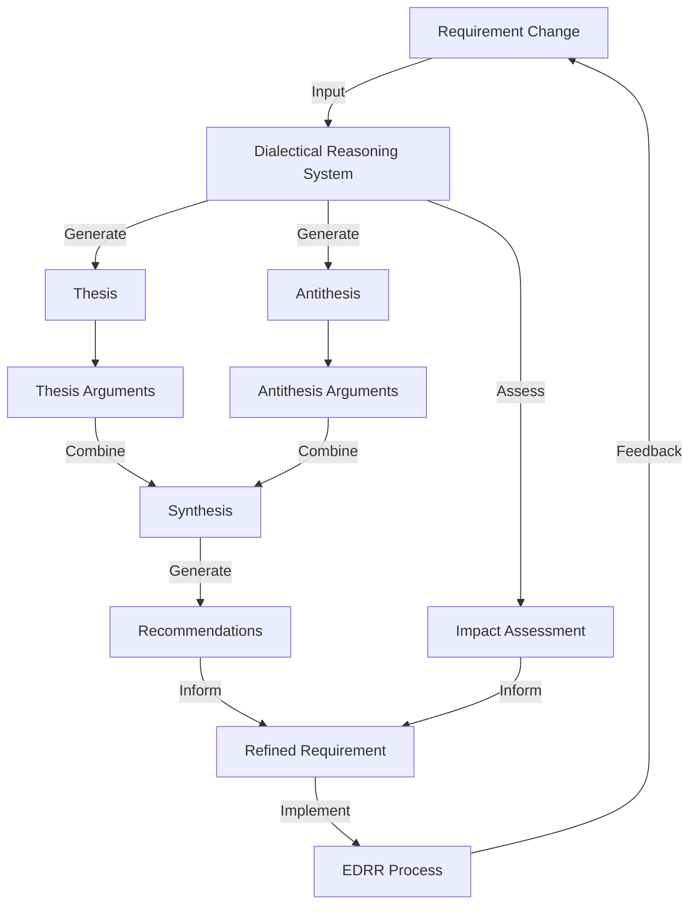

<div class="breadcrumbs">
<a href="../index.md">Documentation</a> &gt; <a href="index.md">Architecture</a> &gt; Dialectical Reasoning System for Requirements Management
</div>

# Dialectical Reasoning System for Requirements Management

## Overview

The Dialectical Reasoning System is a component of DevSynth that enables intelligent evaluation of proposed changes to requirements. It uses dialectical reasoning—a method of examining ideas by juxtaposing opposing arguments (thesis and antithesis) to arrive at a resolution (synthesis)—to assess the impact and validity of requirement changes.

## Key Features

- **Dialectical Evaluation**: Analyzes requirement changes by generating thesis, antithesis, arguments, synthesis, and recommendations
- **Impact Assessment**: Identifies affected requirements and components, assesses risk levels, and estimates effort
- **Chat Interface**: Provides an interactive dialogue system for discussing requirement changes
- **Notification System**: Alerts stakeholders about proposed changes, approvals, rejections, and impact assessments

## Architecture

The Dialectical Reasoning System follows the hexagonal architecture pattern of DevSynth:

### Domain Layer

- **Models**:
  - `Requirement`: Represents a system requirement
  - `RequirementChange`: Represents a proposed change to a requirement
  - `DialecticalReasoning`: Represents the dialectical reasoning process and results
  - `ImpactAssessment`: Represents the impact assessment of a change
  - `ChatSession` and `ChatMessage`: Represent chat interactions with the reasoning system

### Ports Layer

- **Inbound Ports**:
  - `DialecticalReasonerPort`: Interface for the dialectical reasoning service
  - `ChatPort`: Interface for the chat interaction service

- **Outbound Ports**:
  - `RequirementRepositoryPort`: Interface for requirement storage
  - `ChangeRepositoryPort`: Interface for change storage
  - `DialecticalReasoningRepositoryPort`: Interface for reasoning storage
  - `ImpactAssessmentRepositoryPort`: Interface for impact assessment storage

## Implementation Details

### Dialectical Reasoning Process

The dialectical reasoning process consists of the following steps:

1. **Thesis Formation**: Generate an initial proposal based on the requirement change
2. **Antithesis Formation**: Generate opposing viewpoints to the thesis
3. **Argumentation**: Generate supporting arguments for both thesis and antithesis
4. **Synthesis**: Combine the thesis and antithesis to form a balanced resolution
5. **Recommendation**: Generate actionable recommendations based on the synthesis

```python
class DialecticalReasoningService:
    """Service for performing dialectical reasoning on requirement changes."""

    def __init__(self,
                 llm_provider: LLMProviderPort,
                 requirement_repository: RequirementRepositoryPort,
                 reasoning_repository: DialecticalReasoningRepositoryPort):
        """Initialize the dialectical reasoning service."""
        self.llm_provider = llm_provider
        self.requirement_repository = requirement_repository
        self.reasoning_repository = reasoning_repository

    async def analyze_change(self, requirement_change: RequirementChange) -> DialecticalReasoning:
        """Analyze a requirement change using dialectical reasoning."""
        # Retrieve the original requirement
        requirement = await self.requirement_repository.get_by_id(requirement_change.requirement_id)

        # Generate thesis
        thesis = await self._generate_thesis(requirement, requirement_change)

        # Generate antithesis
        antithesis = await self._generate_antithesis(requirement, requirement_change, thesis)

        # Generate arguments for thesis and antithesis
        thesis_arguments = await self._generate_arguments(thesis, True)
        antithesis_arguments = await self._generate_arguments(antithesis, False)

        # Generate synthesis
        synthesis = await self._generate_synthesis(thesis, antithesis,
                                                thesis_arguments, antithesis_arguments)

        # Generate recommendations
        recommendations = await self._generate_recommendations(synthesis)

        # Create and persist reasoning result
        reasoning = DialecticalReasoning(
            requirement_id=requirement.id,
            change_id=requirement_change.id,
            thesis=thesis,
            antithesis=antithesis,
            thesis_arguments=thesis_arguments,
            antithesis_arguments=antithesis_arguments,
            synthesis=synthesis,
            recommendations=recommendations,
            timestamp=datetime.now()
        )

        await self.reasoning_repository.save(reasoning)
        return reasoning

    async def _generate_thesis(self, requirement: Requirement,
                              requirement_change: RequirementChange) -> str:
        """Generate thesis for the proposed change."""
        prompt = f"""
        You are analyzing a proposed change to a software requirement.

        Original requirement: {requirement.description}
        Proposed change: {requirement_change.description}

        Generate a thesis statement that supports this change.
        Consider the following aspects:
        1. The benefits of implementing this change
        2. How the change aligns with system goals
        3. Why the change is necessary or valuable

        Provide a concise thesis statement (2-3 paragraphs).
        """

        return await self.llm_provider.generate(prompt)

    # Additional private methods for generating antithesis, arguments, synthesis, and recommendations...
```

### Impact Assessment

The impact assessment process analyzes the potential effects of implementing a requirement change:

```python
class ImpactAssessmentService:
    """Service for assessing the impact of requirement changes."""

    def __init__(self,
                 requirement_repository: RequirementRepositoryPort,
                 component_repository: ComponentRepositoryPort):
        """Initialize the impact assessment service."""
        self.requirement_repository = requirement_repository
        self.component_repository = component_repository

    async def assess_impact(self, requirement_change: RequirementChange) -> ImpactAssessment:
        """Assess the impact of implementing a requirement change."""
        # Identify affected requirements
        affected_requirements = await self._identify_affected_requirements(requirement_change)

        # Identify affected components
        affected_components = await self._identify_affected_components(requirement_change, affected_requirements)

        # Assess risk level
        risk_level = await self._assess_risk(requirement_change, affected_requirements, affected_components)

        # Estimate effort
        effort_estimate = await self._estimate_effort(requirement_change, affected_components)

        # Create and return impact assessment
        return ImpactAssessment(
            change_id=requirement_change.id,
            affected_requirements=affected_requirements,
            affected_components=affected_components,
            risk_level=risk_level,
            effort_estimate=effort_estimate,
            timestamp=datetime.now()
        )
```

### Chat Interface

The interactive chat interface for the dialectical reasoning system:

```python
class DialecticalReasoningChatService:
    """Service for interactive discussions about requirement changes."""

    def __init__(self,
                 llm_provider: LLMProviderPort,
                 reasoning_repository: DialecticalReasoningRepositoryPort,
                 session_repository: ChatSessionRepositoryPort):
        """Initialize the chat service."""
        self.llm_provider = llm_provider
        self.reasoning_repository = reasoning_repository
        self.session_repository = session_repository

    async def start_session(self, requirement_change_id: str) -> ChatSession:
        """Start a new discussion session about a requirement change."""
        # Retrieve the reasoning results for the requirement change
        reasoning = await self.reasoning_repository.get_by_change_id(requirement_change_id)

        # Create a system message with context
        system_message = self._create_system_message(reasoning)

        # Create and persist the chat session
        session = ChatSession(
            change_id=requirement_change_id,
            messages=[system_message],
            active=True,
            created_at=datetime.now(),
            updated_at=datetime.now()
        )

        await self.session_repository.save(session)
        return session

    async def send_message(self, session_id: str, content: str) -> ChatMessage:
        """Send a message to the dialectical reasoning chat."""
        # Retrieve the chat session
        session = await self.session_repository.get_by_id(session_id)

        # Add user message to the session
        user_message = ChatMessage(
            role="user",
            content=content,
            timestamp=datetime.now()
        )
        session.messages.append(user_message)

        # Generate assistant response
        response_content = await self._generate_response(session)

        # Add assistant message to the session
        assistant_message = ChatMessage(
            role="assistant",
            content=response_content,
            timestamp=datetime.now()
        )
        session.messages.append(assistant_message)

        # Update session timestamp
        session.updated_at = datetime.now()

        # Persist updated session
        await self.session_repository.update(session)

        return assistant_message
```

## Technical Examples

### Example 1: Basic Dialectical Reasoning

Consider a proposed change to a security requirement:

```text
Original Requirement:
The system must encrypt all user passwords using industry-standard hashing algorithms.

Proposed Change:
The system must encrypt all user passwords using the Argon2id algorithm with a minimum work factor of 12, and implement MFA for all administrative accounts.
```

#### Generated Dialectical Analysis

**Thesis:**
The proposed change significantly strengthens security by specifying a modern, memory-hard hashing algorithm (Argon2id) with an appropriate work factor, while adding multi-factor authentication for privileged accounts. This provides concrete guidance to developers, aligns with NIST 800-63B recommendations, and adds defense-in-depth through MFA. These improvements are necessary given the increasing sophistication of password cracking techniques and the elevated risk associated with administrative access.

**Antithesis:**
The proposed change introduces excessive specificity by naming a particular algorithm, which could quickly become outdated as cryptographic standards evolve. Additionally, it combines two separate concerns (password hashing and MFA) that should be addressed in separate requirements for better clarity and maintenance. The implementation effort and potential compatibility issues with existing systems may outweigh the security benefits, especially if the current hashing implementation is already reasonably secure.

**Synthesis:**
The requirement should be updated to strengthen security while maintaining adaptability and clarity. It should specify a modern memory-hard hashing algorithm (preferably Argon2id) while allowing for authorized alternatives that meet or exceed its security properties. The MFA requirement for administrative accounts should be separated into its own requirement. Both should reference established security standards rather than hardcoding specific parameters that may need future updates.

**Recommendations:**
1. Split the requirement into two separate requirements: one for password hashing and one for MFA.
2. Update the password hashing requirement to specify Argon2id as the preferred algorithm but allow equivalent alternatives that satisfy specific security properties.
3. Include a reference to NIST 800-63B or similar recognized standard rather than hardcoding specific parameters.
4. Create a new requirement for MFA that specifies which account types require it and acceptable authentication factors.
5. Add a requirement for periodic review of cryptographic implementations to ensure continued security.

#### Impact Assessment

**Affected Requirements:**
- User Authentication Requirements (REQ-AUTH-001, REQ-AUTH-003)
- Password Management Requirements (REQ-SEC-005)
- Administrative Access Control (REQ-ADM-002)

**Affected Components:**
- AuthenticationService
- UserManagementService
- AdminControlPanel
- SecurityConfigurationManager

**Risk Level:** Medium
- Security improvement benefits outweigh risks
- Requires careful migration of existing password hashes
- May impact performance due to increased computational requirements

**Effort Estimate:** 3 developer-weeks
- Update password hashing implementation: 1 week
- Implement MFA for admin accounts: 1.5 weeks
- Testing and validation: 0.5 weeks

### Example 2: Enhanced Dialectical Reasoning

Enhanced dialectical reasoning extends the basic approach with domain-specific categorization, conflict resolution, and detailed evaluation. This example demonstrates how it analyzes a code solution:

```python

# Task: Implement a user authentication function

def authenticate_user(username, password):
    # Get user from database
    user = db.get_user(username)

    # Check if user exists and password matches
    if user and user.password == password:
        return {"authenticated": True, "user_id": user.id}
    else:
        return {"authenticated": False}
```

## Enhanced Dialectical Process

**Thesis Identification:**

```json
{
  "id": "thesis-123",
  "content": "User authentication implementation",
  "code": "def authenticate_user(username, password)...",
  "task_id": "auth-task-456",
  "task_description": "Implement secure user authentication",
  "requirements": ["Verify user credentials", "Return authentication status"]
}
```

**Enhanced Antithesis Generation:**

```json
{
  "id": "antithesis-789",
  "critiques": [
    "Passwords are compared in plain text without hashing",
    "No protection against timing attacks",
    "No input validation for username and password"
  ],
  "domain_critiques": {
    "security": [
      "Missing password hashing",
      "Vulnerable to timing attacks",
      "No rate limiting for failed attempts"
    ],
    "error_handling": [
      "No exception handling for database errors",
      "No logging of authentication attempts"
    ],
    "performance": [
      "Database query not optimized"
    ]
  },
  "prioritized_critiques": {
    "security": [
      {"priority": "high", "critique": "Missing password hashing"},
      {"priority": "medium", "critique": "Vulnerable to timing attacks"},
      {"priority": "medium", "critique": "No rate limiting for failed attempts"}
    ],
    "error_handling": [
      {"priority": "medium", "critique": "No exception handling for database errors"},
      {"priority": "low", "critique": "No logging of authentication attempts"}
    ]
  },
  "domain_conflicts": [
    {
      "domain1": "security",
      "domain2": "performance",
      "conflict": "Implementing proper password hashing will impact performance"
    }
  ]
}
```

**Enhanced Synthesis Generation:**

```json
{
  "id": "synthesis-101",
  "content": "Improved user authentication implementation",
  "code": "def authenticate_user(username, password):\n    try:\n        # Input validation\n        if not username or not password:\n            logger.warning('Authentication attempt with empty credentials')\n            return {\"authenticated\": False, \"error\": \"Invalid credentials\"}\n            \n        # Get user from database\n        user = db.get_user(username)\n        \n        # Use constant-time comparison to prevent timing attacks\n        if user and constant_time_compare(user.password_hash, hash_password(password)):\n            logger.info(f'Successful authentication for user {username}')\n            return {\"authenticated\": True, \"user_id\": user.id}\n        else:\n            # Rate limiting would be implemented here\n            logger.warning(f'Failed authentication attempt for user {username}')\n            return {\"authenticated\": False, \"error\": \"Invalid credentials\"}\n    except DatabaseError as e:\n        logger.error(f'Database error during authentication: {str(e)}')\n        return {\"authenticated\": False, \"error\": \"System error\"}\n",
  "domain_improvements": {
    "security": [
      "Implemented password hashing",
      "Added constant-time comparison to prevent timing attacks"
    ],
    "error_handling": [
      "Added exception handling for database errors",
      "Added logging for authentication events"
    ]
  },
  "resolved_conflicts": [
    {
      "domains": ["security", "performance"],
      "resolution_approach": "Balanced security and performance considerations",
      "resolution_details": [
        "Used efficient hashing algorithm with appropriate work factor",
        "Implemented caching for frequently accessed, non-sensitive data"
      ]
    }
  ],
  "standards_compliance": {
    "OWASP Authentication": {
      "compliance_level": "high",
      "compliance_percentage": 85.0,
      "met_requirements": 17,
      "total_requirements": 20
    }
  }
}
```

**Evaluation:**

```json
{
  "id": "eval-202",
  "critique_evaluations": [
    {
      "critique": "Passwords are compared in plain text without hashing",
      "addressed": true,
      "explanation": "The critique was addressed in the synthesis by implementing password hashing."
    },
    {
      "critique": "No protection against timing attacks",
      "addressed": true,
      "explanation": "The critique was addressed in the synthesis by implementing constant-time comparison."
    }
  ],
  "domain_evaluations": {
    "security": {
      "score": 0.85,
      "critique_count": 3,
      "improvement_count": 2,
      "explanation": "The synthesis addressed 2 out of 3 critiques in the security domain."
    },
    "error_handling": {
      "score": 1.0,
      "critique_count": 2,
      "improvement_count": 2,
      "explanation": "The synthesis addressed 2 out of 2 critiques in the error_handling domain."
    }
  },
  "overall_score": 0.82,
  "explanation": "The synthesis achieved an overall score of 0.82 out of 1.0, indicating excellent quality."
}
```

### Example 3: Multi-Disciplinary Dialectical Reasoning

Multi-disciplinary dialectical reasoning incorporates perspectives from multiple disciplines to create a more comprehensive synthesis. This example demonstrates how it analyzes a solution from different disciplinary viewpoints:

```python

# Task: Design a user registration system

class UserRegistration:
    def register(self, username, email, password):
        # Validate input
        if not self._validate_input(username, email, password):
            return {"success": False, "error": "Invalid input"}

        # Check if user already exists
        if self._user_exists(username, email):
            return {"success": False, "error": "User already exists"}

        # Create user
        user_id = self._create_user(username, email, password)

        # Return success
        return {"success": True, "user_id": user_id}
```

## Multi-Disciplinary Analysis

**Disciplinary Perspectives:**

```json
[
  {
    "discipline": "security",
    "strengths": [
      "Basic input validation is present",
      "Checks for existing users before creation"
    ],
    "weaknesses": [
      "No password strength requirements",
      "No protection against brute force attacks",
      "No secure password storage mechanism specified"
    ],
    "recommendations": [
      "Implement password strength requirements",
      "Add rate limiting for registration attempts",
      "Use secure password hashing with salt"
    ]
  },
  {
    "discipline": "user_experience",
    "strengths": [
      "Simple registration flow",
      "Clear error messages"
    ],
    "weaknesses": [
      "No guidance for users on password requirements",
      "No progressive disclosure of registration steps",
      "No feedback on registration success beyond return value"
    ],
    "recommendations": [
      "Add password strength meter",
      "Implement step-by-step registration process",
      "Provide clear success message and next steps"
    ]
  },
  {
    "discipline": "software_engineering",
    "strengths": [
      "Modular design with separate methods",
      "Clear return values"
    ],
    "weaknesses": [
      "No exception handling",
      "No logging",
      "No dependency injection for easier testing"
    ],
    "recommendations": [
      "Add proper exception handling",
      "Implement logging for registration events",
      "Use dependency injection for database access"
    ]
  }
]
```

**Perspective Conflicts:**

```json
[
  {
    "discipline1": "security",
    "discipline2": "user_experience",
    "details": [
      "Security recommendation 'Implement password strength requirements' conflicts with UX recommendation 'Simplify registration process'",
      "Security recommendation 'Add rate limiting' conflicts with UX goal of frictionless registration"
    ]
  },
  {
    "discipline1": "security",
    "discipline2": "software_engineering",
    "details": [
      "Security recommendation 'Use secure password hashing with salt' may conflict with software engineering goal of performance optimization"
    ]
  }
]
```

**Multi-Disciplinary Synthesis:**

```json
{
  "id": "multi-synth-303",
  "integrated_perspectives": ["security-1", "ux-1", "software-eng-1"],
  "resolved_conflicts": [
    {
      "disciplines": ["security", "user_experience"],
      "resolution_approach": "Balanced security and UX considerations",
      "resolution_details": [
        "Implemented progressive security that scales with sensitivity of operations",
        "Used secure defaults with clear override options",
        "Added clear security-related feedback for users"
      ]
    },
    {
      "disciplines": ["security", "software_engineering"],
      "resolution_approach": "Balanced security and performance considerations",
      "resolution_details": [
        "Used efficient hashing algorithm with appropriate work factor",
        "Implemented caching for frequently accessed, non-sensitive data",
        "Added asynchronous processing for intensive security operations"
      ]
    }
  ],
  "improvements": [
    "Enhanced password validation with strength requirements (security)",
    "Added password strength meter with visual feedback (user_experience)",
    "Implemented proper exception handling and logging (software_engineering)",
    "Added dependency injection for better testability (software_engineering)"
  ],
  "code": "class UserRegistration:\n    def __init__(self, user_repository, password_service, logger):\n        self.user_repository = user_repository\n        self.password_service = password_service\n        self.logger = logger\n\n    def register(self, username, email, password):\n        try:\n            # Validate input\n            validation_result = self._validate_input(username, email, password)\n            if not validation_result['valid']:\n                self.logger.warning(f'Registration failed: {validation_result[\"reason\"]}')\n                return {\"success\": False, \"error\": validation_result[\"reason\"], \"strength_feedback\": validation_result.get(\"strength_feedback\")}\n                \n            # Check if user already exists\n            if self._user_exists(username, email):\n                self.logger.info(f'Registration failed: User {username} or {email} already exists')\n                return {\"success\": False, \"error\": \"User already exists\"}\n                \n            # Hash password securely\n            password_hash = self.password_service.hash_password(password)\n            \n            # Create user\n            user_id = self.user_repository.create_user(username, email, password_hash)\n            \n            # Log success\n            self.logger.info(f'User {username} registered successfully')\n            \n            # Return success with next steps\n            return {\n                \"success\": True, \n                \"user_id\": user_id,\n                \"next_steps\": [\"verify_email\", \"complete_profile\", \"set_preferences\"]\n            }\n        except Exception as e:\n            self.logger.error(f'Registration error: {str(e)}')\n            return {\"success\": False, \"error\": \"Registration failed due to system error\"}\n            \n    def _validate_input(self, username, email, password):\n        # Basic validation\n        if not username or not email or not password:\n            return {\"valid\": False, \"reason\": \"All fields are required\"}\n            \n        # Email validation\n        if not re.match(r'^[\\w.-]+@[\\w.-]+\\.[a-zA-Z]{2,}$', email):\n            return {\"valid\": False, \"reason\": \"Invalid email format\"}\n            \n        # Password strength validation\n        strength_result = self.password_service.check_strength(password)\n        if not strength_result[\"strong_enough\"]:\n            return {\n                \"valid\": False, \n                \"reason\": \"Password does not meet strength requirements\",\n                \"strength_feedback\": strength_result[\"feedback\"]\n            }\n            \n        return {\"valid\": True}\n"
}
```

**Multi-Disciplinary Evaluation:**

```json
{
  "overall_assessment": "Excellent multi-disciplinary synthesis that effectively integrates perspectives from all relevant disciplines. (Score: 8.5/10)",
  "discipline_assessments": {
    "security": {
      "score": 9,
      "strengths": [
        "Implemented secure password hashing",
        "Added comprehensive input validation"
      ],
      "limitations": [
        "Could further enhance with multi-factor authentication options"
      ]
    },
    "user_experience": {
      "score": 8,
      "strengths": [
        "Added clear feedback on password strength"
      ],
      "limitations": [
        "Registration form UI could be further optimized"
      ]
    },
    "software_engineering": {
      "score": 9,
      "strengths": [
        "Implemented dependency injection for better testability"
      ],
      "limitations": [
        "Could benefit from more comprehensive error handling"
      ]
    }
  },
  "strengths": [
    "Balanced security and usability effectively",
    "Implemented proper software engineering practices",
    "Provided clear user feedback"
  ],
  "limitations": [
    "Could further enhance with multi-factor authentication options",
    "Registration form UI could be further optimized",
    "Could benefit from more comprehensive error handling"
  ]
}
```

### Example 4: Dialectical Reasoning with Knowledge Graph Integration

Dialectical reasoning with knowledge graph integration leverages a knowledge graph to enhance the antithesis and synthesis generation. This example demonstrates how it analyzes a solution using knowledge from a graph:

```python

# Task: Implement a REST API endpoint for user creation

@app.route('/api/users', methods=['POST'])
def create_user():
    data = request.get_json()

    # Create user
    user = User(
        username=data['username'],
        email=data['email'],
        password=data['password']
    )

    db.session.add(user)
    db.session.commit()

    return jsonify({'id': user.id, 'username': user.username}), 201
```

## Knowledge Graph Integration

**Knowledge Graph Insights:**

```json
{
  "similar_solutions": [
    {
      "id": "sol-123",
      "strengths": ["Input validation", "Error handling", "Security measures"],
      "approach": "Validate input, handle errors, secure data",
      "key_insights": ["Always validate user input", "Handle all potential errors"]
    }
  ],
  "best_practices": [
    {
      "name": "Input Validation",
      "description": "Validate all user input to prevent injection attacks"
    },
    {
      "name": "Error Handling",
      "description": "Implement proper error handling to provide meaningful feedback"
    },
    {
      "name": "Password Security",
      "description": "Never store passwords in plain text, use secure hashing"
    }
  ],
  "standards": [
    {
      "name": "OWASP API Security",
      "requirements": [
        "Implement proper authentication",
        "Validate all inputs",
        "Handle errors appropriately",
        "Use HTTPS for all API endpoints",
        "Rate limit API requests"
      ]
    }
  ]
}
```

**Antithesis with Knowledge Graph:**

```json
{
  "critiques": [
    "No input validation to prevent injection attacks",
    "Passwords stored in plain text without hashing",
    "No error handling for database operations"
  ],
  "knowledge_based_critiques": [
    "Solution does not follow best practice: Input Validation - Validate all user input to prevent injection attacks",
    "Solution does not follow best practice: Password Security - Never store passwords in plain text, use secure hashing",
    "Solution does not follow best practice: Error Handling - Implement proper error handling to provide meaningful feedback"
  ],
  "standard_violations": [
    "Violation of OWASP API Security: Validate all inputs",
    "Violation of OWASP API Security: Handle errors appropriately"
  ],
  "improvement_suggestions": [
    "Implement input validation for all user-provided data",
    "Hash passwords before storing in database",
    "Add error handling for database operations",
    "Implement OWASP API Security requirements"
  ]
}
```

**Synthesis with Knowledge Graph:**

```json
{
  "integrated_critiques": [
    "No input validation to prevent injection attacks",
    "Passwords stored in plain text without hashing",
    "No error handling for database operations",
    "Violation of OWASP API Security: Validate all inputs",
    "Violation of OWASP API Security: Handle errors appropriately"
  ],
  "knowledge_integrations": [
    "Implemented best practice: Input Validation",
    "Implemented best practice: Password Security",
    "Implemented best practice: Error Handling",
    "Integrated insight: Always validate user input",
    "Integrated insight: Handle all potential errors"
  ],
  "addressed_standards": [
    "OWASP API Security"
  ],
  "code": "@app.route('/api/users', methods=['POST'])\ndef create_user():\n    try:\n        # Get and validate input\n        data = request.get_json()\n        if not data:\n            return jsonify({'error': 'Invalid JSON'}), 400\n            \n        # Validate required fields\n        required_fields = ['username', 'email', 'password']\n        for field in required_fields:\n            if field not in data or not data[field]:\n                return jsonify({'error': f'Missing required field: {field}'}), 400\n                \n        # Validate email format\n        if not re.match(r'^[\\w.-]+@[\\w.-]+\\.[a-zA-Z]{2,}$', data['email']):\n            return jsonify({'error': 'Invalid email format'}), 400\n            \n        # Validate password strength\n        if len(data['password']) < 8:\n            return jsonify({'error': 'Password must be at least 8 characters'}), 400\n            \n        # Check if user already exists\n        existing_user = User.query.filter(\n            (User.username == data['username']) | \n            (User.email == data['email'])\n        ).first()\n        \n        if existing_user:\n            return jsonify({'error': 'Username or email already exists'}), 409\n            \n        # Hash password\n        password_hash = generate_password_hash(data['password'])\n        \n        # Create user\n        user = User(\n            username=data['username'],\n            email=data['email'],\n            password_hash=password_hash\n        )\n        \n        db.session.add(user)\n        db.session.commit()\n        \n        return jsonify({'id': user.id, 'username': user.username}), 201\n        \n    except ValueError as e:\n        return jsonify({'error': str(e)}), 400\n    except IntegrityError:\n        db.session.rollback()\n        return jsonify({'error': 'Database integrity error'}), 400\n    except Exception as e:\n        db.session.rollback()\n        app.logger.error(f'Error creating user: {str(e)}')\n        return jsonify({'error': 'Internal server error'}), 500",
  "standards_compliance": {
    "OWASP API Security": {
      "compliance_level": "high",
      "compliance_percentage": 90.0,
      "met_requirements": 4,
      "total_requirements": 5
    }
  },
  "reasoning": "## Integrated Critiques\n- No input validation to prevent injection attacks\n- Passwords stored in plain text without hashing\n- No error handling for database operations\n- Violation of OWASP API Security: Validate all inputs\n- Violation of OWASP API Security: Handle errors appropriately\n\n## Knowledge Graph Integrations\n- Implemented best practice: Input Validation\n- Implemented best practice: Password Security\n- Implemented best practice: Error Handling\n- Integrated insight: Always validate user input\n- Integrated insight: Handle all potential errors\n\n## Standards Compliance\n- OWASP API Security: High (90.0%)\n  - Met 4 of 5 requirements"
}
```

**Evaluation with Knowledge Graph:**

```json
{
  "strengths": [
    "Addressed 5 critiques from the antithesis",
    "Successfully integrated 5 insights from the knowledge graph",
    "High compliance with OWASP API Security standard (90.0%)"
  ],
  "weaknesses": [
    "Did not implement rate limiting for API requests"
  ],
  "alignment_with_knowledge": [
    "Solution aligns with successful approach: Validate input, handle errors, secure data"
  ],
  "overall_assessment": "Excellent solution that effectively addresses critiques and integrates knowledge graph insights. (Confidence: 0.85)",
  "confidence_score": 0.85
}
```

### Example 5: Analyzing Performance vs. Usability Trade-off

```text
Original Requirement:
The system must respond to user queries within 2 seconds under normal load.

Proposed Change:
The system must respond to user queries within 1 second for 99% of requests and within 3 seconds for 99.9% of requests, with appropriate user feedback for longer operations.
```

#### Generated Dialectical Analysis

**Thesis:**
The proposed change establishes more precise and realistic performance targets by using percentile-based metrics rather than a single threshold. It acknowledges the reality that some operations may take longer while setting a higher standard (1 second vs. 2 seconds) for most requests. The addition of user feedback for longer operations improves the user experience by providing transparency when operations exceed expected response times.

**Antithesis:**
The proposed change introduces unnecessary complexity by replacing a simple, measurable threshold with a dual-percentile approach that requires more sophisticated monitoring. The more stringent 1-second requirement for 99% of requests may necessitate costly infrastructure upgrades or architectural changes. The allowance for some requests to take up to 3 seconds represents a regression from the current 2-second requirement and could decrease user satisfaction.

**Synthesis:**
The requirement should adopt a percentile-based approach to better reflect real-world performance characteristics while maintaining clarity and measurability. The focus should be on optimizing the common case while gracefully handling edge cases. User feedback is essential for maintaining a positive user experience when operations exceed expected durations.

**Recommendations:**
1. Adopt the percentile-based approach but simplify to: "The system must respond to user queries within 1 second for 95% of requests and within 2 seconds for 99.5% of requests under normal load."
2. Add a separate requirement specifically for user feedback: "The system must provide appropriate visual feedback for operations taking longer than 1 second."
3. Define what constitutes "normal load" more precisely to ensure measurability.
4. Establish different performance targets for different types of operations based on complexity.
5. Implement comprehensive performance monitoring to measure compliance with the percentile-based requirements.

## Integration with EDRR Framework

The Dialectical Reasoning System is a core component of DevSynth's EDRR (Evaluate-Design-Reason-Refine) Framework:

1. **Evaluate** - The system evaluates proposed requirement changes using dialectical reasoning
2. **Design** - Based on the dialectical analysis, new designs or modifications are proposed
3. **Reason** - Further reasoning occurs about implementation approaches and trade-offs
4. **Refine** - The original requirement change is refined based on the combined insights



## Best Practices

### Effective Requirement Change Analysis

1. **Provide Comprehensive Context**: Include background information, constraints, and goals
2. **Frame Changes Neutrally**: Avoid biased language that could influence the dialectical analysis
3. **Review Multiple Iterations**: Consider performing several rounds of dialectical reasoning
4. **Include Stakeholder Perspectives**: Ensure the system considers diverse viewpoints
5. **Validate Recommendations**: Manually review and validate generated recommendations

### Interpreting Dialectical Results

1. **Look for Balance**: Good synthesis should incorporate strengths from both thesis and antithesis
2. **Consider Edge Cases**: Examine how the recommendations handle exceptional situations
3. **Assess Trade-offs**: Understand what is gained and lost in the proposed solution
4. **Validate Assumptions**: Identify and verify any assumptions made in the reasoning process
5. **Review Impact Assessment**: Carefully consider the broader system impact

## Configuration Examples

### Setting Up the Dialectical Reasoning System

```python
from devsynth.adapters.providers import OpenAIProvider
from devsynth.adapters.repositories import JSONRequirementRepository
from devsynth.adapters.repositories import MemoryReasoningRepository
from devsynth.domain.services import DialecticalReasoningService

# Initialize repositories

requirement_repo = JSONRequirementRepository(file_path="./data/requirements.json")
reasoning_repo = MemoryReasoningRepository()

# Initialize Provider

llm_provider = OpenAIProvider(model="gpt-4-turbo", temperature=0.2)

# Initialize dialectical reasoning service

reasoning_service = DialecticalReasoningService(
    llm_provider=llm_provider,
    requirement_repository=requirement_repo,
    reasoning_repository=reasoning_repo
)

# Analyze a requirement change

change = RequirementChange(
    id="change-123",
    requirement_id="req-auth-001",
    description="Update the password hashing algorithm to Argon2id with work factor 12",
    rationale="Improve security against modern password cracking techniques",
    requested_by="security_team",
    timestamp=datetime.now()
)

result = await reasoning_service.analyze_change(change)
```

## Chat Interface Integration

```python
from devsynth.adapters.repositories import MemorySessionRepository
from devsynth.domain.services import DialecticalReasoningChatService

# Initialize chat session repository

session_repo = MemorySessionRepository()

# Initialize chat service

chat_service = DialecticalReasoningChatService(
    llm_provider=llm_provider,
    reasoning_repository=reasoning_repo,
    session_repository=session_repo
)

# Start a chat session about a requirement change

session = await chat_service.start_session("change-123")

# Send a message in the chat

response = await chat_service.send_message(
    session_id=session.id,
    content="What are the main security implications of this change?"
)
```

## Dialectical Reasoning Flag

The behavior of agents is controlled by the `features.dialectical_reasoning` flag
in `.devsynth/project.yaml`. When this flag is set to `true`, agents automatically
perform thesis/antithesis/synthesis cycles during tasks such as requirement
analysis or design discussions. Disabling the flag reverts agents to simpler
critique without the full dialectical loop.

### Customizing Depth and Cycle Frequency

You can adjust how many reasoning cycles run and how deep each cycle recurses by
adding optional settings under `dialectical_reasoning`:

```yaml
features:
  dialectical_reasoning: true
dialectical_reasoning:
  cycles: 1  # number of reasoning passes
  depth: 2   # recursion depth for nested reasoning
```

Keep these values low at first to minimize resource usage. The [Progressive
Feature Setup guide](../user_guides/progressive_setup.md#enabling-dialectical-reasoning)
explains how to gradually increase reasoning depth as your project grows.

## Performance and Scalability Considerations

- **Caching**: Cache reasoning results for similar requirements and changes
- **Asynchronous Processing**: Process complex reasoning tasks asynchronously
- **Batched Analysis**: Group related requirement changes for more efficient processing
- **Resource Management**: Monitor and limit concurrent reasoning processes
- **Persistence Strategy**: Store reasoning artifacts efficiently based on access patterns

## Current Limitations

Dialectical reasoning support is only partially implemented. Argument weighting,
multi-agent interaction, and transparency tooling are still incomplete. The
feature is disabled by default via the `features.dialectical_reasoning` flag in
`config/default.yml`. See the
[Feature Status Matrix](../implementation/feature_status_matrix.md) for up-to-date
implementation progress.

## Real-World Application Examples

The following examples demonstrate how dialectical reasoning is applied in actual software development projects and business contexts to solve real-world challenges.

### Example 6: Architectural Decision - Monolith vs. Microservices

A development team needs to decide whether to refactor their monolithic application into microservices.

**Thesis (Pro-Microservices):**
The monolithic architecture has become difficult to maintain and scale. Refactoring to microservices would allow independent scaling of components, enable parallel development by multiple teams, improve fault isolation, and facilitate continuous deployment. The organization's growth trajectory suggests we'll soon need these benefits to remain competitive and responsive to market changes.

**Antithesis (Pro-Monolith):**
Refactoring to microservices introduces significant complexity in deployment, monitoring, and inter-service communication. Our team lacks experience with distributed systems, and the current monolith is still manageable. The business doesn't yet have the scale that would justify microservices, and the refactoring effort would delay planned feature development by 3-6 months, potentially losing market share.

**Synthesis:**
Adopt a gradual, incremental approach to microservices rather than a complete refactoring. Begin by identifying bounded contexts within the monolith and refactoring them into modules with clear interfaces. Extract only the most critical or problematic components as independent services while maintaining the core as a modular monolith. Invest in DevOps infrastructure and training to support both approaches. This balanced approach provides some microservices benefits while minimizing disruption and allowing the team to gain experience.

**Recommendations:**
1. Conduct a domain-driven design workshop to identify bounded contexts
2. Refactor the monolith internally to respect these boundaries
3. Extract the user authentication system as the first microservice (highest value, lowest risk)
4. Implement an API gateway to route requests to the monolith or microservices
5. Develop a comprehensive monitoring solution before extracting additional services
6. Create a 12-month roadmap for gradual extraction of additional services based on business priorities

**Business Impact:**
This approach allowed the company to improve their architecture incrementally while continuing to deliver features. The authentication service was successfully extracted in 6 weeks, and the team gained valuable experience with microservices patterns. The modular monolith approach improved maintainability even before additional services were extracted, and the business avoided the risks of a "big bang" rewrite.

### Example 7: Project Management - Agile vs. Structured Approach

A government contractor needs to decide on the development methodology for a new public sector project.

**Thesis (Pro-Agile):**
Agile methodologies would allow for faster delivery of working software, better adaptation to changing requirements, and more frequent stakeholder feedback. The iterative approach would reduce the risk of building the wrong solution and enable continuous improvement based on user feedback. Agile's emphasis on working software over comprehensive documentation aligns with modern software development practices.

**Antithesis (Pro-Structured):**
Government projects require extensive documentation, compliance with regulations, and predictable budgeting. Agile's flexibility may lead to scope creep and budget overruns. Stakeholders expect detailed upfront planning and fixed deliverables. The organization's existing processes and governance structures are built around waterfall methodologies, and changing them would require significant organizational change.

**Synthesis:**
Implement a hybrid approach that combines elements of both methodologies. Use a structured approach for overall project planning, compliance documentation, and budget management, while employing agile practices for the actual software development work. Define fixed milestones with clear deliverables for reporting and governance purposes, but use sprints and iterative development between these milestones.

**Recommendations:**
1. Create a high-level project plan with fixed milestones and deliverables
2. Develop detailed requirements and architecture for critical components upfront
3. Organize development work into 2-week sprints between milestones
4. Implement continuous integration and automated testing to ensure quality
5. Hold regular sprint reviews with technical stakeholders
6. Conduct formal milestone reviews with executive stakeholders
7. Maintain compliance documentation throughout the project

**Business Impact:**
The hybrid approach satisfied both the need for governance and predictability while enabling the development team to work efficiently. The project delivered on time and within budget, with higher quality than previous similar projects. Stakeholders appreciated the regular demos from sprint reviews, and the development team reported higher satisfaction with the process. The approach has since been adopted as a standard for similar projects within the organization.

### Example 8: Technology Selection - Build vs. Buy Decision

A financial services company needs to implement a new customer relationship management (CRM) system.

**Thesis (Pro-Buy):**
Purchasing an established CRM solution would provide immediate access to best practices, reduce development time, and lower risk. Vendors offer proven solutions with regular updates, security patches, and support. The company's requirements are largely standard, and customization options should be sufficient. The total cost of ownership would be lower than building and maintaining a custom solution.

**Antithesis (Pro-Build):**
The company's unique workflow and compliance requirements would require significant customization of any off-the-shelf solution. A custom-built solution would provide a competitive advantage through perfect alignment with business processes. Third-party solutions introduce vendor lock-in, potential security risks, and ongoing licensing costs. The company has strong engineering talent that could build and maintain a tailored solution.

**Synthesis:**
Adopt a hybrid approach that leverages commercial components for standard functionality while building custom elements for the company's unique requirements. Use an open-source CRM as the foundation, which provides flexibility for customization without vendor lock-in. Develop custom modules for the most unique business processes, and integrate them with the core CRM through well-defined APIs.

**Recommendations:**
1. Select an open-source CRM platform with a strong community and extension capabilities
2. Implement the platform with minimal customization for standard CRM functions
3. Develop custom modules for unique financial services workflows and compliance requirements
4. Create a robust integration layer between custom modules and the core platform
5. Contribute non-proprietary improvements back to the open-source community
6. Establish an internal team responsible for maintaining both custom code and platform updates

**Business Impact:**
The hybrid approach reduced development time by 40% compared to a fully custom solution while providing the necessary flexibility for unique business requirements. The company avoided vendor lock-in while benefiting from community-driven improvements to the core platform. The solution has been in production for three years with high user satisfaction and has adapted well to changing business needs.

## Future Enhancements

- **Collaborative Reasoning**: Support multiple participants in the dialectical process
- **Visual Representations**: Provide visual diagrams of reasoning chains and impacts
- **Temporal Analysis**: Track how reasoning changes over time for evolving requirements
- **Case-Based Learning**: Learn from previous reasoning patterns to improve future analyses
- **Domain-Specific Reasoning**: Customize reasoning based on specific project domains
- **Integration with Testing**: Link reasoning to test case generation
- **Stakeholder-Specific Views**: Customize analysis presentation for different stakeholder roles

## Implementation Status

.
