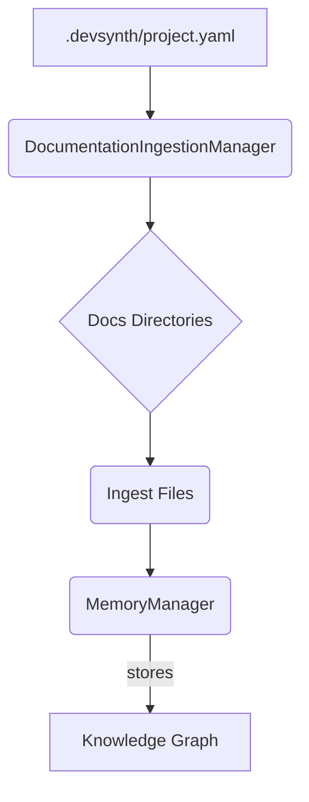

<div class="breadcrumbs">
<a href="../index.md">Documentation</a> &gt; <a href="index.md">Architecture</a> &gt; Documentation Ingestion Overview
</div>

# Documentation Ingestion Overview

This document describes how DevSynth ingests local documentation and integrates
it with the memory system. Configuration is driven by `.devsynth/project.yaml`.

## Integration Diagram



The `DocumentationIngestionManager` reads the documentation directories from the
project configuration and stores processed files in the knowledge graph. Other
components can then query these items.

## Pseudocode Example

```python
config = load_project_config()
docs_dirs = config.config.directories.get("docs", ["docs"])
manager = DocumentationIngestionManager(memory_manager)
for path in docs_dirs:
    manager.ingest_directory(Path(path))
results = manager.search_documentation("API usage")
```

The manager lazily loads files from each configured directory only when the
`ingest_from_project_config` method is executed.
## Implementation Status

.
