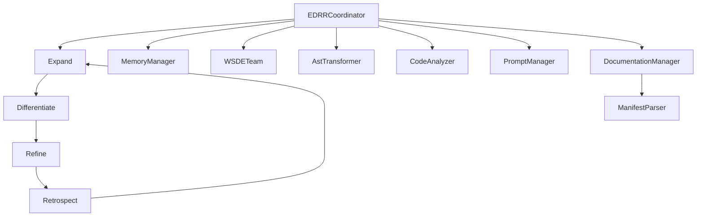

<div class="breadcrumbs">
<a href="../index.md">Documentation</a> &gt; <a href="index.md">Architecture</a> &gt; 'EDRR Framework: Expand, Differentiate, Refine, Retrospect'
</div>

# EDRR Framework: Expand, Differentiate, Refine, Retrospect

## Overview

The EDRR (Expand, Differentiate, Refine, Retrospect) framework is a core methodology used in DevSynth for structured problem-solving and implementation. This dialectical approach ensures comprehensive exploration of solutions, critical evaluation of alternatives, focused implementation, and reflective learning.



**Implementation Status**

- The `EDRRCoordinator` orchestrates phase transitions with manifest parser
  integration, but several coordination behaviors and step definitions are still
  incomplete. See [issue 104](../../issues/Critical-recommendations-follow-up.md) for outstanding tasks.
- Integration with `MemoryManager` and `WSDETeam` is functional but requires
  additional testing. `AstTransformer` and advanced documentation features remain
  in progress.

## Recursive EDRR Architecture

The EDRR framework is implemented as a recursive, fractal structure where each macro-level phase (Expand, Differentiate, Refine, Retrospect) can contain its own nested micro-EDRR cycles. This recursive approach enables self-optimization at multiple levels of granularity, creating a more adaptive and intelligent development process.

### Key Features of Recursive EDRR

- **Micro-Cycles**: Each phase can spawn micro-EDRR cycles for complex sub-tasks
- **Recursion Depth Control**: Limits prevent excessive nesting of cycles
- **Granularity Thresholds**: Prevents recursion for overly simple tasks
- **Cost-Benefit Analysis**: Ensures recursion provides value relative to effort
- **Quality Monitoring**: Tracks quality metrics to determine when recursion is beneficial
- **Resource Management**: Prevents excessive resource consumption
- **Human Oversight**: Allows human judgment to override automatic recursion decisions

### Example of Recursive EDRR

When implementing a complex feature, the main EDRR might handle the overall process, while micro-cycles address specific challenges:

1. **Main Cycle - Expand Phase**: Exploring approaches for implementing the feature
   - **Micro-Cycle**: Conducting detailed research on a specific technology
     - Has its own Expand, Differentiate, Refine, and Retrospect phases
     - Results feed back into the parent Expand phase

2. **Main Cycle - Differentiate Phase**: Evaluating approaches
   - **Micro-Cycle**: Performing detailed performance testing of alternatives
     - Results feed back into the parent Differentiate phase

3. **Main Cycle - Refine Phase**: Implementing the selected approach
   - **Micro-Cycle**: Developing a complex component of the implementation
     - Results feed back into the parent Refine phase

4. **Main Cycle - Retrospect Phase**: Evaluating the implementation
   - **Micro-Cycle**: Analyzing specific aspects of the implementation
     - Results feed back into the parent Retrospect phase

## Framework Phases

### 1. Expand Phase

The Expand phase focuses on divergent thinking and comprehensive exploration of the problem space.

#### Key Activities

- Brainstorming multiple approaches to solving the problem
- Exploring different implementation strategies
- Gathering relevant documentation and examples
- Analyzing existing code structures
- Identifying potential challenges and edge cases

#### Integration Points

- **WSDE Team**: Engages in collaborative brainstorming using multi-disciplinary reasoning
- **AST Analyzer**: Analyzes existing code structures
- **Prompt Manager**: Provides templates for exploration
- **Documentation Manager**: Retrieves relevant documentation

#### Example

When tasked with implementing a new feature like "vector memory storage":

```text
EXPAND PHASE OUTPUT:
1. Approach A: Use ChromaDB as the vector store backend
   - Pros: Well-documented, efficient for small to medium datasets
   - Cons: May have scaling limitations
2. Approach B: Implement FAISS integration
   - Pros: Highly efficient for large datasets, supports GPU acceleration
   - Cons: More complex implementation, additional dependencies
3. Approach C: Use DuckDB with pgvector extension
   - Pros: SQL interface, good for hybrid structured/vector queries
   - Cons: Newer technology, less community support
4. Approach D: Custom vector store with LMDB backend
   - Pros: Maximum control, potential for optimization
   - Cons: Development overhead, maintenance burden
```

### 2. Differentiate Phase

The Differentiate phase focuses on critical evaluation and comparison of the approaches identified in the Expand phase.

#### Key Activities

- Evaluating each approach against requirements
- Comparing approaches based on performance, maintainability, etc.
- Identifying trade-offs between different approaches
- Selecting the most appropriate approach
- Documenting the decision-making process

#### Integration Points

- **WSDE Team**: Evaluates and compares approaches with multi-disciplinary reasoning
- **AST Analyzer**: Evaluates code quality of potential implementations
- **Prompt Manager**: Provides templates for evaluation
- **Documentation Manager**: Retrieves best practices documentation

#### Example

Continuing with the "vector memory storage" feature:

```sql
DIFFERENTIATE PHASE OUTPUT:
Evaluation Criteria:
- Performance: Speed and efficiency for typical workloads
- Scalability: Ability to handle growing datasets
- Maintainability: Ease of maintenance and updates
- Integration: Compatibility with existing system
- Development Effort: Time and resources required

Approach Comparison:
1. ChromaDB: Performance (4/5), Scalability (3/5), Maintainability (4/5), Integration (5/5), Effort (5/5)
2. FAISS: Performance (5/5), Scalability (5/5), Maintainability (3/5), Integration (3/5), Effort (2/5)
3. DuckDB: Performance (3/5), Scalability (4/5), Maintainability (4/5), Integration (3/5), Effort (3/5)
4. Custom LMDB: Performance (4/5), Scalability (4/5), Maintainability (2/5), Integration (4/5), Effort (1/5)

Selected Approach: ChromaDB
Rationale: Best balance of performance, maintainability, and integration ease with reasonable scalability for current needs. Development effort is minimal, allowing for faster implementation.
```

### 3. Refine Phase

The Refine phase focuses on implementing the selected approach with attention to detail and quality.

#### Key Activities

- Implementing the selected approach
- Applying best practices and design patterns
- Optimizing for performance and maintainability
- Writing comprehensive tests
- Documenting the implementation

#### Integration Points

- **WSDE Team**: Implements the selected approach
- **AST Analyzer**: Applies code transformations for optimization
- **Prompt Manager**: Provides templates for implementation
- **Documentation Manager**: Retrieves implementation examples

#### Example

Implementing the ChromaDB vector store:

```text
REFINE PHASE OUTPUT:
Implementation Steps:
1. Created VectorMemoryAdapter interface in domain layer
2. Implemented ChromaDBAdapter in adapters layer
3. Added configuration options for ChromaDB in settings
4. Implemented Embedding utilities
5. Created factory for instantiating the appropriate adapter
6. Added comprehensive unit tests for all components
7. Integrated with existing MemoryManager class
8. Optimized query performance with indexing

Code Quality Improvements:
- Applied consistent error handling pattern
- Added comprehensive type hints
- Implemented connection pooling for better performance
- Added detailed logging for debugging
- Created utility functions for common operations
```

### 4. Retrospect Phase

The Retrospect phase focuses on evaluating the implementation, learning from the process, and identifying improvements.

#### Key Activities

- Evaluating the implementation against requirements
- Identifying lessons learned
- Documenting challenges and solutions
- Planning future improvements
- Sharing knowledge with the team

#### Integration Points

- **WSDE Team**: Evaluates the implementation
- **AST Analyzer**: Verifies code quality
- **Prompt Manager**: Provides templates for evaluation
- **Documentation Manager**: Retrieves evaluation criteria

#### Example

Reflecting on the ChromaDB implementation:

```text
RETROSPECT PHASE OUTPUT:
Evaluation:
- Implementation still in progress
- Performance meets expectations for current workloads
- Integration with existing systems is seamless
- Test coverage is comprehensive

Lessons Learned:
- ChromaDB configuration requires careful tuning for optimal performance
- Embedding generation is a potential bottleneck
- Connection management is critical for stability
- Type hints significantly improved code clarity

Future Improvements:
- Implement caching layer for frequently accessed vectors
- Add support for batch operations for better performance
- Create monitoring dashboard for vector store metrics
- Explore hybrid retrieval combining vector and keyword search

Knowledge Sharing:
- Documentation updated with implementation details
- Team presentation scheduled to share insights
- Example usage patterns added to developer guide
```

## EDRR Coordinator

The EDRR Coordinator orchestrates the flow between components according to the EDRR pattern. It manages the transitions between phases, ensures proper data flow, and maintains the state of the EDRR.

### Key Responsibilities

- Initializing and managing the EDRR
- Coordinating component interactions in each phase
- Managing phase transitions
- Storing and retrieving phase-specific data
- Generating comprehensive reports
- Creating and managing recursive micro-cycles
- Tracking parent-child relationships between cycles
- Enforcing recursion depth limits and quality thresholds

### Recursive Coordination

The coordinator supports recursive EDRR cycles by:
- Creating child coordinators for micro-cycles
- Maintaining parent-child relationships between cycles
- Tracking recursion depth to prevent excessive nesting
- Applying granularity thresholds to determine when recursion is appropriate
- Performing cost-benefit analysis for potential micro-cycles
- Monitoring quality metrics to guide recursion decisions
- Managing resource allocation across nested cycles
- Supporting human judgment overrides for recursion decisions
- Integrating results from micro-cycles back into parent cycles

### Integration with Other Components

- **Memory System**: Stores and retrieves phase-specific data
- **WSDE Team**: Coordinates agent activities in each phase
- **AST Analyzer**: Directs code analysis and transformation activities
- **Prompt Manager**: Retrieves phase-specific prompt templates
- **Documentation Manager**: Retrieves relevant documentation for each phase

## EDRR Manifest

The EDRR Manifest is a configuration file that defines the structure and parameters of an EDRR. It allows for customization of the EDRR process for specific tasks.

### Manifest Structure

```yaml
name: "Feature Implementation Cycle"
description: "EDRR for implementing a new feature"
version: "0.1.0a1"
phases:
  expand:
    instructions: "Explore multiple approaches to implementing the feature"
    templates:
      - "expand_feature_implementation"
    dependencies: []
    outputs:
      - "approach_list"
      - "challenge_list"
  differentiate:
    instructions: "Evaluate and compare the approaches identified in the Expand phase"
    templates:
      - "differentiate_approaches"
    dependencies:
      - "expand.approach_list"
    outputs:
      - "approach_evaluation"
      - "selected_approach"
  refine:
    instructions: "Implement the selected approach with attention to detail and quality"
    templates:
      - "refine_implementation"
    dependencies:
      - "differentiate.selected_approach"
    outputs:
      - "implementation_code"
      - "test_code"
      - "documentation"
  retrospect:
    instructions: "Evaluate the implementation and identify lessons learned"
    templates:
      - "retrospect_implementation"
    dependencies:
      - "refine.implementation_code"
      - "refine.test_code"
    outputs:
      - "evaluation_report"
      - "lessons_learned"
      - "future_improvements"
```

## Best Practices for Using EDRR

### General Best Practices

1. **Complete Each Phase**: Don't skip phases, as each contributes to the quality of the final solution.
2. **Document Decisions**: Record the rationale for decisions, especially in the Differentiate phase.
3. **Embrace Dialectical Thinking**: Consider opposing viewpoints and synthesize them into a coherent solution.
4. **Use Phase-Specific Templates**: Leverage the Prompt Manager's phase-specific templates.
5. **Learn from Retrospection**: Use the Retrospect phase to continuously improve the process.
6. **Customize for Task Complexity**: Adjust the depth of each phase based on task complexity.
7. **Leverage Component Integration**: Make full use of the integration between EDRR and other components.

### Recursive EDRR Best Practices

1. **Apply Recursion Strategically**: Use micro-cycles for complex subtasks that benefit from the full EDRR approach.
2. **Maintain Appropriate Granularity**: Don't create micro-cycles for simple tasks that don't warrant the overhead.
3. **Monitor Recursion Depth**: Keep recursion to a reasonable depth (typically 2-3 levels) to avoid complexity explosion.
4. **Balance Cost and Benefit**: Ensure the value gained from recursion justifies the additional time and resources.
5. **Integrate Results Effectively**: Ensure insights and artifacts from micro-cycles are properly integrated into parent cycles.
6. **Use Human Judgment**: Override automatic recursion decisions when human expertise suggests a different approach.
7. **Document Recursive Structure**: Maintain clear documentation of the recursive structure for better understanding and maintenance.

## Implementation Status

The recursive EDRR framework is in progress. Phase transitions are
handled automatically with configurable timeouts and recursion limits. The
coordinator integrates deeply with memory, WSDE agents, and documentation
management to produce a comprehensive final report after each cycle. Feature
flags can still disable collaborative reasoning features, but the core EDRR
orchestration operates end-to-end.

## Current Limitations

While end-to-end cycles execute successfully, several pieces remain only
partially implemented:

- Phase monitoring and debugging tools are minimal.
- Micro-cycle helpers lack advanced recovery hooks.
- WSDE collaboration is enabled by default but still requires additional
  validation with real projects.
- Dialectical reasoning hooks are experimental and disabled via
  `features.dialectical_reasoning`.

See the [Feature Status Matrix](../implementation/feature_status_matrix.md) for
the most up-to-date progress on these items.

## Related Documents

- [EDRR Specification](../specifications/edrr_cycle_specification.md)
- [Dialectical Reasoning](dialectical_reasoning.md)
- [WSDE Agent Model](wsde_agent_model.md)
- [Memory System Architecture](memory_system.md)
- [AST Code Analysis](../code_analysis.md)
