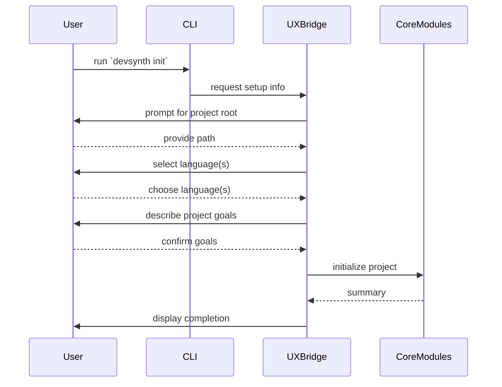

# Init Workflow Sequence

The redesigned `init` command collects essential project details before creating a configuration file.

Both the CLI and the future WebUI will use this same sequence by invoking the
`CoreModules` through the `UXBridge`. This keeps initialization logic in one
place while supporting multiple user interfaces.
