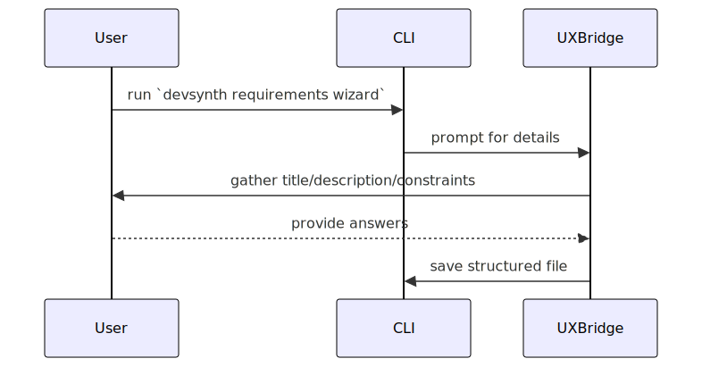

<a href="../index.md">Documentation</a> &gt; <a href="index.md">Architecture</a> &gt; Init Workflow

# Init Workflow

The redesigned `init` command collects essential project details before creating a configuration file.

Both the CLI and the future WebUI will use this same sequence by invoking the
`CoreModules` through the `UXBridge`. This keeps initialization logic in one
place while supporting multiple user interfaces.

## Requirements Wizard Sequence

This wizard shares the same prompts across interfaces thanks to the
`UXBridge` abstraction.
## Implementation Status

This workflow is **implemented** and used by both the CLI and WebUI
via the `UXBridge` layer.
