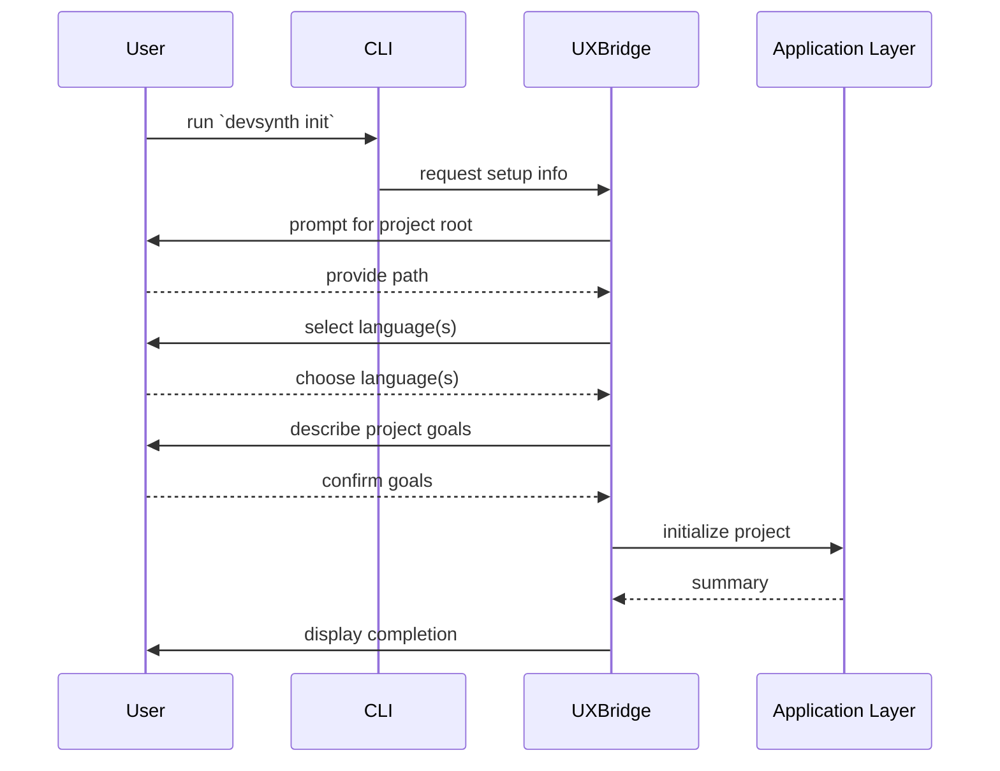

# Init Workflow Sequence

The redesigned `init` command collects essential project details before creating a configuration file.

```mermaid
sequenceDiagram
    participant U as User
    participant CLI as CLI
    participant UX as UXBridge
    participant App as Application Layer
    U->>CLI: run `devsynth init`
    CLI->>UX: request setup info
    UX->>U: prompt for project root
    U-->>UX: provide path
    UX->>U: select language(s)
    U-->>UX: choose language(s)
    UX->>U: describe project goals
    U-->>UX: confirm goals
    UX->>App: initialize project
    App-->>UX: summary
    UX->>U: display completion
```
