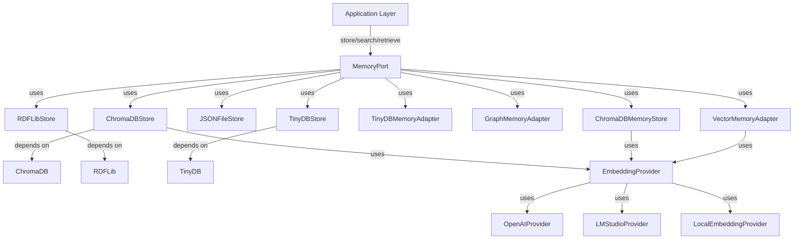

# DevSynth Memory System Architecture

## Overview

The DevSynth memory system is designed for extensibility, resilience, and semantic search. It supports multiple backends (ChromaDB, TinyDB, JSON, RDFLib) via a unified interface, enabling advanced retrieval-augmented workflows and agentic collaboration.

### Key Features
- **Multiple ChromaDB Implementations**: 
  - ChromaDBStore: Comprehensive implementation with caching, versioning, and optimized embeddings
  - ChromaDBMemoryStore: Implementation with provider system integration and retry mechanisms
- **Multiple TinyDB Implementations**:
  - TinyDBStore: Implementation with token counting and caching middleware
  - TinyDBMemoryAdapter: Implementation with structured data queries
- **JSON File Storage**: Persistent storage using JSON files
- **RDFLib Integration**: Knowledge graph storage using RDF triples with SPARQL query support
- **In-Memory Implementations**:
  - GraphMemoryAdapter: Simple in-memory graph implementation
  - VectorMemoryAdapter: Basic in-memory vector store
- **Provider System Integration**: Uses unified provider system (OpenAI, LM Studio) for embeddings with automatic fallback
- **Unified Memory Interface**: Abstracts backend details for seamless migration and extension

## Architecture Diagram

### Current Architecture



## Implementation Details

### Memory Interface

The unified `MemoryPort` interface defines the core operations across all memory implementations:

```python
class MemoryPort(ABC):
    """Abstract base class for memory storage operations."""
    
    @abstractmethod
    async def store(self, key: str, content: Any, metadata: Dict[str, Any] = None) -> str:
        """Store content with optional metadata, return unique ID."""
        pass
        
    @abstractmethod
    async def retrieve(self, key: str) -> Optional[Any]:
        """Retrieve content by key."""
        pass
        
    @abstractmethod
    async def search(self, query: str, limit: int = 5) -> List[Dict[str, Any]]:
        """Search for content relevant to query."""
        pass
        
    @abstractmethod
    async def delete(self, key: str) -> bool:
        """Delete content by key."""
        pass
        
    @abstractmethod
    async def update(self, key: str, content: Any, metadata: Dict[str, Any] = None) -> bool:
        """Update existing content."""
        pass
        
    @abstractmethod
    async def list_keys(self) -> List[str]:
        """List all stored keys."""
        pass
```

### ChromaDB Implementation

The `ChromaDBStore` implementation provides comprehensive vector storage with advanced features:

```python
class ChromaDBStore(MemoryPort):
    """ChromaDB implementation of the memory port."""
    
    def __init__(self, 
                 collection_name: str = "devsynth_memory",
                 embedding_provider: EmbeddingProvider = None,
                 persistence_directory: str = "./chroma_db",
                 cache_ttl: int = 3600,
                 retry_attempts: int = 3):
        """Initialize ChromaDB store with configuration."""
        self.client = chromadb.PersistentClient(path=persistence_directory)
        self.collection = self.client.get_or_create_collection(name=collection_name)
        self.embedding_provider = embedding_provider or OpenAIProvider()
        self.cache = LRUCache(maxsize=100, ttl=cache_ttl)
        self.retry_attempts = retry_attempts
        
    async def store(self, key: str, content: Any, metadata: Dict[str, Any] = None) -> str:
        """Store content and metadata with embeddings."""
        try:
            text_content = self._normalize_content(content)
            embedding = await self._get_embedding_with_retry(text_content)
            
            # Generate a unique ID if key is not provided
            doc_id = key or str(uuid.uuid4())
            
            # Store document with embedding
            self.collection.add(
                ids=[doc_id],
                embeddings=[embedding],
                documents=[text_content],
                metadatas=[metadata or {}]
            )
            
            # Update cache
            self.cache[doc_id] = (text_content, metadata)
            
            return doc_id
        except Exception as e:
            logger.error(f"Failed to store content: {str(e)}")
            raise MemoryStorageError(f"Failed to store content: {str(e)}")
            
    # Additional method implementations...
```

### Knowledge Graph Implementation

The `RDFLibStore` provides graph-based memory with semantic reasoning capabilities:

```python
class RDFLibStore(MemoryPort):
    """RDFLib implementation for knowledge graph storage."""
    
    def __init__(self, store_path: str = "memory.ttl"):
        """Initialize RDF graph store."""
        self.store_path = store_path
        self.graph = Graph()
        
        # Load existing graph if available
        if os.path.exists(store_path):
            self.graph.parse(store_path, format="turtle")
            
    async def store(self, key: str, content: Any, metadata: Dict[str, Any] = None) -> str:
        """Store content as RDF triples."""
        subject = URIRef(f"http://devsynth.ai/memory/{key}")
        
        # Add content triple
        self.graph.add((subject, RDFS.label, Literal(str(content))))
        
        # Add metadata triples
        if metadata:
            for meta_key, meta_value in metadata.items():
                predicate = URIRef(f"http://devsynth.ai/ontology/{meta_key}")
                self.graph.add((subject, predicate, Literal(str(meta_value))))
                
        # Persist changes to file
        self.graph.serialize(destination=self.store_path, format="turtle")
        
        return key
        
    async def search(self, query: str, limit: int = 5) -> List[Dict[str, Any]]:
        """Search using SPARQL queries."""
        sparql_query = f"""
            SELECT ?subject ?content ?key ?value
            WHERE {{
                ?subject rdfs:label ?content .
                OPTIONAL {{ ?subject ?key ?value }}
                FILTER(CONTAINS(LCASE(STR(?content)), LCASE("{query}")))
            }}
            LIMIT {limit}
        """
        
        results = []
        for row in self.graph.query(sparql_query):
            subject_id = str(row.subject).split('/')[-1]
            results.append({
                "id": subject_id,
                "content": str(row.content),
                "metadata": {str(row.key).split('/')[-1]: str(row.value)} if row.key else {}
            })
            
        return results
```

## Configuration Examples

### Setting Up ChromaDB Memory Store

```python
from devsynth.adapters.memory.chromadb_store import ChromaDBStore
from devsynth.adapters.providers.openai_provider import OpenAIProvider

# Configure with OpenAI embeddings
memory = ChromaDBStore(
    collection_name="project_memory",
    embedding_provider=OpenAIProvider(model="text-embedding-3-small"),
    persistence_directory="./data/memory",
    cache_ttl=7200,  # 2 hours
    retry_attempts=3
)

# Store code snippet with metadata
await memory.store(
    key="authentication_module",
    content="def authenticate(username, password):\n    # Implementation\n    return token",
    metadata={
        "language": "python",
        "component": "auth",
        "author": "dev_team",
        "created_at": "2025-06-01"
    }
)

# Search for authentication-related content
results = await memory.search("authentication implementation", limit=3)
```

### Setting Up RDFLib Knowledge Graph Store

```python
from devsynth.adapters.memory.rdflib_store import RDFLibStore

# Initialize the knowledge graph
kg_memory = RDFLibStore(store_path="./data/knowledge_graph.ttl")

# Store relationship between components
await kg_memory.store(
    key="relationship_auth_db",
    content="Authentication module depends on Database module",
    metadata={
        "relationship_type": "depends_on",
        "source": "authentication_module",
        "target": "database_module",
        "strength": "high"
    }
)

# Query relationships with SPARQL
results = await kg_memory.search_with_sparql("""
    SELECT ?subject ?target ?type
    WHERE {
        ?subject <http://devsynth.ai/ontology/relationship_type> ?type .
        ?subject <http://devsynth.ai/ontology/target> ?target .
    }
""")
```

## Performance Considerations

### Memory Usage Patterns

Different memory implementations have varying performance characteristics:

| Implementation     | Read Performance | Write Performance | Query Performance | Memory Usage | Persistence | Best Use Case                     |
|-------------------|-----------------|-------------------|------------------|--------------|------------|----------------------------------|
| ChromaDBStore     | Medium          | Medium            | High             | High         | Yes        | Semantic search, RAG              |
| TinyDBStore       | High            | High              | Low              | Low          | Yes        | Simple key-value storage          |
| RDFLibStore       | Medium          | Low               | High             | Medium       | Yes        | Knowledge graphs, reasoning       |
| JSONFileStore     | High            | Medium            | Low              | Low          | Yes        | Configuration, simple data        |
| VectorMemoryAdapter| High           | High              | Medium           | Medium       | No         | Testing, temporary storage        |

### Scaling Strategies

- **Sharding**: For large collections, implement sharding based on content categories
- **Caching**: Implement multi-level caching for frequently accessed items
- **Indexing**: Use specialized indices for different query patterns
- **Batching**: Process large operations in batches to avoid memory spikes

## Best Practices

1. **Choose the Right Implementation**: Select the memory implementation based on your specific use case requirements
2. **Configure Embedding Models**: Use appropriate embedding models for your domain-specific content
3. **Implement Error Handling**: Add robust retry and fallback mechanisms for resilience
4. **Monitor Memory Usage**: Track memory consumption and query performance
5. **Regular Maintenance**: Implement scheduled maintenance for index optimization and cleanup
6. **Backup Strategy**: Create regular backups of persistent stores
7. **Security Considerations**: Secure sensitive information using encryption at rest and in transit

## Integration with Other Systems

The memory system integrates with other DevSynth components:

- **Agent System**: Provides context and history for agent operations
- **Dialectical Reasoning System**: Stores reasoning chains and outcomes
- **Provider System**: Utilizes embedding providers for vector representations
- **EDRR Framework**: Supports the Evaluate-Design-Reason-Refine cycle

## Query Routing and Synchronization

Two helper components extend the memory manager:

- **QueryRouter**: Routes queries to the appropriate store and supports
  direct, cross-store, cascading, federated and context-aware strategies.
- **SyncManager**: Propagates changes between stores and handles basic
  synchronization tasks.

```python
from devsynth.application.memory.memory_manager import MemoryManager
from devsynth.application.memory.query_router import QueryRouter

manager = MemoryManager({"vector": vector_store, "graph": graph_store})

# Cross-store query
results = manager.route_query("authentication implementation", strategy="cross")

# Synchronize two stores
manager.synchronize("vector", "graph")
```

## Common Usage Patterns

### RAG Pattern (Retrieval Augmented Generation)

```python
# 1. Store context documents
for document in project_documents:
    await memory.store(
        key=document.id,
        content=document.text,
        metadata=document.metadata
    )

# 2. Retrieve relevant context for a query
query = "How does the authentication system handle OAuth?"
context_results = await memory.search(query, limit=3)

# 3. Extract relevant context
relevant_context = "\n".join([result["content"] for result in context_results])

# 4. Augment LLM prompt with context
augmented_prompt = f"""
Based on the following context:
{relevant_context}

Answer the question: {query}
"""

# 5. Generate response with LLM using augmented prompt
response = await llm_provider.generate(augmented_prompt)
```

### Knowledge Graph Navigation

```python
# 1. Define relationships between components
components = ["auth", "db", "api", "ui"]
for i, comp1 in enumerate(components):
    for comp2 in components[i+1:]:
        if relationship_exists(comp1, comp2):
            relation = determine_relationship(comp1, comp2)
            await kg_memory.store(
                key=f"rel_{comp1}_{comp2}",
                content=f"{comp1} {relation.name} {comp2}",
                metadata={
                    "type": "relationship",
                    "source": comp1,
                    "target": comp2,
                    "relation": relation.name,
                    "properties": relation.properties
                }
            )

# 2. Find all dependencies for a component
component = "auth"
dependencies = await kg_memory.search_with_sparql(f"""
    SELECT ?target ?relation
    WHERE {{
        ?subject <http://devsynth.ai/ontology/source> "{component}" .
        ?subject <http://devsynth.ai/ontology/target> ?target .
        ?subject <http://devsynth.ai/ontology/relation> ?relation .
    }}
""")
```

## Future Enhancements

- **Hybrid Search**: Combining vector and keyword search for improved precision
- **Distributed Storage**: Supporting distributed memory implementations
- **Streaming Updates**: Real-time updates for collaborative environments
- **Incremental Embeddings**: Optimizing embedding generation for large documents
- **Multi-modal Storage**: Supporting storage and retrieval of various data types (text, code, images)
