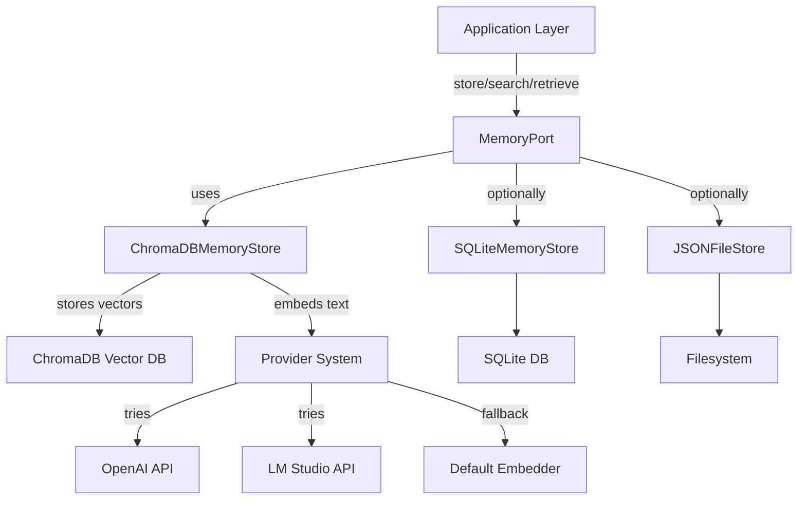

# DevSynth Memory System Architecture

## Overview

The DevSynth memory system is designed for extensibility, resilience, and semantic search. It supports multiple backends (ChromaDB, SQLite, JSON) via a unified interface, enabling advanced retrieval-augmented workflows and agentic collaboration.

### Key Features
- **ChromaDB Integration**: Vector database for semantic search and scalable storage
- **Provider System Integration**: Uses unified provider system (OpenAI, LM Studio) for embeddings with automatic fallback
- **SQLite Backend**: Structured data storage with efficient indexing
- **Unified Memory Interface**: Abstracts backend details for seamless migration and extension
- **Versioning & Caching**: (Planned) Artifact versioning and in-memory caching for performance

## Architecture Diagram

## MemoryPort (Hexagonal Adapter)
- Exposes `store_memory`, `retrieve_memory`, `search_memory` methods
- Uses `ChromaDBMemoryStore` by default, but can be configured for other backends
- Ensures all artifacts are stored with metadata, type, and version (future)

## ChromaDBMemoryStore
- Implements the `MemoryStore` protocol
- Stores artifacts as vectors for semantic search
- Leverages provider system for embeddings with automatic fallback mechanisms
- Configurable to use specific providers (OpenAI, LM Studio) or default embedder
- Supports add, retrieve, search, and delete operations
- All test artifacts are isolated and cleaned up via test fixtures

## Provider System Integration
- Uses unified provider abstraction for generating embeddings
- Provides automatic fallback between providers if one is unavailable
- Graceful degradation to default embedder if all providers fail
- Configurable via environment variables and initialization parameters

## Extensibility
- New backends can be added by implementing the `MemoryStore` protocol
- New embedding providers can be added through the provider system
- Migration utilities are planned for seamless data transfer between stores

## Testing & Cleanliness
- All tests use temporary directories and patch environment variables for isolation
- CI checks ensure no workspace pollution
- Test fixtures provide access to LLM providers and embedding capabilities

## Traceability
- Requirements, code, and tests are linked via IDs and doc references
- See `docs/specifications/current/devsynth_specification.md` and `tests/behavior/test_chromadb_integration.py`

## Future Enhancements
- Add versioning and caching layers
- Integrate with self-analysis and dialectic reasoning modules
- Expand semantic search to all project artifacts
- Introduce more sophisticated embedding models and techniques

---

_Last updated: May 2025_
