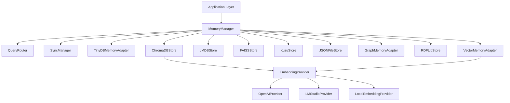

<div class="breadcrumbs">
<a href="../index.md">Documentation</a> &gt; <a href="index.md">Architecture</a> &gt; DevSynth Memory System Architecture
</div>

# DevSynth Memory System Architecture

## Overview

The DevSynth memory system is designed for extensibility, resilience, and semantic search. It supports multiple backends (ChromaDB, TinyDB, JSON, RDFLib) via a unified interface, enabling advanced retrieval-augmented workflows and agentic collaboration.

### Key Features

- **Multiple ChromaDB Implementations**:
  - ChromaDBStore: Comprehensive implementation with caching, versioning, and optimized embeddings
  - ChromaDBMemoryStore: Implementation with provider system integration and retry mechanisms
- **Multiple TinyDB Implementations**:
  - TinyDBStore: Implementation with token counting and caching middleware
  - TinyDBMemoryAdapter: Implementation with structured data queries
- **JSON File Storage**: Persistent storage using JSON files
- **RDFLib Integration**: Knowledge graph storage using RDF triples with SPARQL query support
- **In-Memory Implementations**:
  - GraphMemoryAdapter: Simple in-memory graph implementation
  - VectorMemoryAdapter: Basic in-memory vector store
- **Provider System Integration**: Uses unified provider system (OpenAI, LM Studio) for embeddings with automatic fallback
- **Unified Memory Interface**: Abstracts backend details for seamless migration and extension

## Architecture Diagram

### Current Architecture



**Implementation Status**

The memory subsystem is **fully implemented**. `MemoryManager`, `QueryRouter`,
`SyncManager`, `TinyDBMemoryAdapter`, `ChromaDBStore`, `LMDBStore`, `FAISSStore`,
`KuzuStore`, `JSONFileStore`, `GraphMemoryAdapter`, `VectorMemoryAdapter`, and
`RDFLibStore` are actively used in the codebase with integration tests covering
cross-store synchronization.

## Implementation Details

### Conflict Resolution and Transactions

`SyncManager` keeps multiple stores consistent by detecting conflicts and
resolving them in favour of the newest item. Cross-store transactions span
LMDB, FAISS, and Kuzu adapters using store-specific context managers. If any
operation fails, changes are rolled back across all participating stores using a
mix of native transactions and snapshot restoration.

### Complexity and Synchronization Guarantees

The memory subsystem exhibits the following time complexities (``n`` = number of
stored items):

| Adapter | Insert Complexity | Lookup Complexity |
|---------|-------------------|-------------------|
| TinyDB  | ``O(n)``          | ``O(n)``          |
| DuckDB  | ``O(log n)``      | ``O(log n)``      |
| LMDB    | ``O(log n)``      | ``O(log n)``      |
| Kuzu    | ``O(log n)``      | ``O(log n)``      |

`SyncManager` enforces atomic cross-store commits across LMDB, FAISS, and Kuzu.
It couples LMDB's native transactions with snapshot restoration for adapters
that lack transactional support. When a failure occurs, all participating stores
roll back to their previous states, ensuring that either every store records the
update or none do. Asynchronous replicas such as TinyDB and DuckDB receive
changes after the transaction completes, providing eventual consistency with a
last-write-wins policy.

### Domain Models

#### Memory Types

The `MemoryType` enum defines various types of memory in the DevSynth system:

```python
class MemoryType(Enum):
    """Types of memory in the DevSynth system."""
    SHORT_TERM = "short_term"
    LONG_TERM = "long_term"
    WORKING = "working"
    EPISODIC = "episodic"
    SOLUTION = "solution"
    DIALECTICAL_REASONING = "dialectical_reasoning"
    TEAM_STATE = "team_state"
    KNOWLEDGE_GRAPH = "knowledge_graph"
    RELATIONSHIP = "relationship"
    CODE_ANALYSIS = "code_analysis"
    CODE = "code"
    CODE_TRANSFORMATION = "code_transformation"
    DOCUMENTATION = "documentation"
    CONTEXT = "context"
    CONVERSATION = "conversation"
    TASK_HISTORY = "task_history"
    KNOWLEDGE = "knowledge"
    ERROR_LOG = "error_log"
```

#### Memory Items

The `MemoryItem` dataclass represents a single item stored in memory:

```python
@dataclass
class MemoryItem:
    """A single item stored in memory."""
    id: str
    content: Any
    memory_type: MemoryType
    metadata: Dict[str, Any] = None
    created_at: datetime = None

    def __post_init__(self):
        if self.metadata is None:
            self.metadata = {}
        if self.created_at is None:
            self.created_at = datetime.now()
```

#### Memory Vectors

The `MemoryVector` dataclass represents a vector representation of a memory item:

```python
@dataclass
class MemoryVector:
    """A vector representation of a memory item."""
    id: str
    content: Any
    embedding: List[float]
    metadata: Dict[str, Any] = None
    created_at: datetime = None

    def __post_init__(self):
        if self.metadata is None:
            self.metadata = {}
        if self.created_at is None:
            self.created_at = datetime.now()
```

### Memory Interfaces

The memory system defines several protocols that implementations must adhere to:

#### Memory Store Protocol

```python
class MemoryStore(Protocol):
    """Protocol for memory storage."""

    @abstractmethod
    def store(self, item: MemoryItem) -> str:
        """Store an item in memory and return its ID."""
        ...

    @abstractmethod
    def retrieve(self, item_id: str) -> Optional[MemoryItem]:
        """Retrieve an item from memory by ID."""
        ...

    @abstractmethod
    def search(self, query: Dict[str, Any]) -> List[MemoryItem]:
        """Search for items in memory matching the query."""
        ...

    @abstractmethod
    def delete(self, item_id: str) -> bool:
        """Delete an item from memory."""
        ...
```

#### Vector Store Protocol

```python
class VectorStore(Protocol):
    """Protocol for vector storage."""

    @abstractmethod
    def store_vector(self, vector: MemoryVector) -> str:
        """Store a vector in the vector store and return its ID."""
        ...

    @abstractmethod
    def retrieve_vector(self, vector_id: str) -> Optional[MemoryVector]:
        """Retrieve a vector from the vector store by ID."""
        ...

    @abstractmethod
    def similarity_search(
        self, query_embedding: List[float], top_k: int = 5
    ) -> List[MemoryVector]:
        """Search for vectors similar to the query embedding."""
        ...

    @abstractmethod
    def delete_vector(self, vector_id: str) -> bool:
        """Delete a vector from the vector store."""
        ...

    @abstractmethod
    def get_collection_stats(self) -> Dict[str, Any]:
        """Get statistics about the vector store collection."""
        ...
```

#### Context Manager Protocol

```python
class ContextManager(Protocol):
    """Protocol for managing context."""

    @abstractmethod
    def add_to_context(self, key: str, value: Any) -> None:
        """Add a value to the current context."""
        ...

    @abstractmethod
    def get_from_context(self, key: str) -> Optional[Any]:
        """Get a value from the current context."""
        ...

    @abstractmethod
    def get_full_context(self) -> Dict[str, Any]:
        """Get the full current context."""
        ...

    @abstractmethod
    def clear_context(self) -> None:
        """Clear the current context."""
        ...
```

#### Vector Store Provider Factory Protocol

```python
class VectorStoreProviderFactory(Protocol):
    """Protocol for creating VectorStore providers."""

    @abstractmethod
    def create_provider(
        self, provider_type: str, config: Dict[str, Any] | None = None
    ) -> VectorStore:
        """Create a VectorStore provider of the specified type."""
        ...

    @abstractmethod
    def register_provider_type(self, provider_type: str, provider_class: type) -> None:
        """Register a new provider type."""
        ...
```

### Memory Port Interface

The unified `MemoryPort` interface defines the core operations across all memory implementations:

```python
class MemoryPort(ABC):
    """Abstract base class for memory storage operations."""

    @abstractmethod
    async def store(self, key: str, content: Any, metadata: Dict[str, Any] = None) -> str:
        """Store content with optional metadata, return unique ID."""
        pass

    @abstractmethod
    async def retrieve(self, key: str) -> Optional[Any]:
        """Retrieve content by key."""
        pass

    @abstractmethod
    async def search(self, query: str, limit: int = 5) -> List[Dict[str, Any]]:
        """Search for content relevant to query."""
        pass

    @abstractmethod
    async def delete(self, key: str) -> bool:
        """Delete content by key."""
        pass

    @abstractmethod
    async def update(self, key: str, content: Any, metadata: Dict[str, Any] = None) -> bool:
        """Update existing content."""
        pass

    @abstractmethod
    async def list_keys(self) -> List[str]:
        """List all stored keys."""
        pass
```

### ChromaDB Implementation

The `ChromaDBStore` implementation provides comprehensive vector storage with advanced features:

```python
class ChromaDBStore(MemoryPort):
    """ChromaDB implementation of the memory port."""

    def __init__(self,
                 collection_name: str = "devsynth_memory",
                 embedding_provider: EmbeddingProvider = None,
                 persistence_directory: str = "./chroma_db",
                 cache_ttl: int = 3600,
                 retry_attempts: int = 3):
        """Initialize ChromaDB store with configuration."""
        self.client = ChromaDB.PersistentClient(path=persistence_directory)
        self.collection = self.client.get_or_create_collection(name=collection_name)
        self.embedding_provider = embedding_provider or OpenAIProvider()
        self.cache = LRUCache(maxsize=100, ttl=cache_ttl)
        self.retry_attempts = retry_attempts

    async def store(self, key: str, content: Any, metadata: Dict[str, Any] = None) -> str:
        """Store content and metadata with embeddings."""
        try:
            text_content = self._normalize_content(content)
            embedding = await self._get_embedding_with_retry(text_content)

            # Generate a unique ID if key is not provided
            doc_id = key or str(uuid.uuid4())

            # Store document with embedding
            self.collection.add(
                ids=[doc_id],
                embeddings=[embedding],
                documents=[text_content],
                metadatas=[metadata or {}]
            )

            # Update cache
            self.cache[doc_id] = (text_content, metadata)

            return doc_id
        except Exception as e:
            logger.error(f"Failed to store content: {str(e)}")
            raise MemoryStorageError(f"Failed to store content: {str(e)}")

    # Additional method implementations...
```

### Multi-Layered Memory System

The `MultiLayeredMemorySystem` implementation provides a multi-layered memory system with short-term, episodic, and semantic memory layers:

```python
class MultiLayeredMemorySystem:
    """
    Multi-Layered Memory System with short-term, episodic, and semantic memory layers.

    This class categorizes memory items into appropriate layers based on their type
    and provides methods for querying across layers. It also supports a tiered cache
    strategy for faster access to frequently used items.
    """

    def __init__(self):
        """Initialize the multi-layered memory system."""
        # Initialize memory layers
        self.short_term_memory = {}  # For immediate context (e.g., current task, conversation)
        self.episodic_memory = {}    # For past events (e.g., task history, error logs)
        self.semantic_memory = {}    # For general knowledge (e.g., language references, best practices)

        # Initialize cache
        self.cache = None
        self.cache_enabled = False
        self.cache_stats = {"hits": 0, "misses": 0}

    def store(self, memory_item: MemoryItem) -> str:
        """
        Store a memory item in the appropriate memory layer.

        Args:
            memory_item: The memory item to store

        Returns:
            The ID of the stored memory item
        """
        # Generate an ID if not provided
        if not memory_item.id:
            memory_item.id = str(uuid.uuid4())

        # Determine the appropriate memory layer based on the memory type
        if memory_item.memory_type in [MemoryType.CONTEXT, MemoryType.CONVERSATION]:
            # Store in short-term memory
            self.short_term_memory[memory_item.id] = memory_item
        elif memory_item.memory_type in [MemoryType.TASK_HISTORY, MemoryType.ERROR_LOG]:
            # Store in episodic memory
            self.episodic_memory[memory_item.id] = memory_item
        elif memory_item.memory_type in [MemoryType.KNOWLEDGE, MemoryType.DOCUMENTATION]:
            # Store in semantic memory
            self.semantic_memory[memory_item.id] = memory_item
        else:
            # Default to short-term memory for unknown types
            self.short_term_memory[memory_item.id] = memory_item

        return memory_item.id

    def retrieve(self, item_id: str) -> Optional[MemoryItem]:
        """
        Retrieve a memory item by ID.

        Args:
            item_id: The ID of the memory item to retrieve

        Returns:
            The retrieved memory item, or None if not found
        """
        # Check cache first if enabled
        if self.cache_enabled:
            cached_item = self.cache.get(item_id)
            if cached_item is not None:
                self.cache_stats["hits"] += 1
                return cached_item
            self.cache_stats["misses"] += 1

        # Check each memory layer
        if item_id in self.short_term_memory:
            item = self.short_term_memory[item_id]
        elif item_id in self.episodic_memory:
            item = self.episodic_memory[item_id]
        elif item_id in self.semantic_memory:
            item = self.semantic_memory[item_id]
        else:
            return None

        # Add to cache if enabled
        if self.cache_enabled:
            self.cache.put(item_id, item)

        return item

    def query(self, query_params: Dict[str, Any]) -> List[MemoryItem]:
        """
        Query memory items across layers.

        Args:
            query_params: Query parameters, including optional "layer" parameter

        Returns:
            A list of memory items matching the query
        """
        # Check if a specific layer is requested
        layer = query_params.get("layer")

        if layer:
            # Query a specific layer
            return self.get_items_by_layer(layer)
        else:
            # Query all layers
            all_items = []
            all_items.extend(self.short_term_memory.values())
            all_items.extend(self.episodic_memory.values())
            all_items.extend(self.semantic_memory.values())
            return all_items

    def enable_tiered_cache(self, max_size: int = 100) -> None:
        """
        Enable the tiered cache strategy.

        Args:
            max_size: The maximum number of items to store in the cache
        """
        self.cache = TieredCache(max_size=max_size)
        self.cache_enabled = True
```

### Tiered Cache Implementation

The `TieredCache` implementation provides a tiered cache strategy with an in-memory cache for frequently used items:

```python
class TieredCache(Generic[T]):
    """
    Tiered Cache with LRU eviction policy.

    This class implements a tiered cache strategy with an in-memory cache for
    frequently used items. It uses a Least Recently Used (LRU) cache eviction
    policy to manage cache size.
    """

    def __init__(self, max_size: int = 100):
        """
        Initialize the tiered cache.

        Args:
            max_size: The maximum number of items to store in the cache
        """
        self.max_size = max_size
        self.cache: OrderedDict[str, T] = OrderedDict()

    def get(self, key: str) -> Optional[T]:
        """
        Get an item from the cache.

        Args:
            key: The key of the item to retrieve

        Returns:
            The cached item, or None if not found
        """
        if key in self.cache:
            # Move the item to the end of the OrderedDict to mark it as most recently used
            value = self.cache.pop(key)
            self.cache[key] = value
            return value

        return None

    def put(self, key: str, value: T) -> None:
        """
        Put an item in the cache.

        Args:
            key: The key of the item to store
            value: The item to store
        """
        # If the key already exists, remove it first
        if key in self.cache:
            self.cache.pop(key)

        # If the cache is full, remove the least recently used item (first item in OrderedDict)
        if len(self.cache) >= self.max_size:
            # Get the key of the least recently used item
            lru_key, _ = next(iter(self.cache.items()))
            self.cache.pop(lru_key)

        # Add the new item to the end of the OrderedDict
        self.cache[key] = value

    def clear(self) -> None:
        """Clear the cache."""
        self.cache.clear()

    def size(self) -> int:
        """
        Get the current size of the cache.

        Returns:
            The number of items in the cache
        """
        return len(self.cache)
```

### Knowledge Graph Implementation

The `RDFLibStore` provides graph-based memory with semantic reasoning capabilities:

```python
class RDFLibStore(MemoryPort):
    """RDFLib implementation for knowledge graph storage."""

    def __init__(self, store_path: str = "memory.ttl"):
        """Initialize RDF graph store."""
        self.store_path = store_path
        self.graph = Graph()

        # Load existing graph if available
        if os.path.exists(store_path):
            self.graph.parse(store_path, format="turtle")

    async def store(self, key: str, content: Any, metadata: Dict[str, Any] = None) -> str:
        """Store content as RDF triples."""
        subject = URIRef(f"https://github.com/ravenoak/devsynth/ontology/memory/{key}")

        # Add content triple
        self.graph.add((subject, RDFS.label, Literal(str(content))))

        # Add metadata triples
        if metadata:
            for meta_key, meta_value in metadata.items():
                predicate = URIRef(f"https://github.com/ravenoak/devsynth/ontology/{meta_key}")
                self.graph.add((subject, predicate, Literal(str(meta_value))))

        # Persist changes to file
        self.graph.serialize(destination=self.store_path, format="turtle")

        return key

    async def search(self, query: str, limit: int = 5) -> List[Dict[str, Any]]:
        """Search using SPARQL queries."""
        sparql_query = f"""
            SELECT ?subject ?content ?key ?value
            WHERE {{
                ?subject rdfs:label ?content .
                OPTIONAL {{ ?subject ?key ?value }}
                FILTER(CONTAINS(LCASE(STR(?content)), LCASE("{query}")))
            }}
            LIMIT {limit}
        """

        results = []
        for row in self.graph.query(sparql_query):
            subject_id = str(row.subject).split('/')[-1]
            results.append({
                "id": subject_id,
                "content": str(row.content),
                "metadata": {str(row.key).split('/')[-1]: str(row.value)} if row.key else {}
            })

        return results
```

## Configuration Examples

### Setting Up ChromaDB Memory Store

```python
from devsynth.application.memory.chromadb_store import ChromaDBStore
from devsynth.adapters.providers.openai_provider import OpenAIProvider

# Configure with OpenAI embeddings

memory = ChromaDBStore(
    collection_name="project_memory",
    embedding_provider=OpenAIProvider(model="text-embedding-3-small"),
    persistence_directory="./data/memory",
    cache_ttl=7200,  # 2 hours
    retry_attempts=3
)

# Store code snippet with metadata

await memory.store(
    key="authentication_module",
    content="def authenticate(username, password):\n    # Implementation\n    return token",
    metadata={
        "language": "python",
        "component": "auth",
        "author": "dev_team",
        "created_at": "2025-06-01"
    }
)

# Search for authentication-related content

results = await memory.search("authentication implementation", limit=3)
```

## Setting Up RDFLib Knowledge Graph Store

```python
from devsynth.adapters.memory.rdflib_store import RDFLibStore

# Initialize the knowledge graph

kg_memory = RDFLibStore(store_path="./data/knowledge_graph.ttl")

# Store relationship between components

await kg_memory.store(
    key="relationship_auth_db",
    content="Authentication module depends on Database module",
    metadata={
        "relationship_type": "depends_on",
        "source": "authentication_module",
        "target": "database_module",
        "strength": "high"
    }
)

# Query relationships with SPARQL

results = await kg_memory.search_with_sparql("""
    SELECT ?subject ?target ?type
    WHERE {
        ?subject <https://github.com/ravenoak/devsynth/ontology/relationship_type> ?type .
        ?subject <https://github.com/ravenoak/devsynth/ontology/target> ?target .
    }
""")
```

## Performance Considerations

### Memory Usage Patterns

Different memory implementations have varying performance characteristics:

| Implementation     | Read Performance | Write Performance | Query Performance | Memory Usage | Persistence | Best Use Case                     |
|-------------------|-----------------|-------------------|------------------|--------------|------------|----------------------------------|
| ChromaDBStore     | Medium          | Medium            | High             | High         | Yes        | Semantic search, RAG              |
| TinyDBStore       | High            | High              | Low              | Low          | Yes        | Simple key-value storage          |
| RDFLibStore       | Medium          | Low               | High             | Medium       | Yes        | Knowledge graphs, reasoning       |
| JSONFileStore     | High            | Medium            | Low              | Low          | Yes        | Configuration, simple data        |
| VectorMemoryAdapter| High           | High              | Medium           | Medium       | No         | Testing, temporary storage        |

### Scaling Strategies

- **Sharding**: For large collections, implement sharding based on content categories
- **Caching**: Implement multi-level caching for frequently accessed items
- **Indexing**: Use specialized indices for different query patterns
- **Batching**: Process large operations in batches to avoid memory spikes

## Best Practices

1. **Choose the Right Implementation**: Select the memory implementation based on your specific use case requirements
2. **Configure Embedding Models**: Use appropriate embedding models for your domain-specific content
3. **Implement Error Handling**: Add robust retry and fallback mechanisms for resilience
4. **Monitor Memory Usage**: Track memory consumption and query performance
5. **Regular Maintenance**: Implement scheduled maintenance for index optimization and cleanup
6. **Backup Strategy**: Create regular backups of persistent stores
7. **Security Considerations**: Secure sensitive information using encryption at rest and in transit

## Integration with Other Systems

The memory system integrates with other DevSynth components:

- **Agent System**: Provides context and history for agent operations
- **Dialectical Reasoning System**: Stores reasoning chains and outcomes
- **Provider System**: Utilizes embedding providers for vector representations
- **EDRR Framework**: Supports the Evaluate-Design-Reason-Refine cycle

### Vector Store Provider Factory

To decouple the memory manager from concrete vector store implementations the
`SimpleVectorStoreProviderFactory` mirrors the Provider factory pattern.
Vector store classes register themselves with the factory and can then be
instantiated by type.  The memory manager accepts these providers so embedding
and search logic can be delegated without hard dependencies on specific
backends.

```python
from devsynth.application.memory.vector_providers import factory
from devsynth.adapters.memory.kuzu_adapter import KuzuAdapter

factory.register_provider_type("Kuzu", KuzuAdapter)
vector_store = factory.create_provider("Kuzu", {"persist_directory": "./data"})
manager = MemoryManager({"vector": vector_store})
```

## Query Routing and Synchronization

Two helper components extend the memory manager:

- **QueryRouter**: Routes queries to the appropriate store and supports
  direct, cross-store, cascading, federated and context-aware strategies.
- **SyncManager**: Propagates changes between stores and handles basic
  synchronization tasks.

```python
from devsynth.application.memory.memory_manager import MemoryManager
from devsynth.application.memory.query_router import QueryRouter

manager = MemoryManager({"vector": vector_store, "graph": graph_store})

# Cross-store query

results = manager.route_query("authentication implementation", strategy="cross")

# Synchronize two stores

manager.synchronize("vector", "graph")
```

The synchronization manager keeps a small in-memory cache of cross-store
query results. Repeating a query with `manager.sync_manager.cross_store_query()`
will return the cached data until the cache is cleared.

## Common Usage Patterns

### Multi-Layered Memory System Usage

```python
from devsynth.application.memory.multi_layered_memory import MultiLayeredMemorySystem
from devsynth.domain.models.memory import MemoryItem, MemoryType

# Initialize the multi-layered memory system

memory_system = MultiLayeredMemorySystem()

# Enable tiered cache for faster access to frequently used items

memory_system.enable_tiered_cache(max_size=200)

# Store items in different memory layers

context_item = MemoryItem(
    id="context_1",
    content="Current project: Authentication System",
    memory_type=MemoryType.CONTEXT,
    metadata={"project": "auth_system", "priority": "high"}
)
memory_system.store(context_item)

task_history_item = MemoryItem(
    id="task_1",
    content="Implemented OAuth flow",
    memory_type=MemoryType.TASK_HISTORY,
    metadata={"status": "completed", "date": "2025-06-01"}
)
memory_system.store(task_history_item)

knowledge_item = MemoryItem(
    id="knowledge_1",
    content="OAuth 2.0 best practices",
    memory_type=MemoryType.KNOWLEDGE,
    metadata={"category": "security", "source": "official_docs"}
)
memory_system.store(knowledge_item)

# Retrieve items from different memory layers

context = memory_system.retrieve("context_1")
task = memory_system.retrieve("task_1")
knowledge = memory_system.retrieve("knowledge_1")

# Query items across layers

all_items = memory_system.query({})
print(f"Total items: {len(all_items)}")

# Query items in a specific layer

short_term_items = memory_system.query({"layer": "short-term"})
print(f"Short-term items: {len(short_term_items)}")

# Get cache statistics

cache_stats = memory_system.get_cache_stats()
print(f"Cache hits: {cache_stats['hits']}, Cache misses: {cache_stats['misses']}")
```

## RAG Pattern (Retrieval Augmented Generation)

```python

# 1. Store context documents

for document in project_documents:
    await memory.store(
        key=document.id,
        content=document.text,
        metadata=document.metadata
    )

# 2. Retrieve relevant context for a query

query = "How does the authentication system handle OAuth?"
context_results = await memory.search(query, limit=3)

# 3. Extract relevant context

relevant_context = "\n".join([result["content"] for result in context_results])

# 4. Augment LLM prompt with context

augmented_prompt = f"""
Based on the following context:
{relevant_context}

Answer the question: {query}
"""

# 5. Generate response with LLM using augmented prompt

response = await llm_provider.generate(augmented_prompt)
```

## Knowledge Graph Navigation

```python

# 1. Define relationships between components

components = ["auth", "db", "api", "ui"]
for i, comp1 in enumerate(components):
    for comp2 in components[i+1:]:
        if relationship_exists(comp1, comp2):
            relation = determine_relationship(comp1, comp2)
            await kg_memory.store(
                key=f"rel_{comp1}_{comp2}",
                content=f"{comp1} {relation.name} {comp2}",
                metadata={
                    "type": "relationship",
                    "source": comp1,
                    "target": comp2,
                    "relation": relation.name,
                    "properties": relation.properties
                }
            )

# 2. Find all dependencies for a component

component = "auth"
dependencies = await kg_memory.search_with_sparql(f"""
    SELECT ?target ?relation
    WHERE {{
        ?subject <https://github.com/ravenoak/devsynth/ontology/source> "{component}" .
        ?subject <https://github.com/ravenoak/devsynth/ontology/target> ?target .
        ?subject <https://github.com/ravenoak/devsynth/ontology/relation> ?relation .
    }}
""")
```

## Current Limitations

The memory system works with ChromaDB, TinyDB, and JSON backends, but advanced
capabilities like distributed storage and streaming updates remain under
development. RDFLib support lacks query optimization and integration with
production-grade databases.

## Future Enhancements

- **Hybrid Search**: Combining vector and keyword search for improved precision
- **Distributed Storage**: Supporting distributed memory implementations
- **Streaming Updates**: Real-time updates for collaborative environments
- **Incremental Embeddings**: Optimizing embedding generation for large documents
- **Multi-modal Storage**: Supporting storage and retrieval of various data types (text, code, images)
