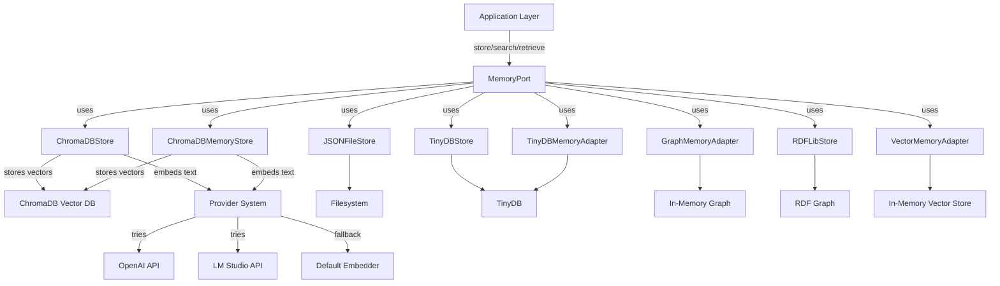
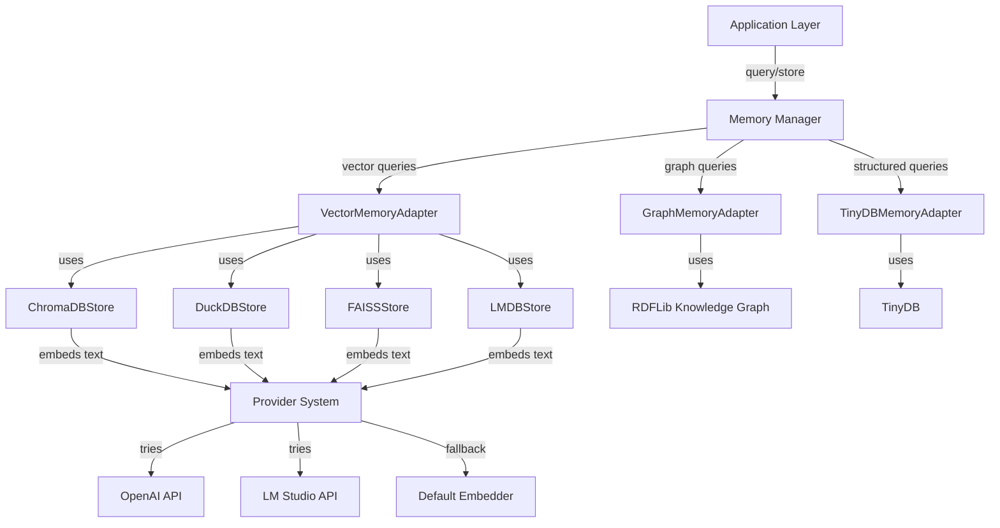

# DevSynth Memory System Architecture

## Overview

The DevSynth memory system is designed for extensibility, resilience, and semantic search. It supports multiple backends (ChromaDB, TinyDB, JSON, RDFLib) via a unified interface, enabling advanced retrieval-augmented workflows and agentic collaboration.

### Key Features
- **Multiple ChromaDB Implementations**: 
  - ChromaDBStore: Comprehensive implementation with caching, versioning, and optimized embeddings
  - ChromaDBMemoryStore: Implementation with provider system integration and retry mechanisms
- **Multiple TinyDB Implementations**:
  - TinyDBStore: Implementation with token counting and caching middleware
  - TinyDBMemoryAdapter: Implementation with structured data queries
- **JSON File Storage**: Persistent storage using JSON files
- **RDFLib Integration**: Knowledge graph storage using RDF triples with SPARQL query support
- **In-Memory Implementations**:
  - GraphMemoryAdapter: Simple in-memory graph implementation
  - VectorMemoryAdapter: Basic in-memory vector store
- **Provider System Integration**: Uses unified provider system (OpenAI, LM Studio) for embeddings with automatic fallback
- **Unified Memory Interface**: Abstracts backend details for seamless migration and extension

## Architecture Diagram

### Current Architecture

### Planned Enhanced Architecture

## MemoryPort (Hexagonal Adapter)
- Exposes `store_memory`, `retrieve_memory`, `search_memory` methods
- Can be configured to use any of the available memory store implementations
- Ensures all artifacts are stored with metadata, type, and version

## Memory Store Implementations

### ChromaDBStore
- Implements the `MemoryStore` protocol
- Stores artifacts as vectors for semantic search
- Advanced features include caching, versioning, and optimized embedding storage
- Supports token counting and tracking
- Provides both semantic search and exact match search capabilities

### ChromaDBMemoryStore
- Implements the `MemoryStore` protocol
- Stores artifacts as vectors for semantic search
- Leverages provider system for embeddings with automatic fallback mechanisms
- Configurable to use specific providers (OpenAI, LM Studio) or default embedder
- Implements retry mechanisms with exponential backoff
- All test artifacts are isolated and cleaned up via test fixtures

### JSONFileStore
- Implements the `MemoryStore` protocol
- Stores artifacts as JSON files on the filesystem
- Simple and reliable persistent storage

### TinyDBStore
- Implements the `MemoryStore` protocol
- Uses TinyDB for lightweight, document-oriented storage
- Features include token counting and caching middleware

### TinyDBMemoryAdapter
- Implements the `MemoryStore` protocol
- Provides structured data queries using TinyDB
- Supports both file-based and in-memory storage

### RDFLibStore
- Implements both the `MemoryStore` and `VectorStore` protocols
- Uses RDFLib to store and retrieve memory items and vectors as RDF triples
- Supports SPARQL queries for advanced search capabilities
- Provides semantic knowledge graph capabilities

### GraphMemoryAdapter
- Implements the `MemoryStore` protocol
- Simple in-memory graph implementation
- Handles relationships between memory items

### VectorMemoryAdapter
- Implements the `MemoryStore` protocol
- Basic in-memory vector store implementation

## Provider System Integration
- Uses unified provider abstraction for generating embeddings
- Provides automatic fallback between providers if one is unavailable
- Graceful degradation to default embedder if all providers fail
- Configurable via environment variables and initialization parameters

## Extensibility
- New backends can be added by implementing the `MemoryStore` protocol
- New embedding providers can be added through the provider system
- Migration utilities are planned for seamless data transfer between stores

## Testing & Cleanliness
- All tests use temporary directories and patch environment variables for isolation
- CI checks ensure no workspace pollution
- Test fixtures provide access to LLM providers and embedding capabilities

## Traceability
- Requirements, code, and tests are linked via IDs and doc references
- See `docs/specifications/current/devsynth_specification.md` and `tests/behavior/test_chromadb_integration.py`

## Current Status and Future Enhancements

### Implemented Features
- **Multiple Memory Store Implementations**: ChromaDBStore, ChromaDBMemoryStore, JSONFileStore, TinyDBStore, TinyDBMemoryAdapter, RDFLibStore, GraphMemoryAdapter, VectorMemoryAdapter
- **Versioning and Caching**: ChromaDBStore implements versioning and caching layers
- **Provider System Integration**: Automatic fallback between providers and graceful degradation
- **Multi-Layered Memory Approach**: 
  - **Short-term (working) memory**: Implemented via in-memory adapters
  - **Episodic memory**: Implemented via TinyDB adapters
  - **Semantic memory**: Implemented via ChromaDB and RDFLib adapters

### Planned Enhancements
- **Integration Improvements**: Better integration with self-analysis and dialectic reasoning modules
- **Expanded Semantic Search**: Apply to all project artifacts
- **Advanced Embedding Models**: Introduce more sophisticated embedding models and techniques
- **Enhanced Knowledge Graph**: Improve the RDFLib implementation with more advanced ontology modeling and reasoning capabilities
- **Performance Optimization**: Optimize vector stores for large-scale embeddings

### Alternative Vector Stores (Partially Implemented)
The memory system includes basic implementations of alternative vector stores:

- **DuckDB Store**: Basic implementation with vector extension support
- **FAISS Store**: Basic implementation for high-performance nearest-neighbor search
- **LMDB Store**: Basic implementation for fast, memory-mapped key-value storage

### Unified Query Interface (Partially Implemented)
The memory system includes basic implementations of specialized adapters:

- **GraphMemoryAdapter**: Basic implementation for graph-based queries
- **VectorMemoryAdapter**: Basic implementation for embedding similarity queries
- **TinyDBMemoryAdapter**: Implementation for structured queries

Further enhancements are planned to improve the integration and capabilities of these adapters.

---

_Last updated: May 28, 2025_
