<a href="../index.md">Documentation</a> &gt; <a href="index.md">Architecture</a> &gt; Orchestration

# Orchestration State Machines and Recovery Strategies {#orchestration}

This document describes the orchestration workflows used by DevSynth, focusing on LangGraph-driven state machines, transitions, and the recovery strategies that ensure robustness. It complements the Architecture Overview and details the invariants for error handling and retries.

Related:
- Architecture Overview: ../architecture/overview.md
- Error Handling: ../technical_reference/error_handling.md
- Testing Guide: ../developer_guides/testing.md

## Goals
- Make control flow explicit with state machines for core agent workflows.
- Define deterministic transitions, guards, and side-effect boundaries.
- Provide standardized recovery paths: retry, fallback, and abort with diagnostics.

## High-Level Orchestration Flow

```mermaid
stateDiagram-v2
  [*] --> Init
  Init: Initialize context, load config, set feature flags
  Init --> Plan: when init_ok
  Init --> Abort: when init_failed

  Plan: Build/validate plan using provider(s) and memory
  Plan --> Execute: when plan_valid
  Plan --> RecoverPlan: when plan_invalid

  RecoverPlan: Apply heuristics, reduce scope, or fallback provider
  RecoverPlan --> Plan: when recover_ok
  RecoverPlan --> Abort: when recover_failed

  Execute: Run steps (may be parallelized); stream partial results
  Execute --> Verify: when steps_complete
  Execute --> RetryStep: when step_failed and can_retry

  RetryStep: Backoff and retry with bounded attempts
  RetryStep --> Execute: when retry_ok
  RetryStep --> Fallback: when retries_exhausted and fallback_available
  RetryStep --> Abort: when retries_exhausted and no_fallback

  Fallback: Switch provider/adapter or degrade non-critical features
  Fallback --> Execute: when fallback_applied
  Fallback --> Abort: when fallback_unavailable

  Verify: Validate outputs against invariants and policies
  Verify --> Refine: when verification_gap
  Verify --> Done: when verified

  Refine: Targeted iterations to meet acceptance criteria
  Refine --> Execute: when ready

  Done --> [*]
  Abort --> [*]
```

Notes:
- All network/filesystem effects occur in adapters. The core state machine operates on typed commands/events.
- Guards (e.g., init_ok, plan_valid) are pure functions and deterministic under offline mode.

## Transition Guards and Effects
- init_ok: configuration parsed to typed objects; required env validated; offline mode honored.
- plan_valid: plan satisfies constraints (resource availability, feature flags, speed).
- can_retry: error is transient or classified retriable; attempts < max_retries.
- fallback_available: alternate provider/adapter configured and allowed by flags.
- verification_gap: postconditions unmet; produce a delta guiding Refine.

## Recovery Strategies
1. Bounded Retries
   - Exponential backoff: min_delay, max_delay, jitter.
   - Retry taxonomy: timeouts, 5xx, rate-limits; never retry on 4xx validation errors.
2. Provider Fallback
   - Selection order: preferred -> compatible -> stub (offline).
   - Preserve determinism in CI: stub-only when DEVSYNTH_OFFLINE=true.
3. Degraded Mode
   - Disable heavy steps (e.g., embeddings) if resource flags are false.
   - Produce actionable diagnostics for the user.
4. Abort with Diagnostics
   - Emit structured error with remediation hints and relevant env/flags snapshot (no secrets).

## LangGraph Notes
- Nodes encapsulate pure decision logic or invoke adapters via ports.
- Edges reflect explicit guards; cycles exist only for bounded retries/refinement.
- Cancellation: cooperative checks at step boundaries; long-running adapter calls must respect timeouts.

## Invariants and Policies
- Core cannot import framework/adapter code.
- Typed config objects must be created at the boundary (CLI) and passed inward.
- Exceptions are mapped to domain errors before crossing boundaries.
- Offline mode prevents any external network calls; verify via tests/fixtures.

## Traceability
- ReqID: ARCH-ORCH-01 — Deterministic orchestration state machine.
- ReqID: ARCH-ORCH-02 — Bounded retries and provider fallback.
- ReqID: ARCH-ORCH-03 — Deterministic offline behavior in CI.

## References
- docs/architecture/overview.md
- docs/technical_reference/error_handling.md
- tests/behavior/ (LangGraph steps and CLI flows)
