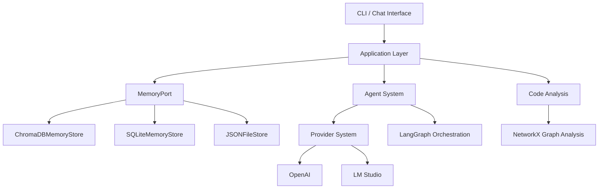

# DevSynth Architecture Overview

DevSynth is a modular, agentic software engineering platform designed for extensibility, resilience, and traceability. The architecture is organized into distinct layers and components, each with clear responsibilities and interfaces, supporting both human and agentic workflows.

## Table of Contents

- [High-Level Architecture Diagram](#high-level-architecture-diagram)
- [Key Components](#key-components)
- [Architectural Principles](#architectural-principles)
- [Documentation Harmony & SDLC Alignment](#documentation-harmony--sdlc-alignment)
- [Repository Structure & Navigation](#repository-structure--navigation)
- [Continuous Improvement & SDLC Policies](#continuous-improvement--sdlc-policies)
- [Related Documents](#related-documents)

## High-Level Architecture Diagram

## Key Components

- **CLI / Chat Interface**: Entry points for user and agent interaction
- **Application Layer**: Orchestrates workflows, manages commands, coordinates agents, and interprets `manifest.yaml` to understand project structure. It initiates the "Expand, Differentiate, Refine, Retrospect" adaptation cycle.
- **Agent System**: Modular agents for code generation, analysis, and requirement refinement (LangGraph-powered)
- **Provider System**: Abstraction for LLM providers (OpenAI, LM Studio, etc.) with fallback and selection logic
- **Code Analysis**: Uses NetworkX for dependency graphing, complexity metrics, and refactoring suggestions
- **MemoryPort**: Unified interface for memory operations, supporting ChromaDB, SQLite, and JSON backends. Manages storage and retrieval of project artifacts, metadata, and the project's structural model derived from `manifest.yaml`.
- **ChromaDBMemoryStore**: Vector database for semantic search and scalable artifact storage
- **SQLiteMemoryStore**: Structured data storage for project metadata, relationships, and the project structure model.
- **JSONFileStore**: Simple file-based storage for legacy and lightweight use cases

## Architectural Principles

- **Hexagonal Architecture**: Clear separation of core logic, adapters, and ports for testability and extensibility
- **Traceability**: All requirements, code, and tests are linked via the [Requirements Traceability Matrix](../requirements_traceability.md)
- **Extensibility**: New agents, providers, and memory backends can be added with minimal changes
- **Resilience**: Automatic fallback and error handling in provider and memory systems
- **Observability**: Standardized logging, metrics, and tracing across all modules for debugging and performance monitoring
- **Adaptive Project Understanding**: The system dynamically ingests and adapts to project structures and changes using `manifest.yaml` as a guide, following an "Expand, Differentiate, Refine" cycle to maintain an accurate internal representation.
- **Documentation Harmony**: All code, tests, and documents are kept in sync, with traceability via the [Requirements Traceability Matrix](../requirements_traceability.md)
- **Testing & Cleanliness**: All tests use isolated environments, patch environment variables, and enforce artifact cleanliness (see [Testing Guide](../developer_guides/testing.md))
- **Automated Knowledge Base**: Documentation and code are indexed for semantic search and agentic retrieval (see [Comprehensive DevSynth Enhancement Plan](../../Comprehensive%20DevSynth%20Enhancement%20Plan.md)).
- **Role-Based SDLC Policies**: Multi-agent and human roles are defined with clear responsibilities, SOPs, and review/approval workflows (see [SDLC Policy Corpus](../policies/README.md)).

## Documentation Harmony & SDLC Alignment

DevSynth maintains continuous alignment between code, tests, and documentation through:

- **Project Manifest (`manifest.yaml`)**: A root-level YAML file, defined by `docs/manifest_schema.json`, that allows users to specify their project's structure, components, and layout (e.g., monorepo, multi-language). This manifest is the primary input for the ingestion and adaptation process.
- **Requirements Traceability Matrix** ([requirements_traceability.md](../requirements_traceability.md)): Maps requirements to design, code, and tests for bidirectional traceability.
- **Documentation Restructuring Plan** ([documentation_plan.md](../roadmap/documentation_plan.md)): Guides ongoing consolidation, navigation, and clarity improvements.
- **SDLC Policy Corpus** ([policies/README.md](../policies/README.md)): Comprehensive SDLC, security, ethics, and testing policies for both human and agentic contributors.
- **Testing & Cleanliness** ([Testing Guide](../developer_guides/testing.md)): All tests use isolated environments, patch environment variables, and enforce artifact cleanliness.
- **Automated CI/CD**: Pipelines validate code, tests, and documentation for every change, enforcing quality and up-to-date docs.
- **Regular Audits**: Scheduled audits and documentation reviews ensure ongoing accuracy and completeness.
- **Metadata & Tagging**: Requirements, code, and tests are tagged with unique IDs for bidirectional traceability.
- **Changelog & Versioning** ([../../CHANGELOG.md](../../CHANGELOG.md)): Semantic versioning and changelog policies ensure all changes are tracked and documented.
- **Repository Map & Index**: A `manifest.yaml` file at the root, its schema `docs/manifest_schema.json`, and a planned [RepoStructure.md](../repo_structure.md) along with autogenerated indices provide a navigable map for both human and agentic contributors.

## Repository Structure & Navigation

DevSynth's repository is organized for clarity and agentic navigation:

- `src/` – Source code (modular, hexagonal architecture)
- `tests/` – Unit, integration, and behavior-driven tests
- `docs/` – User, developer, architecture, and policy documentation, including `manifest_schema.json`.
- `policies/` – SDLC, security, and cross-cutting policies
- `roadmap/` – Roadmaps and improvement plans
- `specifications/` – Current and archived specifications
- `deployment/` – Deployment scripts and configuration
- `manifest.yaml` – Project structure and artifact definition file (at project root).

A full [documentation restructuring plan](../roadmap/documentation_plan.md), the `manifest.yaml` file, and a [RepoStructure.md](../repo_structure.md) (planned) provide a map for both human and agentic contributors.

## Continuous Improvement & SDLC Policies

DevSynth follows a comprehensive set of SDLC policies and documentation standards to support both human and agentic contributors:

- **Requirements Traceability**: All requirements are tracked and linked to code and tests ([RTM](../requirements_traceability.md))
- **Documentation Restructuring**: Documentation is organized for clarity and maintainability ([Restructuring Plan](../roadmap/documentation_plan.md))
- **SDLC Policies**: See [policies/](../policies/README.md) for requirements, design, development, testing, deployment, and maintenance policies
- **Contribution Protocols**: See [Contributing Guide](../developer_guides/contributing.md) for branching, PR, and review processes
- **Code Style & Quality**: See [Code Style Guide](../developer_guides/code_style.md) and [Testing Guide](../developer_guides/testing.md)
- **Automated CI/CD**: All code and documentation changes are validated by automated pipelines

## Related Documents

- [Memory System](memory_system.md)
- [Agent System](agent_system.md)
- [Dialectical Reasoning](dialectical_reasoning.md)
- [Error Handling](../technical_reference/error_handling.md)
- [Requirements Traceability Matrix](../requirements_traceability.md)

---

_Last reviewed: May 2025_
