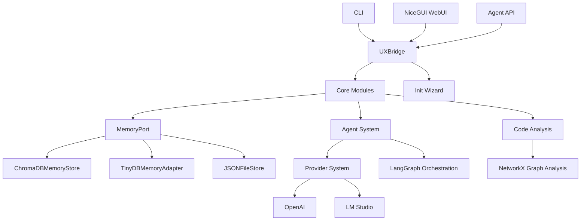
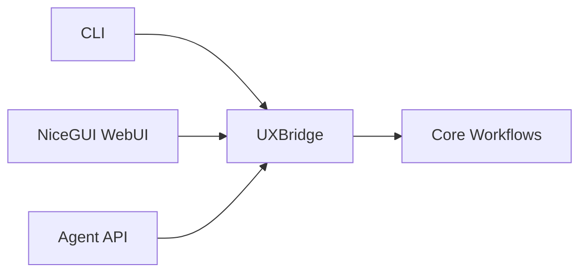

<div class="breadcrumbs">
<a href="../index.md">Documentation</a> &gt; <a href="index.md">Architecture</a> &gt; DevSynth Architecture Overview
</div>

# DevSynth Architecture Overview

## Executive Summary

DevSynth is a modular, agentic software engineering platform designed for extensibility, resilience, and traceability. The architecture is organized into distinct layers and components, each with clear responsibilities and interfaces, supporting both human and agentic workflows. This document provides a comprehensive overview of the system architecture, key components, architectural principles, and how they align with the project's SDLC policies.

> **Note**: This document uses domain-specific terminology. For definitions of unfamiliar terms, please refer to the [DevSynth Glossary](../glossary.md).

## Table of Contents

- [High-Level Architecture Diagram](#high-level-architecture-diagram)
- [Key Components](#key-components)
- [Architectural Principles](#architectural-principles)
- [Documentation Harmony & SDLC Alignment](#documentation-harmony--sdlc-alignment)
- [Repository Structure & Navigation](#repository-structure--navigation)
- [Continuous Improvement & SDLC Policies](#continuous-improvement--sdlc-policies)
- [Related Documents](#related-documents)


## High-Level Architecture Diagram



### Shared UX Bridge

The CLI, NiceGUI WebUI and Agent API all interact with the core
application through a common `UXBridge`. The bridge exposes
`ask_question`, `confirm_choice` and `display_result` methods so that
workflows remain UI agnostic. CLI modules in `src/devsynth/application/cli`
call these methods, enabling both graphical and programmatic interfaces to
reuse the same orchestration logic without modification.



## Key Components

- **CLI / Chat Interface**: Entry points for user and agent interaction
- **Application Layer**: Orchestrates workflows, manages commands, coordinates agents, and interprets `.devsynth/project.yaml` to understand project structure. It initiates the "Expand, Differentiate, Refine, Retrospect" adaptation cycle.
- **Agent System**: Modular agents for code generation, analysis, and requirement refinement (LangGraph-powered)
- **Provider System**: Abstraction for LLM providers (OpenAI, LM Studio, etc.) with fallback and selection logic
- **Code Analysis**: Uses NetworkX for dependency graphing, complexity metrics, and refactoring suggestions
- **MemoryPort**: Unified interface for memory operations, supporting ChromaDB, TinyDB, and JSON backends. Manages storage and retrieval of project artifacts, metadata, and the project's structural model derived from `.devsynth/project.yaml`.
- **ChromaDBMemoryStore**: Vector database for semantic search and scalable artifact storage
- **TinyDBMemoryAdapter**: Structured data storage for project metadata, relationships, and the project structure model.
- **JSONFileStore**: Simple file-based storage for legacy and lightweight use cases


## Architectural Principles

- **Hexagonal Architecture**: Clear separation of core logic, adapters, and ports for testability and extensibility
- **Traceability**: All requirements, code, and tests are linked via the [Requirements Traceability Matrix](../requirements_traceability.md)
- **Extensibility**: New agents, providers, and memory backends can be added with minimal changes
- **Resilience**: Automatic fallback and error handling in provider and memory systems
- **Observability**: Standardized logging, metrics, and tracing across all modules for debugging and performance monitoring
- **Adaptive Project Understanding**: The system dynamically ingests and adapts to project structures and changes using `.devsynth/project.yaml` as a guide, following an "Expand, Differentiate, Refine" cycle to maintain an accurate internal representation.
- **Documentation Harmony**: All code, tests, and documents are kept in sync, with traceability via the [Requirements Traceability Matrix](../requirements_traceability.md)
- **Testing & Cleanliness**: All tests use isolated environments, patch environment variables, and enforce artifact cleanliness (see [Testing Guide](../developer_guides/testing.md))
- **Automated Knowledge Base**: Documentation and code are indexed for semantic search and agentic retrieval (see [Comprehensive DevSynth Enhancement Plan](../../Comprehensive%20DevSynth%20Enhancement%20Plan.md)).
- **Role-Based SDLC Policies**: Multi-agent and human roles are defined with clear responsibilities, SOPs, and review/approval workflows (see [SDLC Policy Corpus](../policies/README.md)).

## Ports and Adapters Boundaries and Invariants

This section documents the explicit boundaries and invariants required by our hexagonal architecture. The core domain (use cases, orchestration policies, business rules) is framework-agnostic. Framework- and IO-specific integrations live in adapters on the outside, and all interactions occur via well-defined ports (interfaces/ABCs).

```mermaid
flowchart LR
  subgraph UI[Inbound Adapters]
    CLI[CLI (Typer)]
    WebUI[NiceGUI]
    API[FastAPI]
  end

  subgraph CORE[Core Domain]
    Orchestrator[Orchestration Policies]
    UseCases[Use Cases]
    Ports[Ports (LLM, Memory, Retrieval)]
  end

  subgraph OUT[Outbound Adapters]
    LLMAdapters[LLM Providers (OpenAI, LM Studio, Stub)]
    MemoryAdapters[Memory Stores (TinyDB, ChromaDB, JSON, FAISS, Kuzu)]
    RetrievalAdapters[Retrieval Integrations]
  end

  CLI --> Orchestrator
  WebUI --> Orchestrator
  API --> Orchestrator
  Orchestrator <--> UseCases
  UseCases <--> Ports
  Ports --> LLMAdapters
  Ports --> MemoryAdapters
  Ports --> RetrievalAdapters
```

Invariants (non-exhaustive):
- Core must not import from UI or adapter frameworks (Typer/FastAPI/NiceGUI/httpx/DB clients).
- Ports are defined as typed protocols/ABCs in `src/devsynth/ports/` and only referenced by the core.
- Adapters implement ports in `src/devsynth/adapters/` and may depend on frameworks/backends.
- Configuration enters at the edge; normalize to typed config objects before crossing into the core.
- Errors crossing boundaries are mapped to domain exceptions; low-level exceptions must not leak.
- Side effects (network, filesystem, DB) occur only in adapters; core remains pure/deterministic.
- Tests for the core mock ports; adapter tests may use resource markers and are skipped by default unless available.

Audit (2025-08-25):
- Implemented scripts/check_domain_dependencies.py to statically verify the domain layer imports no forbidden frameworks/backends. Current status: PASS (no violations found).
- Implemented scripts/verify_resource_markers.py to validate that all @pytest.mark.requires_resource("<name>") markers correspond to a checker in tests/conftest.py. Current status: PASS (all markers recognized).
- Ports and interfaces: VectorStore/MemoryStore protocols live in `src/devsynth/domain/interfaces/` and adapter-facing ports in `src/devsynth/ports/`. Adapters under `src/devsynth/adapters/` remain thin and integration-focused.

Cross-cutting policies:
- Logging is injected via facades; secrets must not be logged.
- Feature flags are read at the edge and exposed to the core via explicit parameters or config objects.
- Offline mode must be honored by all outbound adapters, preventing network calls by default in CI.


## Documentation Harmony & SDLC Alignment

DevSynth maintains continuous alignment between code, tests, and documentation through:

- **`.devsynth/project.yaml`**: A YAML file in the `.devsynth` directory, defined by `src/devsynth/schemas/project_schema.json`, that allows users to specify their project's structure, components, and layout (e.g., monorepo, multi-language). This configuration file is the primary input for the ingestion and adaptation process.
- **Requirements Traceability Matrix** ([requirements_traceability.md](../requirements_traceability.md)): Maps requirements to design, code, and tests for bidirectional traceability.
- **Documentation Policies** ([documentation_policies.md](../policies/documentation_policies.md)): Guides ongoing documentation quality, consistency, and maintenance.
- **SDLC Policy Corpus** ([policies/README.md](../policies/README.md)): Comprehensive SDLC, security, ethics, and testing policies for both human and agentic contributors.
- **Testing & Cleanliness** ([Testing Guide](../developer_guides/testing.md)): All tests use isolated environments, patch environment variables, and enforce artifact cleanliness.
- **Automated CI/CD**: Pipelines validate code, tests, and documentation for every change, enforcing quality and up-to-date docs.
- **Regular Audits**: Scheduled audits and documentation reviews ensure ongoing accuracy and completeness.
- **Metadata & Tagging**: Requirements, code, and tests are tagged with unique IDs for bidirectional traceability.
- **Changelog & Versioning** ([../../CHANGELOG.md](../../CHANGELOG.md)): Semantic versioning and changelog policies ensure all changes are tracked and documented.
- **Repository Map & Index**: A `.devsynth/project.yaml` file, its schema `src/devsynth/schemas/project_schema.json`, and a planned [RepoStructure.md](../repo_structure.md) along with autogenerated indices provide a navigable map for both human and agentic contributors.


## Repository Structure & Navigation

DevSynth's repository is organized for clarity and agentic navigation:

- `src/` – Source code (modular, hexagonal architecture)
- `tests/` – Unit, integration, and behavior-driven tests
- `docs/` – User, developer, architecture, and policy documentation.
- `policies/` – SDLC, security, and cross-cutting policies
- `roadmap/` – Roadmaps and improvement plans
- `specifications/` – Current and archived specifications
- `deployment/` – Deployment scripts and configuration
- `.devsynth/project.yaml` – Project structure and artifact definition file.


A full [documentation policies document](../policies/documentation_policies.md), the `.devsynth/project.yaml` file, and a [RepoStructure.md](../repo_structure.md) provide a map for both human and agentic contributors.

## Continuous Improvement & SDLC Policies

DevSynth follows a comprehensive set of SDLC policies and documentation standards to support both human and agentic contributors:

- **Requirements Traceability**: All requirements are tracked and linked to code and tests ([RTM](../requirements_traceability.md))
- **Documentation Organization**: Documentation is organized for clarity and maintainability ([Documentation Policies](../policies/documentation_policies.md))
- **SDLC Policies**: See [policies/](../policies/README.md) for requirements, design, development, testing, deployment, and maintenance policies
- **Contribution Protocols**: See [Contributing Guide](../developer_guides/contributing.md) for branching, PR, and review processes
- **Code Style & Quality**: See [Code Style Guide](../developer_guides/code_style.md) and [Testing Guide](../developer_guides/testing.md)
- **Automated CI/CD**: All code and documentation changes are validated by automated pipelines


## Related Documents

- [Memory System](memory_system.md)
- [Agent System](agent_system.md)
- [Dialectical Reasoning](dialectical_reasoning.md)
- [Error Handling](../technical_reference/error_handling.md)
- [Requirements Traceability Matrix](../requirements_traceability.md)
- [WSDE/EDRR Convergence Analysis](../analysis/wsde_edrr_convergence.md)

## Diagrams

The following static diagrams complement the Mermaid diagrams above:

- [DPG Overview](diagrams/dpg_overview.svg)
- [Init Workflow (1)](diagrams/init_workflow-1.svg)
- [Init Workflow (2)](diagrams/init_workflow-2.svg)
- [WebUI Overview (1)](diagrams/webui_overview-1.svg)
- [WebUI Overview (2)](diagrams/webui_overview-2.svg)
- [WebUI Overview (3)](diagrams/webui_overview-3.svg)
- [WebUI Overview (4)](diagrams/webui_overview-4.svg)
- [WebUI Overview (5)](diagrams/webui_overview-5.svg)
- [WSDE/EDRR Integration](diagrams/wsde_edrr_integration-1.svg)

---
