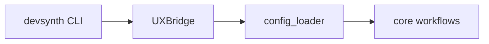
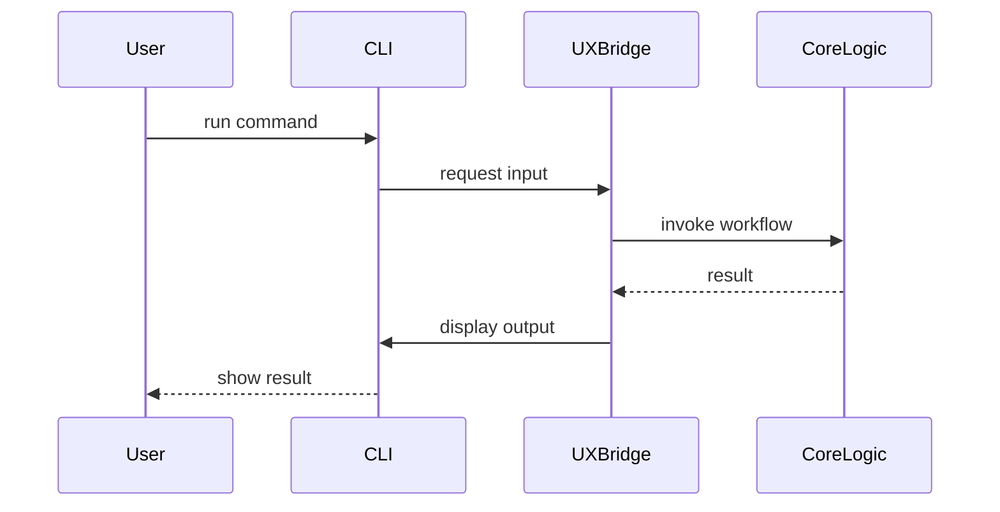

<div class="breadcrumbs">
<a href="../index.md">Documentation</a> &gt; <a href="index.md">Architecture</a> &gt; Phase 1 Overhaul Overview
</div>

# Phase 1 Overhaul Overview

Phase 1 focuses on refactoring the command-line interface, unifying configuration
handling, and formalizing the `UXBridge` abstraction. These changes allow the
same core logic to support both the CLI and the future WebUI.

## CLI Refactor

- Commands moved to `src/devsynth/interface/cli.py` with thin wrappers that call

  shared workflow functions.

- Presentation logic is isolated behind the `UXBridge` interface so user prompts

  can be reused by other front‑ends.

- The `init` command has been simplified and now delegates user interaction to

  the bridge and configuration loader.

- The former `analyze` and `adaptive` commands are now called `inspect` and

  `refactor` to better reflect their behavior.

## Unified Configuration System

The new `config_loader` module reads settings from either
`.devsynth/project.yaml` or the `[tool.devsynth]` table in `pyproject.toml`.
It exposes a single API for loading and saving configuration regardless of file
format.



## UXBridge Pattern

`UXBridge` defines a minimal set of methods (`prompt`, `confirm`, `print`) that
any user interface must implement. The CLI provides a concrete implementation
while tests and the WebUI can supply alternatives. Workflow modules interact
only with this interface.

## Command Flow



## Pseudocode

### config_loader

```pseudocode
class ConfigLoader:
    static function load(path = default_location) -> DevSynthConfig
    static function save(config: DevSynthConfig, path = default_location)
```

### UXBridge

```pseudocode
class UXBridge:
    function prompt(message, choices=None, default=None) -> str
    function confirm(message, default=False) -> bool
    function print(message, highlight=False) -> None
```

### init workflow

```pseudocode
function init_workflow(bridge: UXBridge):
    config = ConfigLoader.load()
    if config.exists():
        bridge.print("Project already initialized")
        return
    root = bridge.prompt("Project root directory?")
    language = bridge.prompt("Primary language?")
    goals = bridge.prompt("Project goals?")
    config.root = root
    config.language = language
    config.goals = goals
    ConfigLoader.save(config)
    bridge.print("Initialization complete")
```

These snippets outline the major modules and how the CLI interacts with them
through `UXBridge`.
## Implementation Status

.
