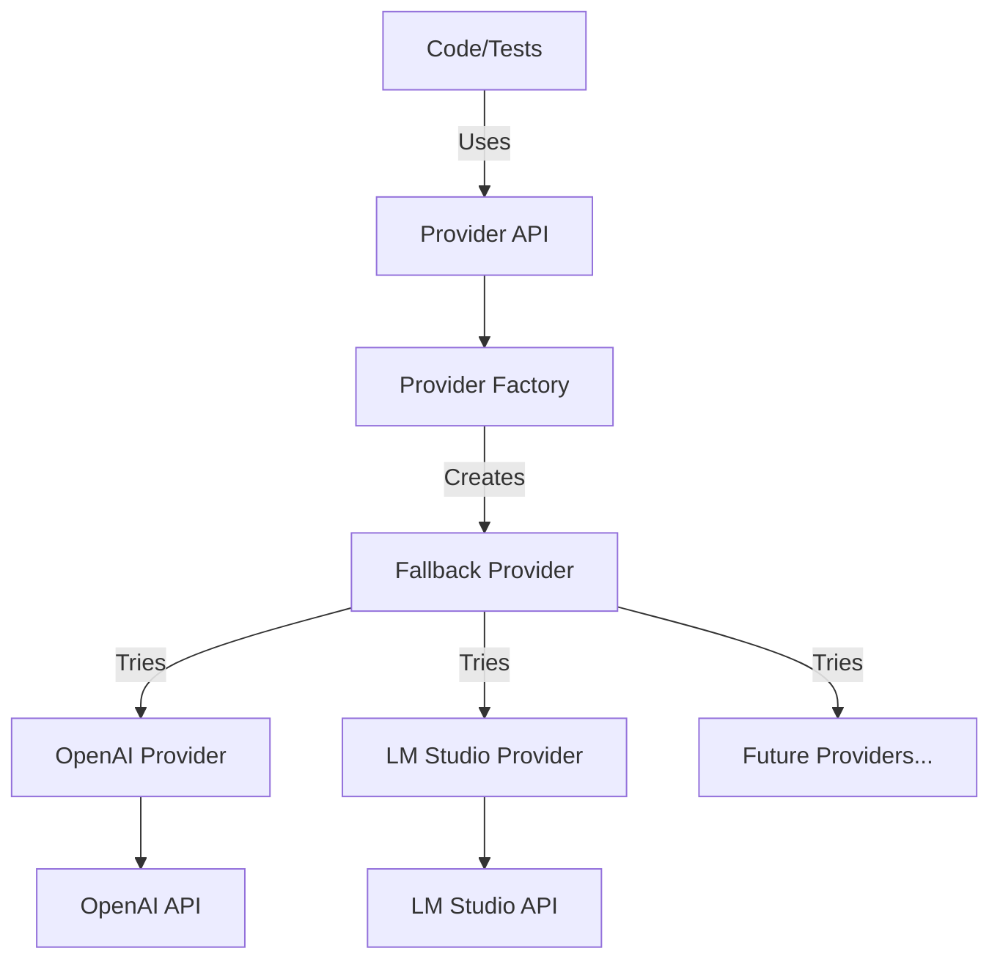

# Provider System Architecture

## Overview

The DevSynth provider system enables seamless integration with multiple LLM providers (OpenAI, LM Studio) through a unified interface. It supports automatic fallback, configuration via environment variables, and selection based on task requirements.

## Key Features

- **Unified Interface**: All LLM providers expose the same methods (`complete`, `embed`)
- **Automatic Fallback**: Gracefully falls back between providers if one fails
- **Configuration**: Uses environment variables and `.env` files for flexible configuration
- **Extensibility**: Easy to add new provider implementations
- **Retry Mechanism**: Implements exponential backoff for reliable API calls

## Architecture Diagram



## Provider Hierarchy

- **BaseProvider**: Abstract base class defining the provider interface
- **OpenAIProvider**: Implementation for OpenAI API
- **LMStudioProvider**: Implementation for LM Studio local API
- **FallbackProvider**: Meta-provider that tries multiple providers in sequence
- **ProviderFactory**: Factory for creating appropriate provider instances

## Configuration

The provider system is configured through environment variables:

| Environment Variable | Description | Default |
|---------------------|-------------|---------|
| `DEVSYNTH_PROVIDER` | Default provider to use | `openai` |
| `OPENAI_API_KEY` | OpenAI API key | None |
| `OPENAI_MODEL` | OpenAI model to use | `gpt-4` |
| `OPENAI_BASE_URL` | OpenAI API base URL | `https://api.openai.com/v1` |
| `LM_STUDIO_ENDPOINT` | LM Studio API endpoint | `http://127.0.0.1:1234` |
| `LM_STUDIO_MODEL` | LM Studio model identifier | `default` |

## Usage Examples

```python
# Get a provider with automatic fallback
from devsynth.adapters.provider_system import get_provider, complete, embed

# Simple API: Generate a completion
response = complete(
    prompt="Generate a Python function to calculate factorial.",
    system_prompt="You are a helpful coding assistant.",
    temperature=0.7
)

# Get embeddings for a text
embeddings = embed("This is a text to embed.")

# For more control, use a provider instance
provider = get_provider(fallback=True)
result = provider.complete(prompt="Hello, world!")
```

## Testing

The provider system includes comprehensive tests:

- **Unit Tests**: Test individual provider implementations with mocked responses
- **Integration Tests**: Test actual API connectivity and provider selection
- **Test Fixtures**: Enable any test to use LLMs through the `llm_provider` and `llm_complete` fixtures

## Related Components

- **Memory System**: Uses the provider system for embedding generation
- **Test Infrastructure**: Uses the provider system for LLM-based testing

## Future Enhancements

- Add more provider implementations (Claude, Gemini, etc.)
- Add streaming support for real-time responses
- Implement provider caching for repeated requests
- Add token counting and budget management

---

_Last updated: May 2025_
