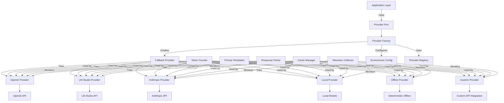

<div class="breadcrumbs">
<a href="../index.md">Documentation</a> &gt; <a href="index.md">Architecture</a> &gt; Provider System Architecture
</div>

# Provider System Architecture

## Overview

The DevSynth provider system enables seamless integration with multiple LLM providers (OpenAI, Anthropic, LM Studio, Local and Offline models) through a unified interface. It supports automatic fallback, configuration via environment variables, and selection based on task requirements.

## Key Features

- **Unified Interface**: All LLM providers expose the same methods (`complete`, `embed`)
- **Automatic Fallback**: Gracefully falls back between providers if one fails
- **Configuration**: Uses environment variables and `.env` files for flexible configuration
- **Extensibility**: Easy to add new provider implementations
- **Retry Mechanism**: Implements exponential backoff for reliable API calls
- **Model Selection**: Intelligent selection of appropriate models based on task complexity
- **Token Management**: Token counting, context window optimization, and cost tracking
- **Streaming Support**: Real-time streaming of responses for interactive applications
- **Batching**: Efficient batching of requests for improved throughput
- **Telemetry**: Performance monitoring and usage analytics

## Architecture Diagram



## Provider Hierarchy

- **BaseProvider**: Abstract base class defining the provider interface with common functionality
- **OpenAIProvider**: Implementation for OpenAI API with comprehensive retry mechanisms
- **LMStudioProvider**: Implementation for LM Studio local API with full feature parity
- **AnthropicProvider**: Implementation for Anthropic's API
- **LocalProvider**: Interface for running local LLM models
- **OfflineProvider**: Deterministic provider used when network access is disabled
- **FallbackProvider**: Meta-provider that tries multiple providers in sequence with circuit breaker pattern
- **ProviderFactory**: Factory for creating appropriate provider instances based on configuration
- **CircuitBreaker**: Utility class for preventing cascading failures when a provider is experiencing issues

## Implementation Details

### Provider Interface

All provider implementations extend the `BaseProvider` abstract class:

```python
class BaseProvider:
    """Base class for all LLM providers."""

    def __init__(self, tls_config: TLSConfig | None = None, **kwargs):
        """Initialize the provider with implementation-specific kwargs."""
        self.kwargs = kwargs
        self.tls_config = tls_config or TLSConfig()

        # Get retry configuration
        config = get_provider_config()
        self.retry_config = config.get("retry", {
            "max_retries": 3,
            "initial_delay": 1.0,
            "exponential_base": 2.0,
            "max_delay": 60.0,
            "jitter": True,
        })

    def get_retry_decorator(self, retryable_exceptions=(Exception,)):
        """
        Get a retry decorator configured with the provider's retry settings.

        Args:
            retryable_exceptions: Tuple of exception types to retry on

        Returns:
            Callable: A configured retry decorator
        """
        return retry_with_exponential_backoff(
            max_retries=self.retry_config["max_retries"],
            initial_delay=self.retry_config["initial_delay"],
            exponential_base=self.retry_config["exponential_base"],
            max_delay=self.retry_config["max_delay"],
            jitter=self.retry_config["jitter"],
            retryable_exceptions=retryable_exceptions,
        )

    def complete(
        self,
        prompt: str,
        system_prompt: Optional[str] = None,
        temperature: float = 0.7,
        max_tokens: int = 2000,
    ) -> str:
        """
        Generate a completion from the LLM.

        Args:
            prompt: User prompt
            system_prompt: Optional system prompt
            temperature: Sampling temperature (0.0 to 1.0)
            max_tokens: Maximum number of tokens to generate

        Returns:
            str: Generated completion

        Raises:
            NotImplementedError: Must be implemented by subclasses
        """
        raise NotImplementedError("Subclasses must implement complete()")

    def embed(self, text: Union[str, List[str]]) -> List[List[float]]:
        """
        Generate embeddings for input text.

        Args:
            text: Input text or list of texts

        Returns:
            List[List[float]]: Embeddings

        Raises:
            NotImplementedError: Must be implemented by subclasses
        """
        raise NotImplementedError("Subclasses must implement embed()")

    async def acomplete(
        self,
        prompt: str,
        system_prompt: Optional[str] = None,
        temperature: float = 0.7,
        max_tokens: int = 2000,
    ) -> str:
        """Asynchronous version of :meth:`complete`."""
        raise NotImplementedError("Subclasses must implement acomplete()")

    async def aembed(self, text: Union[str, List[str]]) -> List[List[float]]:
        """Asynchronous version of :meth:`embed`."""
        raise NotImplementedError("Subclasses must implement aembed()")
```

### OpenAI Provider Implementation

```python
class OpenAIProvider(BaseProvider):
    """OpenAI API provider implementation."""

    def __init__(
        self,
        api_key: str,
        model: str = "gpt-4",
        base_url: str = "https://api.openai.com/v1",
        tls_config: TLSConfig | None = None,
    ):
        """
        Initialize OpenAI provider.

        Args:
            api_key: OpenAI API key
            model: Model name (default: gpt-4)
            base_url: Base URL for API (default: OpenAI's API)
            tls_config: TLS configuration for secure connections
        """
        super().__init__(
            tls_config=tls_config, api_key=api_key, model=model, base_url=base_url
        )
        self.api_key = api_key
        self.model = model
        self.base_url = base_url
        self.headers = {
            "Content-Type": "application/json",
            "Authorization": f"Bearer {api_key}",
        }

    def _get_retry_config(self):
        """Get the retry configuration for OpenAI API calls."""
        return {
            "max_retries": self.retry_config["max_retries"],
            "initial_delay": self.retry_config["initial_delay"],
            "exponential_base": self.retry_config["exponential_base"],
            "max_delay": self.retry_config["max_delay"],
            "jitter": self.retry_config["jitter"],
        }

    def complete(
        self,
        prompt: str,
        system_prompt: Optional[str] = None,
        temperature: float = 0.7,
        max_tokens: int = 2000,
    ) -> str:
        """
        Generate a completion using OpenAI API.

        Args:
            prompt: User prompt
            system_prompt: Optional system prompt
            temperature: Sampling temperature (0.0 to 1.0)
            max_tokens: Maximum number of tokens to generate

        Returns:
            str: Generated completion

        Raises:
            ProviderError: If API call fails
        """
        # Define the actual API call function
        def _api_call():
            url = f"{self.base_url}/chat/completions"

            messages = []
            if system_prompt:
                messages.append({"role": "system", "content": system_prompt})
            messages.append({"role": "user", "content": prompt})

            payload = {
                "model": self.model,
                "messages": messages,
                "temperature": temperature,
                "max_tokens": max_tokens,
            }

            response = requests.post(
                url,
                headers=self.headers,
                json=payload,
                **self.tls_config.as_requests_kwargs(),
            )
            response.raise_for_status()
            response_data = response.json()

            if "choices" in response_data and len(response_data["choices"]) > 0:
                return response_data["choices"][0]["message"]["content"]
            else:
                raise ProviderError(f"Invalid response format: {response_data}")

        # Use retry with exponential backoff
        try:
            retry_config = self._get_retry_config()
            return retry_with_exponential_backoff(
                max_retries=retry_config["max_retries"],
                initial_delay=retry_config["initial_delay"],
                exponential_base=retry_config["exponential_base"],
                max_delay=retry_config["max_delay"],
                jitter=retry_config["jitter"],
                retryable_exceptions=(requests.exceptions.RequestException,)
            )(_api_call)()
        except requests.exceptions.RequestException as e:
            logger.error(f"OpenAI API error: {e}")
            raise ProviderError(f"OpenAI API error: {e}")

    async def acomplete(
        self,
        prompt: str,
        system_prompt: Optional[str] = None,
        temperature: float = 0.7,
        max_tokens: int = 2000,
    ) -> str:
        """Asynchronously generate a completion using the OpenAI API."""
        # Implementation details omitted for brevity
        # Uses httpx for async HTTP requests with retry logic

    def embed(self, text: Union[str, List[str]]) -> List[List[float]]:
        """
        Generate embeddings using OpenAI API.

        Args:
            text: Input text or list of texts

        Returns:
            List[List[float]]: Embeddings

        Raises:
            ProviderError: If API call fails
        """
        # Implementation details omitted for brevity
        # Uses the text-embedding-3-small model by default

    async def aembed(self, text: Union[str, List[str]]) -> List[List[float]]:
        """Asynchronously generate embeddings using the OpenAI API."""
        # Implementation details omitted for brevity
```

### Fallback Provider Implementation

The `FallbackProvider` attempts to use multiple providers in sequence with circuit breaker pattern:

```python
class FallbackProvider(BaseProvider):
    """Fallback provider that tries multiple providers in sequence."""

    def __init__(self, providers: List[BaseProvider] = None):
        """
        Initialize with list of providers to try in sequence.

        Args:
            providers: List of provider instances (if None, auto-creates based on config)
        """
        super().__init__()

        # Get fallback and circuit breaker configuration
        config = get_provider_config()
        self.fallback_config = config.get("fallback", {
            "enabled": True,
            "order": ["openai", "lmstudio"],
        })
        self.circuit_breaker_config = config.get("circuit_breaker", {
            "enabled": True,
            "failure_threshold": 5,
            "recovery_timeout": 60.0,
        })

        # Initialize circuit breakers for providers
        self.circuit_breakers = {}

        if providers is None:
            # Try to create providers based on fallback order
            providers = []
            provider_order = self.fallback_config["order"]

            for provider_type in provider_order:
                if provider_type.lower() == ProviderType.OPENAI.value:
                    if config["openai"]["api_key"]:
                        try:
                            providers.append(
                                ProviderFactory.create_provider(ProviderType.OPENAI.value)
                            )
                            # Create circuit breaker for this provider
                            if self.circuit_breaker_config["enabled"]:
                                self.circuit_breakers[ProviderType.OPENAI.value] = CircuitBreaker(
                                    failure_threshold=self.circuit_breaker_config["failure_threshold"],
                                    recovery_timeout=self.circuit_breaker_config["recovery_timeout"]
                                )
                        except Exception as e:
                            logger.warning(
                                f"Failed to create OpenAI provider: {e}; continuing with next provider"
                            )
                    else:
                        logger.info("OpenAI API key missing; skipping OpenAI provider")
                elif provider_type.lower() == ProviderType.LMSTUDIO.value:
                    try:
                        providers.append(
                            ProviderFactory.create_provider(ProviderType.LMSTUDIO.value)
                        )
                        # Create circuit breaker for this provider
                        if self.circuit_breaker_config["enabled"]:
                            self.circuit_breakers[ProviderType.LMSTUDIO.value] = CircuitBreaker(
                                failure_threshold=self.circuit_breaker_config["failure_threshold"],
                                recovery_timeout=self.circuit_breaker_config["recovery_timeout"]
                            )
                    except Exception as e:
                        logger.warning(f"Failed to create LM Studio provider: {e}")

        if not providers:
            raise ProviderError("No valid providers available for fallback")

        self.providers = providers
        logger.info(
            "Initialized fallback provider order: %s",
            ", ".join(p.__class__.__name__ for p in self.providers),
        )

    def complete(
        self,
        prompt: str,
        system_prompt: Optional[str] = None,
        temperature: float = 0.7,
        max_tokens: int = 2000,
    ) -> str:
        """
        Try to complete with each provider until one succeeds.

        Args:
            prompt: User prompt
            system_prompt: Optional system prompt
            temperature: Sampling temperature (0.0 to 1.0)
            max_tokens: Maximum number of tokens to generate

        Returns:
            str: Generated completion

        Raises:
            ProviderError: If all providers fail
        """
        last_error = None

        # If fallback is disabled and we have providers, just use the first one
        if not self.fallback_config.get("enabled", True) and self.providers:
            provider = self.providers[0]
            provider_type = provider.__class__.__name__.replace("Provider", "").lower()

            # Use circuit breaker if enabled
            if self.circuit_breaker_config.get("enabled", True) and provider_type in self.circuit_breakers:
                try:
                    return self.circuit_breakers[provider_type].call(
                        provider.complete,
                        prompt=prompt,
                        system_prompt=system_prompt,
                        temperature=temperature,
                        max_tokens=max_tokens,
                    )
                except Exception as e:
                    logger.error(f"Provider {provider.__class__.__name__} failed with circuit breaker: {e}")
                    raise ProviderError(f"Provider {provider.__class__.__name__} failed: {e}")
            else:
                return provider.complete(
                    prompt=prompt,
                    system_prompt=system_prompt,
                    temperature=temperature,
                    max_tokens=max_tokens,
                )

        # Try each provider in sequence
        for provider in self.providers:
            provider_type = provider.__class__.__name__.replace("Provider", "").lower()

            # Skip if circuit breaker is open
            if (self.circuit_breaker_config.get("enabled", True) and
                provider_type in self.circuit_breakers and
                self.circuit_breakers[provider_type].state != "closed"):
                logger.warning(f"Skipping provider {provider.__class__.__name__} due to open circuit breaker")
                continue

            try:
                logger.info(f"Trying completion with provider: {provider.__class__.__name__}")

                # Use circuit breaker if enabled
                if self.circuit_breaker_config.get("enabled", True) and provider_type in self.circuit_breakers:
                    return self.circuit_breakers[provider_type].call(
                        provider.complete,
                        prompt=prompt,
                        system_prompt=system_prompt,
                        temperature=temperature,
                        max_tokens=max_tokens,
                    )
                else:
                    return provider.complete(
                        prompt=prompt,
                        system_prompt=system_prompt,
                        temperature=temperature,
                        max_tokens=max_tokens,
                    )
            except Exception as e:
                logger.warning(f"Provider {provider.__class__.__name__} failed: {e}")
                last_error = e

        raise ProviderError(
            f"All providers failed for completion. Last error: {last_error}"
        )

    # Additional methods (async versions and embedding methods) omitted for brevity
```

### Circuit Breaker Implementation

The circuit breaker pattern prevents cascading failures when a provider is experiencing issues:

```python
class CircuitBreaker:
    """
    Circuit breaker pattern implementation for provider calls.

    Prevents cascading failures by stopping calls to failing providers
    and allowing them to recover.

    States:
    - closed: Normal operation, calls pass through
    - open: Provider is failing, calls are blocked
    - half-open: Testing if provider has recovered
    """

    def __init__(self, failure_threshold=5, recovery_timeout=60.0):
        """
        Initialize circuit breaker.

        Args:
            failure_threshold: Number of failures before opening circuit
            recovery_timeout: Seconds to wait before trying provider again
        """
        self.failure_threshold = failure_threshold
        self.recovery_timeout = recovery_timeout
        self.failure_count = 0
        self.last_failure_time = 0
        self.state = "closed"

    def call(self, func, *args, **kwargs):
        """
        Call function with circuit breaker protection.

        Args:
            func: Function to call
            *args, **kwargs: Arguments to pass to function

        Returns:
            Result of function call

        Raises:
            Exception: If circuit is open or function call fails
        """
        if self.state == "open":
            # Check if recovery timeout has elapsed
            if time.time() - self.last_failure_time > self.recovery_timeout:
                self.state = "half-open"
                logger.info("Circuit half-open, testing provider...")
            else:
                raise ProviderError(f"Circuit breaker open, provider unavailable for {self.recovery_timeout - (time.time() - self.last_failure_time):.1f}s")

        try:
            result = func(*args, **kwargs)

            # If we're in half-open state and call succeeded, close circuit
            if self.state == "half-open":
                self._reset()

            return result

        except Exception as e:
            self._record_failure()
            raise

    def _record_failure(self):
        """Record a failure and update circuit state."""
        self.failure_count += 1
        self.last_failure_time = time.time()

        if self.state == "closed" and self.failure_count >= self.failure_threshold:
            self.state = "open"
            logger.warning(f"Circuit breaker opened after {self.failure_count} failures")

        if self.state == "half-open":
            self.state = "open"
            logger.warning("Circuit breaker reopened after failed recovery attempt")

    def _record_success(self):
        """Record a success and update circuit state."""
        if self.state == "half-open":
            self._reset()

    def _reset(self):
        """Reset circuit breaker to closed state."""
        self.failure_count = 0
        self.state = "closed"
        logger.info("Circuit breaker reset to closed state")
```

### Provider Factory

The `ProviderFactory` creates provider instances based on configuration:

```python
class ProviderFactory:
    """Factory class for creating provider instances."""

    @staticmethod
    def create_provider(provider_type: Optional[str] = None) -> "BaseProvider":
        """
        Create a provider instance based on the specified type or config.

        Args:
            provider_type: Optional provider type, defaults to config value

        Returns:
            BaseProvider: A provider instance

        Raises:
            ProviderError: If provider creation fails
        """
        config = get_provider_config()
        tls_settings = get_settings()
        tls_conf = TLSConfig(
            verify=getattr(tls_settings, "tls_verify", True),
            cert_file=getattr(tls_settings, "tls_cert_file", None),
            key_file=getattr(tls_settings, "tls_key_file", None),
            ca_file=getattr(tls_settings, "tls_ca_file", None),
        )

        if provider_type is None:
            provider_type = config["default_provider"]

        try:
            if provider_type.lower() == ProviderType.OPENAI.value:
                if not config["openai"]["api_key"]:
                    logger.warning(
                        "OpenAI API key not found; falling back to LM Studio if available"
                    )
                    return ProviderFactory.create_provider(ProviderType.LMSTUDIO.value)
                logger.info("Using OpenAI provider")
                return OpenAIProvider(
                    api_key=config["openai"]["api_key"],
                    model=config["openai"]["model"],
                    base_url=config["openai"]["base_url"],
                    tls_config=tls_conf,
                )
            elif provider_type.lower() == ProviderType.LMSTUDIO.value:
                logger.info("Using LM Studio provider")
                return LMStudioProvider(
                    endpoint=config["lmstudio"]["endpoint"],
                    model=config["lmstudio"]["model"],
                    tls_config=tls_conf,
                )
            else:
                logger.warning(
                    f"Unknown provider type '{provider_type}', falling back to OpenAI"
                )
                return ProviderFactory.create_provider(ProviderType.OPENAI.value)
        except Exception as e:
            logger.error(f"Failed to create provider {provider_type}: {e}")
            raise ProviderError(f"Failed to create provider {provider_type}: {e}")
```

### Simplified API

The provider system also offers a simplified API for common usage:

```python

# Get a provider instance, optionally with fallback capability

def get_provider(
    provider_type: Optional[str] = None, fallback: bool = True
) -> BaseProvider:
    """
    Get a provider instance, optionally with fallback capability.

    Args:
        provider_type: Optional provider type, defaults to config value
        fallback: Whether to use fallback mechanism

    Returns:
        BaseProvider: A provider instance
    """
    if fallback:
        return FallbackProvider()
    else:
        return ProviderFactory.create_provider(provider_type)

# Generate a completion using the configured provider

def complete(
    prompt: str,
    system_prompt: Optional[str] = None,
    temperature: float = 0.7,
    max_tokens: int = 2000,
    provider_type: Optional[str] = None,
    fallback: bool = True,
) -> str:
    """
    Generate a completion using the configured provider.

    Args:
        prompt: User prompt
        system_prompt: Optional system prompt
        temperature: Sampling temperature (0.0 to 1.0)
        max_tokens: Maximum number of tokens to generate
        provider_type: Optional provider type, defaults to config value
        fallback: Whether to use fallback mechanism

    Returns:
        str: Generated completion
    """
    provider = get_provider(provider_type=provider_type, fallback=fallback)
    inc_provider("complete")  # Track metrics
    return provider.complete(
        prompt=prompt,
        system_prompt=system_prompt,
        temperature=temperature,
        max_tokens=max_tokens,
    )

# Async version of complete

async def acomplete(
    prompt: str,
    system_prompt: Optional[str] = None,
    temperature: float = 0.7,
    max_tokens: int = 2000,
    provider_type: Optional[str] = None,
    fallback: bool = True,
) -> str:
    """Asynchronously generate a completion using the configured provider."""
    provider = get_provider(provider_type=provider_type, fallback=fallback)
    inc_provider("acomplete")  # Track metrics
    return await provider.acomplete(
        prompt=prompt,
        system_prompt=system_prompt,
        temperature=temperature,
        max_tokens=max_tokens,
    )
```

## Configuration Examples

### Provider Configuration

#### Environment Variables

```bash

# Default Provider Selection

DEVSYNTH_PROVIDER=openai  # Main provider (openai, lmstudio)

# OpenAI Configuration

OPENAI_API_KEY=sk-...
OPENAI_MODEL=gpt-4
OPENAI_BASE_URL=https://api.openai.com/v1  # Optional, for API proxies or compatible services

# LM Studio Configuration

LM_STUDIO_ENDPOINT=http://127.0.0.1:1234
LM_STUDIO_MODEL=default  # Model name is managed by LM Studio itself

# Retry Configuration (Optional)

PROVIDER_MAX_RETRIES=3
PROVIDER_INITIAL_DELAY=1.0
PROVIDER_EXPONENTIAL_BASE=2.0
PROVIDER_MAX_DELAY=60.0
PROVIDER_JITTER=true

# Fallback Configuration (Optional)

PROVIDER_FALLBACK_ENABLED=true
PROVIDER_FALLBACK_ORDER=openai,lmstudio

# Circuit Breaker Configuration (Optional)

PROVIDER_CIRCUIT_BREAKER_ENABLED=true
PROVIDER_FAILURE_THRESHOLD=5
PROVIDER_RECOVERY_TIMEOUT=60.0

# TLS Configuration (Optional)

TLS_VERIFY=true
TLS_CERT_FILE=/path/to/cert.pem
TLS_KEY_FILE=/path/to/key.pem
TLS_CA_FILE=/path/to/ca.pem
```

##### Safe Defaults and Test/CI Behavior
To prevent accidental live network calls during tests or on minimal CI runners, the provider system uses safe defaults:

- By default, if OPENAI_API_KEY is not set, the system will NOT attempt to contact LM Studio unless you explicitly declare availability.
- Explicitly enable LM Studio discovery by setting:

```bash
DEVSYNTH_RESOURCE_LMSTUDIO_AVAILABLE=true
```

- Choose the safe default provider when no online provider is usable:

```bash
# Options: "stub" (deterministic offline) or "null" (no-op)
DEVSYNTH_SAFE_DEFAULT_PROVIDER=stub
```

- To completely disable providers (useful for some tests):

```bash
DEVSYNTH_DISABLE_PROVIDERS=true
```

- Anthropic: when DEVSYNTH_PROVIDER=anthropic and ANTHROPIC_API_KEY is missing, the system safely falls back to the configured safe default. Anthropic is currently supported via application.llm.providers; the adapters.provider_system path will raise a clear error if Anthropic is explicitly requested with a key.

###### Testing Fixtures and CI Usage

To ensure deterministic, no-network behavior in tests, use the following patterns:

- Pytest markers and environment gating:
  - Default tests run with the `no_network` assumption. Avoid real provider calls unless explicitly opted in.
  - Enable property tests locally with:
    ```bash
    export DEVSYNTH_PROPERTY_TESTING=true
    poetry run pytest tests/property/
    ```

- Recommended environment for CI and unit tests:
  ```bash
  export DEVSYNTH_DISABLE_PROVIDERS=true
  export DEVSYNTH_SAFE_DEFAULT_PROVIDER=stub
  export DEVSYNTH_PROVIDER=openai  # harmless without keys when using stub
  ```

- Example pytest fixture to enforce stubbed provider:
  ```python
  import os
  import pytest

  @pytest.fixture(autouse=True)
  def _force_stub_provider(monkeypatch):
      monkeypatch.setenv("DEVSYNTH_DISABLE_PROVIDERS", "true")
      monkeypatch.setenv("DEVSYNTH_SAFE_DEFAULT_PROVIDER", "stub")
      # Ensure no accidental keys leak into CI runs
      monkeypatch.delenv("OPENAI_API_KEY", raising=False)
      monkeypatch.delenv("ANTHROPIC_API_KEY", raising=False)
      return
  ```

- Integration tests using local stubs/mocks should construct providers via the factory with fallback disabled to avoid any external calls:
  ```python
  from devsynth.adapters.provider_system import ProviderFactory

  # Create a provider explicitly; factory will honor env and safe defaults
  provider = ProviderFactory.create_provider(provider_type=os.getenv("DEVSYNTH_PROVIDER", "openai"))
  ```

Documenting and enforcing these fixtures prevents flakiness and aligns with pytest.ini defaults (registered markers and coverage thresholds).

## Configuration in Python Code

```python
from devsynth.adapters.provider_system import get_provider, complete, acomplete

# Basic usage with default configuration

result = complete(
    prompt="Explain how to implement a hexagonal architecture in Python.",
    temperature=0.7,
    max_tokens=2000
)

# Using a specific provider without fallback

provider = get_provider(provider_type="openai", fallback=False)
result = provider.complete(
    prompt="Explain dependency injection in Python.",
    system_prompt="You are a Python expert.",
    temperature=0.5,
    max_tokens=1500
)

# Async usage with system prompt

import asyncio

async def generate_async():
    result = await acomplete(
        prompt="Write a Python class for a circuit breaker pattern.",
        system_prompt="You are a software design patterns expert.",
        temperature=0.6,
        max_tokens=3000
    )
    return result

# Run the async function

result = asyncio.run(generate_async())
```

## Advanced Configuration

### Custom Settings File (config/settings.py)

```python
"""Custom settings for the provider system."""

# Provider configuration

provider_max_retries = 5
provider_initial_delay = 2.0
provider_exponential_base = 2.0
provider_max_delay = 120.0
provider_jitter = True

# Fallback configuration

provider_fallback_enabled = True
provider_fallback_order = "openai,lmstudio"

# Circuit breaker configuration

provider_circuit_breaker_enabled = True
provider_failure_threshold = 10
provider_recovery_timeout = 300.0

# TLS configuration

tls_verify = True
tls_cert_file = "/path/to/cert.pem"
tls_key_file = "/path/to/key.pem"
tls_ca_file = "/path/to/ca.pem"
```

## Docker Environment Configuration

```yaml

# docker-compose.yml

version: "0.1.0a1"
services:
  devsynth:
    image: devsynth:latest
    environment:
      # Provider selection
      - DEVSYNTH_PROVIDER=openai

      # OpenAI configuration
      - OPENAI_API_KEY=${OPENAI_API_KEY}
      - OPENAI_MODEL=gpt-4

      # LM Studio configuration (for fallback)
      - LM_STUDIO_ENDPOINT=http://lmstudio:1234

      # Retry configuration
      - PROVIDER_MAX_RETRIES=3
      - PROVIDER_INITIAL_DELAY=1.0
      - PROVIDER_MAX_DELAY=60.0

      # Circuit breaker configuration
      - PROVIDER_CIRCUIT_BREAKER_ENABLED=true
      - PROVIDER_FAILURE_THRESHOLD=5
      - PROVIDER_RECOVERY_TIMEOUT=60.0
    volumes:
      - ./config:/app/config
    depends_on:
      - lmstudio

  lmstudio:
    image: lmstudio:latest
    ports:
      - "1234:1234"
    volumes:
      - ./models:/models
```

## Usage Examples

### Basic Text Generation

```python
from devsynth.adapters.providers.factory import ProviderFactory

# Create a provider using the factory

provider = ProviderFactory.create(provider_type="openai", model="gpt-4-turbo")

# Generate text

response = await provider.generate(
    prompt="Explain how to implement a hexagonal architecture in Python.",
    temperature=0.7,
    max_tokens=1000
)

print(response)
```

## Streaming Generation

```python
from devsynth.adapters.providers.factory import ProviderFactory

# Create a provider using the factory

provider = ProviderFactory.create()

# Stream generation results

stream = await provider.generate_stream(
    prompt="Write a step-by-step guide for implementing dependency injection in Python.",
    temperature=0.6,
    max_tokens=2000,
)

async for chunk in stream:
    print(chunk, end="", flush=True)
```

## Embedding Generation

```python
from devsynth.adapters.providers.factory import ProviderFactory

# Create a provider optimized for embeddings

provider = ProviderFactory.create(model="text-embedding-3-large")

# Generate embeddings for a single text

embedding = await provider.embed("This is a sample text to embed.")

# Generate embeddings for multiple texts

texts = [
    "First document to embed.",
    "Second document with different content.",
    "Third document about something else."
]
embeddings = await provider.embed_batch(texts)

# Use embeddings for similarity comparison

from sklearn.metrics.pairwise import cosine_similarity
similarity = cosine_similarity([embeddings[0]], [embeddings[1]])[0][0]
print(f"Similarity between first and second document: {similarity:.4f}")
```

## Provider Selection Based on Task

```python
from devsynth.adapters.providers.factory import ProviderFactory
from devsynth.domain.services.task_analyzer import TaskAnalyzer

# Analyze the task complexity

task = "Develop a microservice architecture for a banking application."
analyzer = TaskAnalyzer()
task_complexity = analyzer.analyze_complexity(task)

# Select the appropriate provider based on task complexity

if task_complexity > 0.8:  # High complexity
    provider = ProviderFactory.create(provider_type="openai", model="gpt-4-turbo")
elif task_complexity > 0.5:  # Medium complexity
    provider = ProviderFactory.create(provider_type="openai", model="gpt-3.5-turbo")
else:  # Low complexity
    provider = ProviderFactory.create(provider_type="local", model="mistral-7b-instruct")

# Generate response

response = await provider.generate(prompt=task)
```

## Performance Considerations

### Model Selection Trade-offs

| Model | Capability | Context Size | Response Speed | Cost |
|-------|------------|--------------|----------------|------|
| GPT-4 Turbo | Very High | 128K | Medium | $$$$ |
| GPT-3.5 Turbo | High | 16K | Fast | $$ |
| Llama 3 70B | High | 8K | Medium | $ (self-hosted) |
| Mistral 7B | Medium | 8K | Fast | $ (self-hosted) |

### Optimizing Token Usage

1. **Prompt Compression**: Use techniques like retrieval-based compression to reduce input token count
2. **Response Limiting**: Set appropriate `max_tokens` values to control response length
3. **Chunked Processing**: Break large tasks into smaller chunks to work within context limits
4. **Template Optimization**: Refine prompts to be concise while maintaining clarity
5. **Response Filtering**: Post-process responses to extract only relevant information

### Caching Strategies

```python
from devsynth.adapters.providers.factory import ProviderFactory
from devsynth.infrastructure.cache import ResponseCache

# Initialize the cache

cache = ResponseCache(ttl=3600)  # 1 hour cache lifetime

# Create a provider

provider = ProviderFactory.create()

# Function using caching for expensive operations

async def get_generation_with_cache(prompt, temperature=0.7):
    # Create a cache key based on prompt and temperature
    cache_key = f"{hash(prompt)}:{temperature}"

    # Try to get from cache first
    cached_response = await cache.get(cache_key)
    if cached_response:
        return cached_response

    # Generate response if not in cache
    response = await provider.generate(
        prompt=prompt,
        temperature=temperature
    )

    # Store in cache for future use
    await cache.set(cache_key, response)

    return response
```

## Cost Management

### Tracking and Budgeting

```python
from devsynth.adapters.providers.factory import ProviderFactory
from devsynth.infrastructure.telemetry import CostTracker

# Initialize cost tracker

cost_tracker = CostTracker()

# Create a provider

provider = ProviderFactory.create()

# Track cost of a generation

async def generate_with_cost_tracking(prompt, project_id):
    # Count tokens before generation
    input_tokens = provider.count_tokens(prompt)

    # Generate response
    response = await provider.generate(prompt=prompt)

    # Count output tokens
    output_tokens = provider.count_tokens(response)

    # Calculate and track cost
    costs = provider.cost_per_1k_tokens
    input_cost = (input_tokens / 1000) * costs["input"]
    output_cost = (output_tokens / 1000) * costs["output"]
    total_cost = input_cost + output_cost

    # Record cost to tracker
    cost_tracker.record(
        project_id=project_id,
        input_tokens=input_tokens,
        output_tokens=output_tokens,
        total_cost=total_cost
    )

    # Return response and cost info
    return {
        "response": response,
        "cost_info": {
            "input_tokens": input_tokens,
            "output_tokens": output_tokens,
            "total_cost": total_cost
        }
    }
```

## Best Practices

### Provider Selection

1. **Task-Based Selection**: Use more capable models for complex tasks
2. **Cost-Based Selection**: Use less expensive models for routine tasks
3. **Latency-Based Selection**: Use faster models for interactive applications
4. **Fallback Configuration**: Configure appropriate fallback providers for reliability
5. **Local Backup**: Include local models as a final fallback for critical systems

### Error Handling

```python
from devsynth.adapters.providers.factory import ProviderFactory
from devsynth.adapters.providers.exceptions import ProviderError, RateLimitError

# Create a provider

provider = ProviderFactory.create()

# Robust error handling

async def generate_with_robust_error_handling(prompt):
    max_retries = 3
    backoff = 2

    for attempt in range(max_retries):
        try:
            return await provider.generate(prompt=prompt)
        except RateLimitError as e:
            # Handle rate limits with exponential backoff
            wait_time = backoff ** attempt
            logger.warning(f"Rate limit reached. Waiting {wait_time}s before retry...")
            await asyncio.sleep(wait_time)
            if attempt == max_retries - 1:
                raise
        except ProviderError as e:
            # For other provider errors, try a different provider
            logger.error(f"Provider error: {str(e)}")
            try:
                # Attempt with a different provider
                fallback = ProviderFactory.create(
                    provider_type="lmstudio" if "openai" in str(e).lower() else "openai"
                )
                return await fallback.generate(prompt=prompt)
            except Exception as fallback_err:
                logger.error(f"Fallback provider also failed: {str(fallback_err)}")
                raise
```

## Security Considerations

1. **API Key Management**: Use secure environment variables or secret management systems
2. **Input Validation**: Sanitize prompts to prevent prompt injection attacks
3. **Output Filtering**: Filter responses to remove potentially harmful content
4. **Rate Limiting**: Implement local rate limiting to prevent accidental API abuse
5. **Access Control**: Restrict provider access based on user permissions

## Integration with Other DevSynth Systems

### Memory System Integration

The provider system integrates with the memory system for RAG applications:

```python
from devsynth.adapters.providers.factory import ProviderFactory
from devsynth.application.memory.chromadb_store import ChromaDBStore

# Initialize memory and provider

memory = ChromaDBStore(collection_name="knowledge_base")
provider = ProviderFactory.create()

# RAG implementation

async def answer_with_rag(query, max_context=3):
    # Search memory system for relevant context
    context_results = await memory.search(query, limit=max_context)

    # Extract relevant content
    context_texts = [result["content"] for result in context_results]
    relevant_context = "\n\n".join(context_texts)

    # Create augmented prompt
    augmented_prompt = f"""
    Based on the following context:
    {relevant_context}

    Answer the question: {query}
    """

    # Generate response with augmented prompt
    response = await provider.generate(prompt=augmented_prompt)

    return {
        "query": query,
        "response": response,
        "sources": [result["id"] for result in context_results]
    }
```

## Dialectical Reasoning Integration

```python
from devsynth.adapters.providers.factory import ProviderFactory
from devsynth.domain.services.dialectical_reasoning import DialecticalReasoningService

# Initialize provider and reasoning service

provider = ProviderFactory.create(model="gpt-4-turbo")
reasoning_service = DialecticalReasoningService(llm_provider=provider)

# Analyze a design choice with dialectical reasoning

async def analyze_design_choice(design_question):
    # Generate thesis and antithesis
    thesis = await provider.generate(
        prompt=f"Generate a thesis supporting the following design choice: {design_question}"
    )

    antithesis = await provider.generate(
        prompt=f"Generate an antithesis opposing the following design choice: {design_question}"
    )

    # Generate synthesis
    synthesis_prompt = f"""
    Given the following:

    Design Question: {design_question}
    Thesis: {thesis}
    Antithesis: {antithesis}

    Generate a balanced synthesis that considers both perspectives.
    """

    synthesis = await provider.generate(prompt=synthesis_prompt)

    return {
        "design_question": design_question,
        "thesis": thesis,
        "antithesis": antithesis,
        "synthesis": synthesis
    }
```

## Future Enhancements

- **Dynamic Model Selection**: Intelligent model selection based on input complexity
- **Provider Analytics**: Performance tracking and optimization suggestions
- **Multi-Model Inference**: Parallel inference across multiple models with result combination
- **Fine-Tuning Management**: Streamlined process for model fine-tuning and deployment
- **Parameter Optimization**: Automatic tuning of temperature and other parameters based on task
- **Cross-Provider Consistency**: Ensuring consistent outputs across different providers
- **Modality Support**: Extending provider system to support image and audio modalities

## Current Features and Capabilities

The provider system now includes:

- **Fully Functional Implementations**: Both OpenAI and LM Studio providers are fully implemented with comprehensive feature support
- **Circuit Breaker Pattern**: Automatic detection and handling of provider failures to prevent cascading failures
- **Comprehensive Fallback Logic**: Sophisticated fallback between providers with configurable order and behavior
- **Asynchronous Support**: Full async/await support for all provider operations
- **Metrics and Telemetry**: Built-in tracking of provider usage and performance
- **Security Integration**: TLS configuration support for secure provider connections
- **Comprehensive Error Handling**: Detailed error reporting and recovery strategies

### Ongoing Development

- **Streaming Support**: Cross-provider streaming support is under development
- **Additional Providers**: Integration with more LLM providers is planned
- **Advanced Caching**: More sophisticated caching strategies are being implemented
## Implementation Status

This feature is **implemented** and actively used across the codebase.
