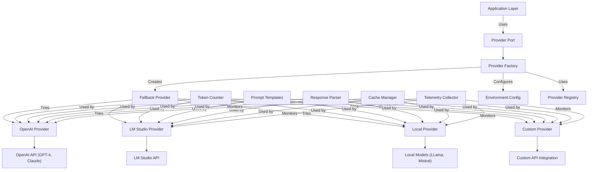

# Provider System Architecture

## Overview

The DevSynth provider system enables seamless integration with multiple LLM providers (OpenAI, LM Studio) through a unified interface. It supports automatic fallback, configuration via environment variables, and selection based on task requirements.

## Key Features

- **Unified Interface**: All LLM providers expose the same methods (`complete`, `embed`)
- **Automatic Fallback**: Gracefully falls back between providers if one fails
- **Configuration**: Uses environment variables and `.env` files for flexible configuration
- **Extensibility**: Easy to add new provider implementations
- **Retry Mechanism**: Implements exponential backoff for reliable API calls
- **Model Selection**: Intelligent selection of appropriate models based on task complexity
- **Token Management**: Token counting, context window optimization, and cost tracking
- **Streaming Support**: Real-time streaming of responses for interactive applications
- **Batching**: Efficient batching of requests for improved throughput
- **Telemetry**: Performance monitoring and usage analytics

## Architecture Diagram



## Provider Hierarchy

- **BaseProvider**: Abstract base class defining the provider interface
- **OpenAIProvider**: Implementation for OpenAI API
- **LMStudioProvider**: Implementation for LM Studio local API
- **LocalProvider**: Implementation for locally hosted models
- **FallbackProvider**: Meta-provider that tries multiple providers in sequence
- **ProviderFactory**: Factory for creating appropriate provider instances

## Implementation Details

### Provider Interface

All provider implementations adhere to the `ProviderPort` interface:

```python
class ProviderPort(ABC):
    """Abstract base class for LLM provider implementations."""
    
    @abstractmethod
    async def generate(self, 
                      prompt: str, 
                      temperature: float = 0.7, 
                      max_tokens: int = 1000,
                      stop_sequences: List[str] = None) -> str:
        """Generate text completion based on the prompt."""
        pass
    
    @abstractmethod
    async def generate_stream(self, 
                             prompt: str, 
                             temperature: float = 0.7,
                             max_tokens: int = 1000,
                             stop_sequences: List[str] = None) -> AsyncIterator[str]:
        """Stream text completion based on the prompt."""
        pass
    
    @abstractmethod
    async def embed(self, text: str) -> List[float]:
        """Generate embeddings for the provided text."""
        pass
    
    @abstractmethod
    async def embed_batch(self, texts: List[str]) -> List[List[float]]:
        """Generate embeddings for multiple texts."""
        pass
    
    @abstractmethod
    def count_tokens(self, text: str) -> int:
        """Count the number of tokens in the provided text."""
        pass
    
    @property
    @abstractmethod
    def max_context_size(self) -> int:
        """Return the maximum context size supported by this provider."""
        pass
    
    @property
    @abstractmethod
    def cost_per_1k_tokens(self) -> Dict[str, float]:
        """Return the cost per 1,000 tokens for this provider."""
        pass
```

### OpenAI Provider Implementation

```python
class OpenAIProvider(ProviderPort):
    """OpenAI implementation of the provider port."""
    
    def __init__(self, 
                 api_key: str = None, 
                 model: str = "gpt-4-turbo",
                 organization: str = None,
                 retry_attempts: int = 3,
                 timeout: int = 60):
        """Initialize OpenAI provider with configuration."""
        self.api_key = api_key or os.getenv("OPENAI_API_KEY")
        self.model = model
        self.organization = organization or os.getenv("OPENAI_ORGANIZATION")
        self.retry_attempts = retry_attempts
        self.timeout = timeout
        self.client = self._initialize_client()
        self.tokenizer = tiktoken.encoding_for_model(model)
        
        if not self.api_key:
            raise ConfigurationError("OpenAI API key not provided")
            
    def _initialize_client(self) -> OpenAI:
        """Initialize the OpenAI client."""
        return OpenAI(
            api_key=self.api_key,
            organization=self.organization,
            timeout=self.timeout,
            max_retries=self.retry_attempts
        )
        
    async def generate(self, 
                      prompt: str, 
                      temperature: float = 0.7, 
                      max_tokens: int = 1000,
                      stop_sequences: List[str] = None) -> str:
        """Generate text completion using OpenAI API."""
        try:
            response = await self._make_completion_request(
                prompt=prompt,
                temperature=temperature,
                max_tokens=max_tokens,
                stop_sequences=stop_sequences
            )
            return response.choices[0].message.content
        except OpenAIError as e:
            raise ProviderError(f"OpenAI API error: {str(e)}")
            
    async def _make_completion_request(self, **kwargs):
        """Make API request with exponential backoff retry."""
        backoff = 1
        for attempt in range(self.retry_attempts):
            try:
                return await self.client.chat.completions.create(
                    model=self.model,
                    messages=[{"role": "user", "content": kwargs["prompt"]}],
                    temperature=kwargs["temperature"],
                    max_tokens=kwargs["max_tokens"],
                    stop=kwargs["stop_sequences"]
                )
            except OpenAIError as e:
                if attempt == self.retry_attempts - 1:
                    raise
                wait_time = backoff * 2 ** attempt
                logger.warning(f"OpenAI API error: {str(e)}. Retrying in {wait_time}s...")
                await asyncio.sleep(wait_time)
                
    # Additional method implementations...
    
    @property
    def max_context_size(self) -> int:
        """Return the maximum context size for the current model."""
        context_sizes = {
            "gpt-4-turbo": 128000,
            "gpt-4o": 128000,
            "gpt-4": 8192,
            "gpt-3.5-turbo": 16385,
            "text-embedding-3-small": 8191,
            "text-embedding-3-large": 8191
        }
        return context_sizes.get(self.model, 4096)
        
    @property
    def cost_per_1k_tokens(self) -> Dict[str, float]:
        """Return the cost per 1,000 tokens for the current model."""
        costs = {
            "gpt-4-turbo": {"input": 0.01, "output": 0.03},
            "gpt-4o": {"input": 0.01, "output": 0.03},
            "gpt-4": {"input": 0.03, "output": 0.06},
            "gpt-3.5-turbo": {"input": 0.0015, "output": 0.002},
            "text-embedding-3-small": {"input": 0.00002, "output": 0},
            "text-embedding-3-large": {"input": 0.00013, "output": 0}
        }
        return costs.get(self.model, {"input": 0.01, "output": 0.03})
```

### Fallback Provider Implementation

The `FallbackProvider` attempts to use multiple providers in sequence:

```python
class FallbackProvider(ProviderPort):
    """Meta-provider that tries multiple providers in sequence."""
    
    def __init__(self, providers: List[ProviderPort]):
        """Initialize with a list of providers to try in order."""
        if not providers:
            raise ValueError("At least one provider must be specified")
        self.providers = providers
        
    async def generate(self, 
                      prompt: str, 
                      temperature: float = 0.7, 
                      max_tokens: int = 1000,
                      stop_sequences: List[str] = None) -> str:
        """Try each provider in sequence until one succeeds."""
        last_error = None
        
        for provider in self.providers:
            try:
                return await provider.generate(
                    prompt=prompt,
                    temperature=temperature,
                    max_tokens=max_tokens,
                    stop_sequences=stop_sequences
                )
            except Exception as e:
                last_error = e
                logger.warning(f"Provider {provider.__class__.__name__} failed: {str(e)}")
                continue
                
        # If we get here, all providers failed
        raise ProviderError(f"All providers failed. Last error: {str(last_error)}")
        
    # Additional method implementations...
    
    @property
    def max_context_size(self) -> int:
        """Return the minimum context size among all providers."""
        return min(provider.max_context_size for provider in self.providers)
        
    @property
    def cost_per_1k_tokens(self) -> Dict[str, float]:
        """Return the cost of the first provider."""
        return self.providers[0].cost_per_1k_tokens if self.providers else {"input": 0, "output": 0}
```

### Provider Factory

The `ProviderFactory` creates provider instances based on configuration:

```python
class ProviderFactory:
    """Factory for creating LLM provider instances."""
    
    @classmethod
    def create(cls, 
               provider_type: str = None, 
               model: str = None,
               use_fallback: bool = True) -> ProviderPort:
        """Create a provider instance based on configuration."""
        # Default to environment variable or OpenAI
        provider_type = provider_type or os.getenv("DEVSYNTH_PROVIDER", "openai")
        
        # Create the primary provider
        primary_provider = cls._create_single_provider(provider_type, model)
        
        # If fallback is disabled, return the primary provider
        if not use_fallback:
            return primary_provider
            
        # Create fallback providers
        fallback_providers = []
        
        # Add primary provider
        fallback_providers.append(primary_provider)
        
        # Add secondary providers based on environment
        # (only add if different from primary)
        secondary_type = os.getenv("DEVSYNTH_FALLBACK_PROVIDER")
        if secondary_type and secondary_type != provider_type:
            try:
                secondary_provider = cls._create_single_provider(secondary_type, model)
                fallback_providers.append(secondary_provider)
            except Exception as e:
                logger.warning(f"Failed to create fallback provider: {str(e)}")
                
        # Add local provider as last resort if environment allows
        if os.getenv("DEVSYNTH_USE_LOCAL_FALLBACK", "false").lower() == "true":
            if "local" not in [p.__class__.__name__.lower() for p in fallback_providers]:
                try:
                    local_provider = cls._create_single_provider("local", None)
                    fallback_providers.append(local_provider)
                except Exception as e:
                    logger.warning(f"Failed to create local fallback provider: {str(e)}")
                    
        # Return a fallback provider with all available providers
        return FallbackProvider(fallback_providers)
        
    @classmethod
    def _create_single_provider(cls, provider_type: str, model: str = None) -> ProviderPort:
        """Create a single provider instance."""
        provider_type = provider_type.lower()
        
        if provider_type == "openai":
            return OpenAIProvider(model=model or os.getenv("OPENAI_MODEL", "gpt-4-turbo"))
        elif provider_type == "lmstudio":
            return LMStudioProvider(
                base_url=os.getenv("LMSTUDIO_BASE_URL", "http://localhost:1234/v1"),
                model=model or os.getenv("LMSTUDIO_MODEL")
            )
        elif provider_type == "local":
            return LocalProvider(
                model_path=os.getenv("LOCAL_MODEL_PATH"),
                model=model or os.getenv("LOCAL_MODEL", "mistral-7b-instruct")
            )
        else:
            raise ValueError(f"Unknown provider type: {provider_type}")
```

## Configuration Examples

### Basic Provider Configuration

#### Environment Variables

```bash
# OpenAI Configuration
OPENAI_API_KEY=sk-...
OPENAI_ORGANIZATION=org-...
OPENAI_MODEL=gpt-4-turbo

# LM Studio Configuration
LMSTUDIO_BASE_URL=http://localhost:1234/v1
LMSTUDIO_MODEL=llama3-70b

# Local Model Configuration
LOCAL_MODEL_PATH=/data/models
LOCAL_MODEL=mistral-7b-instruct

# Provider Selection
DEVSYNTH_PROVIDER=openai  # Main provider (openai, lmstudio, local)
DEVSYNTH_FALLBACK_PROVIDER=lmstudio  # Fallback provider
DEVSYNTH_USE_LOCAL_FALLBACK=true  # Use local model as last resort
```

#### Configuration File (config/default.yml)

```yaml
provider:
  primary: openai
  fallback: lmstudio
  use_local_fallback: true
  
  openai:
    model: gpt-4-turbo
    temperature: 0.7
    retry_attempts: 3
    timeout: 60
    
  lmstudio:
    base_url: http://localhost:1234/v1
    model: llama3-70b
    timeout: 120
    
  local:
    model_path: /data/models
    model: mistral-7b-instruct
    context_size: 8192
```

### Usage Examples

#### Basic Text Generation

```python
from devsynth.adapters.providers.factory import ProviderFactory

# Create a provider using the factory
provider = ProviderFactory.create(provider_type="openai", model="gpt-4-turbo")

# Generate text
response = await provider.generate(
    prompt="Explain how to implement a hexagonal architecture in Python.",
    temperature=0.7,
    max_tokens=1000
)

print(response)
```

#### Streaming Generation

```python
from devsynth.adapters.providers.factory import ProviderFactory

# Create a provider using the factory
provider = ProviderFactory.create()

# Stream generation results
async for chunk in provider.generate_stream(
    prompt="Write a step-by-step guide for implementing dependency injection in Python.",
    temperature=0.6,
    max_tokens=2000
):
    print(chunk, end="", flush=True)
```

#### Embedding Generation

```python
from devsynth.adapters.providers.factory import ProviderFactory

# Create a provider optimized for embeddings
provider = ProviderFactory.create(model="text-embedding-3-large")

# Generate embeddings for a single text
embedding = await provider.embed("This is a sample text to embed.")

# Generate embeddings for multiple texts
texts = [
    "First document to embed.",
    "Second document with different content.",
    "Third document about something else."
]
embeddings = await provider.embed_batch(texts)

# Use embeddings for similarity comparison
from sklearn.metrics.pairwise import cosine_similarity
similarity = cosine_similarity([embeddings[0]], [embeddings[1]])[0][0]
print(f"Similarity between first and second document: {similarity:.4f}")
```

#### Provider Selection Based on Task

```python
from devsynth.adapters.providers.factory import ProviderFactory
from devsynth.domain.services.task_analyzer import TaskAnalyzer

# Analyze the task complexity
task = "Develop a microservice architecture for a banking application."
analyzer = TaskAnalyzer()
task_complexity = analyzer.analyze_complexity(task)

# Select the appropriate provider based on task complexity
if task_complexity > 0.8:  # High complexity
    provider = ProviderFactory.create(provider_type="openai", model="gpt-4-turbo")
elif task_complexity > 0.5:  # Medium complexity
    provider = ProviderFactory.create(provider_type="openai", model="gpt-3.5-turbo")
else:  # Low complexity
    provider = ProviderFactory.create(provider_type="local", model="mistral-7b-instruct")

# Generate response
response = await provider.generate(prompt=task)
```

## Performance Considerations

### Model Selection Trade-offs

| Model | Capability | Context Size | Response Speed | Cost |
|-------|------------|--------------|----------------|------|
| GPT-4 Turbo | Very High | 128K | Medium | $$$$ |
| GPT-3.5 Turbo | High | 16K | Fast | $$ |
| Llama 3 70B | High | 8K | Medium | $ (self-hosted) |
| Mistral 7B | Medium | 8K | Fast | $ (self-hosted) |

### Optimizing Token Usage

1. **Prompt Compression**: Use techniques like retrieval-based compression to reduce input token count
2. **Response Limiting**: Set appropriate `max_tokens` values to control response length
3. **Chunked Processing**: Break large tasks into smaller chunks to work within context limits
4. **Template Optimization**: Refine prompts to be concise while maintaining clarity
5. **Response Filtering**: Post-process responses to extract only relevant information

### Caching Strategies

```python
from devsynth.adapters.providers.factory import ProviderFactory
from devsynth.infrastructure.cache import ResponseCache

# Initialize the cache
cache = ResponseCache(ttl=3600)  # 1 hour cache lifetime

# Create a provider
provider = ProviderFactory.create()

# Function using caching for expensive operations
async def get_generation_with_cache(prompt, temperature=0.7):
    # Create a cache key based on prompt and temperature
    cache_key = f"{hash(prompt)}:{temperature}"
    
    # Try to get from cache first
    cached_response = await cache.get(cache_key)
    if cached_response:
        return cached_response
        
    # Generate response if not in cache
    response = await provider.generate(
        prompt=prompt,
        temperature=temperature
    )
    
    # Store in cache for future use
    await cache.set(cache_key, response)
    
    return response
```

## Cost Management

### Tracking and Budgeting

```python
from devsynth.adapters.providers.factory import ProviderFactory
from devsynth.infrastructure.telemetry import CostTracker

# Initialize cost tracker
cost_tracker = CostTracker()

# Create a provider
provider = ProviderFactory.create()

# Track cost of a generation
async def generate_with_cost_tracking(prompt, project_id):
    # Count tokens before generation
    input_tokens = provider.count_tokens(prompt)
    
    # Generate response
    response = await provider.generate(prompt=prompt)
    
    # Count output tokens
    output_tokens = provider.count_tokens(response)
    
    # Calculate and track cost
    costs = provider.cost_per_1k_tokens
    input_cost = (input_tokens / 1000) * costs["input"]
    output_cost = (output_tokens / 1000) * costs["output"]
    total_cost = input_cost + output_cost
    
    # Record cost to tracker
    cost_tracker.record(
        project_id=project_id,
        input_tokens=input_tokens,
        output_tokens=output_tokens,
        total_cost=total_cost
    )
    
    # Return response and cost info
    return {
        "response": response,
        "cost_info": {
            "input_tokens": input_tokens,
            "output_tokens": output_tokens,
            "total_cost": total_cost
        }
    }
```

## Best Practices

### Provider Selection

1. **Task-Based Selection**: Use more capable models for complex tasks
2. **Cost-Based Selection**: Use less expensive models for routine tasks
3. **Latency-Based Selection**: Use faster models for interactive applications
4. **Fallback Configuration**: Configure appropriate fallback providers for reliability
5. **Local Backup**: Include local models as a final fallback for critical systems

### Error Handling

```python
from devsynth.adapters.providers.factory import ProviderFactory
from devsynth.adapters.providers.exceptions import ProviderError, RateLimitError

# Create a provider
provider = ProviderFactory.create()

# Robust error handling
async def generate_with_robust_error_handling(prompt):
    max_retries = 3
    backoff = 2
    
    for attempt in range(max_retries):
        try:
            return await provider.generate(prompt=prompt)
        except RateLimitError as e:
            # Handle rate limits with exponential backoff
            wait_time = backoff ** attempt
            logger.warning(f"Rate limit reached. Waiting {wait_time}s before retry...")
            await asyncio.sleep(wait_time)
            if attempt == max_retries - 1:
                raise
        except ProviderError as e:
            # For other provider errors, try a different provider
            logger.error(f"Provider error: {str(e)}")
            try:
                # Attempt with a different provider
                fallback = ProviderFactory.create(
                    provider_type="lmstudio" if "openai" in str(e).lower() else "openai"
                )
                return await fallback.generate(prompt=prompt)
            except Exception as fallback_err:
                logger.error(f"Fallback provider also failed: {str(fallback_err)}")
                raise
```

### Security Considerations

1. **API Key Management**: Use secure environment variables or secret management systems
2. **Input Validation**: Sanitize prompts to prevent prompt injection attacks
3. **Output Filtering**: Filter responses to remove potentially harmful content
4. **Rate Limiting**: Implement local rate limiting to prevent accidental API abuse
5. **Access Control**: Restrict provider access based on user permissions

## Integration with Other DevSynth Systems

### Memory System Integration

The provider system integrates with the memory system for RAG applications:

```python
from devsynth.adapters.providers.factory import ProviderFactory
from devsynth.adapters.memory.chromadb_store import ChromaDBStore

# Initialize memory and provider
memory = ChromaDBStore(collection_name="knowledge_base")
provider = ProviderFactory.create()

# RAG implementation
async def answer_with_rag(query, max_context=3):
    # Search memory system for relevant context
    context_results = await memory.search(query, limit=max_context)
    
    # Extract relevant content
    context_texts = [result["content"] for result in context_results]
    relevant_context = "\n\n".join(context_texts)
    
    # Create augmented prompt
    augmented_prompt = f"""
    Based on the following context:
    {relevant_context}
    
    Answer the question: {query}
    """
    
    # Generate response with augmented prompt
    response = await provider.generate(prompt=augmented_prompt)
    
    return {
        "query": query,
        "response": response,
        "sources": [result["id"] for result in context_results]
    }
```

### Dialectical Reasoning Integration

```python
from devsynth.adapters.providers.factory import ProviderFactory
from devsynth.domain.services.dialectical_reasoning import DialecticalReasoningService

# Initialize provider and reasoning service
provider = ProviderFactory.create(model="gpt-4-turbo")
reasoning_service = DialecticalReasoningService(llm_provider=provider)

# Analyze a design choice with dialectical reasoning
async def analyze_design_choice(design_question):
    # Generate thesis and antithesis
    thesis = await provider.generate(
        prompt=f"Generate a thesis supporting the following design choice: {design_question}"
    )
    
    antithesis = await provider.generate(
        prompt=f"Generate an antithesis opposing the following design choice: {design_question}"
    )
    
    # Generate synthesis
    synthesis_prompt = f"""
    Given the following:
    
    Design Question: {design_question}
    Thesis: {thesis}
    Antithesis: {antithesis}
    
    Generate a balanced synthesis that considers both perspectives.
    """
    
    synthesis = await provider.generate(prompt=synthesis_prompt)
    
    return {
        "design_question": design_question,
        "thesis": thesis,
        "antithesis": antithesis,
        "synthesis": synthesis
    }
```

## Future Enhancements

- **Dynamic Model Selection**: Intelligent model selection based on input complexity
- **Provider Analytics**: Performance tracking and optimization suggestions
- **Multi-Model Inference**: Parallel inference across multiple models with result combination
- **Fine-Tuning Management**: Streamlined process for model fine-tuning and deployment
- **Parameter Optimization**: Automatic tuning of temperature and other parameters based on task
- **Cross-Provider Consistency**: Ensuring consistent outputs across different providers
- **Modality Support**: Extending provider system to support image and audio modalities

## Current Limitations

- Only LM Studio has a fully functional implementation.
- Provider fallback logic is basic and lacks cross-provider streaming support.

