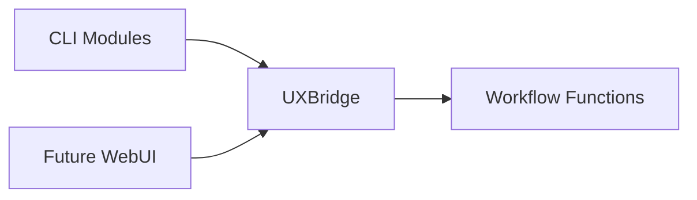

# UXBridge Abstraction

The **UXBridge** is a thin interface that decouples DevSynth's workflow logic from
any specific user interface framework. CLI commands and future WebUI components
invoke workflow functions through this common layer, allowing the same code in
`src/devsynth/core` to be reused across different front‑ends.

## Responsibilities

- Expose simple `prompt`, `confirm`, and `print` methods
- Hide presentation details from workflow logic
- Allow mocking during tests
- Provide a single point where alternative UIs (e.g., a WebUI) can plug in

## WebUI Consumption

The WebUI will implement the `UXBridge` interface so it can call the existing
workflow functions without modification. CLI modules in `src/devsynth/core` will
therefore serve both command-line users and the WebUI. By adhering to the
`UXBridge` interface, the WebUI can provide richer interactivity while leveraging
the same orchestration logic already used by the CLI.

## Related Components

- **CLI Implementation:** `src/devsynth/interface/cli.py`
- **Bridge Definition:** `src/devsynth/core/ux_bridge.py`
- **Workflow Functions:** `src/devsynth/core/workflows.py`

The UXBridge ensures these components remain loosely coupled, enabling a smooth
transition from a purely CLI experience to a more graphical WebUI.
