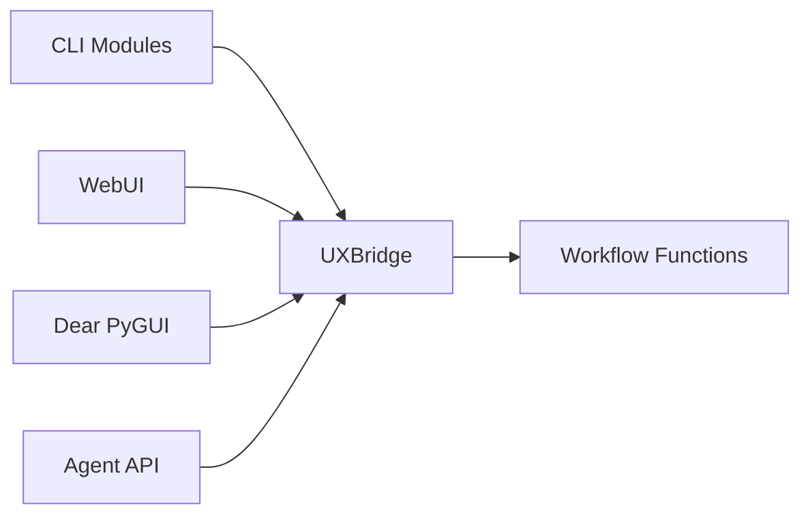
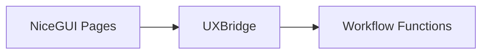
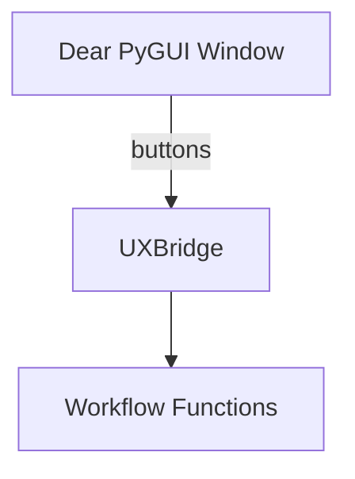

<div class="breadcrumbs">
<a href="../index.md">Documentation</a> &gt; <a href="index.md">Architecture</a> &gt; UXBridge Abstraction
</div>

# UXBridge Abstraction

The **UXBridge** is a thin interface that decouples DevSynth's workflow logic from
any specific user interface framework. CLI commands, the NiceGUI‑based WebUI,
and the Dear PyGUI desktop interface invoke workflow functions through this
common layer, allowing the same code in `src/devsynth/core` to be reused across
different front‑ends.

## Responsibilities

- Expose the descriptive `ask_question`, `confirm_choice`, and

  `display_result` methods

- Provide backward compatible aliases `prompt`, `confirm`, and `print`
- Hide presentation details from workflow logic
- Allow mocking during tests
- Provide a single point where alternative UIs (e.g., a WebUI) can plug in


<!-- Diagram: Interfaces connected through UXBridge -->



```pseudocode

# CLI front-end

cli_bridge = CLIUXBridge()
cli_command(args, bridge=cli_bridge)

# WebUI front-end

web_bridge = WebUI()
web_bridge.run()

# Agent API

api = AgentAPI(cli_bridge)
api.init(path=".")
```

## WebUI Consumption

The WebUI implements the `UXBridge` interface so it can call the existing
workflow functions without modification. CLI modules in `src/devsynth/core` and
the WebUI therefore share the same orchestration code. A basic NiceGUI
implementation is available in `src/devsynth/interface/webui.py`.
It presents a sidebar with collapsible sections for onboarding, requirements,
analysis, synthesis, and configuration. By adhering to the `UXBridge`
interface, the WebUI can provide richer interactivity while leveraging the same
logic already used by the CLI.

<!-- Diagram: NiceGUI pages using UXBridge -->



## Dear PyGUI Consumption

The Dear PyGUI interface offers a lightweight desktop client that also
implements the `UXBridge`. A minimal window is defined in
`src/devsynth/interface/dpg_ui.py`; each button triggers the same workflow
functions used by the CLI and WebUI.

### Setup

```bash
poetry install --with gui
poetry run python -m devsynth.interface.dpg_ui
```

Launching the module starts the Dear PyGUI event loop and binds common
DevSynth workflows to buttons.

<!-- Diagram: Dear PyGUI layout using UXBridge -->




### Button Layout

The desktop client exposes the following buttons mapped to their CLI commands:

| Button Label       | CLI Command |
|--------------------|-------------|
| Init               | `init` |
| Gather             | `gather` |
| Inspect            | `inspect` |
| Spec               | `spec` |
| Test               | `test` |
| Code               | `code` |
| Run Pipeline       | `run-pipeline` |
| Config             | `config` |
| Enable Feature     | `config enable-feature` |
| Wizard             | `wizard` |
| Inspect Code       | `inspect-code` |
| Refactor           | `refactor` |
| Webapp             | `webapp` |
| Serve              | `serve` |
| DbSchema           | `dbschema` |
| Doctor             | `doctor` |
| Check              | `check` |
| EDRR Cycle         | `EDRR-cycle` |
| Align              | `align` |
| Alignment Metrics  | `alignment-metrics` |
| Inspect Config     | `inspect-config` |
| Validate Manifest  | `validate-manifest` |
| Validate Metadata  | `validate-metadata` |
| Test Metrics       | `test-metrics` |
| Generate Docs      | `generate-docs` |
| Ingest             | `ingest` |
| API Spec           | `apispec` |
| WebUI              | `webui` |

## Unified Interaction Pattern

Both CLI commands and the WebUI rely on the same interaction calls. A single
`CLIUXBridge` instance is passed to command handlers so that user interaction
methods can be easily mocked during tests.

```pseudocode
bridge = CLIUXBridge()

function some_command(args, bridge=bridge):
    answer = bridge.ask_question("Enter value")
    if bridge.confirm_choice("Continue?"):
        bridge.display_result(f"Result: {answer}")
```

## Related Components

- **CLI Implementation:** `src/devsynth/interface/cli.py`
- **Bridge Definition:** `src/devsynth/interface/ux_bridge.py`
- **Workflow Functions:** `src/devsynth/core/workflows.py`
- **Dear PyGUI Bridge:** `src/devsynth/interface/dpg_bridge.py`
- **Dear PyGUI UI:** `src/devsynth/interface/dpg_ui.py`

Additional documentation that explains how the bridge integrates with the user
interfaces can be found in:

- **[CLI to WebUI and Dear PyGUI Command Mapping](cli_webui_mapping.md)** – shows
  how each CLI command corresponds to WebUI pages and Dear PyGUI windows using
  the `UXBridge` layer.
- **[WebUI Architecture Overview](webui_overview.md)** – details how the
  NiceGUI interface implements `UXBridge` for feature parity with the CLI.


The UXBridge ensures these components remain loosely coupled, enabling a smooth
transition from a purely CLI experience to a more graphical WebUI.

## Method Contracts

All implementations expose the following behaviours so workflows can remain UI
agnostic:

- **``ask_question(message, choices=None, default=None, show_default=True)``** –

  returns the user's response as a string. Choice lists and default values may
  be presented but callers always receive text.

- **``confirm_choice(message, default=False)``** – returns ``True`` when the user

  confirms the action, otherwise ``False``.

- **``display_result(message, highlight=False)``** – shows a message to the user

  without returning a value. When ``highlight`` is ``True`` the text is
  emphasised (for example using colour or bold styling).

- **``create_progress(description, total=100)``** – yields a progress indicator

  object with ``update`` and ``complete`` methods. The object supports the
  context manager protocol so ``with bridge.create_progress("Loading") as p:`` is
  valid.

These expectations are enforced by unit tests in
``tests/unit/interface/test_uxbridge_consistency.py`` which instantiate each
bridge and verify consistent behaviour.

## Bridge Invariants

Regardless of implementation, all bridges guarantee a few key invariants:

- **Consistent return types** – `ask_question` always yields a string and

  `confirm_choice` always yields a boolean.

- **Output sanitization** – messages passed to `display_result` and progress

  descriptions are sanitized with `sanitize_output` before presentation.

- **Safe CLI input** – the CLI bridge validates user responses with

  `validate_safe_input` so unsafe content is rejected early.
## Implementation Status

This feature is **implemented**. The CLI, WebUI, and Dear PyGUI interfaces rely
on the `UXBridge` abstraction, and unit tests ensure consistent behaviour across
bridges.
