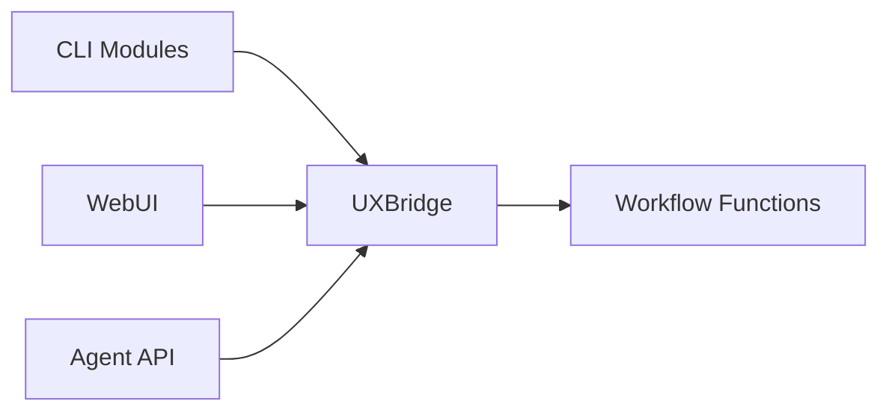
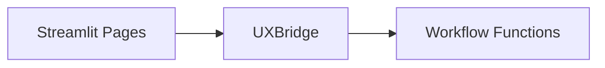

# UXBridge Abstraction

The **UXBridge** is a thin interface that decouples DevSynth's workflow logic from
any specific user interface framework. CLI commands and future WebUI components
invoke workflow functions through this common layer, allowing the same code in
`src/devsynth/core` to be reused across different front‑ends.

## Responsibilities

- Expose simple `prompt`, `confirm`, and `print` methods
- Hide presentation details from workflow logic
- Allow mocking during tests
- Provide a single point where alternative UIs (e.g., a WebUI) can plug in



## WebUI Consumption

The WebUI implements the `UXBridge` interface so it can call the existing
workflow functions without modification. CLI modules in `src/devsynth/core` and
the WebUI therefore share the same orchestration code. A basic Streamlit
implementation is available in `src/devsynth/interface/webui.py`.
It presents a sidebar with collapsible sections for onboarding, requirements,
analysis, synthesis, and configuration. By adhering to the `UXBridge`
interface, the WebUI can provide richer interactivity while leveraging the same
logic already used by the CLI.



## Unified Interaction Pattern

Both CLI commands and the WebUI rely on the same interaction calls. A single
`CLIUXBridge` instance is passed to command handlers so that user prompts and
output can be easily mocked during tests.

```pseudocode
bridge = CLIUXBridge()

function some_command(args, bridge=bridge):
    answer = bridge.prompt("Enter value")
    if bridge.confirm("Continue?"):
        bridge.print(f"Result: {answer}")
```

## Related Components

- **CLI Implementation:** `src/devsynth/interface/cli.py`
- **Bridge Definition:** `src/devsynth/interface/ux_bridge.py`
- **Workflow Functions:** `src/devsynth/core/workflows.py`

The UXBridge ensures these components remain loosely coupled, enabling a smooth
transition from a purely CLI experience to a more graphical WebUI.
