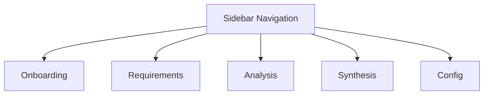
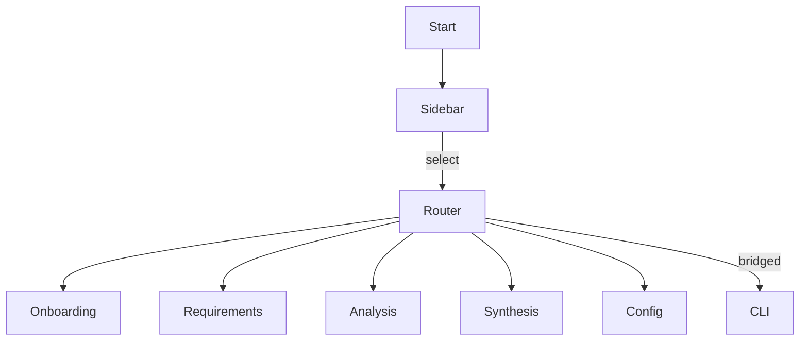

# WebUI Architecture Overview

The WebUI presents DevSynth workflows via Streamlit while reusing the
existing CLI logic through the `UXBridge` abstraction. The `WebUI`
class implements the bridge methods and exposes navigable pages for the
core workflows. By consuming the `UXBridge` interface it reuses the same
workflow orchestration that powers the CLI.

## Side Navigation Layout



## Pseudocode

```python
class WebUI(UXBridge):
    def run(self):
        st.set_page_config(page_title="DevSynth WebUI", layout="wide")
        page = st.sidebar.radio(
            "Navigation",
            ("Onboarding", "Requirements", "Analysis", "Synthesis", "Config"),
        )
        if page == "Onboarding":
            self.onboarding_page()
        elif page == "Requirements":
            self.requirements_page()
        # additional pages omitted
```

## High-Level Flow



The sidebar acts as a router. Each page delegates workflow execution to
the same CLI commands used in the terminal interface, ensuring feature
parity while benefiting from Streamlit components such as collapsible
sections and progress indicators.

## Programmatic Access

Agents or external tools can drive these workflows using the
`AgentAPI`. The FastAPI application defined in
`src/devsynth/interface/agentapi.py` exposes the following JSON
endpoints:

- `/init` – initialize or onboard a project
- `/gather` – run the requirements gathering wizard
- `/synthesize` – execute the synthesis pipeline
- `/status` – retrieve messages from the most recent workflow

Each endpoint mirrors the `UXBridge` interactions so that automated
clients receive the same feedback a human would see in the CLI or
WebUI. This allows scripted agents to orchestrate DevSynth without a
user present.

