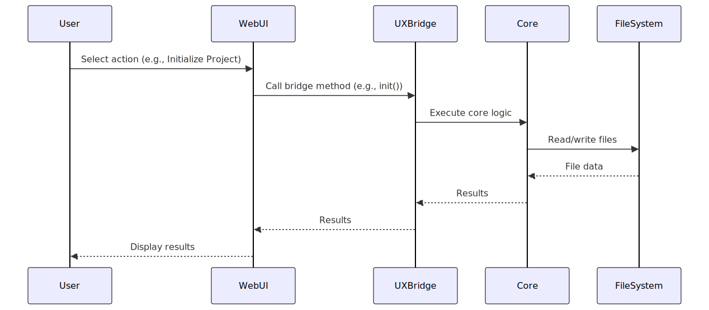

<div class="breadcrumbs">
<a href="../index.md">Documentation</a> &gt; <a href="index.md">Architecture</a> &gt; WebUI Architecture Overview
</div>

# WebUI Architecture Overview

## Introduction

The DevSynth WebUI provides a browser-based graphical interface to the DevSynth platform, making it accessible to users who prefer visual interfaces over command-line tools. Built with NiceGUI, the WebUI maintains feature parity with the CLI by reusing the same underlying logic through the `UXBridge` abstraction.

## Architecture Principles

The WebUI architecture follows these key principles:

1. **Separation of Concerns**: UI components are separated from business logic
2. **Code Reuse**: Leverages the same core logic as the CLI through the `UXBridge`
3. **Consistency**: Provides the same capabilities and workflows as the CLI
4. **Extensibility**: New pages and features can be added without modifying existing code
5. **Responsive Design**: Adapts to different screen sizes and devices


## Component Architecture

The WebUI architecture consists of several key components that work together to provide a comprehensive user interface for DevSynth. The following diagram illustrates the high-level component architecture:


### Detailed Component Descriptions

#### Core Components

1. **WebUI Interface**: The main entry point for the web interface, implemented as a NiceGUI application. It handles page rendering, navigation, and user interactions.
   - **Implementation**: `WebUI` class in `adapters/cli/webui.py`
   - **Responsibilities**: Page rendering, navigation, session state management
   - **Dependencies**: NiceGUI, UXBridge

2. **UXBridge Implementation**: The WebUI implements the UXBridge interface to ensure consistent functionality with the CLI.
   - **Implementation**: `WebUI` class implements `UXBridge` interface
   - **Responsibilities**: Translating UI actions to core logic calls
   - **Dependencies**: UXBridge interface, Core DevSynth Logic

3. **Session State Management**: Manages persistent state between page reloads and user interactions.
   - **Implementation**: Uses NiceGUI's `st.session_state`
   - **Responsibilities**: Storing project data, user preferences, process state
   - **Dependencies**: NiceGUI


#### UI Pages

Each page in the WebUI corresponds to a specific DevSynth workflow:

1. **Onboarding Page**: Handles project creation and opening existing projects.
   - **Implementation**: `_render_onboarding_page` method in `WebUI` class
   - **Responsibilities**: Project initialization, project loading
   - **Key Features**: Project directory selection, project name input, initialization options

2. **Requirements Page**: Manages requirement gathering and editing.
   - **Implementation**: `_render_requirements_page` method in `WebUI` class
   - **Responsibilities**: Requirement input, requirement editing, requirement validation
   - **Key Features**: Text editor for requirements, file upload for requirements, requirement visualization

3. **Analysis Page**: Displays code analysis results and metrics.
   - **Implementation**: `_render_analysis_page` method in `WebUI` class
   - **Responsibilities**: Code analysis visualization, metric display
   - **Key Features**: Code quality metrics, architecture visualization, issue highlighting

4. **Synthesis Page**: Handles code generation and review.
   - **Implementation**: `_render_synthesis_page` method in `WebUI` class
   - **Responsibilities**: Code generation, code review, code export
   - **Key Features**: Code editor with syntax highlighting, diff view, export options

5. **EDRR Page**: Manages the EDRR execution and visualization.
   - **Implementation**: `_render_edrr_cycle_page` method in `WebUI` class
   - **Responsibilities**: EDRR execution, phase visualization, result display
   - **Key Features**: Phase transition controls, result visualization, cycle configuration

6. **Configuration Page**: Handles system configuration and preferences.
   - **Implementation**: `_render_configuration_page` method in `WebUI` class
   - **Responsibilities**: Configuration management, preference setting
   - **Key Features**: Provider configuration, UI preferences, advanced options


#### UI Components

The WebUI uses custom components to enhance the user experience:

1. **Code Editor**: Interactive code editor with syntax highlighting.
   - **Implementation**: `CodeEditor` class
   - **Responsibilities**: Code editing, syntax highlighting, code validation
   - **Key Features**: Multiple language support, line numbering, error highlighting

2. **Progress Bar**: Visual indicator of process completion.
   - **Implementation**: `ProgressTracker` class
   - **Responsibilities**: Progress tracking, status updates
   - **Key Features**: Percentage display, step labeling, completion indication

3. **File Uploader**: Component for uploading files to the system.
   - **Implementation**: Uses NiceGUI's `st.file_uploader` with custom handling
   - **Responsibilities**: File upload, file validation, file processing
   - **Key Features**: Multiple file support, file type filtering, drag-and-drop

4. **Visualizations**: Components for data visualization.
   - **Implementation**: Various visualization classes using NiceGUI's plotting capabilities
   - **Responsibilities**: Data visualization, metric display
   - **Key Features**: Charts, graphs, tables, interactive elements


#### UI Utilities

1. **Data Formatters**: Utilities for formatting data for display.
   - **Implementation**: Various formatter functions
   - **Responsibilities**: Data formatting, display preparation
   - **Key Features**: Code formatting, JSON formatting, table formatting

2. **Input Validators**: Utilities for validating user input.
   - **Implementation**: Various validator functions
   - **Responsibilities**: Input validation, error reporting
   - **Key Features**: Path validation, name validation, format validation

3. **Error Handlers**: Utilities for handling and displaying errors.
   - **Implementation**: Error handling functions and decorators
   - **Responsibilities**: Error catching, error display, error logging
   - **Key Features**: User-friendly error messages, error categorization, recovery suggestions

4. **Notification System**: System for displaying notifications to the user.
   - **Implementation**: Notification functions using NiceGUI's message components
   - **Responsibilities**: Notification display, notification timing
   - **Key Features**: Success messages, warning messages, error messages, info messages


### Key Components

#### UXBridge Implementation

The `WebUI` class implements the `UXBridge` interface, which defines methods for all core DevSynth workflows:

```python
class WebUI(UXBridge):
    """NiceGUI-based web interface for DevSynth."""

    def __init__(self, config_path: Optional[str] = None):
        """Initialize the WebUI with optional configuration."""
        super().__init__(config_path)
        self.session_state = st.session_state
        self.initialize_session_state()

    def initialize_session_state(self):
        """Initialize NiceGUI session state variables."""
        if 'project_path' not in self.session_state:
            self.session_state.project_path = ""
        if 'messages' not in self.session_state:
            self.session_state.messages = []
        if 'current_page' not in self.session_state:
            self.session_state.current_page = "Onboarding"

    def run(self):
        """Run the WebUI application."""
        st.set_page_config(
            page_title="DevSynth WebUI",
            page_icon="🧠",
            layout="wide",
            initial_sidebar_state="expanded"
        )

        self._render_sidebar()
        self._render_current_page()

    def _render_sidebar(self):
        """Render the sidebar navigation."""
        with st.sidebar:
            st.title("DevSynth")
            st.subheader("AI-Powered Software Engineering")

            # Navigation
            pages = [
                "Onboarding",
                "Requirements",
                "Analysis",
                "Synthesis",
                "EDRR",
                "Configuration"
            ]

            selected_page = st.radio("Navigation", pages, index=pages.index(self.session_state.current_page))
            if selected_page != self.session_state.current_page:
                self.session_state.current_page = selected_page

            # Project info
            if self.session_state.project_path:
                st.divider()
                st.subheader("Current Project")
                st.info(self.session_state.project_path)

    def _render_current_page(self):
        """Render the currently selected page."""
        page = self.session_state.current_page

        if page == "Onboarding":
            self._render_onboarding_page()
        elif page == "Requirements":
            self._render_requirements_page()
        elif page == "Analysis":
            self._render_analysis_page()
        elif page == "Synthesis":
            self._render_synthesis_page()
        elif page == "EDRR":
            self._render_edrr_cycle_page()
        elif page == "Configuration":
            self._render_configuration_page()
```

#### Page Implementations

Each page in the WebUI corresponds to a specific DevSynth workflow:

```python
def _render_onboarding_page(self):
    """Render the onboarding page."""
    st.title("Project Onboarding")

    col1, col2 = st.columns(2)

    with col1:
        st.subheader("Create New Project")
        new_project_path = st.text_input("Project Directory", placeholder="/path/to/new/project")
        project_name = st.text_input("Project Name", placeholder="My Amazing Project")

        if st.button("Initialize Project", key="init_new"):
            if new_project_path and project_name:
                with st.spinner("Initializing project..."):
                    try:
                        self.init(new_project_path, project_name)
                        self.session_state.project_path = new_project_path
                        st.success(f"Project initialized at {new_project_path}")
                    except Exception as e:
                        st.error(f"Failed to initialize project: {e}")
            else:
                st.warning("Please provide both project path and name")

    with col2:
        st.subheader("Open Existing Project")
        existing_project_path = st.text_input("Project Directory", placeholder="/path/to/existing/project")

        if st.button("Open Project", key="open_existing"):
            if existing_project_path:
                with st.spinner("Opening project..."):
                    try:
                        self.load(existing_project_path)
                        self.session_state.project_path = existing_project_path
                        st.success(f"Project opened from {existing_project_path}")
                    except Exception as e:
                        st.error(f"Failed to open project: {e}")
            else:
                st.warning("Please provide project path")
```

#### UI Components

The WebUI uses custom components to enhance the user experience:

```python
class CodeEditor:
    """Interactive code editor component."""

    def __init__(self, language="python", height=300):
        """Initialize the code editor."""
        self.language = language
        self.height = height

    def render(self, key, initial_value="", readonly=False):
        """Render the code editor and return the edited code."""
        return st.code_editor(
            initial_value,
            language=self.language,
            height=self.height,
            key=key,
            readonly=readonly
        )

class ProgressTracker:
    """Component for tracking and displaying progress."""

    def __init__(self, total_steps):
        """Initialize the progress tracker."""
        self.total_steps = total_steps
        self.current_step = 0
        self.progress_bar = None

    def start(self):
        """Start the progress tracking."""
        self.current_step = 0
        self.progress_bar = st.progress(0)

    def update(self, step=None, message=None):
        """Update the progress."""
        if step is not None:
            self.current_step = step
        else:
            self.current_step += 1

        progress = min(self.current_step / self.total_steps, 1.0)
        self.progress_bar.progress(progress)

        if message:
            st.info(message)

    def complete(self, success=True, message=None):
        """Complete the progress tracking."""
        self.progress_bar.progress(1.0)
        if success:
            st.success(message or "Process completed successfully")
        else:
            st.error(message or "Process failed")
```

## Navigation Flow

The WebUI uses a sidebar for navigation between different pages:


## Data Flow

The WebUI interacts with the core DevSynth logic through the `UXBridge` interface:





## State Management

The WebUI uses NiceGUI's session state to maintain state between user interactions. This is crucial for providing a seamless user experience despite NiceGUI's stateless nature where the script is re-run on each interaction.

### Session State Architecture

The session state in the WebUI is organized into several categories:





### Session State Initialization

The WebUI initializes the session state when the application starts:

```python
def initialize_session_state(self):
    """Initialize NiceGUI session state variables with proper structure."""
    # Project state
    if 'project_path' not in st.session_state:
        st.session_state.project_path = ""
    if 'project_name' not in st.session_state:
        st.session_state.project_name = ""
    if 'project_config' not in st.session_state:
        st.session_state.project_config = {}
    if 'requirements' not in st.session_state:
        st.session_state.requirements = {}
    if 'code_analysis' not in st.session_state:
        st.session_state.code_analysis = {}
    if 'synthesis_results' not in st.session_state:
        st.session_state.synthesis_results = {}

    # UI state
    if 'current_page' not in st.session_state:
        st.session_state.current_page = "Onboarding"
    if 'page_specific_state' not in st.session_state:
        st.session_state.page_specific_state = {}
    if 'ui_preferences' not in st.session_state:
        st.session_state.ui_preferences = {
            "theme": "light",
            "code_font_size": "medium",
            "show_advanced_options": False,
            "auto_refresh": True
        }
    if 'expanded_sections' not in st.session_state:
        st.session_state.expanded_sections = {}

    # Process state
    if 'edrr_results' not in st.session_state:
        st.session_state.edrr_results = {}
    if 'current_process' not in st.session_state:
        st.session_state.current_process = None
    if 'process_running' not in st.session_state:
        st.session_state.process_running = False
    if 'process_progress' not in st.session_state:
        st.session_state.process_progress = 0.0
    if 'process_messages' not in st.session_state:
        st.session_state.process_messages = []

    # Message system
    if 'messages' not in st.session_state:
        st.session_state.messages = []
```

### Session State Usage

The WebUI uses the session state throughout the application to maintain context between user interactions:

#### Project State Management

```python
def load_project(self, project_path):
    """Load a project from the specified path."""
    try:
        # Load project configuration
        config_path = os.path.join(project_path, "devsynth.json")
        if os.path.exists(config_path):
            with open(config_path, "r") as f:
                project_config = json.load(f)

            # Update session state with project information
            st.session_state.project_path = project_path
            st.session_state.project_name = project_config.get("name", "")
            st.session_state.project_config = project_config

            # Load requirements if available
            requirements_path = os.path.join(project_path, "requirements.md")
            if os.path.exists(requirements_path):
                with open(requirements_path, "r") as f:
                    requirements_text = f.read()
                st.session_state.requirements = {"text": requirements_text}

            # Add success message
            self.add_message("success", f"Project loaded from {project_path}")

            # Navigate to Requirements page
            st.session_state.current_page = "Requirements"

            return True
        else:
            self.add_message("error", f"No DevSynth project found at {project_path}")
            return False
    except Exception as e:
        self.add_message("error", f"Failed to load project: {str(e)}")
        return False
```

#### UI State Management

```python
def handle_page_navigation(self, page_name):
    """Handle navigation to a different page."""
    # Save current page state if needed
    current_page = st.session_state.current_page
    if current_page == "Requirements" and page_name != "Requirements":
        # Save requirements before navigating away
        self._save_current_requirements()

    # Update current page
    st.session_state.current_page = page_name

    # Initialize page-specific state if needed
    if page_name not in st.session_state.page_specific_state:
        st.session_state.page_specific_state[page_name] = {}

    # Reset expanded sections for the new page
    st.session_state.expanded_sections = {}

    # Add navigation message
    self.add_message("info", f"Navigated to {page_name} page")
```

#### Process State Management

```python
def start_edrr_cycle(self):
    """Start an EDRR."""
    if not st.session_state.project_path:
        self.add_message("error", "No project loaded")
        return False

    # Update process state
    st.session_state.process_running = True
    st.session_state.process_progress = 0.0
    st.session_state.process_messages = []
    st.session_state.current_process = "edrr_cycle"

    try:
        # Start EDRR in a separate thread
        thread = threading.Thread(target=self._run_edrr_cycle)
        thread.start()

        # Add message
        self.add_message("info", "Started EDRR")
        return True
    except Exception as e:
        # Update process state on failure
        st.session_state.process_running = False
        st.session_state.current_process = None
        self.add_message("error", f"Failed to start EDRR: {str(e)}")
        return False
```

### Message System

The WebUI includes a message system for displaying notifications to the user:

```python
def add_message(self, message_type, content):
    """Add a message to the message list."""
    message = {
        "type": message_type,  # "info", "success", "warning", "error"
        "content": content,
        "timestamp": time.time()
    }
    st.session_state.messages.append(message)

    # Limit the number of messages to prevent memory issues
    if len(st.session_state.messages) > 100:
        st.session_state.messages = st.session_state.messages[-100:]

def display_messages(self):
    """Display all messages in the UI."""
    if not st.session_state.messages:
        return

    # Display messages in reverse chronological order (newest first)
    for message in reversed(st.session_state.messages[-5:]):
        message_type = message["type"]
        content = message["content"]

        if message_type == "info":
            st.info(content)
        elif message_type == "success":
            st.success(content)
        elif message_type == "warning":
            st.warning(content)
        elif message_type == "error":
            st.error(content)
```

### State Persistence

The WebUI provides mechanisms for persisting state across sessions:

```python
def save_user_preferences(self):
    """Save user preferences to disk."""
    if not st.session_state.project_path:
        return

    preferences_path = os.path.join(st.session_state.project_path, ".devsynth", "ui_preferences.json")
    os.makedirs(os.path.dirname(preferences_path), exist_ok=True)

    with open(preferences_path, "w") as f:
        json.dump(st.session_state.ui_preferences, f, indent=2)

def load_user_preferences(self):
    """Load user preferences from disk."""
    if not st.session_state.project_path:
        return

    preferences_path = os.path.join(st.session_state.project_path, ".devsynth", "ui_preferences.json")
    if os.path.exists(preferences_path):
        with open(preferences_path, "r") as f:
            preferences = json.load(f)

        # Update session state with loaded preferences
        st.session_state.ui_preferences.update(preferences)
```

## Programmatic Access

The WebUI functionality is also accessible programmatically through the `AgentAPI`, which is a FastAPI application that exposes JSON endpoints:

```python
@app.post("/init")
async def init_project(request: InitRequest):
    """Initialize a new project."""
    try:
        bridge = get_bridge()
        result = bridge.init(request.path, request.name)
        return {"success": True, "result": result}
    except Exception as e:
        return {"success": False, "error": str(e)}

@app.post("/gather")
async def gather_requirements(request: GatherRequest):
    """Gather requirements for a project."""
    try:
        bridge = get_bridge()
        result = bridge.gather(request.path, request.source)
        return {"success": True, "result": result}
    except Exception as e:
        return {"success": False, "error": str(e)}

@app.post("/synthesize")
async def synthesize(request: SynthesizeRequest):
    """Synthesize code from requirements."""
    try:
        bridge = get_bridge()
        result = bridge.synthesize(request.path)
        return {"success": True, "result": result}
    except Exception as e:
        return {"success": False, "error": str(e)}

@app.get("/status")
async def get_status():
    """Get the current status of the system."""
    try:
        bridge = get_bridge()
        messages = bridge.get_messages()
        return {"success": True, "messages": messages}
    except Exception as e:
        return {"success": False, "error": str(e)}
```

## Implementation Details

### WebUI Class Structure

```python
class WebUI(UXBridge):
    """NiceGUI-based web interface for DevSynth."""

    def __init__(self, config_path: Optional[str] = None):
        """Initialize the WebUI with optional configuration."""
        # Implementation details...

    def run(self):
        """Run the WebUI application."""
        # Implementation details...

    # Page rendering methods
    def _render_onboarding_page(self):
        """Render the onboarding page."""
        # Implementation details...

    def _render_requirements_page(self):
        """Render the requirements page."""
        # Implementation details...

    def _render_analysis_page(self):
        """Render the analysis page."""
        # Implementation details...

    def _render_synthesis_page(self):
        """Render the synthesis page."""
        # Implementation details...

    def _render_edrr_cycle_page(self):
        """Render the EDRR page."""
        # Implementation details...

    def _render_configuration_page(self):
        """Render the configuration page."""
        # Implementation details...

    # UXBridge implementation methods
    def init(self, path: str, name: str) -> Dict[str, Any]:
        """Initialize a new project."""
        result = super().init(path, name)
        self._update_messages()
        return result

    def gather(self, path: str, source: str) -> Dict[str, Any]:
        """Gather requirements for a project."""
        result = super().gather(path, source)
        self._update_messages()
        return result

    def synthesize(self, path: str) -> Dict[str, Any]:
        """Synthesize code from requirements."""
        result = super().synthesize(path)
        self._update_messages()
        return result

    def _update_messages(self):
        """Update the messages in the session state."""
        self.session_state.messages = self.get_messages()
```

### Running the WebUI

The WebUI can be started using the CLI command:

```bash
devsynth webui --port 8501
```

Or programmatically:

```python
from devsynth.adapters.cli.webui import WebUI

if __name__ == "__main__":
    webui = WebUI()
    webui.run()
```

## Deployment Options

The WebUI can be deployed in several ways, each with its own advantages and considerations. This section provides detailed information about the different deployment options and how to implement them.

### Deployment Architecture

The following diagram illustrates the different deployment options for the WebUI:


### 1. Local Development Deployment

Running the WebUI locally is the simplest deployment option and is ideal for development and testing.

#### Requirements

- Python 3.12 or higher
- Poetry (for dependency management)
- DevSynth repository


#### Setup Steps

1. Clone the DevSynth repository:

   ```bash
   git clone https://github.com/devsynth/devsynth.git
   cd devsynth
   ```

2. Install dependencies using Poetry:

   ```bash
   poetry install
   ```

3. Activate the Poetry virtual environment:

   ```bash
   poetry shell
   ```

4. Run the WebUI:

   ```bash
   python -m devsynth.adapters.cli.webui --port 8501
   ```

5. Access the WebUI in your browser at `http://localhost:8501`


#### Configuration

The local deployment can be configured using environment variables or a `.env` file:

```bash

# .env file example for local deployment

DEVSYNTH_PROVIDER=openai
OPENAI_API_KEY=your-api-key
STREAMLIT_THEME=light
STREAMLIT_SERVER_PORT=8501
STREAMLIT_SERVER_HEADLESS=false
STREAMLIT_BROWSER_GATHER_USAGE_STATS=false
```

## 2. Docker Container Deployment

Containerizing the WebUI provides a consistent environment and simplifies deployment across different systems.

### Requirements

- Docker
- Docker Compose (optional, for multi-container deployments)


#### Dockerfile

```dockerfile
FROM python:3.12-slim

WORKDIR /app

# Install system dependencies

RUN apt-get update && apt-get install -y \
    build-essential \
    git \
    && rm -rf /var/lib/apt/lists/*

# Install Poetry

RUN pip install --no-cache-dir poetry

# Copy Poetry configuration

COPY pyproject.toml poetry.lock* ./

# Configure Poetry to not create a virtual environment

RUN poetry config virtualenvs.create false

# Install dependencies

RUN poetry install --no-dev --no-interaction --no-ansi

# Copy application code

COPY . .

# Expose NiceGUI port

EXPOSE 8501

# Set environment variables

ENV PYTHONUNBUFFERED=1 \
    STREAMLIT_SERVER_PORT=8501 \
    STREAMLIT_SERVER_HEADLESS=true \
    STREAMLIT_BROWSER_GATHER_USAGE_STATS=false

# Run the WebUI

CMD ["python", "-m", "devsynth.adapters.cli.webui"]
```

## Docker Compose Configuration

For more complex deployments with multiple services, Docker Compose provides a convenient way to define and run multi-container Docker applications:

```yaml

# docker-compose.yml

version: "0.1.0a1"

services:
  webui:
    build: .
    ports:
      - "8501:8501"

    environment:
      - DEVSYNTH_PROVIDER=openai
      - OPENAI_API_KEY=${OPENAI_API_KEY}
      - STREAMLIT_SERVER_HEADLESS=true

    volumes:
      - ./projects:/app/projects

    restart: unless-stopped

  lm-studio:
    image: lmstudio/lmstudio:latest
    ports:
      - "1234:1234"

    volumes:
      - ./models:/models

    restart: unless-stopped
```

## Deployment Steps

1. Build the Docker image:

   ```bash
   docker build -t devsynth-webui .
   ```

2. Run the Docker container:

   ```bash
   docker run -p 8501:8501 -e OPENAI_API_KEY=your-api-key devsynth-webui
   ```

3. Or, using Docker Compose:

   ```bash
   docker-compose up -d
   ```

4. Access the WebUI in your browser at `http://localhost:8501`


### 3. Cloud Deployment

Deploying the WebUI to cloud platforms provides scalability, reliability, and accessibility from anywhere.

#### AWS Deployment

##### Using AWS Elastic Beanstalk

1. Create a `Procfile` in the project root:

   ```text
   web: nicegui run devsynth/adapters/cli/webui.py --server.port=$PORT --server.headless=true
   ```

2. Create a `requirements.txt` file:

   ```bash
   poetry export -f requirements.txt --output requirements.txt
   ```

3. Create an Elastic Beanstalk application and environment:

   ```bash
   eb init -p python-3.12 devsynth-webui
   eb create devsynth-webui-env
   ```

4. Configure environment variables:

   ```bash
   eb setenv DEVSYNTH_PROVIDER=openai OPENAI_API_KEY=your-api-key
   ```

5. Deploy the application:

   ```bash
   eb deploy
   ```

##### Using AWS ECS with Fargate

1. Create an ECR repository:

   ```bash
   aws ecr create-repository --repository-name devsynth-webui
   ```

2. Build and push the Docker image:

   ```bash
   aws ecr get-login-password | docker login --username AWS --password-stdin your-account-id.dkr.ecr.region.amazonaws.com
   docker build -t your-account-id.dkr.ecr.region.amazonaws.com/devsynth-webui:latest .
   docker push your-account-id.dkr.ecr.region.amazonaws.com/devsynth-webui:latest
   ```

3. Create an ECS cluster, task definition, and service using the AWS Console or CLI


#### Google Cloud Platform Deployment

##### Using Google Cloud Run

1. Build and push the Docker image to Google Container Registry:

   ```bash
   gcloud builds submit --tag gcr.io/your-project-id/devsynth-webui
   ```

2. Deploy to Cloud Run:

   ```bash
   gcloud run deploy devsynth-webui \
     --image gcr.io/your-project-id/devsynth-webui \
     --platform managed \
     --allow-unauthenticated \
     --set-env-vars="DEVSYNTH_PROVIDER=openai,OPENAI_API_KEY=your-api-key"
   ```

#### Azure Deployment

##### Using Azure Container Instances

1. Create an Azure Container Registry and push the Docker image:

   ```bash
   az acr create --resource-group myResourceGroup --name myRegistry --sku Basic
   az acr login --name myRegistry
   docker tag devsynth-webui myRegistry.azurecr.io/devsynth-webui:latest
   docker push myRegistry.azurecr.io/devsynth-webui:latest
   ```

2. Deploy to Azure Container Instances:

   ```bash
   az container create \
     --resource-group myResourceGroup \
     --name devsynth-webui \
     --image myRegistry.azurecr.io/devsynth-webui:latest \
     --registry-login-server myRegistry.azurecr.io \
     --registry-username myRegistry \
     --registry-password $(az acr credential show --name myRegistry --query "passwords[0].value" -o tsv) \
     --ports 8501 \
     --environment-variables DEVSYNTH_PROVIDER=openai OPENAI_API_KEY=your-api-key
   ```

### 4. NiceGUI Cloud Deployment

NiceGUI Cloud provides a simple way to deploy NiceGUI applications without managing infrastructure.

#### Requirements

- GitHub repository with the DevSynth code
- NiceGUI Cloud account


#### Deployment Steps

1. Push your code to a GitHub repository:

   ```bash
   git push origin main
   ```

2. Log in to NiceGUI Cloud (https://nicegui.io/cloud)

3. Click "New app" and select your GitHub repository, branch, and the main file path (`devsynth/adapters/cli/webui.py`)

4. Configure environment variables in the NiceGUI Cloud dashboard:
   - `DEVSYNTH_PROVIDER`: openai
   - `OPENAI_API_KEY`: your-api-key

5. Deploy the app


### Security Considerations

When deploying the WebUI, consider the following security best practices:

1. **API Key Management**: Store API keys securely using environment variables or secret management services
2. **Network Security**: Use HTTPS for all communications and configure appropriate firewall rules
3. **Authentication**: Implement user authentication for production deployments
4. **Resource Isolation**: Use containerization to isolate the application from the host system
5. **Regular Updates**: Keep all dependencies updated to patch security vulnerabilities


### Performance Optimization

To optimize the performance of the WebUI deployment:

1. **Caching**: Configure NiceGUI's caching mechanisms to improve response times
2. **Resource Allocation**: Allocate appropriate CPU and memory resources based on expected usage
3. **Content Delivery Network**: Use a CDN for static assets in production deployments
4. **Database Connection Pooling**: Implement connection pooling for database interactions
5. **Monitoring**: Set up monitoring to track performance metrics and identify bottlenecks


### Scaling Considerations

For deployments that need to scale:

1. **Horizontal Scaling**: Deploy multiple instances behind a load balancer
2. **Stateless Design**: Ensure the application is stateless to facilitate scaling
3. **Database Scaling**: Use scalable database solutions for persistent storage
4. **Caching Layer**: Implement a distributed caching layer for shared state
5. **Auto-scaling**: Configure auto-scaling based on CPU usage or request volume


## Future Enhancements

Planned enhancements for the WebUI include:

1. **Real-time Collaboration**: Allow multiple users to collaborate on the same project
2. **Advanced Visualizations**: Add more sophisticated visualizations for code analysis
3. **Customizable Themes**: Allow users to customize the UI appearance
4. **Mobile Support**: Enhance mobile responsiveness for tablet and phone use
5. **Offline Mode**: Support offline operation with local LLM providers
6. **Integration with Version Control**: Direct integration with Git repositories
## Implementation Status

.
