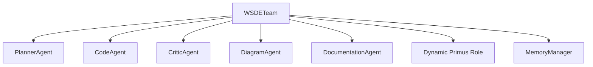

<div class="breadcrumbs">
<a href="../index.md">Documentation</a> &gt; <a href="index.md">Architecture</a> &gt; WSDE Agent Model
</div>

# WSDE Agent Model

## Overview

The WSDE (Worker Self-Directed Enterprise) model is a collaborative multi-agent framework used in DevSynth that enables autonomous agents to work together in a democratic, self-organizing manner. Inspired by real-world worker cooperatives, the WSDE model distributes authority and responsibility among specialized agents, each contributing their expertise while collectively making decisions.



**Implementation Status**

- Dynamic role rotation and consensus voting are implemented in
  `src/devsynth/domain/models/wsde_roles.py` and
  `src/devsynth/domain/models/wsde_voting.py`. Unit tests are provided in
  `tests/unit/domain/test_wsde_facade_roles.py` and
  `tests/unit/domain/test_wsde_voting_logic.py`, with integration coverage in
  `tests/integration/general/test_multi_agent_roles_and_voting.py`.
- Integration with the EDRR cycle and enhanced dialectical reasoning hooks
  remain in progress and are tracked in
  [issue 104](../../issues/Critical-recommendations-follow-up.md).

## Core Principles

1. **Distributed Authority**: No single agent has complete control; decision-making is collaborative.
2. **Specialization with Collaboration**: Agents have specialized roles but work together on complex tasks.
3. **Dialectical Reasoning**: Agents engage in thesis-antithesis-synthesis reasoning to reach optimal solutions.
4. **Continuous Improvement**: The team regularly evaluates and improves its processes and outcomes.
5. **Transparency**: All decisions and their rationales are documented and accessible.

## Agent Roles

The WSDE team consists of specialized agents with distinct roles and responsibilities:

### Architect Agent

**Responsibilities**:
- Designing high-level system architecture
- Ensuring architectural consistency
- Evaluating technical trade-offs
- Maintaining design patterns

**Integration Points**:
- Works with the Developer Agent to ensure implementation aligns with architecture
- Consults with the Requirements Agent to ensure architecture meets requirements
- Reviews the Tester Agent's test architecture

### Developer Agent

**Responsibilities**:
- Implementing code based on specifications
- Refactoring and optimizing existing code
- Resolving technical debt
- Applying best practices in implementation

**Integration Points**:
- Implements designs provided by the Architect Agent
- Works with the Tester Agent to ensure code is testable
- Consults with the Documentation Agent to ensure code is well-documented

### Tester Agent

**Responsibilities**:
- Designing and implementing tests
- Identifying edge cases and potential issues
- Verifying requirements are met
- Ensuring code quality through testing

**Integration Points**:
- Works with the Developer Agent to ensure comprehensive test coverage
- Consults with the Requirements Agent to ensure tests verify requirements
- Provides test results to the Documentation Agent for inclusion in documentation

### Requirements Agent

**Responsibilities**:
- Analyzing and clarifying requirements
- Identifying potential conflicts or ambiguities
- Ensuring requirements are testable and implementable
- Tracking requirement implementation status

**Integration Points**:
- Provides clear requirements to the Architect and Developer Agents
- Works with the Tester Agent to ensure requirements are verifiable
- Consults with the Documentation Agent to ensure requirements are well-documented

### Documentation Agent

**Responsibilities**:
- Creating and maintaining documentation
- Ensuring documentation is clear, comprehensive, and up-to-date
- Documenting design decisions and their rationales
- Creating user guides and API documentation

**Integration Points**:
- Works with all other agents to document their work
- Ensures documentation reflects the current state of the system
- Provides documentation feedback to improve code clarity

### Coordinator Agent

**Responsibilities**:
- Facilitating communication between agents
- Managing the workflow and task assignments
- Resolving conflicts between agents
- Ensuring the team follows the EDRR process

**Integration Points**:
- Interfaces with all agents to coordinate activities
- Manages the EDRR process flow
- Ensures all agents have the information they need

## Collaboration Patterns

### Democratic Decision-Making

The WSDE team makes decisions through a democratic process:

1. **Proposal**: Any agent can propose a solution or approach
2. **Discussion**: All agents discuss the proposal, offering perspectives from their domains
3. **Dialectical Analysis**: The team applies thesis-antithesis-synthesis reasoning
4. **Consensus Building**: The team works toward consensus, not just majority rule
5. **Decision**: The team makes a collective decision
6. **Documentation**: The decision and its rationale are documented

### Task Allocation

Tasks are allocated based on:

1. **Specialization**: Tasks are assigned to agents with relevant expertise
2. **Workload Balance**: Tasks are distributed to maintain balanced workloads
3. **Dependencies**: Task dependencies are considered in allocation
4. **Agent Input**: Agents have input on task assignments
5. **Collective Oversight**: The team collectively monitors progress

### Conflict Resolution

When conflicts arise, the team follows this process:

1. **Identification**: Clearly identify the conflict and its root causes
2. **Perspective Sharing**: Each agent shares their perspective
3. **Dialectical Analysis**: Apply thesis-antithesis-synthesis reasoning
4. **Solution Generation**: Generate potential solutions
5. **Evaluation**: Evaluate solutions against project goals
6. **Consensus Building**: Work toward a consensus solution
7. **Documentation**: Document the conflict and its resolution

## Integration with EDRR Framework

The WSDE model integrates seamlessly with the EDRR (Expand, Differentiate, Refine, Retrospect) framework:

### Memory Synchronization Hooks

To maintain consistent state across components, the lightweight
`EDRRCoordinator` and the WSDE facade register synchronization hooks with the
central `MemoryManager`. After dialectical reasoning steps or peer review
operations, pending updates are flushed and hooks are invoked so downstream
adapters remain in sync. This ensures that artifacts created in one phase are
immediately available to the others.

### Expand Phase

- **Architect Agent**: Proposes architectural approaches
- **Developer Agent**: Suggests implementation strategies
- **Tester Agent**: Identifies testing approaches
- **Requirements Agent**: Clarifies requirements and constraints
- **Documentation Agent**: Gathers relevant documentation
- **Coordinator Agent**: Facilitates brainstorming sessions

### Differentiate Phase

- **Architect Agent**: Evaluates architectural trade-offs
- **Developer Agent**: Assesses implementation complexity
- **Tester Agent**: Evaluates testability of approaches
- **Requirements Agent**: Verifies alignment with requirements
- **Documentation Agent**: Documents comparison of approaches
- **Coordinator Agent**: Facilitates evaluation discussions

### Refine Phase

- **Architect Agent**: Finalizes architecture design
- **Developer Agent**: Implements the selected approach
- **Tester Agent**: Develops comprehensive tests
- **Requirements Agent**: Tracks requirement implementation
- **Documentation Agent**: Creates implementation documentation
- **Coordinator Agent**: Coordinates implementation activities

### Retrospect Phase

- **Architect Agent**: Evaluates architectural decisions
- **Developer Agent**: Reviews code quality and performance
- **Tester Agent**: Analyzes test coverage and effectiveness
- **Requirements Agent**: Verifies all requirements were met
- **Documentation Agent**: Ensures documentation is complete
- **Coordinator Agent**: Facilitates retrospective discussions

## Implementation Details

### Agent Communication

Agents communicate through:

1. **Shared Memory**: A central memory system accessible to all agents
2. **Structured Messages**: Standardized message format for inter-agent communication
3. **Collaborative Workspace**: Shared workspace for collaborative tasks
4. **Meeting Protocols**: Structured protocols for team discussions

### Agent State Management

Each agent maintains:

1. **Role-Specific Knowledge**: Specialized knowledge related to their role
2. **Task Context**: Current task context and status
3. **Team Awareness**: Awareness of other agents' activities
4. **Historical Memory**: Record of past decisions and activities

### Example: Collaborative Code Review

```text
COLLABORATIVE CODE REVIEW PROCESS:

1. Developer Agent submits code for review
   - Provides implementation details
   - Highlights design decisions
   - Notes any concerns or questions

2. Architect Agent reviews architectural aspects
   - Evaluates alignment with architecture
   - Identifies potential architectural improvements
   - Provides architectural feedback

3. Tester Agent reviews testability
   - Evaluates test coverage
   - Identifies potential edge cases
   - Suggests additional tests

4. Requirements Agent verifies requirement implementation
   - Confirms all requirements are met
   - Identifies any requirement gaps
   - Verifies requirement traceability

5. Documentation Agent reviews documentation
   - Checks documentation completeness
   - Ensures code comments are clear
   - Suggests documentation improvements

6. Coordinator Agent facilitates discussion
   - Identifies areas of agreement and disagreement
   - Ensures all perspectives are considered
   - Helps build consensus on improvements

7. Team collectively approves or requests changes
   - Provides consolidated feedback
   - Prioritizes requested changes
   - Documents review decisions
```

## Best Practices for WSDE Implementation

1. **Balance Specialization and Collaboration**: Ensure agents are specialized but not siloed
2. **Encourage Dialectical Thinking**: Promote thesis-antithesis-synthesis reasoning
3. **Document Decision Rationale**: Always document why decisions were made
4. **Regular Retrospectives**: Conduct regular team retrospectives
5. **Continuous Learning**: Incorporate feedback to improve team performance
6. **Transparent Communication**: Ensure all agents have access to necessary information
7. **Respect Expertise**: Value each agent's domain expertise
8. **Collective Ownership**: Foster a sense of collective ownership of outcomes

## Using WSDETeam

The `WSDETeam` class in `domain.models.wsde_facade` manages collaborative agents. To
use it:

```python
from devsynth.domain.models.wsde_facade import WSDETeam

team = WSDETeam()
team.add_agents([agent_a, agent_b])

# Dynamically assign roles for a new task

task = {"type": "documentation", "description": "Write API docs"}
team.dynamic_role_reassignment(task)

# Optionally attach shared resources
team.set_knowledge_graph(my_knowledge_graph)
team.set_standards(my_standards)

# Agents contribute solutions

team.add_solution(task, {"agent": agent_a.name, "content": "Initial draft"})
team.add_solution(task, {"agent": agent_b.name, "content": "Formatting updates"})

# Build consensus on the final approach

final = team.build_consensus(task)
print(final["consensus"])
```

Role assignments are accessible through `WSDE.get_role_assignments()`, which
returns a mapping of agent identifiers to their active roles. Identifiers are
generated when agents join the team. When the workflow advances, the
`progress_roles` helper from `domain.wsde.workflow` reassigns roles for the new
EDRR phase and invokes `flush_memory_queue` to commit pending memory updates
before proceeding.

The methods used in this example are implemented across
`src/devsynth/domain/models/wsde_core.py` and
`src/devsynth/domain/models/wsde_facade.py` and tested in
`tests/unit/domain/test_wsde_phase_role_rotation.py` and
`tests/integration/general/test_collaborative_decision_making.py`.

The team uses `select_primus_by_expertise()` to choose a Primus for each task. This logic lives in `src/devsynth/domain/models/wsde_roles.py` and is validated by `tests/unit/domain/test_wsde_primus_selection.py` and `tests/integration/general/test_delegate_task_primus_selection.py`.

## Current Limitations

Full WSDE collaboration is still under development. The latest release adds
dynamic role reassignment and fully functional consensus voting. Collaboration
remains disabled by default via the `features.wsde_collaboration` flag in
`config/default.yml`.
Refer to the
[Feature Status Matrix](../implementation/feature_status_matrix.md) for the
latest progress details.

## Related Documents

- [EDRR Framework](edrr_framework.md)
- [Dialectical Reasoning](dialectical_reasoning.md)
- [Agent System Architecture](agent_system.md)
- [Memory System Architecture](memory_system.md)
