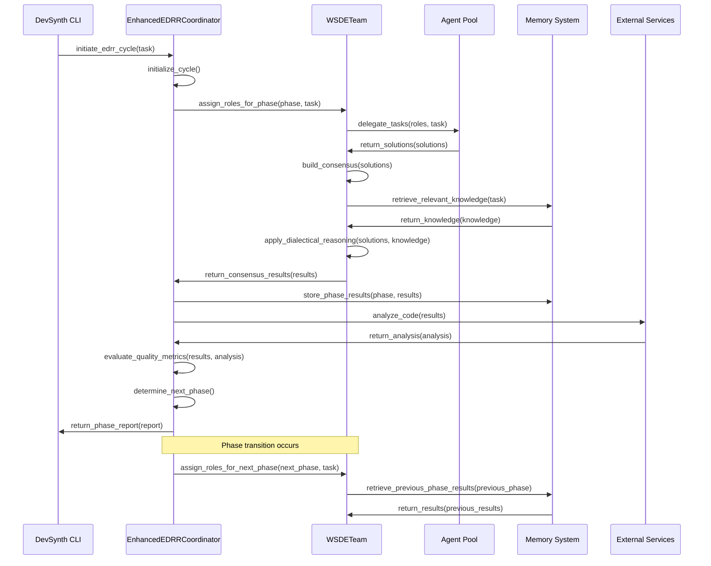
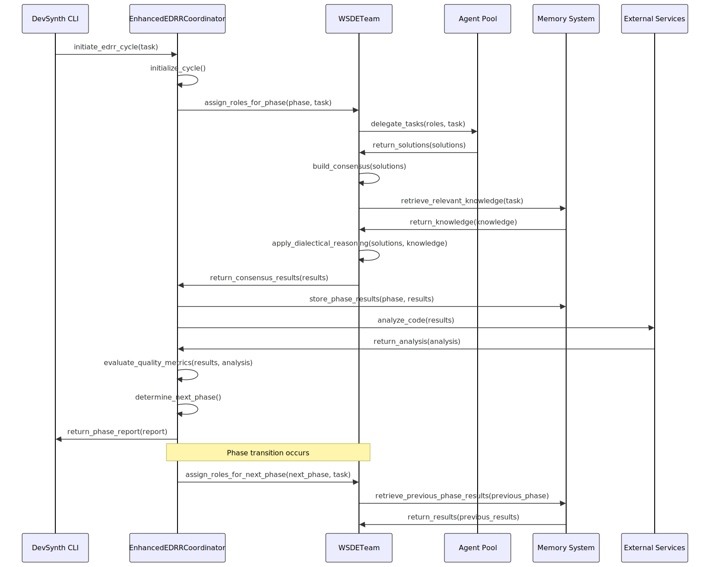

<div class="breadcrumbs">
<a href="../index.md">Documentation</a> &gt; <a href="index.md">Architecture</a> &gt; WSDE-EDRR Integration Architecture
</div>

# WSDE-EDRR Integration Architecture

This document describes the architecture of the integration between the WSDE (Workplace, Social, and Democratic Economy) model and the EDRR (EDRR) framework in DevSynth.

## Architecture Overview

```text
┌─────────────────────────────────────────────────────────────────────┐
│                        DevSynth CLI Interface                        │
└───────────────────────────────┬─────────────────────────────────────┘
                                │
                                ▼
┌─────────────────────────────────────────────────────────────────────┐
│                    EnhancedEDRRCoordinator                           │
│                                                                     │
│  ┌─────────────────┐  ┌─────────────────┐  ┌─────────────────────┐  │
│  │  Phase Manager  │  │ Quality Metrics │  │ Micro-Cycle Engine  │  │
│  └────────┬────────┘  └────────┬────────┘  └──────────┬──────────┘  │
│           │                    │                      │             │
│           └──────────┬─────────┴──────────┬──────────┘             │
│                      │                    │                         │
└──────────────────────┼────────────────────┼─────────────────────────┘
                       │                    │
                       ▼                    ▼
┌─────────────────────────────┐  ┌─────────────────────────────────────┐
│        WSDETeam              │  │         Memory System               │
│                             │  │                                     │
│  ┌─────────────────────┐    │  │  ┌─────────────────────────────┐    │
│  │ Role Management     │    │  │  │ Phase-Specific Storage      │    │
│  └─────────────────────┘    │  │  └─────────────────────────────┘    │
│                             │  │                                     │
│  ┌─────────────────────┐    │  │  ┌─────────────────────────────┐    │
│  │ Consensus Building  │    │  │  │ Knowledge Graph Integration │    │
│  └─────────────────────┘    │  │  └─────────────────────────────┘    │
│                             │  │                                     │
│  ┌─────────────────────┐    │  │  ┌─────────────────────────────┐    │
│  │ Dialectical Reasoning│◄──┼──┼──┤ Historical Pattern Retrieval │    │
│  └─────────────────────┘    │  │  └─────────────────────────────┘    │
│                             │  │                                     │
└─────────────────────────────┘  └─────────────────────────────────────┘
           ▲                                       ▲
           │                                       │
           ▼                                       ▼
┌─────────────────────────────┐  ┌─────────────────────────────────────┐
│        Agent Pool           │  │         External Services            │
│                             │  │                                     │
│  ┌─────────────────────┐    │  │  ┌─────────────────────────────┐    │
│  │ Specialized Agents  │    │  │  │ Code Analysis               │    │
│  └─────────────────────┘    │  │  └─────────────────────────────┘    │
│                             │  │                                     │
│  ┌─────────────────────┐    │  │  ┌─────────────────────────────┐    │
│  │ Expertise Profiles  │    │  │  │ Documentation Management    │    │
│  └─────────────────────┘    │  │  └─────────────────────────────┘    │
│                             │  │                                     │
└─────────────────────────────┘  └─────────────────────────────────────┘
```

## Component Descriptions

### EnhancedEDRRCoordinator

The EnhancedEDRRCoordinator is the central component that orchestrates the EDRR process and integrates with the WSDE model. It manages the progression through EDRR phases and coordinates the activities of agents.

**Subcomponents:**

- **Phase Manager**: Controls transitions between EDRR phases
- **Quality Metrics**: Collects and evaluates metrics for phase transitions
- **Micro-Cycle Engine**: Manages iterative refinement within phases


### WSDETeam

The WSDETeam implements the WSDE model for non-hierarchical, context-driven agent collaboration. It manages agent roles, consensus building, and dialectical reasoning.

**Subcomponents:**

- **Role Management**: Assigns and rotates roles based on context
- **Consensus Building**: Facilitates consensus-based decision making
- **Dialectical Reasoning**: Implements thesis-antithesis-synthesis workflow


### Memory System

The Memory System stores and retrieves results, knowledge, and patterns across EDRR phases and cycles.

**Subcomponents:**

- **Phase-Specific Storage**: Stores results for each EDRR phase
- **Knowledge Graph Integration**: Connects with knowledge graphs for enhanced reasoning
- **Historical Pattern Retrieval**: Retrieves patterns from previous cycles


### Agent Pool

The Agent Pool provides specialized agents with different expertise for the WSDE team.

**Subcomponents:**

- **Specialized Agents**: Agents with specific expertise
- **Expertise Profiles**: Profiles defining agent capabilities


### External Services

External Services provide additional capabilities to the EDRR framework.

**Subcomponents:**

- **Code Analysis**: Analyzes code structure and quality
- **Documentation Management**: Manages documentation generation and updates


## Integration Points

### WSDE-EDRR Integration

The integration between the WSDE model and the EDRR framework occurs at several key points:

#### 1. Phase-Specific Role Assignment

The EDRR Coordinator assigns different roles to the WSDE team members based on the current phase of the EDRR. This ensures that the team composition is optimized for the specific requirements of each phase.

Role assignments are keyed by agent identifiers rather than names. When the
coordinator advances to a new phase, the `progress_roles` helper updates these
mappings and the coordinator flushes the memory queue *before and after* role
assignment. This double flush ensures any pending updates from the previous
phase are written and prevents deadlocks caused by new writes during the
transition. If no memory manager is configured the coordinator still emits a
terminal sync event to keep downstream observers in step.

```python

# In EnhancedEDRRCoordinator

def progress_to_phase(self, phase: Phase) -> None:
    """
    Progress to the specified EDRR phase and assign appropriate roles to the WSDE team.

    Args:
        phase: The EDRR phase to progress to
    """
    self.logger.info(f"Progressing to phase: {phase.name}")
    self.current_phase = phase

    # Assign roles based on the current phase
    if phase == Phase.EXPAND:
        # For Expand phase, prioritize creative and exploratory roles
        self.wsde_team.assign_roles_for_phase(
            phase,
            self.task,
            role_priorities={
                "explorer": 0.9,
                "innovator": 0.8,
                "researcher": 0.7,
                "architect": 0.6,
                "critic": 0.3
            }
        )
    elif phase == Phase.DIFFERENTIATE:
        # For Differentiate phase, prioritize analytical and critical roles
        self.wsde_team.assign_roles_for_phase(
            phase,
            self.task,
            role_priorities={
                "critic": 0.9,
                "analyst": 0.8,
                "architect": 0.7,
                "explorer": 0.4,
                "innovator": 0.3
            }
        )
    elif phase == Phase.REFINE:
        # For Refine phase, prioritize implementation and optimization roles
        self.wsde_team.assign_roles_for_phase(
            phase,
            self.task,
            role_priorities={
                "implementer": 0.9,
                "optimizer": 0.8,
                "architect": 0.7,
                "critic": 0.6,
                "explorer": 0.3
            }
        )
    elif phase == Phase.RETROSPECT:
        # For Retrospect phase, prioritize evaluation and learning roles
        self.wsde_team.assign_roles_for_phase(
            phase,
            self.task,
            role_priorities={
                "evaluator": 0.9,
                "critic": 0.8,
                "researcher": 0.7,
                "architect": 0.5,
                "implementer": 0.3
            }
        )

    # Initialize phase-specific metrics
    self.quality_metrics.initialize_phase_metrics(phase)

    # Notify observers about phase transition
    self.notify_observers(EDRREvent.PHASE_TRANSITION, {"phase": phase})
```

## 2. Consensus Building for Phase Results

The WSDE team uses a consensus-building process to integrate the contributions of different team members into a coherent result for each EDRR phase.

```python

# In EnhancedEDRRCoordinator

def execute_current_phase(self) -> Dict[str, Any]:
    """
    Execute the current EDRR phase using the WSDE team.

    Returns:
        Dict[str, Any]: The results of the phase execution
    """
    phase = self.current_phase
    self.logger.info(f"Executing phase: {phase.name}")

    # Get phase-specific prompt template
    template = self.prompt_manager.get_template_for_phase(phase)

    # Prepare task with phase-specific context
    phase_context = self._get_phase_context()
    task = self._prepare_task_with_context(self.task, phase_context)

    # Execute phase using WSDE team
    if self.config.get("wsde_integration", {}).get("enable_consensus_building", True):
        # Use consensus-building approach
        consensus_results = self.wsde_team.build_consensus(
            task=task,
            template=template,
            phase=phase,
            consensus_threshold=self.config.get("consensus_threshold", 0.7),
            max_iterations=self.config.get("max_consensus_iterations", 3),
            voting_method=self.config.get("voting_method", "weighted")
        )

        # Extract results and metadata
        results = consensus_results["results"]
        consensus_metadata = {
            "consensus_score": consensus_results["consensus_score"],
            "iterations": consensus_results["iterations"],
            "dissenting_views": consensus_results["dissenting_views"]
        }

        # Store consensus metadata
        self.memory_manager.store(
            consensus_metadata,
            "CONSENSUS_METADATA",
            {"phase": phase.value, "cycle_id": self.cycle_id}
        )
    else:
        # Use simple aggregation approach
        results = self.wsde_team.execute_task(task, template, phase)

    # Store results in memory
    self.memory_manager.store_with_edrr_phase(
        results,
        "EDRR_RESULTS",
        phase.value,
        {"cycle_id": self.cycle_id}
    )

    # Update quality metrics
    self.quality_metrics.update_phase_metrics(phase, results)

    return results
```

## 3. Dialectical Reasoning for Solution Refinement

The WSDE team applies dialectical reasoning to refine solutions, particularly in the Refine phase of the EDRR.

```python

# In WSDETeam

def apply_enhanced_dialectical_reasoning(
    self,
    task: str,
    solution: Dict[str, Any],
    critic_agent: Optional[Agent] = None
) -> Dict[str, Any]:
    """
    Apply enhanced dialectical reasoning to refine a solution.

    Args:
        task: The task description
        solution: The initial solution to refine
        critic_agent: Optional specific critic agent to use

    Returns:
        Dict[str, Any]: The refined solution
    """
    self.logger.info("Applying enhanced dialectical reasoning")

    # If no specific critic agent is provided, find one from the team
    if critic_agent is None:
        critic_agent = self._find_agent_by_role("critic")
        if critic_agent is None:
            self.logger.warning("No critic agent found, using default critic")
            critic_agent = self._create_default_critic()

    # Generate thesis (the initial solution)
    thesis = solution

    # Generate antithesis (critique of the solution)
    antithesis_prompt = f"""
    As a critical reviewer, analyze the following solution to the task:

    Task: {task}

    Solution:
    {json.dumps(solution, indent=2)}

    Identify weaknesses, potential issues, edge cases not handled, and areas for improvement.
    Focus on substantive issues rather than stylistic concerns.
    Provide specific examples where possible.
    """

    antithesis = critic_agent.execute_task(antithesis_prompt)

    # Generate synthesis (refined solution incorporating critique)
    synthesis_prompt = f"""
    Refine the following solution based on the critique provided:

    Task: {task}

    Original Solution:
    {json.dumps(thesis, indent=2)}

    Critique:
    {antithesis}

    Create an improved solution that addresses the valid points in the critique
    while maintaining the strengths of the original solution.
    """

    # Use a team approach for synthesis
    synthesis_agents = self._find_agents_by_roles(["implementer", "optimizer", "architect"])
    if not synthesis_agents:
        synthesis_agents = [self._create_default_implementer()]

    synthesis_results = []
    for agent in synthesis_agents:
        synthesis_results.append(agent.execute_task(synthesis_prompt))

    # Combine synthesis results
    final_synthesis = self._combine_synthesis_results(synthesis_results)

    # Store the dialectical process in memory
    self.memory_manager.store(
        {
            "thesis": thesis,
            "antithesis": antithesis,
            "synthesis": final_synthesis,
            "task": task
        },
        "DIALECTICAL_REASONING",
        {"timestamp": time.time()}
    )

    return final_synthesis
```

## Memory Integration

The memory system integrates with both the WSDE model and the EDRR framework to store and retrieve knowledge across phases and cycles.

### 1. Phase Result Storage

The EDRR Coordinator stores the results of each phase in the memory system with appropriate metadata.

```python

# In EnhancedEDRRCoordinator

def store_phase_results(self, phase: Phase, results: Dict[str, Any]) -> None:
    """
    Store the results of an EDRR phase in the memory system.

    Args:
        phase: The EDRR phase
        results: The results to store
    """
    # Create metadata for storage
    metadata = {
        "cycle_id": self.cycle_id,
        "phase": phase.value,
        "timestamp": time.time(),
        "task_id": self.task_id,
        "quality_metrics": self.quality_metrics.get_phase_metrics(phase)
    }

    # Store in short-term memory (for current cycle)
    self.memory_manager.store(
        results,
        "EDRR_PHASE_RESULTS",
        metadata,
        memory_type="short_term"
    )

    # Store in episodic memory (for learning across cycles)
    self.memory_manager.store(
        results,
        "EDRR_PHASE_RESULTS",
        metadata,
        memory_type="episodic"
    )

    # Extract key insights for semantic memory
    insights = self._extract_insights_from_results(results, phase)
    if insights:
        semantic_metadata = {**metadata, "insight_type": "phase_insight"}
        self.memory_manager.store(
            insights,
            "EDRR_INSIGHTS",
            semantic_metadata,
            memory_type="semantic"
        )

    self.logger.info(f"Stored results for phase {phase.name} in memory system")
```

## 2. Knowledge Retrieval for Dialectical Reasoning

The WSDE team retrieves relevant knowledge from the memory system to enhance dialectical reasoning.

```python

# In WSDETeam

def apply_enhanced_dialectical_reasoning_with_knowledge(
    self,
    task: str,
    solution: Dict[str, Any],
    critic_agent: Optional[Agent] = None
) -> Dict[str, Any]:
    """
    Apply enhanced dialectical reasoning with knowledge retrieval to refine a solution.

    Args:
        task: The task description
        solution: The initial solution to refine
        critic_agent: Optional specific critic agent to use

    Returns:
        Dict[str, Any]: The refined solution
    """
    self.logger.info("Applying enhanced dialectical reasoning with knowledge retrieval")

    # Retrieve relevant knowledge from memory
    relevant_knowledge = self._retrieve_relevant_knowledge(task, solution)

    # Generate thesis (the initial solution)
    thesis = solution

    # Generate antithesis with knowledge enhancement
    antithesis_prompt = f"""
    As a critical reviewer with access to relevant knowledge, analyze the following solution:

    Task: {task}

    Solution:
    {json.dumps(solution, indent=2)}

    Relevant Knowledge:
    {json.dumps(relevant_knowledge, indent=2)}

    Using both your expertise and the provided knowledge, identify weaknesses,
    potential issues, edge cases not handled, and areas for improvement.
    Focus on substantive issues rather than stylistic concerns.
    Provide specific examples where possible.
    """

    # Use critic agent or find one
    if critic_agent is None:
        critic_agent = self._find_agent_by_role("critic")
        if critic_agent is None:
            critic_agent = self._create_default_critic()

    antithesis = critic_agent.execute_task(antithesis_prompt)

    # Generate synthesis with knowledge enhancement
    synthesis_prompt = f"""
    Refine the following solution based on the critique and relevant knowledge:

    Task: {task}

    Original Solution:
    {json.dumps(thesis, indent=2)}

    Critique:
    {antithesis}

    Relevant Knowledge:
    {json.dumps(relevant_knowledge, indent=2)}

    Create an improved solution that addresses the valid points in the critique,
    incorporates relevant knowledge, and maintains the strengths of the original solution.
    """

    # Use a team approach for synthesis
    synthesis_agents = self._find_agents_by_roles(["implementer", "optimizer", "architect"])
    if not synthesis_agents:
        synthesis_agents = [self._create_default_implementer()]

    synthesis_results = []
    for agent in synthesis_agents:
        synthesis_results.append(agent.execute_task(synthesis_prompt))

    # Combine synthesis results
    final_synthesis = self._combine_synthesis_results(synthesis_results)

    # Store the dialectical process with knowledge in memory
    self.memory_manager.store(
        {
            "thesis": thesis,
            "antithesis": antithesis,
            "synthesis": final_synthesis,
            "relevant_knowledge": relevant_knowledge,
            "task": task
        },
        "DIALECTICAL_REASONING_WITH_KNOWLEDGE",
        {"timestamp": time.time()}
    )

    return final_synthesis

def _retrieve_relevant_knowledge(self, task: str, solution: Dict[str, Any]) -> List[Dict[str, Any]]:
    """
    Retrieve relevant knowledge from memory for a given task and solution.

    Args:
        task: The task description
        solution: The current solution

    Returns:
        List[Dict[str, Any]]: Relevant knowledge items
    """
    # Create a combined query from task and key solution elements
    solution_summary = self._summarize_solution(solution)
    query = f"{task} {solution_summary}"

    # Search different memory types with different strategies
    knowledge_items = []

    # Search semantic memory for general principles and patterns
    semantic_items = self.memory_manager.search(
        query,
        "EDRR_INSIGHTS",
        limit=5,
        memory_type="semantic"
    )
    knowledge_items.extend(semantic_items)

    # Search episodic memory for similar past experiences
    episodic_items = self.memory_manager.search(
        query,
        "EDRR_PHASE_RESULTS",
        limit=3,
        memory_type="episodic"
    )
    knowledge_items.extend(episodic_items)

    # Search short-term memory for current cycle context
    short_term_items = self.memory_manager.search(
        query,
        "EDRR_PHASE_RESULTS",
        limit=2,
        memory_type="short_term"
    )
    knowledge_items.extend(short_term_items)

    # Deduplicate and rank by relevance
    unique_items = self._deduplicate_knowledge_items(knowledge_items)
    ranked_items = self._rank_knowledge_items_by_relevance(unique_items, query)

    # Return top items
    return ranked_items[:5]
```

## Data Flow

The following diagram illustrates the data flow between components in the WSDE-EDRR integration:

<!-- Diagram: WSDE and EDRR data flow -->





The data flow follows these key steps:

1. **CLI to Coordinator**: The CLI interface initiates an EDRR by calling the EnhancedEDRRCoordinator.
2. **Coordinator to WSDE Team**: The coordinator assigns roles to the WSDE team based on the current phase.
3. **WSDE Team to Agents**: The WSDE team delegates tasks to agents based on their expertise.
4. **Agents to WSDE Team**: Agents return solutions to the WSDE team.
5. **WSDE Team to Memory**: The WSDE team retrieves relevant knowledge from the memory system.
6. **WSDE Team to WSDE Team**: The WSDE team applies dialectical reasoning to the solutions.
7. **WSDE Team to Coordinator**: The WSDE team returns consensus results to the coordinator.
8. **Coordinator to Memory**: The coordinator stores results in the memory system.
9. **Coordinator to External Services**: The coordinator requests code analysis from external services.
10. **Coordinator to Coordinator**: The coordinator evaluates quality metrics and determines the next phase.
11. **Coordinator to CLI**: The coordinator returns the phase report to the CLI interface.
12. **Phase Transition**: The coordinator transitions to the next phase and the process repeats.


## Configuration

The integration between the WSDE model and the EDRR framework can be configured through the coordinator's configuration:

```python
config = {
    "EDRR": {
        "quality_based_transitions": True,
        "phase_transition": {
            "auto": True
        },
        "wsde_integration": {
            "enable_dialectical_reasoning": True,
            "enable_consensus_building": True,
            "enable_peer_review": True
        }
    }
}
```

## Conclusion

The integration between the WSDE model and the EDRR framework provides a powerful approach to problem-solving in DevSynth. By combining the non-hierarchical, context-driven collaboration of the WSDE model with the structured phases of the EDRR framework, DevSynth enables more effective and efficient problem-solving.
## Implementation Status

.

## Current Limitations

- WSDE collaboration is enabled via feature flags but lacks extensive
  end-to-end validation.
- Dialectical reasoning hooks are experimental and disabled by default.
- Integration tests for combined EDRR and WSDE workflows are incomplete.

Refer to the [Feature Status Matrix](../implementation/feature_status_matrix.md)
for detailed progress tracking.
