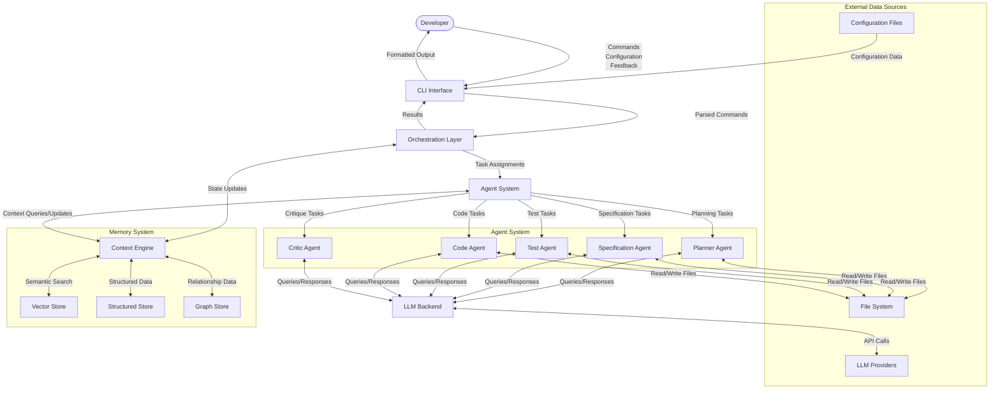
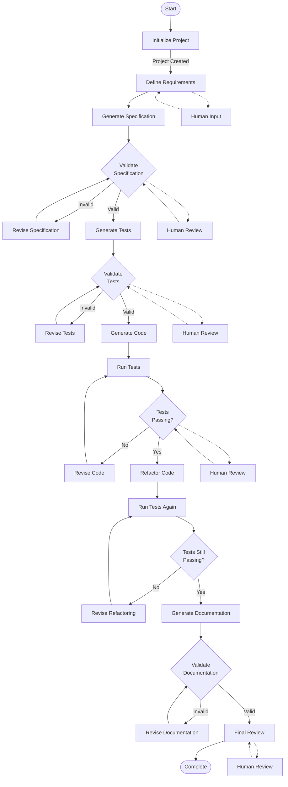
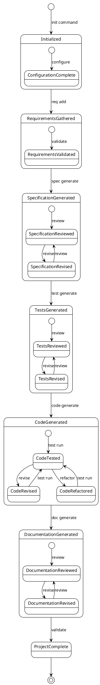
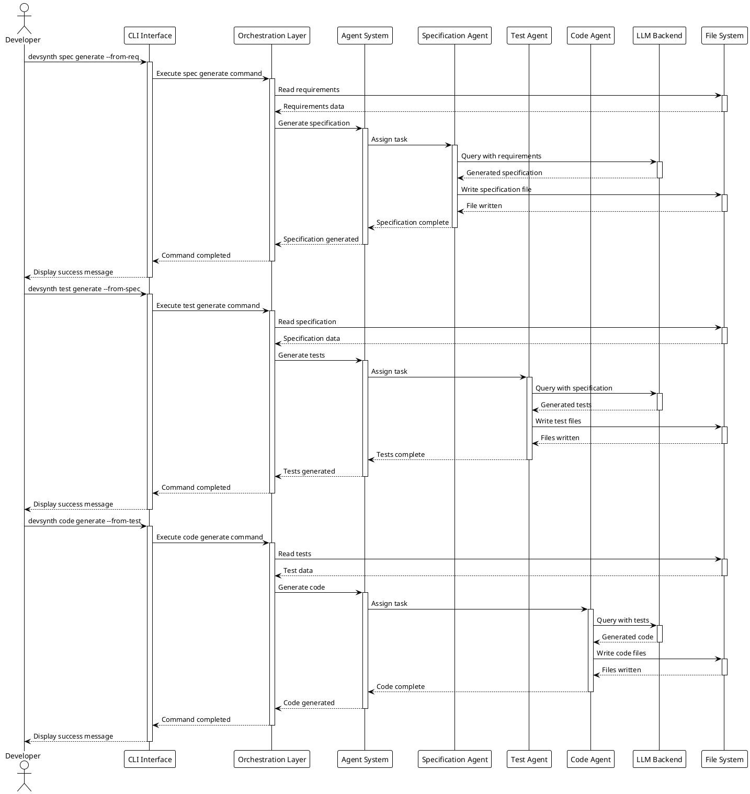
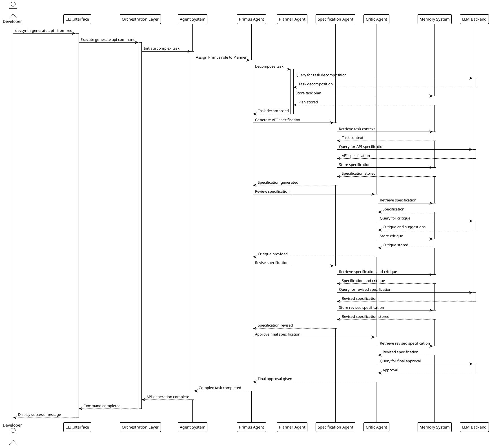
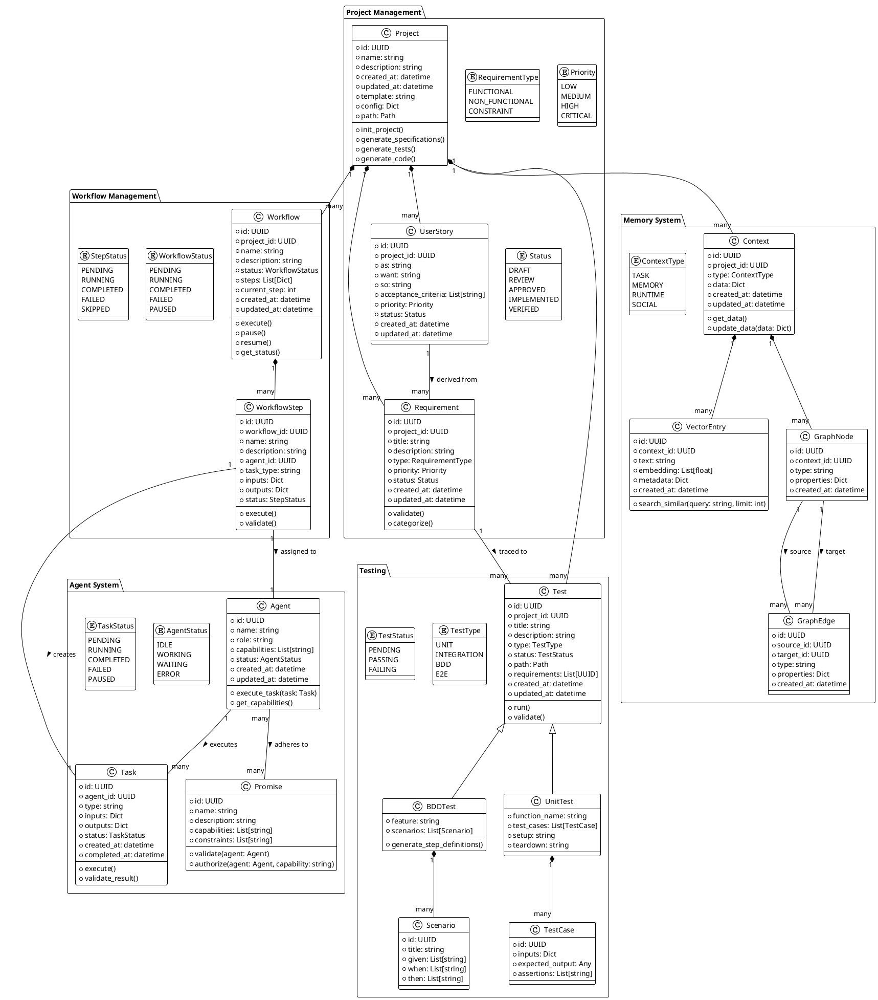
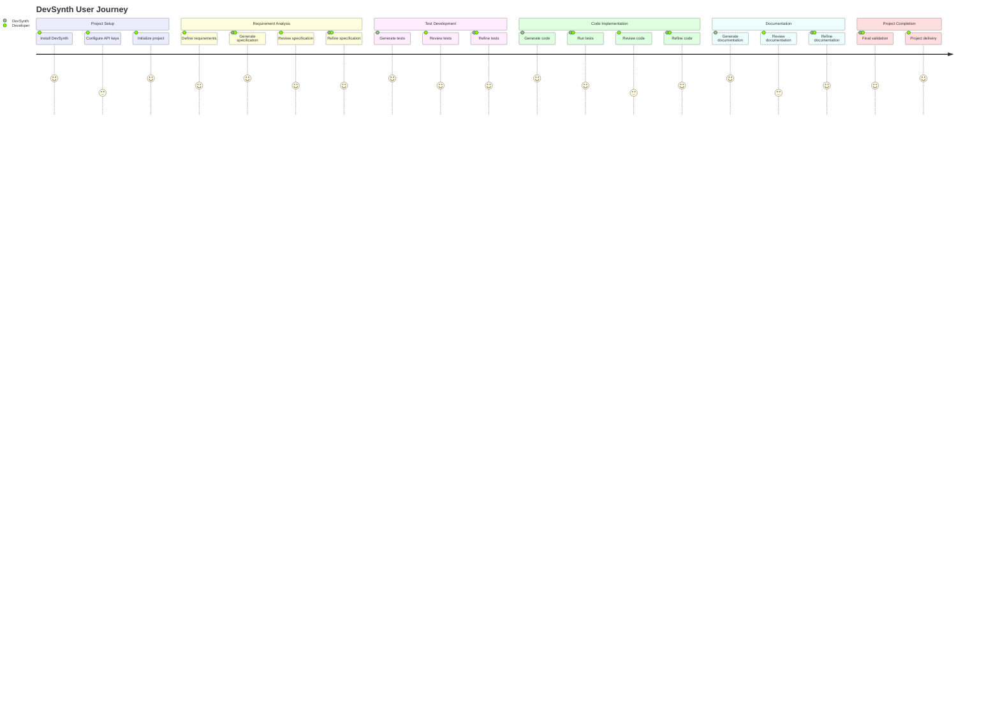

# DevSynth System Architecture and Design Diagrams

## Table of Contents
1. [Introduction](#introduction)
2. [Diagramming Languages and Notations](#diagramming-languages-and-notations)
3. [Architecture Pattern Recommendations](#architecture-pattern-recommendations)
4. [System Architecture Diagram](#system-architecture-diagram)
5. [Component Interaction Diagram](#component-interaction-diagram)
6. [Data Flow Diagram](#data-flow-diagram)
7. [Process Flow Diagram](#process-flow-diagram)
8. [State Diagram](#state-diagram)
9. [Sequence Diagrams](#sequence-diagrams)
10. [Class/Entity Diagram](#class-entity-diagram)
11. [User Journey Map](#user-journey-map)
12. [Conclusion](#conclusion)

## Introduction

This document provides a comprehensive set of diagrams to enhance and clarify the DevSynth system design. DevSynth is an AI-assisted software development tool that helps developers accelerate the software development lifecycle through features like code generation, testing, documentation, and project management via a CLI interface.

The diagrams in this document serve multiple purposes:
- Visualize the system architecture and component relationships
- Illustrate data and process flows within the system
- Document the behavior and interactions of the system
- Provide a clear understanding of the system's structure and functionality
- Support communication among stakeholders and development teams

Each diagram is accompanied by an explanation of its purpose, the insights it provides, and how it enhances understanding of the system.

## Diagramming Languages and Notations

After analyzing the DevSynth specifications, I've selected the following diagramming languages and notations for different aspects of the system:

### C4 Model
The C4 model (Context, Containers, Components, Code) is ideal for visualizing the system architecture at different levels of abstraction. It provides a hierarchical approach to system visualization that works well for DevSynth's layered architecture. I'll use C4 for:
- System context diagram
- Container diagram (high-level architecture)
- Component diagrams

### UML (Unified Modeling Language)
UML is a standardized modeling language that provides a comprehensive set of diagram types for software systems. For DevSynth, I'll use:
- Class diagrams for data models and entity relationships
- Sequence diagrams for interactions between components
- State diagrams for system state transitions
- Activity diagrams for workflows

### BPMN (Business Process Model and Notation)
BPMN is well-suited for modeling business processes and workflows. I'll use BPMN for:
- Process flow diagrams for key workflows in DevSynth

### Data Flow Diagrams (DFD)
DFDs are excellent for visualizing how data moves through the system. I'll use DFDs to show:
- Data flows between components
- Data transformations and storage

### Mermaid
Mermaid is a JavaScript-based diagramming tool that allows for creating diagrams using text-based definitions. It's particularly useful for:
- User journey maps
- Simple flowcharts
- Gantt charts for implementation roadmap

### PlantUML
PlantUML is a text-based diagramming tool that supports various UML diagrams. It's particularly useful for:
- Sequence diagrams
- Component diagrams
- Class diagrams
- State diagrams

The combination of these diagramming languages provides a comprehensive visualization of the DevSynth system from multiple perspectives, enhancing understanding of its structure, behavior, and interactions.

## Architecture Pattern Recommendations

Based on the analysis of the DevSynth specifications, I recommend the following architecture patterns:

### Primary Architecture Pattern: Hexagonal (Ports and Adapters)

The Hexagonal Architecture (also known as Ports and Adapters) is the most suitable primary architecture pattern for DevSynth for the following reasons:

1. **Clear Separation of Concerns**: The pattern separates the core business logic (domain) from external concerns like UI, databases, and external services (LLM APIs).

2. **Flexibility and Adaptability**: The pattern allows for easy swapping of adapters (e.g., different LLM providers, storage mechanisms) without affecting the core domain logic.

3. **Testability**: The pattern facilitates testing by allowing the core domain to be tested in isolation from external dependencies.

4. **Evolution Support**: As DevSynth evolves from MVP to full implementation, the hexagonal architecture provides a clear structure for adding new capabilities while maintaining the integrity of the core domain.

In the Hexagonal Architecture for DevSynth:
- **Core Domain**: Agent system, orchestration logic, and core business rules
- **Ports**: Interfaces for CLI, LLM services, file system operations, etc.
- **Adapters**: Implementations for specific LLM providers, CLI frameworks, storage mechanisms, etc.

### Supporting Architecture Patterns

#### Event-Driven Architecture
For the multi-agent collaboration and workflow orchestration aspects of DevSynth, an Event-Driven Architecture provides:

1. **Loose Coupling**: Agents can communicate without direct dependencies
2. **Scalability**: Easy to add new agents and capabilities
3. **Asynchronous Processing**: Long-running tasks can be handled efficiently
4. **Observability**: Event logs provide insights into system behavior

#### CQRS (Command Query Responsibility Segregation)
For handling the different operations in DevSynth (commands for actions, queries for information):

1. **Performance Optimization**: Different optimization strategies for commands and queries
2. **Scalability**: Commands and queries can be scaled independently
3. **Simplicity**: Clearer separation of concerns between actions and information retrieval

#### Clean Architecture
The principles of Clean Architecture align well with Hexagonal Architecture and provide additional guidance:

1. **Dependency Rule**: Dependencies point inward, with the domain at the center
2. **Use Cases**: Clearly defined use cases that encapsulate business rules
3. **Entities**: Core business objects independent of external concerns
4. **Frameworks as Details**: External frameworks and tools are treated as details

### Architecture Pattern Justification

The combination of Hexagonal Architecture as the primary pattern, supported by Event-Driven Architecture for agent collaboration and CQRS for operation handling, provides DevSynth with:

1. **Modularity**: Clear boundaries between components
2. **Extensibility**: Easy to add new features and capabilities
3. **Testability**: Components can be tested in isolation
4. **Flexibility**: Adapters can be swapped without affecting core logic
5. **Scalability**: System can grow to accommodate more agents and capabilities
6. **Maintainability**: Clear structure makes the system easier to understand and maintain

This architecture aligns well with the DevSynth vision of a modular, extensible system that can evolve over time while maintaining a clear separation of concerns and high testability.

## System Architecture Diagram

The following C4 Container diagram illustrates the high-level architecture of the DevSynth system:

```plantuml
@startuml DevSynth System Architecture
!include https://raw.githubusercontent.com/plantuml-stdlib/C4-PlantUML/master/C4_Container.puml

Person(developer, "Developer", "Software developer using DevSynth")

System_Boundary(devsynth, "DevSynth") {
    Container(cli, "CLI Interface Layer", "Python, Typer", "Provides command-line interface for user interaction")
    Container(orchestration, "Orchestration Layer", "Python, LangGraph", "Coordinates workflows and manages state")
    Container(agent_system, "Agent System", "Python", "Implements AI agents for various tasks")
    Container(memory, "Memory & Context System", "Python, ChromaDB, SQLite", "Manages context and persistent storage")
    Container(llm_backend, "LLM Backend Abstraction", "Python, LangChain", "Provides unified interface to LLM providers")
    
    Container(core_values, "Core Values Subsystem", "Python", "Enforces ethical principles and project values")
    Container(promise_system, "Promise System", "Python", "Defines and enforces agent capabilities")
}

System_Ext(llm_providers, "LLM Providers", "OpenAI API, Local Models, etc.")
System_Ext(file_system, "File System", "Project files, configuration, etc.")
System_Ext(dev_tools, "Development Tools", "Git, pytest, etc.")

Rel(developer, cli, "Uses", "CLI commands")
Rel(cli, orchestration, "Sends commands to")
Rel(orchestration, agent_system, "Coordinates")
Rel(orchestration, memory, "Reads/writes state")
Rel(agent_system, llm_backend, "Queries")
Rel(agent_system, core_values, "Guided by")
Rel(agent_system, promise_system, "Constrained by")
Rel(agent_system, memory, "Reads/writes context")
Rel(llm_backend, llm_providers, "Calls")
Rel(agent_system, file_system, "Reads/writes")
Rel(agent_system, dev_tools, "Integrates with")

@enduml
```

### Explanation

The System Architecture Diagram provides a high-level view of the DevSynth system and its major components. It illustrates:

1. **User Interaction**: The developer interacts with the system through the CLI Interface Layer.

2. **Layered Architecture**: The system follows a layered architecture with clear separation of concerns:
   - CLI Interface Layer handles user interaction
   - Orchestration Layer coordinates workflows and manages state
   - Agent System implements AI agents for various tasks
   - Memory & Context System manages persistent storage and context
   - LLM Backend Abstraction provides a unified interface to LLM providers

3. **Supporting Subsystems**:
   - Core Values Subsystem enforces ethical principles and project values
   - Promise System defines and enforces agent capabilities

4. **External Systems**:
   - LLM Providers (OpenAI API, Local Models, etc.)
   - File System for project files and configuration
   - Development Tools (Git, pytest, etc.)

5. **Component Relationships**: The diagram shows how components interact with each other, with the Orchestration Layer acting as the central coordinator.

This diagram enhances understanding of the system by providing a clear visual representation of its major components and their relationships, helping stakeholders understand the overall structure and boundaries of the system.

## Component Interaction Diagram

The following diagram illustrates the interactions between the major components of the DevSynth system:

```plantuml
@startuml DevSynth Component Interaction
!include https://raw.githubusercontent.com/plantuml-stdlib/C4-PlantUML/master/C4_Component.puml

Container_Boundary(cli, "CLI Interface Layer") {
    Component(command_parser, "Command Parser", "Typer", "Parses command-line arguments")
    Component(output_formatter, "Output Formatter", "Rich", "Formats output for display")
    Component(config_manager, "Configuration Manager", "Pydantic", "Manages configuration")
}

Container_Boundary(orchestration, "Orchestration Layer") {
    Component(workflow_engine, "Workflow Engine", "LangGraph", "Manages workflow execution")
    Component(state_manager, "State Manager", "Python", "Manages workflow state")
    Component(human_intervention, "Human Intervention Handler", "Python", "Manages human input")
}

Container_Boundary(agent_system, "Agent System") {
    Component(agent_registry, "Agent Registry", "Python", "Manages available agents")
    Component(wsde_organization, "WSDE Organization", "Python", "Implements peer-based collaboration")
    Component(primus_manager, "Primus Role Manager", "Python", "Manages coordinator role")
    Component(agent_comm, "Agent Communication Protocol", "Python", "Standardizes agent interactions")
    
    Component(planner_agent, "Planner Agent", "Python", "Creates development plans")
    Component(spec_agent, "Specification Agent", "Python", "Generates specifications")
    Component(test_agent, "Test Agent", "Python", "Creates tests")
    Component(code_agent, "Code Agent", "Python", "Implements code")
    Component(critic_agent, "Critic Agent", "Python", "Applies dialectical methods")
}

Container_Boundary(memory, "Memory & Context System") {
    Component(context_engine, "Context Engine", "Python", "Manages different types of context")
    Component(vector_store, "Vector Store", "ChromaDB", "Semantic search and retrieval")
    Component(structured_store, "Structured Store", "SQLite", "Relational data storage")
    Component(graph_store, "Graph Store", "NetworkX", "Relationship modeling")
}

Container_Boundary(llm_backend, "LLM Backend Abstraction") {
    Component(model_manager, "Model Manager", "Python", "Handles model selection")
    Component(provider_adapters, "Provider Adapters", "Python", "Interfaces with LLM providers")
    Component(token_counter, "Token Counter", "Python", "Tracks token usage")
    Component(response_parser, "Response Parser", "Python", "Standardizes output format")
}

Rel(command_parser, workflow_engine, "Initiates workflows")
Rel(workflow_engine, state_manager, "Updates state")
Rel(workflow_engine, agent_registry, "Dispatches tasks to")
Rel(workflow_engine, human_intervention, "Requests input from")
Rel(human_intervention, output_formatter, "Displays prompts via")
Rel(agent_registry, wsde_organization, "Organizes agents using")
Rel(wsde_organization, primus_manager, "Assigns Primus role via")
Rel(wsde_organization, agent_comm, "Communicates using")
Rel(primus_manager, planner_agent, "May assign as Primus")
Rel(primus_manager, spec_agent, "May assign as Primus")
Rel(primus_manager, test_agent, "May assign as Primus")
Rel(primus_manager, code_agent, "May assign as Primus")
Rel(primus_manager, critic_agent, "May assign as Primus")
Rel(planner_agent, context_engine, "Reads/writes context")
Rel(spec_agent, context_engine, "Reads/writes context")
Rel(test_agent, context_engine, "Reads/writes context")
Rel(code_agent, context_engine, "Reads/writes context")
Rel(critic_agent, context_engine, "Reads/writes context")
Rel(context_engine, vector_store, "Uses for semantic search")
Rel(context_engine, structured_store, "Uses for structured data")
Rel(context_engine, graph_store, "Uses for relationships")
Rel(planner_agent, model_manager, "Queries LLM via")
Rel(spec_agent, model_manager, "Queries LLM via")
Rel(test_agent, model_manager, "Queries LLM via")
Rel(code_agent, model_manager, "Queries LLM via")
Rel(critic_agent, model_manager, "Queries LLM via")
Rel(model_manager, provider_adapters, "Uses")
Rel(model_manager, token_counter, "Tracks usage with")
Rel(provider_adapters, response_parser, "Processes responses with")
Rel(output_formatter, command_parser, "Provides feedback to")

@enduml
```

### Explanation

The Component Interaction Diagram provides a detailed view of the internal components within each layer of the DevSynth system and how they interact with each other. It illustrates:

1. **CLI Interface Layer Components**:
   - Command Parser processes user commands
   - Output Formatter displays results to the user
   - Configuration Manager handles system configuration

2. **Orchestration Layer Components**:
   - Workflow Engine manages the execution of workflows
   - State Manager maintains workflow state
   - Human Intervention Handler manages points where human input is required

3. **Agent System Components**:
   - Agent Registry manages available agents
   - WSDE Organization implements peer-based collaboration
   - Primus Role Manager handles rotation of the coordinator role
   - Agent Communication Protocol standardizes agent interactions
   - Specialized agents for different tasks (Planner, Specification, Test, Code, Critic)

4. **Memory & Context System Components**:
   - Context Engine manages different types of context
   - Vector Store for semantic search and retrieval
   - Structured Store for relational data
   - Graph Store for relationship modeling

5. **LLM Backend Abstraction Components**:
   - Model Manager handles model selection and fallback
   - Provider Adapters interface with different LLM providers
   - Token Counter tracks token usage
   - Response Parser standardizes output format

6. **Component Interactions**:
   - The Workflow Engine coordinates the overall process
   - Agents communicate through the Agent Communication Protocol
   - All agents access context through the Context Engine
   - All agents query LLMs through the Model Manager

This diagram enhances understanding of the system by showing the detailed internal structure of each layer and how components interact across layers, providing insights into the system's internal workings and dependencies.

## Data Flow Diagram

The following Data Flow Diagram illustrates how data moves through the DevSynth system:



### Explanation

The Data Flow Diagram visualizes how data moves through the DevSynth system, from input to output. It illustrates:

1. **User Interaction Flow**:
   - The developer provides commands, configuration, and feedback through the CLI
   - Results are returned to the developer through the CLI

2. **Command Processing Flow**:
   - Commands are parsed by the CLI Interface
   - Parsed commands are sent to the Orchestration Layer
   - The Orchestration Layer assigns tasks to the Agent System

3. **Context and Memory Flow**:
   - The Context Engine serves as the central repository for system state
   - Different storage mechanisms (Vector Store, Structured Store, Graph Store) handle different types of data
   - Agents query and update context as needed

4. **Agent Processing Flow**:
   - Specialized agents handle different types of tasks
   - All agents interact with the LLM Backend for AI capabilities
   - Agents read from and write to the File System as needed

5. **External Data Flow**:
   - Configuration data is loaded from configuration files
   - LLM queries are sent to external LLM providers
   - File operations interact with the file system

This diagram enhances understanding of the system by showing how data flows between components, helping stakeholders understand the system's data processing and transformation capabilities. It highlights the central role of the Context Engine in maintaining system state and the Orchestration Layer in coordinating the overall process.

## Process Flow Diagram

The following BPMN-style diagram illustrates the key workflows in the DevSynth system:



### Explanation

The Process Flow Diagram illustrates the key workflows in the DevSynth system, from project initialization to completion. It shows:

1. **Project Initialization**: The process begins with initializing a new project with the proper structure and configuration.

2. **Requirement and Specification Phase**:
   - Define requirements based on user input
   - Generate specifications from requirements
   - Validate specifications with potential human review
   - Revise specifications if necessary

3. **Test Generation Phase**:
   - Generate tests based on specifications
   - Validate tests with potential human review
   - Revise tests if necessary

4. **Code Generation Phase**:
   - Generate code based on tests and specifications
   - Run tests to verify code functionality
   - Revise code if tests fail
   - Refactor code for improvement while maintaining functionality
   - Verify tests still pass after refactoring

5. **Documentation Phase**:
   - Generate documentation based on code and specifications
   - Validate documentation with potential human review
   - Revise documentation if necessary

6. **Final Review**: Conduct a final review of all artifacts before completion.

7. **Human Intervention Points**: The diagram highlights points where human intervention may be required, showing the collaborative nature of the system.

This diagram enhances understanding of the system by illustrating the sequential and iterative nature of the development process facilitated by DevSynth. It shows how the system implements test-driven development principles and where human oversight is integrated into the workflow.

## State Diagram

The following state diagram illustrates the possible states of a DevSynth project and the transitions between them:



### Explanation

The State Diagram illustrates the possible states of a DevSynth project and the transitions between them. It shows:

1. **Initial State**: The project begins in an uninitialized state and transitions to the Initialized state when the `init` command is executed.

2. **Requirements State**: The project transitions to the RequirementsGathered state when requirements are added, with a nested state for validation.

3. **Specification State**: The project transitions to the SpecificationGenerated state when specifications are generated, with nested states for review and revision in an iterative cycle.

4. **Tests State**: The project transitions to the TestsGenerated state when tests are generated, with nested states for review and revision in an iterative cycle.

5. **Code State**: The project transitions to the CodeGenerated state when code is generated, with nested states for testing, revision, and refactoring in an iterative cycle.

6. **Documentation State**: The project transitions to the DocumentationGenerated state when documentation is generated, with nested states for review and revision in an iterative cycle.

7. **Final State**: The project transitions to the ProjectComplete state when all artifacts are validated, and then to the final state.

This diagram enhances understanding of the system by showing the lifecycle of a DevSynth project and the possible state transitions. It illustrates the iterative nature of the development process, with review and revision cycles for each major artifact. This helps stakeholders understand the project workflow and the points where the project state changes.

## Sequence Diagrams

### Basic Workflow Sequence Diagram

The following sequence diagram illustrates the basic workflow for generating code from a specification:



### Multi-Agent Collaboration Sequence Diagram

The following sequence diagram illustrates the collaboration between multiple agents in a complex task:



### Explanation

The Sequence Diagrams illustrate the interactions between components and the flow of control during key operations in the DevSynth system:

1. **Basic Workflow Sequence Diagram**:
   - Shows the step-by-step process of generating code from a specification
   - Illustrates the sequential execution of commands (spec generate → test generate → code generate)
   - Highlights the role of different agents in the process
   - Shows interactions with the LLM Backend and File System

2. **Multi-Agent Collaboration Sequence Diagram**:
   - Illustrates the collaboration between multiple agents in a complex task
   - Shows the role of the Primus Agent in coordinating the process
   - Highlights the dialectical approach with the Critic Agent reviewing and suggesting improvements
   - Demonstrates the use of the Memory System for context sharing between agents

These diagrams enhance understanding of the system by showing the temporal sequence of operations and the interactions between components during key workflows. They provide insights into how the system handles both simple and complex tasks, and how agents collaborate to achieve the desired outcomes.

## Class/Entity Diagram

The following class diagram illustrates the key data models and their relationships in the DevSynth system:



### Explanation

The Class/Entity Diagram illustrates the key data models and their relationships in the DevSynth system. It is organized into several packages:

1. **Project Management**:
   - Project: The central entity representing a software project
   - Requirement: Represents a software requirement
   - UserStory: Represents a user story in agile methodology
   - Enumerations for requirement types, priorities, and statuses

2. **Testing**:
   - Test: The base class for all test types
   - BDDTest: Represents a behavior-driven test with scenarios
   - UnitTest: Represents a unit test with test cases
   - Supporting classes for scenarios and test cases
   - Enumerations for test types and statuses

3. **Agent System**:
   - Agent: Represents an AI agent with specific capabilities
   - Task: Represents a task assigned to an agent
   - Promise: Represents capabilities and constraints for agents
   - Enumerations for agent and task statuses

4. **Workflow Management**:
   - Workflow: Represents a sequence of steps to accomplish a task
   - WorkflowStep: Represents a single step in a workflow
   - Enumerations for workflow and step statuses

5. **Memory System**:
   - Context: Represents different types of context information
   - VectorEntry: Represents an entry in the vector store
   - GraphNode and GraphEdge: Represent nodes and edges in the graph store
   - Enumeration for context types

The diagram also shows the relationships between these entities:
- A Project contains many Requirements, UserStories, Tests, Workflows, and Contexts
- Requirements are traced to Tests
- UserStories are derived from Requirements
- Tests are specialized into BDDTests and UnitTests
- Workflows contain WorkflowSteps
- WorkflowSteps are assigned to Agents and create Tasks
- Agents execute Tasks and adhere to Promises
- Contexts contain VectorEntries, GraphNodes, and GraphEdges

This diagram enhances understanding of the system by providing a clear view of the data model and entity relationships, helping stakeholders understand the structure and organization of the system's data.

## User Journey Map

The following diagram illustrates the user journey when using DevSynth to develop a software project:



### Explanation

The User Journey Map illustrates the experience of a developer using DevSynth to develop a software project. It shows:

1. **Project Setup**:
   - Installing and configuring DevSynth
   - Initializing a new project

2. **Requirement Analysis**:
   - Defining requirements
   - Generating and refining specifications

3. **Test Development**:
   - Generating, reviewing, and refining tests

4. **Code Implementation**:
   - Generating, reviewing, and refining code
   - Running tests to verify functionality

5. **Documentation**:
   - Generating, reviewing, and refining documentation

6. **Project Completion**:
   - Final validation of all artifacts
   - Project delivery

The journey map also indicates:
- The satisfaction level at each step (1-5 scale)
- The actors involved at each step (Developer, DevSynth, or both)

This diagram enhances understanding of the system by providing a user-centered view of the development process facilitated by DevSynth. It helps stakeholders understand the user experience and the collaborative nature of the system, where the developer and DevSynth work together to create a software project.

## Conclusion

The diagrams presented in this document provide a comprehensive visualization of the DevSynth system from multiple perspectives. They enhance understanding of the system's architecture, components, data flows, processes, states, interactions, data models, and user experience.

Key insights from these diagrams include:

1. **Layered Architecture**: DevSynth follows a layered architecture with clear separation of concerns, making it modular and extensible.

2. **Agent-Based Design**: The system leverages specialized AI agents for different aspects of software development, coordinated through a structured workflow.

3. **Context-Driven**: The Memory and Context System plays a central role in maintaining state and providing relevant information to agents.

4. **Test-Driven Development**: The process flow emphasizes test-driven development principles, with tests generated before code.

5. **Human-AI Collaboration**: The system is designed for collaboration between human developers and AI agents, with clear points for human intervention and review.

6. **Extensible Data Model**: The class diagram shows a comprehensive and extensible data model that supports the system's functionality.

7. **User-Centered Design**: The user journey map illustrates how the system enhances the developer experience throughout the software development lifecycle.

The recommended Hexagonal Architecture pattern, supported by Event-Driven Architecture and CQRS, provides a solid foundation for the system's implementation, ensuring modularity, extensibility, and maintainability.

These diagrams serve as a valuable reference for stakeholders, developers, and users of the DevSynth system, providing a clear and comprehensive understanding of its design and functionality.
