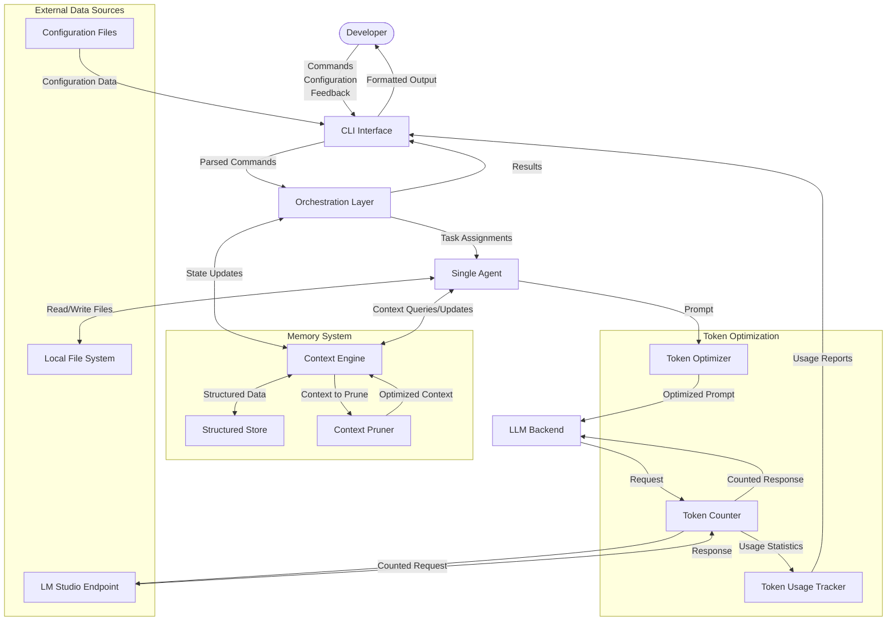
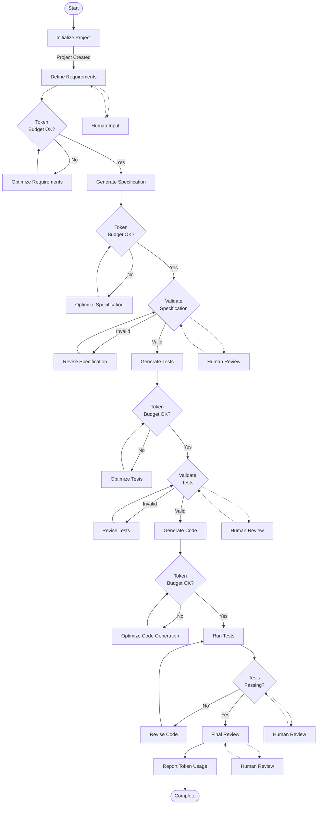
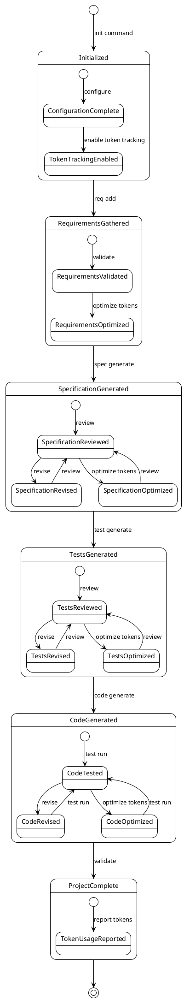
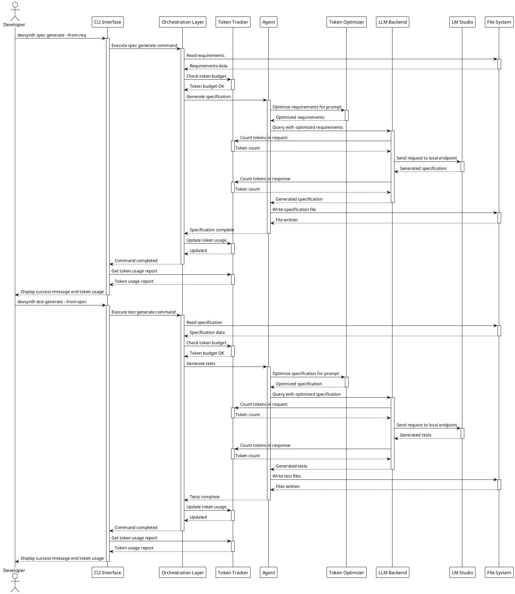
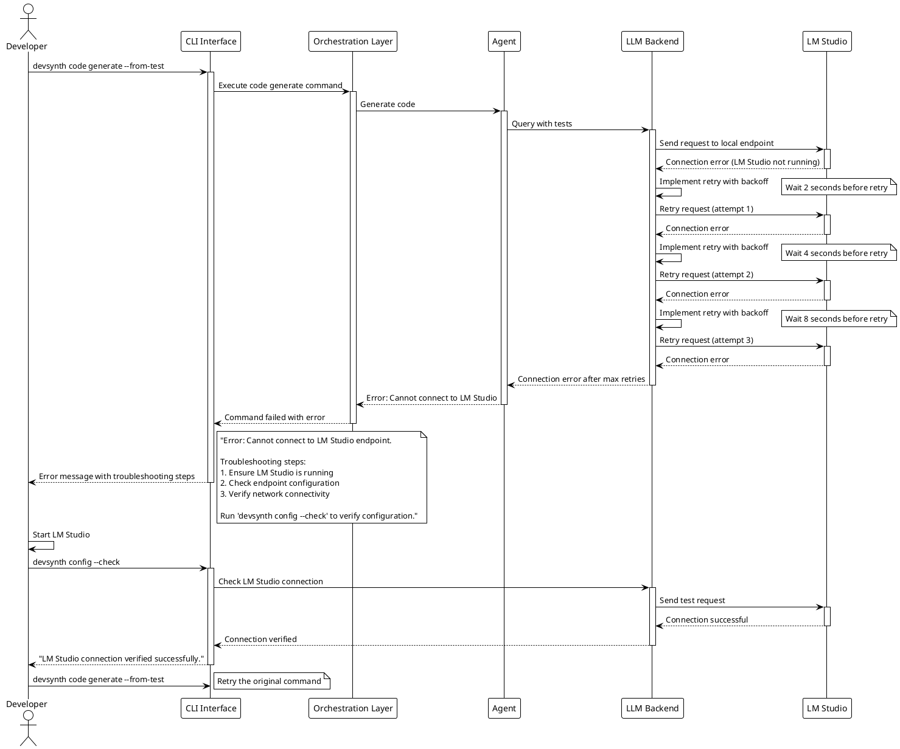
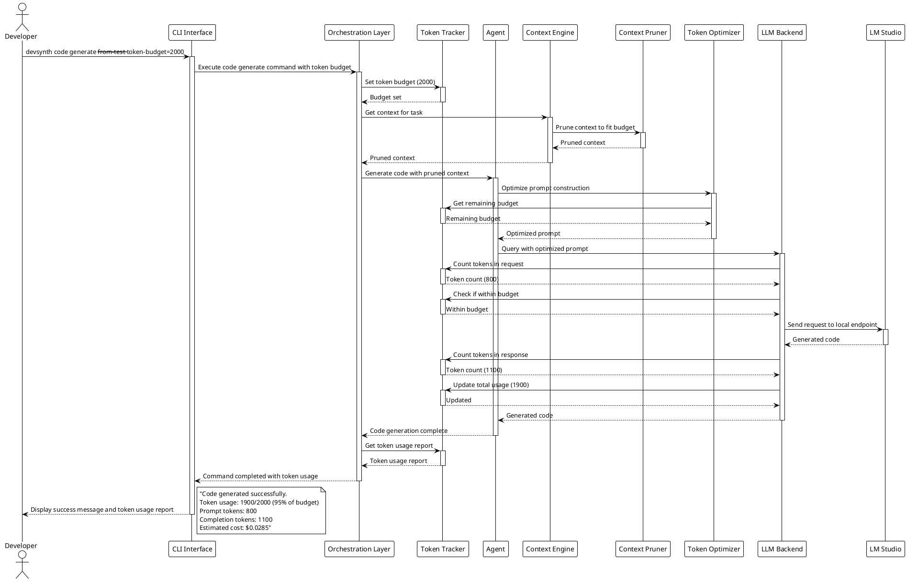
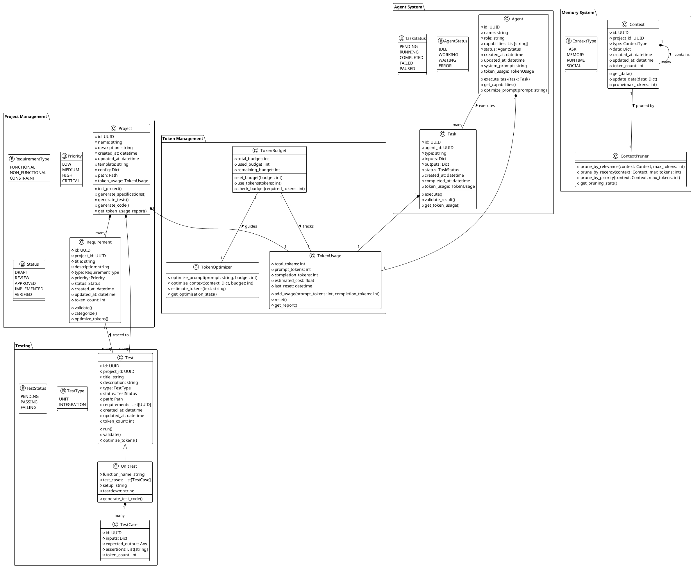
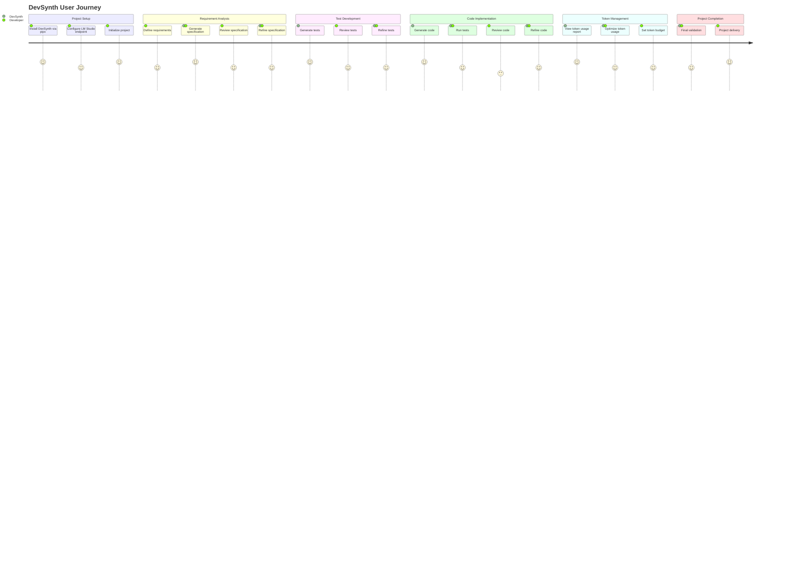
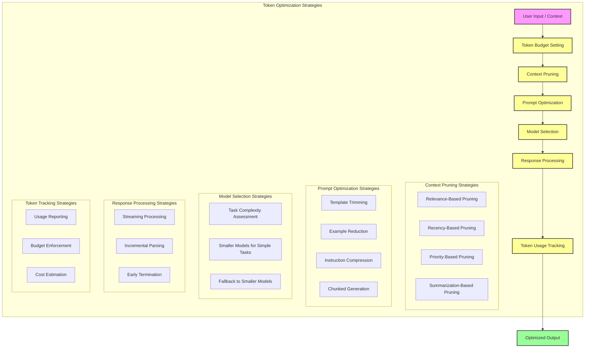

# DevSynth System Architecture and Design Diagrams

## Table of Contents
1. [Introduction](#introduction)
2. [Diagramming Languages and Notations](#diagramming-languages-and-notations)
3. [Architecture Pattern Recommendations](#architecture-pattern-recommendations)
4. [System Architecture Diagram](#system-architecture-diagram)
5. [Component Interaction Diagram](#component-interaction-diagram)
6. [Data Flow Diagram](#data-flow-diagram)
7. [Process Flow Diagram](#process-flow-diagram)
8. [State Diagram](#state-diagram)
9. [Sequence Diagrams](#sequence-diagrams)
10. [Class/Entity Diagram](#class-entity-diagram)
11. [User Journey Map](#user-journey-map)
12. [Token Optimization Diagram](#token-optimization-diagram)
13. [Deployment Architecture](#deployment-architecture)
14. [Security Boundaries](#security-boundaries)
15. [Conclusion](#conclusion)

## Introduction

This document provides a comprehensive set of diagrams to enhance and clarify the DevSynth system design. DevSynth is an AI-assisted software development tool that helps a single developer accelerate the software development lifecycle through features like code generation, testing, documentation, and project management via a CLI interface running on their local machine.

The diagrams in this document serve multiple purposes:
- Visualize the system architecture and component relationships
- Illustrate data and process flows within the system
- Document the behavior and interactions of the system
- Provide a clear understanding of the system's structure and functionality
- Support communication among stakeholders and development teams
- Clarify token optimization strategies and resource usage
- Define security boundaries and deployment architecture

Each diagram is accompanied by an explanation of its purpose, the insights it provides, and how it enhances understanding of the system.

## Diagramming Languages and Notations

After analyzing the DevSynth specifications, I've selected the following diagramming languages and notations for different aspects of the system:

### C4 Model
The C4 model (Context, Containers, Components, Code) is ideal for visualizing the system architecture at different levels of abstraction. It provides a hierarchical approach to system visualization that works well for DevSynth's layered architecture. I'll use C4 for:
- System context diagram
- Container diagram (high-level architecture)
- Component diagrams

### UML (Unified Modeling Language)
UML is a standardized modeling language that provides a comprehensive set of diagram types for software systems. For DevSynth, I'll use:
- Class diagrams for data models and entity relationships
- Sequence diagrams for interactions between components
- State diagrams for system state transitions
- Activity diagrams for workflows

### BPMN (Business Process Model and Notation)
BPMN is well-suited for modeling business processes and workflows. I'll use BPMN for:
- Process flow diagrams for key workflows in DevSynth

### Data Flow Diagrams (DFD)
DFDs are excellent for visualizing how data moves through the system. I'll use DFDs to show:
- Data flows between components
- Data transformations and storage
- Token optimization strategies

### Mermaid
Mermaid is a JavaScript-based diagramming tool that allows for creating diagrams using text-based definitions. It's particularly useful for:
- User journey maps
- Simple flowcharts
- Gantt charts for implementation roadmap

### PlantUML
PlantUML is a text-based diagramming tool that supports various UML diagrams. It's particularly useful for:
- Sequence diagrams
- Component diagrams
- Class diagrams
- State diagrams

The combination of these diagramming languages provides a comprehensive visualization of the DevSynth system from multiple perspectives, enhancing understanding of its structure, behavior, and interactions.

## Architecture Pattern Recommendations

Based on the analysis of the DevSynth specifications and the user's clarifications, I recommend the following architecture patterns:

### Primary Architecture Pattern: Hexagonal (Ports and Adapters)

The Hexagonal Architecture (also known as Ports and Adapters) is the most suitable primary architecture pattern for DevSynth for the following reasons:

1. **Clear Separation of Concerns**: The pattern separates the core business logic (domain) from external concerns like UI, databases, and external services (LLM APIs).

2. **Flexibility and Adaptability**: The pattern allows for easy swapping of adapters (e.g., different LLM providers, storage mechanisms) without affecting the core domain logic.

3. **Testability**: The pattern facilitates testing by allowing the core domain to be tested in isolation from external dependencies.

4. **Evolution Support**: As DevSynth evolves from MVP to full implementation, the hexagonal architecture provides a clear structure for adding new capabilities while maintaining the integrity of the core domain.

5. **Local-First Design**: The pattern supports the local-first approach, where all operations run on the developer's machine, with clear boundaries for external services.

In the Hexagonal Architecture for DevSynth:
- **Core Domain**: Agent system, orchestration logic, and core business rules
- **Ports**: Interfaces for CLI, LLM services, file system operations, etc.
- **Adapters**: Implementations for LM Studio endpoint, CLI frameworks, storage mechanisms, etc.

### Supporting Architecture Patterns

#### Event-Driven Architecture
For the workflow orchestration aspects of DevSynth, an Event-Driven Architecture provides:

1. **Loose Coupling**: Components can communicate without direct dependencies
2. **Scalability**: Easy to add new capabilities
3. **Asynchronous Processing**: Long-running tasks can be handled efficiently
4. **Observability**: Event logs provide insights into system behavior

#### CQRS (Command Query Responsibility Segregation)
For handling the different operations in DevSynth (commands for actions, queries for information):

1. **Performance Optimization**: Different optimization strategies for commands and queries
2. **Scalability**: Commands and queries can be scaled independently
3. **Simplicity**: Clearer separation of concerns between actions and information retrieval

#### Clean Architecture
The principles of Clean Architecture align well with Hexagonal Architecture and provide additional guidance:

1. **Dependency Rule**: Dependencies point inward, with the domain at the center
2. **Use Cases**: Clearly defined use cases that encapsulate business rules
3. **Entities**: Core business objects independent of external concerns
4. **Frameworks as Details**: External frameworks and tools are treated as details

### Architecture Pattern Justification

The combination of Hexagonal Architecture as the primary pattern, supported by Event-Driven Architecture for workflow orchestration and CQRS for operation handling, provides DevSynth with:

1. **Modularity**: Clear boundaries between components
2. **Extensibility**: Easy to add new features and capabilities
3. **Testability**: Components can be tested in isolation
4. **Flexibility**: Adapters can be swapped without affecting core logic
5. **Maintainability**: Clear structure makes the system easier to understand and maintain
6. **Resource Efficiency**: Components can be optimized individually for minimal resource usage
7. **Local-First**: All operations can run efficiently on the developer's local machine

This architecture aligns well with the DevSynth vision of a modular, extensible system that can evolve over time while maintaining a clear separation of concerns and high testability, all while running efficiently on a single developer's machine.

## System Architecture Diagram

The following C4 Container diagram illustrates the high-level architecture of the DevSynth system:

```plantuml
@startuml DevSynth System Architecture
!include https://raw.githubusercontent.com/plantuml-stdlib/C4-PlantUML/master/C4_Container.puml

Person(developer, "Developer", "Software developer using DevSynth on their local machine")

System_Boundary(devsynth, "DevSynth") {
    Container(cli, "CLI Interface Layer", "Python, Typer", "Provides command-line interface for user interaction")
    Container(orchestration, "Orchestration Layer", "Python", "Coordinates workflows and manages state")
    Container(agent_system, "Agent System", "Python", "Implements single AI agent for various tasks")
    Container(memory, "Memory & Context System", "Python, SQLite", "Manages context and persistent storage")
    Container(llm_backend, "LLM Backend Abstraction", "Python, Requests", "Provides unified interface to LLM providers")
    
    Container(core_values, "Core Values Subsystem", "Python", "Enforces ethical principles and project values")
}

System_Ext(lm_studio, "LM Studio", "Local LLM provider running on developer's machine")
System_Ext(file_system, "File System", "Project files, configuration, etc. on developer's machine")
System_Ext(dev_tools, "Development Tools", "Git, pytest, etc. on developer's machine")

Rel(developer, cli, "Uses", "CLI commands")
Rel(cli, orchestration, "Sends commands to")
Rel(orchestration, agent_system, "Coordinates")
Rel(orchestration, memory, "Reads/writes state")
Rel(agent_system, llm_backend, "Queries")
Rel(agent_system, core_values, "Guided by")
Rel(agent_system, memory, "Reads/writes context")
Rel(llm_backend, lm_studio, "Calls")
Rel(agent_system, file_system, "Reads/writes")
Rel(agent_system, dev_tools, "Integrates with")

@enduml
```

### Explanation

The System Architecture Diagram provides a high-level view of the DevSynth system and its major components. It illustrates:

1. **User Interaction**: The developer interacts with the system through the CLI Interface Layer on their local machine.

2. **Layered Architecture**: The system follows a layered architecture with clear separation of concerns:
   - CLI Interface Layer handles user interaction
   - Orchestration Layer coordinates workflows and manages state
   - Agent System implements a single AI agent for various tasks
   - Memory & Context System manages persistent storage and context
   - LLM Backend Abstraction provides a unified interface to LM Studio

3. **Supporting Subsystems**:
   - Core Values Subsystem enforces ethical principles and project values

4. **External Systems**:
   - LM Studio running locally on the developer's machine
   - File System for project files and configuration on the developer's machine
   - Development Tools (Git, pytest, etc.) on the developer's machine

5. **Component Relationships**: The diagram shows how components interact with each other, with the Orchestration Layer acting as the central coordinator.

6. **Local-First Design**: All components and external systems operate on the developer's local machine, with no external dependencies required.

This diagram enhances understanding of the system by providing a clear visual representation of its major components and their relationships, helping stakeholders understand the overall structure and boundaries of the system.

## Component Interaction Diagram

The following diagram illustrates the interactions between the major components of the DevSynth system:

```plantuml
@startuml DevSynth Component Interaction
!include https://raw.githubusercontent.com/plantuml-stdlib/C4-PlantUML/master/C4_Component.puml

Container_Boundary(cli, "CLI Interface Layer") {
    Component(command_parser, "Command Parser", "Typer", "Parses command-line arguments")
    Component(output_formatter, "Output Formatter", "Rich", "Formats output for display")
    Component(config_manager, "Configuration Manager", "Pydantic", "Manages configuration")
    Component(token_reporter, "Token Usage Reporter", "Python", "Reports token usage statistics")
}

Container_Boundary(orchestration, "Orchestration Layer") {
    Component(workflow_engine, "Workflow Engine", "Python", "Manages workflow execution")
    Component(state_manager, "State Manager", "Python", "Manages workflow state")
    Component(human_intervention, "Human Intervention Handler", "Python", "Manages human input")
    Component(token_tracker, "Token Usage Tracker", "Python", "Tracks token usage across operations")
}

Container_Boundary(agent_system, "Agent System") {
    Component(agent, "Single Agent", "Python", "Executes all AI tasks")
    Component(prompt_manager, "Prompt Manager", "Python", "Manages prompt templates and construction")
    Component(token_optimizer, "Token Optimizer", "Python", "Optimizes prompts for token efficiency")
    Component(result_parser, "Result Parser", "Python", "Parses and validates LLM responses")
}

Container_Boundary(memory, "Memory & Context System") {
    Component(context_engine, "Context Engine", "Python", "Manages different types of context")
    Component(structured_store, "Structured Store", "SQLite", "Relational data storage")
    Component(context_pruner, "Context Pruner", "Python", "Prunes context to optimize token usage")
}

Container_Boundary(llm_backend, "LLM Backend Abstraction") {
    Component(model_manager, "Model Manager", "Python", "Handles model selection")
    Component(lm_studio_adapter, "LM Studio Adapter", "Python", "Interfaces with LM Studio")
    Component(token_counter, "Token Counter", "tiktoken", "Tracks token usage")
    Component(response_parser, "Response Parser", "Python", "Standardizes output format")
}

Rel(command_parser, workflow_engine, "Initiates workflows")
Rel(workflow_engine, state_manager, "Updates state")
Rel(workflow_engine, agent, "Dispatches tasks to")
Rel(workflow_engine, human_intervention, "Requests input from")
Rel(human_intervention, output_formatter, "Displays prompts via")
Rel(agent, prompt_manager, "Uses templates from")
Rel(prompt_manager, token_optimizer, "Optimizes prompts with")
Rel(agent, result_parser, "Processes results with")
Rel(agent, context_engine, "Reads/writes context")
Rel(context_engine, structured_store, "Uses for structured data")
Rel(context_engine, context_pruner, "Optimizes context with")
Rel(agent, model_manager, "Queries LLM via")
Rel(model_manager, lm_studio_adapter, "Uses")
Rel(model_manager, token_counter, "Tracks usage with")
Rel(lm_studio_adapter, response_parser, "Processes responses with")
Rel(token_counter, token_tracker, "Reports usage to")
Rel(token_tracker, token_reporter, "Provides statistics to")
Rel(output_formatter, command_parser, "Provides feedback to")

@enduml
```

### Explanation

The Component Interaction Diagram provides a detailed view of the internal components within each layer of the DevSynth system and how they interact with each other. It illustrates:

1. **CLI Interface Layer Components**:
   - Command Parser processes user commands
   - Output Formatter displays results to the user
   - Configuration Manager handles system configuration
   - Token Usage Reporter provides token usage statistics to the user

2. **Orchestration Layer Components**:
   - Workflow Engine manages the execution of workflows
   - State Manager maintains workflow state
   - Human Intervention Handler manages points where human input is required
   - Token Usage Tracker aggregates token usage across operations

3. **Agent System Components**:
   - Single Agent executes all AI tasks
   - Prompt Manager handles prompt templates and construction
   - Token Optimizer optimizes prompts for token efficiency
   - Result Parser processes and validates LLM responses

4. **Memory & Context System Components**:
   - Context Engine manages different types of context
   - Structured Store for relational data
   - Context Pruner optimizes context to reduce token usage

5. **LLM Backend Abstraction Components**:
   - Model Manager handles model selection and fallback
   - LM Studio Adapter interfaces with the local LM Studio endpoint
   - Token Counter tracks token usage
   - Response Parser standardizes output format

6. **Component Interactions**:
   - The Workflow Engine coordinates the overall process
   - The Agent uses the Prompt Manager and Token Optimizer for efficient prompts
   - All components contribute to token usage tracking
   - Context pruning optimizes token usage in memory operations

This diagram enhances understanding of the system by showing the detailed internal structure of each layer and how components interact across layers, providing insights into the system's internal workings and dependencies. It also highlights the token optimization and tracking components that ensure efficient resource usage.

## Data Flow Diagram

The following Data Flow Diagram illustrates how data moves through the DevSynth system:



### Explanation

The Data Flow Diagram visualizes how data moves through the DevSynth system, from input to output. It illustrates:

1. **User Interaction Flow**:
   - The developer provides commands, configuration, and feedback through the CLI
   - Results are returned to the developer through the CLI

2. **Command Processing Flow**:
   - Commands are parsed by the CLI Interface
   - Parsed commands are sent to the Orchestration Layer
   - The Orchestration Layer assigns tasks to the Agent

3. **Context and Memory Flow**:
   - The Context Engine serves as the central repository for system state
   - The Structured Store handles persistent data
   - The Context Pruner optimizes context to reduce token usage

4. **Token Optimization Flow**:
   - The Token Optimizer processes prompts to reduce token usage
   - The Token Counter tracks tokens for all LLM interactions
   - The Token Tracker aggregates usage statistics
   - Token usage reports are provided to the user

5. **LLM Interaction Flow**:
   - Optimized prompts are sent to the LLM Backend
   - The LLM Backend communicates with the local LM Studio endpoint
   - Responses are processed and returned to the Agent

6. **External Data Flow**:
   - Configuration data is loaded from local configuration files
   - LLM queries are sent to the local LM Studio endpoint
   - File operations interact with the local file system

This diagram enhances understanding of the system by showing how data flows between components, helping stakeholders understand the system's data processing and transformation capabilities. It highlights the central role of the Context Engine in maintaining system state, the Orchestration Layer in coordinating the overall process, and the token optimization components in ensuring efficient resource usage.

## Process Flow Diagram

The following BPMN-style diagram illustrates the key workflows in the DevSynth system:



### Explanation

The Process Flow Diagram illustrates the key workflows in the DevSynth system, from project initialization to completion. It shows:

1. **Project Initialization**: The process begins with initializing a new project with the proper structure and configuration.

2. **Requirement and Specification Phase**:
   - Define requirements based on user input
   - Check token budget and optimize if necessary
   - Generate specifications from requirements
   - Check token budget and optimize if necessary
   - Validate specifications with potential human review
   - Revise specifications if necessary

3. **Test Generation Phase**:
   - Generate tests based on specifications
   - Check token budget and optimize if necessary
   - Validate tests with potential human review
   - Revise tests if necessary

4. **Code Generation Phase**:
   - Generate code based on tests and specifications
   - Check token budget and optimize if necessary
   - Run tests to verify code functionality
   - Revise code if tests fail

5. **Final Review and Reporting**:
   - Conduct a final review of all artifacts
   - Report token usage statistics
   - Complete the workflow

6. **Token Budget Checks**: The diagram highlights points where token budget is checked and optimization is performed if necessary, ensuring efficient resource usage.

7. **Human Intervention Points**: The diagram highlights points where human intervention may be required, showing the collaborative nature of the system.

This diagram enhances understanding of the system by illustrating the sequential and iterative nature of the development process facilitated by DevSynth. It shows how the system implements test-driven development principles, where human oversight is integrated into the workflow, and how token optimization is performed throughout the process.

## State Diagram

The following state diagram illustrates the possible states of a DevSynth project and the transitions between them:



### Explanation

The State Diagram illustrates the possible states of a DevSynth project and the transitions between them. It shows:

1. **Initial State**: The project begins in an uninitialized state and transitions to the Initialized state when the `init` command is executed.

2. **Configuration State**: The project transitions to the ConfigurationComplete state when configuration is complete, with an additional state for token tracking.

3. **Requirements State**: The project transitions to the RequirementsGathered state when requirements are added, with nested states for validation and token optimization.

4. **Specification State**: The project transitions to the SpecificationGenerated state when specifications are generated, with nested states for review, revision, and token optimization in an iterative cycle.

5. **Tests State**: The project transitions to the TestsGenerated state when tests are generated, with nested states for review, revision, and token optimization in an iterative cycle.

6. **Code State**: The project transitions to the CodeGenerated state when code is generated, with nested states for testing, revision, and token optimization in an iterative cycle.

7. **Final State**: The project transitions to the ProjectComplete state when all artifacts are validated, with a nested state for token usage reporting, and then to the final state.

8. **Token Optimization States**: The diagram includes states for token optimization at each major phase, highlighting the importance of token efficiency throughout the process.

This diagram enhances understanding of the system by showing the lifecycle of a DevSynth project and the possible state transitions. It illustrates the iterative nature of the development process, with review, revision, and token optimization cycles for each major artifact. This helps stakeholders understand the project workflow and the points where the project state changes.

## Sequence Diagrams

### Basic Workflow Sequence Diagram

The following sequence diagram illustrates the basic workflow for generating code from a specification:



### Error Handling Sequence Diagram

The following sequence diagram illustrates error handling in DevSynth, particularly for LM Studio connection issues:



### Token Optimization Sequence Diagram

The following sequence diagram illustrates the token optimization process in DevSynth:



### Explanation

The Sequence Diagrams illustrate the interactions between components and the flow of control during key operations in the DevSynth system:

1. **Basic Workflow Sequence Diagram**:
   - Shows the step-by-step process of generating code from a specification
   - Illustrates the sequential execution of commands (spec generate → test generate)
   - Highlights the role of the Agent in the process
   - Shows interactions with the LLM Backend and File System
   - Includes token tracking and optimization throughout the process

2. **Error Handling Sequence Diagram**:
   - Illustrates how the system handles LM Studio connection errors
   - Shows the retry mechanism with exponential backoff
   - Demonstrates clear error messaging with troubleshooting steps
   - Includes a configuration check command for verification
   - Provides a complete error recovery workflow

3. **Token Optimization Sequence Diagram**:
   - Shows how token budgets are set and enforced
   - Illustrates context pruning to reduce token usage
   - Demonstrates prompt optimization for token efficiency
   - Includes token counting for both requests and responses
   - Shows detailed token usage reporting to the user

These diagrams enhance understanding of the system by showing the temporal sequence of operations and the interactions between components during key workflows. They provide insights into how the system handles both normal operations and error conditions, and how token optimization is implemented throughout the process.

## Class/Entity Diagram

The following class diagram illustrates the key data models and their relationships in the DevSynth system:



### Explanation

The Class/Entity Diagram illustrates the key data models and their relationships in the DevSynth system. It is organized into several packages:

1. **Project Management**:
   - Project: The central entity representing a software project, now including token usage tracking
   - Requirement: Represents a software requirement, with token count for optimization
   - Enumerations for requirement types, priorities, and statuses

2. **Testing**:
   - Test: The base class for all test types, with token count for optimization
   - UnitTest: Represents a unit test with test cases
   - TestCase: Represents a single test case, with token count for optimization
   - Enumerations for test types and statuses

3. **Agent System**:
   - Agent: Represents the single AI agent, with token usage tracking
   - Task: Represents a task assigned to the agent, with token usage tracking
   - Enumerations for agent and task statuses

4. **Token Management**:
   - TokenUsage: Tracks token usage statistics
   - TokenOptimizer: Optimizes prompts and context for token efficiency
   - TokenBudget: Manages token budgets for operations

5. **Memory System**:
   - Context: Represents different types of context information, with token count for optimization
   - ContextPruner: Optimizes context to reduce token usage
   - Enumeration for context types

The diagram also shows the relationships between these entities:
- A Project contains many Requirements and Tests, and has a TokenUsage
- Requirements are traced to Tests
- Tests are specialized into UnitTests
- UnitTests contain TestCases
- The Agent executes Tasks and has a TokenUsage
- Tasks have a TokenUsage
- Context can contain other Context objects and is pruned by a ContextPruner
- TokenBudget tracks TokenUsage and guides TokenOptimizer

This diagram enhances understanding of the system by providing a clear view of the data model and entity relationships, helping stakeholders understand the structure and organization of the system's data. It also highlights the token management and optimization aspects of the system.

## User Journey Map

The following diagram illustrates the user journey when using DevSynth to develop a software project:



### Explanation

The User Journey Map illustrates the experience of a developer using DevSynth to develop a software project. It shows:

1. **Project Setup**:
   - Installing DevSynth via pipx
   - Configuring the local LM Studio endpoint
   - Initializing a new project

2. **Requirement Analysis**:
   - Defining requirements
   - Generating and refining specifications

3. **Test Development**:
   - Generating, reviewing, and refining tests

4. **Code Implementation**:
   - Generating, reviewing, and refining code
   - Running tests to verify functionality

5. **Token Management**:
   - Viewing token usage reports
   - Optimizing token usage
   - Setting token budgets for operations

6. **Project Completion**:
   - Final validation of all artifacts
   - Project delivery

The journey map also indicates:
- The satisfaction level at each step (1-5 scale)
- The actors involved at each step (Developer, DevSynth, or both)

This diagram enhances understanding of the system by providing a user-centered view of the development process facilitated by DevSynth. It helps stakeholders understand the user experience and the collaborative nature of the system, where the developer and DevSynth work together to create a software project. It also highlights the token management aspects of the system, which are important for efficient resource usage.

## Token Optimization Diagram

The following diagram illustrates the token optimization strategies implemented in DevSynth:



### Explanation

The Token Optimization Diagram illustrates the various strategies implemented in DevSynth to optimize token usage and manage costs. It shows:

1. **Token Budget Setting**: The process begins with setting a token budget for the operation, either automatically or based on user input.

2. **Context Pruning Strategies**:
   - Relevance-Based Pruning: Keeping only the most relevant context for the current task
   - Recency-Based Pruning: Prioritizing recent context over older context
   - Priority-Based Pruning: Keeping high-priority context items
   - Summarization-Based Pruning: Summarizing verbose context to reduce token count

3. **Prompt Optimization Strategies**:
   - Template Trimming: Removing unnecessary parts of prompt templates
   - Example Reduction: Limiting the number of examples in prompts
   - Instruction Compression: Making instructions more concise
   - Chunked Generation: Breaking large prompts into smaller chunks

4. **Model Selection Strategies**:
   - Task Complexity Assessment: Evaluating the complexity of the task
   - Smaller Models for Simple Tasks: Using smaller models for simpler tasks
   - Fallback to Smaller Models: Falling back to smaller models when token budget is limited

5. **Response Processing Strategies**:
   - Streaming Processing: Processing responses as they are generated
   - Incremental Parsing: Parsing responses incrementally to save memory
   - Early Termination: Stopping generation when sufficient information is obtained

6. **Token Tracking Strategies**:
   - Usage Reporting: Tracking and reporting token usage
   - Budget Enforcement: Ensuring operations stay within token budget
   - Cost Estimation: Estimating the cost of operations

This diagram enhances understanding of the system by illustrating the comprehensive approach to token optimization implemented in DevSynth. It shows how token usage is optimized at every stage of the process, from context management to prompt construction to model selection to response processing. This helps stakeholders understand the system's approach to efficient resource usage and cost management.

## Deployment Architecture

The following diagram illustrates the deployment architecture of DevSynth:

```plantuml
@startuml DevSynth Deployment Architecture
!include https://raw.githubusercontent.com/plantuml-stdlib/C4-PlantUML/master/C4_Deployment.puml

Deployment_Node(developer_machine, "Developer's Local Machine", "Windows/macOS/Linux") {
    Deployment_Node(python_env, "Python Environment", "Python 3.8+") {
        Container(devsynth_cli, "DevSynth CLI", "Python, Typer", "Command-line interface for DevSynth")
        Container(devsynth_core, "DevSynth Core", "Python", "Core functionality of DevSynth")
        Container(devsynth_agents, "DevSynth Agent", "Python", "Single agent implementation")
        Container(devsynth_memory, "DevSynth Memory", "Python, SQLite", "Memory and context management")
    }
    
    Deployment_Node(lm_studio, "LM Studio", "Local LLM Provider") {
        Container(lm_studio_api, "LM Studio API", "REST API", "Local API endpoint for LLM access")
        Container(lm_studio_models, "LLM Models", "GGUF Format", "Local language models")
    }
    
    Deployment_Node(file_system, "Local File System", "OS File System") {
        Container(project_files, "Project Files", "Python, etc.", "Source code and project files")
        Container(devsynth_data, "DevSynth Data", "JSON, SQLite", "Configuration and context data")
    }
    
    Deployment_Node(dev_tools, "Development Tools", "Local Tools") {
        Container(git, "Git", "Version Control", "Source code version control")
        Container(pytest, "pytest", "Testing Framework", "Test execution and reporting")
    }
}

Rel(devsynth_cli, devsynth_core, "Uses")
Rel(devsynth_core, devsynth_agents, "Coordinates")
Rel(devsynth_core, devsynth_memory, "Manages context with")
Rel(devsynth_agents, lm_studio_api, "Queries")
Rel(lm_studio_api, lm_studio_models, "Uses")
Rel(devsynth_memory, devsynth_data, "Stores data in")
Rel(devsynth_agents, project_files, "Reads/writes")
Rel(devsynth_core, git, "Integrates with")
Rel(devsynth_core, pytest, "Executes tests with")

@enduml
```

### Explanation

The Deployment Architecture Diagram illustrates how DevSynth is deployed on a developer's local machine. It shows:

1. **Developer's Local Machine**: All components run on the developer's local machine, with no external dependencies.

2. **Python Environment**:
   - DevSynth CLI: The command-line interface for user interaction
   - DevSynth Core: The core functionality of the system
   - DevSynth Agent: The single agent implementation
   - DevSynth Memory: The memory and context management system

3. **LM Studio**:
   - LM Studio API: The local API endpoint for LLM access
   - LLM Models: The local language models in GGUF format

4. **Local File System**:
   - Project Files: Source code and project files
   - DevSynth Data: Configuration and context data

5. **Development Tools**:
   - Git: Source code version control
   - pytest: Test execution and reporting

6. **Component Relationships**:
   - DevSynth CLI uses DevSynth Core
   - DevSynth Core coordinates DevSynth Agent and manages context with DevSynth Memory
   - DevSynth Agent queries LM Studio API, which uses LLM Models
   - DevSynth Memory stores data in DevSynth Data
   - DevSynth Agent reads/writes Project Files
   - DevSynth Core integrates with Git and executes tests with pytest

This diagram enhances understanding of the system by showing how DevSynth is deployed on a developer's local machine, with all components running locally. It illustrates the local-first approach of the system, with no external dependencies required. This helps stakeholders understand the deployment architecture and the relationships between the various components.

## Security Boundaries

The following diagram illustrates the security boundaries of DevSynth:

```plantuml
@startuml DevSynth Security Boundaries
!include https://raw.githubusercontent.com/plantuml-stdlib/C4-PlantUML/master/C4_Container.puml

Person(developer, "Developer", "Software developer using DevSynth")

Boundary(local_machine, "Developer's Local Machine") {
    System_Boundary(devsynth, "DevSynth") {
        Container(cli, "CLI Interface Layer", "Python, Typer", "Provides command-line interface for user interaction")
        Container(orchestration, "Orchestration Layer", "Python", "Coordinates workflows and manages state")
        Container(agent_system, "Agent System", "Python", "Implements single AI agent for various tasks")
        Container(memory, "Memory & Context System", "Python, SQLite", "Manages context and persistent storage")
        Container(llm_backend, "LLM Backend Abstraction", "Python, Requests", "Provides unified interface to LLM providers")
        
        Container(core_values, "Core Values Subsystem", "Python", "Enforces ethical principles and project values")
    }
    
    System_Ext(lm_studio, "LM Studio", "Local LLM provider running on developer's machine")
    System_Ext(file_system, "File System", "Project files, configuration, etc. on developer's machine")
    System_Ext(dev_tools, "Development Tools", "Git, pytest, etc. on developer's machine")
}

Boundary(external, "External Environment") {
    System_Ext(external_resources, "External Resources", "Documentation, references, etc.")
}

Rel(developer, cli, "Uses", "CLI commands")
Rel(cli, orchestration, "Sends commands to")
Rel(orchestration, agent_system, "Coordinates")
Rel(orchestration, memory, "Reads/writes state")
Rel(agent_system, llm_backend, "Queries")
Rel(agent_system, core_values, "Guided by")
Rel(agent_system, memory, "Reads/writes context")
Rel(llm_backend, lm_studio, "Calls")
Rel(agent_system, file_system, "Reads/writes")
Rel(agent_system, dev_tools, "Integrates with")

Rel(external_resources, developer, "References", "Documentation, examples, etc.")

@enduml
```

### Explanation

The Security Boundaries Diagram illustrates the security boundaries of the DevSynth system. It shows:

1. **Developer's Local Machine Boundary**: All components of DevSynth operate within the boundary of the developer's local machine, providing inherent security through isolation.

2. **DevSynth System Boundary**: The DevSynth system itself has a clear boundary, with well-defined interfaces to external systems.

3. **External Environment Boundary**: The only external boundary is for documentation and references, which the developer may access but which do not directly interact with the DevSynth system.

4. **Component Relationships**:
   - All interactions between DevSynth components occur within the system boundary
   - Interactions with LM Studio, the file system, and development tools occur within the local machine boundary
   - The only interaction across the external boundary is the developer referencing external resources

5. **Security Implications**:
   - No sensitive data leaves the developer's machine
   - No external API keys or credentials are required
   - All processing occurs locally, minimizing attack surface
   - The system is isolated from external threats
   - Security concerns are appropriate for a single-developer PoC

This diagram enhances understanding of the system by clearly illustrating the security boundaries of DevSynth. It shows that all components operate within the developer's local machine, with no external dependencies or data transmission. This helps stakeholders understand the security model of the system and the minimal attack surface it presents.

## Conclusion

The diagrams presented in this document provide a comprehensive visualization of the DevSynth system from multiple perspectives. They enhance understanding of the system's architecture, components, data flows, processes, states, interactions, data models, and user experience.

Key insights from these diagrams include:

1. **Local-First Architecture**: DevSynth follows a local-first architecture, with all components running on the developer's local machine, including the LLM through LM Studio.

2. **Single-Agent Design**: The MVP uses a single-agent design, with the agent responsible for all AI tasks, simplifying the architecture while preserving extension points for future multi-agent collaboration.

3. **Token Optimization**: The system implements comprehensive token optimization strategies at every level, from context pruning to prompt optimization to model selection.

4. **Context-Driven**: The Memory and Context System plays a central role in maintaining state and providing relevant information to the agent, with context pruning for token efficiency.

5. **Test-Driven Development**: The process flow emphasizes test-driven development principles, with tests generated before code.

6. **Human-AI Collaboration**: The system is designed for collaboration between a human developer and AI agent, with clear points for human intervention and review.

7. **Extensible Data Model**: The class diagram shows a comprehensive and extensible data model that supports the system's functionality, including token usage tracking.

8. **User-Centered Design**: The user journey map illustrates how the system enhances the developer experience throughout the software development lifecycle.

9. **Security Through Isolation**: The security boundaries diagram shows that all components operate within the developer's local machine, providing inherent security through isolation.

10. **Resource Efficiency**: The deployment architecture and token optimization diagrams show how the system is designed for minimal resource usage, just what's required for each task.

The recommended Hexagonal Architecture pattern, supported by Event-Driven Architecture and CQRS, provides a solid foundation for the system's implementation, ensuring modularity, extensibility, and maintainability.

These diagrams serve as a valuable reference for stakeholders, developers, and users of the DevSynth system, providing a clear and comprehensive understanding of its design and functionality.


