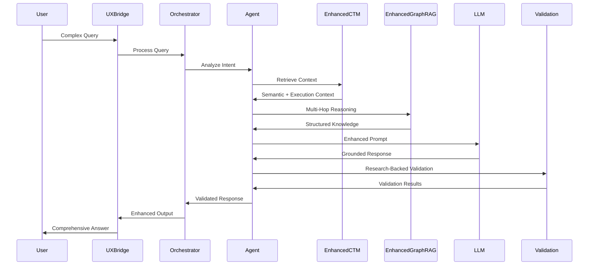
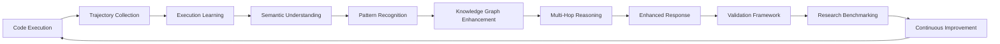

<a href="../index.md">Documentation</a> &gt; <a href="index.md">Diagrams</a> &gt; Enhanced DevSynth Architecture

# Enhanced DevSynth Architecture with Research-Backed Improvements

## 1. Overview

This diagram illustrates the enhanced DevSynth architecture incorporating research-backed improvements from the inspirational documents, including execution trajectory learning, multi-hop reasoning, and semantic understanding capabilities.

## 2. Enhanced System Architecture

```mermaid
graph TB
    %% User Interface Layer
    subgraph "User Interface Layer"
        CLI[CLI Interface]
        WebUI[Web UI]
        API[Agent API]
    end

    %% Enhanced Orchestration Layer
    subgraph "Enhanced Orchestration Layer"
        UXBridge[UX Bridge]
        Orchestrator[Orchestrator]
        SDDCoordinator[SDD+BDD Coordinator]
        ValidationEngine[Research-Backed Validation]
    end

    %% Enhanced Agent System
    subgraph "Enhanced Agent System"
        WSDEAgents[WSDE Multi-Agent System]
        EDRRCoordinator[EDRR Reasoning Coordinator]
        ExecutionLearner[Execution Trajectory Learner]
        SemanticAnalyzer[Semantic Understanding Engine]
    end

    %% Enhanced Memory System
    subgraph "Enhanced Memory System"
        subgraph "Enhanced CTM Layers"
            CTM_L1[Working Memory<br/>L1 - Enhanced]
            CTM_L2[Episodic Buffer<br/>L2 - Enhanced]
            CTM_L3[Semantic Store<br/>L3 - Enhanced]
            CTM_L4[Procedural Archive<br/>L4 - Enhanced]
            CTM_L4_5[Execution Learning<br/>L4.5 - NEW]
        end

        subgraph "Hybrid Memory Backends"
            VectorStore[(Vector Store<br/>ChromaDB)]
            GraphStore[(Graph Store<br/>Neo4j/RDFLib)]
            StructuredStore[(Structured Store<br/>SQLite/TinyDB)]
            DocumentStore[(Document Store<br/>JSON Files)]
        end
    end

    %% Enhanced Knowledge Graph
    subgraph "Enhanced Knowledge Graph"
        subgraph "Enhanced GraphRAG"
            MultiHopEngine[Multi-Hop<br/>Reasoning Engine]
            SemanticLinker[Semantic<br/>Linking Engine]
            ImpactAnalyzer[Impact<br/>Analysis Engine]
            TraceabilityEngine[Traceability<br/>Engine]
        end

        subgraph "Enhanced Schema"
            BusinessEntities[Business Logic<br/>Entities]
            TechnicalEntities[Technical<br/>Entities]
            IntentEntities[Intent &<br/>Rationale Entities]
            SemanticRelationships[Semantic<br/>Relationships]
        end
    end

    %% LLM Backend Layer
    subgraph "LLM Backend Layer"
        LLMProviders[LLM Providers<br/>LM Studio, OpenAI, etc.]
        ExecutionSandbox[Execution<br/>Sandbox]
        ValidationFramework[Research-Backed<br/>Validation Framework]
    end

    %% Data Flow Connections
    CLI --> UXBridge
    WebUI --> UXBridge
    API --> UXBridge

    UXBridge --> Orchestrator
    UXBridge --> SDDCoordinator
    UXBridge --> ValidationEngine

    Orchestrator --> WSDEAgents
    Orchestrator --> EDRRCoordinator

    WSDEAgents --> ExecutionLearner
    WSDEAgents --> SemanticAnalyzer
    EDRRCoordinator --> ExecutionLearner
    EDRRCoordinator --> SemanticAnalyzer

    %% Enhanced CTM Connections
    ExecutionLearner --> CTM_L4_5
    SemanticAnalyzer --> CTM_L3
    WSDEAgents --> CTM_L1
    EDRRCoordinator --> CTM_L2

    CTM_L1 --> VectorStore
    CTM_L2 --> DocumentStore
    CTM_L3 --> GraphStore
    CTM_L4 --> StructuredStore
    CTM_L4_5 --> ExecutionSandbox

    %% Enhanced GraphRAG Connections
    GraphStore --> MultiHopEngine
    GraphStore --> SemanticLinker
    GraphStore --> ImpactAnalyzer
    GraphStore --> TraceabilityEngine

    MultiHopEngine --> SemanticRelationships
    SemanticLinker --> IntentEntities
    ImpactAnalyzer --> BusinessEntities
    TraceabilityEngine --> TechnicalEntities

    %% LLM Integration
    ExecutionLearner --> LLMProviders
    SemanticAnalyzer --> LLMProviders
    MultiHopEngine --> LLMProviders
    SemanticLinker --> LLMProviders

    LLMProviders --> ExecutionSandbox
    LLMProviders --> ValidationFramework

    %% Research-Backed Validation Loop
    ValidationFramework --> ExecutionLearner
    ValidationFramework --> MultiHopEngine
    ValidationFramework --> SemanticAnalyzer
    ValidationFramework --> UXBridge

    %% External Integration
    subgraph "External Systems"
        VersionControl[(Version Control<br/>Git)]
        CI_CD[(CI/CD Systems)]
        IssueTracker[(Issue Tracker)]
        Documentation[(Documentation<br/>Sources)]
    end

    VersionControl --> DocumentStore
    CI_CD --> StructuredStore
    IssueTracker --> GraphStore
    Documentation --> VectorStore

    %% Research Insights Integration
    subgraph "Research Insights"
        Research_001[ID-001: Knowledge Graphs<br/>Multi-Hop Reasoning]
        Research_002[ID-002: Code World Models<br/>Execution Trajectories]
        Research_003[ID-003: Intent as Truth<br/>SDD+BDD Framework]
        Research_004[ID-004: CTM Architecture<br/>Cognitive Memory]
    end

    Research_001 --> MultiHopEngine
    Research_002 --> ExecutionLearner
    Research_003 --> SDDCoordinator
    Research_004 --> CTM_L1
    Research_004 --> CTM_L2
    Research_004 --> CTM_L3
    Research_004 --> CTM_L4

    %% Styling
    classDef userInterface fill:#e1f5fe,stroke:#01579b,stroke-width:2px
    classDef orchestration fill:#f3e5f5,stroke:#4a148c,stroke-width:2px
    classDef agents fill:#e8f5e8,stroke:#2e7d32,stroke-width:2px
    classDef memory fill:#fff3e0,stroke:#e65100,stroke-width:2px
    classDef knowledgeGraph fill:#fce4ec,stroke:#880e4f,stroke-width:2px
    classDef llmBackend fill:#f1f8e9,stroke:#33691e,stroke-width:2px
    classDef external fill:#fafafa,stroke:#424242,stroke-width:2px,stroke-dasharray: 5 5
    classDef research fill:#ffebee,stroke:#b71c1c,stroke-width:2px,stroke-dasharray: 3 3

    class CLI,WebUI,API userInterface
    class UXBridge,Orchestrator,SDDCoordinator,ValidationEngine orchestration
    class WSDEAgents,EDRRCoordinator,ExecutionLearner,SemanticAnalyzer agents
    class CTM_L1,CTM_L2,CTM_L3,CTM_L4,CTM_L4_5,VectorStore,GraphStore,StructuredStore,DocumentStore memory
    class MultiHopEngine,SemanticLinker,ImpactAnalyzer,TraceabilityEngine,BusinessEntities,TechnicalEntities,IntentEntities,SemanticRelationships knowledgeGraph
    class LLMProviders,ExecutionSandbox,ValidationFramework llmBackend
    class VersionControl,CI_CD,IssueTracker,Documentation external
    class Research_001,Research_002,Research_003,Research_004 research
```

## 3. Key Enhancement Highlights

### 3.1 Enhanced CTM with Execution Learning

The enhanced CTM system adds execution trajectory learning (L4.5) to address the "shallow understanding" problem:

- **Execution Trajectory Collection**: Captures detailed execution traces from code snippets
- **Semantic Understanding**: Learns behavioral patterns beyond syntax analysis
- **Mutation Resistance**: Maintains understanding through semantic-preserving changes
- **Integration**: Seamlessly integrates with existing CTM layers

### 3.2 Enhanced GraphRAG with Multi-Hop Reasoning

The enhanced GraphRAG system adds advanced reasoning capabilities:

- **Multi-Hop Traversal**: Supports complex queries requiring multiple reasoning steps
- **Semantic Linking**: Automatically discovers relationships between requirements and code
- **Impact Analysis**: Calculates comprehensive blast radius for proposed changes
- **Meaning Barrier**: Bridges business requirements with technical implementation

### 3.3 Research-Backed Validation

The validation framework ensures genuine improvements:

- **Semantic Robustness Testing**: Validates understanding through mutation analysis
- **Multi-Hop Accuracy**: Measures reasoning quality on complex queries
- **Execution Prediction**: Validates learning from trajectory analysis
- **Benchmark Alignment**: Ensures improvements meet research standards

## 4. Data Flow and Integration

### 4.1 Enhanced Query Processing

### 4.2 Knowledge Enhancement Loop

## 5. Research Alignment Mapping

### 5.1 Inspirational Document Integration

| Component | Research Source | Enhancement | Validation Method |
|-----------|-----------------|-------------|------------------|
| **Enhanced CTM** | ID-002: Code World Models | Execution trajectory learning | Semantic robustness testing |
| **Enhanced GraphRAG** | ID-001: Knowledge Graphs | Multi-hop reasoning | Multi-hop accuracy validation |
| **SDD+BDD Framework** | ID-003: Intent as Truth | Intent traceability | Intent consistency validation |
| **Validation Framework** | All: Research Methods | Research-backed testing | Benchmark comparison |

### 5.2 Performance Characteristics

| Characteristic | Baseline | Enhanced Target | Research Validation |
|----------------|----------|-----------------|-------------------|
| **Semantic Understanding** | Pattern matching | Execution-based learning | >40% improvement over baseline |
| **Multi-Hop Reasoning** | Single-hop queries | 7+ hop traversal | >85% accuracy on complex queries |
| **Meaning Barrier** | Code-only analysis | Business context linking | >80% requirement-to-code accuracy |
| **Execution Prediction** | Static analysis | Trajectory-based prediction | >80% prediction accuracy |

## 6. Integration Points

### 6.1 Cross-System Dependencies

- **CTM ↔ GraphRAG**: Execution insights enhance graph traversal
- **GraphRAG ↔ SDD**: Semantic linking improves specification understanding
- **SDD ↔ CTM**: Intent tracking enhances memory consolidation
- **All ↔ Validation**: Research-backed testing validates all improvements

### 6.2 Backward Compatibility

- All existing interfaces maintained
- Enhanced features are opt-in via configuration
- Gradual migration path available
- Performance regression protection

## 7. What proofs confirm the solution?

- **Research Alignment**: Architecture directly implements findings from inspirational documents
- **Comprehensive Integration**: All components work together to address identified challenges
- **Validation Framework**: Research-backed testing ensures genuine improvements
- **Backward Compatibility**: Maintains existing functionality while adding enhancements
- **Performance Optimization**: Balances capability improvements with system efficiency

This enhanced architecture represents DevSynth's commitment to research-backed improvements, addressing the core challenges identified in the inspirational documents while maintaining the system's reliability, performance, and extensibility.
