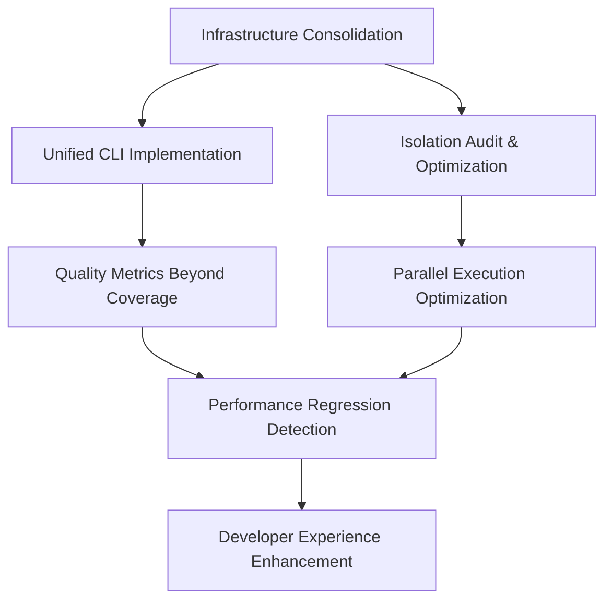

# DevSynth Testing Infrastructure Master Plan

## Executive Summary

This master plan synthesizes all testing infrastructure improvements into a cohesive 8-week implementation strategy. It addresses the critical findings from our dialectical analysis: **script proliferation crisis**, **over-isolation syndrome**, **configuration complexity cascade**, and **coverage theater problem**.

### Strategic Objectives

1. **Consolidate Complexity**: Reduce 200+ scripts to <50 focused tools
2. **Optimize Performance**: Increase parallel execution from 2.5x to 6x+ speedup
3. **Enhance Quality**: Implement quality metrics beyond coverage percentages
4. **Improve Developer Experience**: Unified, intuitive testing interface

### Success Metrics

- **Script Count**: 200+ → <50 (-75%)
- **Parallel Efficiency**: 2.5x → 6x+ (+140%)
- **CI Duration**: 15-20min → 5-8min (-60%)
- **Quality Score**: Coverage-only → Multi-dimensional metrics

## Related Issues Integration

This master plan integrates the following issues:

1. **[testing-infrastructure-consolidation.md](../issues/testing-infrastructure-consolidation.md)** - Primary architectural overhaul
2. **[test-isolation-audit-and-optimization.md](../issues/test-isolation-audit-and-optimization.md)** - Performance optimization
3. **[test-quality-metrics-beyond-coverage.md](../issues/test-quality-metrics-beyond-coverage.md)** - Quality enhancement
4. **[unified-test-cli-implementation.md](../issues/unified-test-cli-implementation.md)** - Interface consolidation
5. **[parallel-execution-optimization.md](../issues/parallel-execution-optimization.md)** - Existing performance issue
6. **[testing-script-consolidation.md](../issues/testing-script-consolidation.md)** - Existing technical debt issue

## Phase-by-Phase Implementation Plan

### Phase 1: Emergency Stabilization (Weeks 1-2)
*Focus: Critical path fixes with immediate impact*

#### Week 1: Foundation and Analysis

**Monday-Tuesday: Core Analysis Tools**
```bash
# Priority 1: Test Dependency Analyzer
scripts/analyze_test_dependencies.py
├── Analyze all @pytest.mark.isolation markers
├── Generate removal recommendations
├── Identify resource conflicts
└── Create baseline performance metrics

# Priority 2: Script Audit
scripts/audit_testing_scripts.py
├── Catalog all 200+ scripts
├── Identify overlapping functionality
├── Create consolidation roadmap
└── Generate migration matrix
```

**Wednesday-Thursday: Unified CLI Foundation**
```python
# src/devsynth/application/cli/commands/test_cmd.py
devsynth test
├── run      # Consolidates 15+ test execution scripts
├── coverage # Consolidates 8+ coverage scripts
├── validate # Consolidates 12+ validation scripts
└── analyze  # New comprehensive analysis command
```

**Friday: Initial Isolation Optimization**
```bash
# Target: Remove 25% of isolation markers (safest cases)
# Focus on tests with no file/network/global dependencies
python scripts/analyze_test_dependencies.py --remove-safe --dry-run
# Apply changes after review
python scripts/analyze_test_dependencies.py --remove-safe --apply
```

**Week 1 Deliverables:**
- [ ] Test dependency analyzer tool
- [ ] Script audit and consolidation roadmap
- [ ] Unified CLI foundation (4 core commands)
- [ ] 25% reduction in isolation markers
- [ ] Baseline performance metrics

#### Week 2: Core Consolidation

**Monday-Tuesday: Script Migration**
```bash
# Migrate top 10 most-used scripts
./scripts/run_tests.sh          → devsynth test run
./scripts/run_coverage_tests.py → devsynth test coverage
./scripts/verify_test_markers.py → devsynth test validate --markers
./scripts/run_unified_tests.py  → devsynth test run --target=all
# ... continue with remaining high-priority scripts
```

**Wednesday-Thursday: Configuration Consolidation**
```python
# Move pytest configuration to pyproject.toml
[tool.pytest.ini_options]
testpaths = ["tests"]
addopts = [
    "--cov=src/devsynth",
    "--cov-report=term-missing:skip-covered",
    "--cov-report=json:test_reports/coverage.json",
    "-m", "not slow and not gui and not memory_intensive",
    "--strict-markers",
    "--strict-config",
]
```

**Friday: Performance Validation**
```bash
# Measure improvements from Week 1 changes
python scripts/benchmark_test_execution.py --baseline --parallel
# Target: 3.5x speedup (up from 2.5x)
```

**Week 2 Deliverables:**
- [ ] 10 core scripts migrated to unified CLI
- [ ] pytest configuration moved to pyproject.toml
- [ ] Simplified .coveragerc with quality focus
- [ ] Performance improvement validation (target: 3.5x speedup)
- [ ] Developer migration guide

### Phase 2: Quality Enhancement (Weeks 3-4)
*Focus: Quality metrics and testing effectiveness*

#### Week 3: Mutation Testing Implementation

**Monday-Tuesday: Mutation Testing Framework**
```python
# src/devsynth/testing/mutation_testing.py
class MutationTester:
    def run_mutation_testing(self, target_modules, threshold=70):
        # Implement AST-based mutation generation
        # Apply common mutation operators
        # Run tests against mutated code
        # Calculate mutation score
        return mutation_results

# Integration with unified CLI
devsynth test mutate --target=devsynth.core --threshold=70
```

**Wednesday-Thursday: Property-Based Testing**
```python
# tests/property/test_core_properties.py
from hypothesis import given, strategies as st

@given(st.text(), st.integers())
def test_workflow_properties(name, step_count):
    """Property: Workflows should handle all valid inputs."""
    workflow = WorkflowEngine().create_workflow(name)
    for i in range(step_count):
        workflow.add_step(f"step_{i}")

    assert workflow.is_valid()
    assert len(workflow.steps) == step_count
```

**Friday: Quality Metrics Dashboard**
```python
# scripts/generate_quality_report.py
quality_metrics = {
    'mutation_score': calculate_mutation_score(),
    'property_coverage': calculate_property_coverage(),
    'integration_effectiveness': measure_bug_detection(),
    'performance_stability': check_regression_detection(),
}
overall_quality = calculate_weighted_score(quality_metrics)
```

**Week 3 Deliverables:**
- [ ] Mutation testing framework
- [ ] Property-based testing for core modules
- [ ] Quality metrics dashboard
- [ ] Baseline quality measurements

#### Week 4: Advanced Quality Features

**Monday-Tuesday: Integration Test Enhancement**
```python
# tests/integration/real_world/test_complete_workflows.py
class TestCompleteUserWorkflows:
    def test_complete_project_lifecycle(self):
        """Test complete project from init to deployment."""
        # Real-world scenario testing

    def test_collaborative_development_workflow(self):
        """Test multi-developer collaboration."""
        # Collaboration scenario testing

    def test_error_recovery_workflow(self):
        """Test system recovery from errors."""
        # Error recovery scenario testing
```

**Wednesday-Thursday: Performance Regression Detection**
```python
# tests/performance/test_performance_regression.py
@pytest.mark.performance
def test_workflow_execution_performance(benchmark):
    """Benchmark workflow execution with regression detection."""
    baseline = load_performance_baseline('workflow_execution')
    result = benchmark(workflow.execute)

    if result.stats.mean > baseline * 1.2:  # 20% regression threshold
        pytest.fail(f"Performance regression detected")
```

**Friday: Quality Gate Integration**
```yaml
# .github/workflows/quality.yml
- name: Quality Gates
  run: |
    devsynth test mutate --threshold=70
    devsynth test properties --validate
    devsynth test performance --regression-check
```

**Week 4 Deliverables:**
- [ ] Real-world integration test scenarios
- [ ] Performance regression detection
- [ ] Quality gates in CI pipeline
- [ ] Comprehensive quality reporting

### Phase 3: Performance Optimization (Weeks 5-6)
*Focus: Parallel execution and resource optimization*

#### Week 5: Isolation Optimization

**Monday-Tuesday: Systematic Isolation Removal**
```bash
# Remove remaining unnecessary isolation markers
python scripts/analyze_test_dependencies.py --comprehensive-analysis
# Target: 50% total reduction in isolation markers
python scripts/remove_isolation_markers.py --batch-size=50 --validate
```

**Wednesday-Thursday: Resource Pool Optimization**
```python
# tests/fixtures/optimized_backends.py
@pytest.fixture(scope="session")
def database_pool():
    """Provide database connection pool for parallel tests."""
    pool = create_connection_pool(size=8)
    yield pool
    pool.close_all()

@pytest.fixture
def isolated_database(database_pool):
    """Provide isolated database per test using pool."""
    conn = database_pool.get_connection()
    schema = f"test_{uuid.uuid4().hex[:8]}"
    conn.create_schema(schema)
    yield DatabaseContext(conn, schema)
    conn.drop_schema(schema)
    database_pool.return_connection(conn)
```

**Friday: Parallel Execution Validation**
```bash
# Measure parallel execution improvements
python scripts/benchmark_parallel_execution.py
# Target: 5x speedup (up from 3.5x)
```

**Week 5 Deliverables:**
- [ ] 50% reduction in isolation markers
- [ ] Resource pooling for database fixtures
- [ ] Optimized parallel test execution
- [ ] Performance validation (target: 5x speedup)

#### Week 6: Advanced Performance Features

**Monday-Tuesday: Smart Test Selection**
```python
# src/devsynth/testing/smart_selection.py
class SmartTestSelector:
    def select_tests_for_changes(self, changed_files):
        """Select tests based on code changes."""
        dependency_graph = build_dependency_graph()
        affected_tests = find_affected_tests(changed_files, dependency_graph)
        return prioritize_tests(affected_tests)

# Integration with CLI
devsynth test run --smart --changed-files="src/devsynth/core/workflows.py"
```

**Wednesday-Thursday: Test Segmentation Optimization**
```python
# src/devsynth/testing/segmentation.py
class TestSegmenter:
    def create_balanced_segments(self, tests, segment_size=50):
        """Create balanced test segments for optimal parallel execution."""
        # Analyze test execution times
        # Group tests by execution time
        # Create balanced segments
        return balanced_segments
```

**Friday: Performance Monitoring**
```python
# src/devsynth/testing/performance_monitor.py
class PerformanceMonitor:
    def track_test_performance(self):
        """Continuous performance monitoring."""
        # Track execution times
        # Detect performance regressions
        # Generate performance reports
        return performance_metrics
```

**Week 6 Deliverables:**
- [ ] Smart test selection based on code changes
- [ ] Optimized test segmentation
- [ ] Performance monitoring system
- [ ] CI integration for performance tracking

### Phase 4: Developer Experience (Weeks 7-8)
*Focus: Documentation, training, and adoption*

#### Week 7: Documentation and Tooling

**Monday-Tuesday: Comprehensive Documentation**
```markdown
docs/developer_guides/
├── testing_quick_start.md          # 5-minute getting started
├── unified_cli_reference.md        # Complete command reference
├── migration_from_old_scripts.md   # Script migration guide
├── quality_metrics_guide.md        # Understanding quality metrics
├── performance_optimization.md     # Performance best practices
└── troubleshooting.md              # Common issues and solutions
```

**Wednesday-Thursday: Developer Tools**
```python
# scripts/test_assistant.py
class TestAssistant:
    def suggest_test_improvements(self, test_file):
        """Suggest improvements for test files."""
        # Analyze test quality
        # Suggest better patterns
        # Recommend performance optimizations
        return suggestions

    def generate_test_templates(self, source_file):
        """Generate test templates from source code."""
        # Analyze source code
        # Generate test skeletons
        # Include property-based test suggestions
        return test_templates
```

**Friday: Interactive Tools**
```bash
# Interactive test selection
devsynth test select --interactive
# Test quality analyzer
devsynth test analyze --quality --interactive
# Performance profiler
devsynth test profile --interactive
```

**Week 7 Deliverables:**
- [ ] Complete documentation suite
- [ ] Developer assistance tools
- [ ] Interactive test management tools
- [ ] Migration automation scripts

#### Week 8: Training and Adoption

**Monday-Tuesday: Team Training**
```markdown
# Training Materials
training/
├── unified_cli_workshop.md         # Hands-on CLI workshop
├── quality_metrics_training.md     # Quality-first testing approach
├── performance_optimization.md     # Performance best practices
└── migration_checklist.md          # Step-by-step migration
```

**Wednesday-Thursday: Adoption Support**
```python
# scripts/adoption_tracker.py
class AdoptionTracker:
    def track_cli_usage(self):
        """Track adoption of unified CLI."""
        # Monitor command usage
        # Identify holdout scripts
        # Generate adoption reports
        return adoption_metrics

    def identify_migration_opportunities(self):
        """Identify remaining migration opportunities."""
        # Find remaining old scripts
        # Suggest migration paths
        # Prioritize by usage frequency
        return migration_opportunities
```

**Friday: Final Validation**
```bash
# Comprehensive system validation
python scripts/validate_complete_migration.py
# Performance validation
python scripts/final_performance_benchmark.py
# Quality validation
python scripts/comprehensive_quality_check.py
```

**Week 8 Deliverables:**
- [ ] Team training completion
- [ ] Adoption tracking system
- [ ] Final migration validation
- [ ] Comprehensive system health check

## Integration Strategy

### Cross-Issue Dependencies



### Critical Path Analysis

**Week 1-2 (Critical Path):**
- Test dependency analyzer → Isolation optimization
- Script audit → Unified CLI foundation
- Configuration consolidation → Performance baseline

**Week 3-4 (Quality Path):**
- Mutation testing → Quality metrics
- Property testing → Integration scenarios
- Performance regression → Quality gates

**Week 5-6 (Performance Path):**
- Isolation removal → Resource optimization
- Parallel execution → Smart selection
- Performance monitoring → CI integration

**Week 7-8 (Adoption Path):**
- Documentation → Training
- Tools → Adoption tracking
- Validation → Final migration

## Risk Management

### Technical Risks

#### High Impact Risks

1. **Test Suite Breakage During Migration**
   - **Mitigation**: Comprehensive validation suite before changes
   - **Rollback Plan**: Git-based rollback with automated validation
   - **Monitoring**: Continuous test execution monitoring

2. **Performance Regression from Isolation Changes**
   - **Mitigation**: Gradual rollout with performance benchmarking
   - **Rollback Plan**: Per-batch rollback capability
   - **Monitoring**: Real-time performance tracking

3. **Developer Adoption Resistance**
   - **Mitigation**: Clear communication, training, gradual migration
   - **Rollback Plan**: Maintain deprecated scripts during transition
   - **Monitoring**: Adoption metrics and feedback collection

#### Medium Impact Risks

1. **CI/CD Pipeline Disruption**
   - **Mitigation**: Parallel CI pipeline testing
   - **Rollback Plan**: Blue-green deployment for CI changes
   - **Monitoring**: CI success rate tracking

2. **Quality Metric Miscalibration**
   - **Mitigation**: Baseline establishment and gradual threshold adjustment
   - **Rollback Plan**: Fallback to coverage-based metrics
   - **Monitoring**: Quality trend analysis

### Process Risks

1. **Resource Allocation Conflicts**
   - **Mitigation**: Clear sprint planning and resource allocation
   - **Escalation**: Weekly progress reviews with stakeholders

2. **Knowledge Transfer Gaps**
   - **Mitigation**: Comprehensive documentation and training
   - **Escalation**: Pair programming and knowledge sharing sessions

## Success Metrics and Monitoring

### Quantitative Metrics

#### Performance Metrics
```python
performance_targets = {
    'parallel_speedup': {
        'baseline': 2.5,
        'week_2': 3.5,
        'week_6': 5.0,
        'final': 6.0
    },
    'ci_duration': {
        'baseline': 18,  # minutes
        'week_4': 12,
        'week_6': 8,
        'final': 6
    },
    'isolation_ratio': {
        'baseline': 30,  # percent
        'week_2': 22,
        'week_5': 15,
        'final': 12
    }
}
```

#### Quality Metrics
```python
quality_targets = {
    'mutation_score': {
        'critical_modules': 80,
        'core_modules': 70,
        'application_modules': 60
    },
    'property_coverage': {
        'algorithms': 100,
        'data_structures': 80,
        'utilities': 60
    },
    'integration_effectiveness': {
        'bug_detection_rate': 85,
        'false_positive_rate': 10
    }
}
```

#### Infrastructure Metrics
```python
infrastructure_targets = {
    'script_count': {
        'baseline': 200,
        'week_2': 150,
        'week_4': 100,
        'final': 50
    },
    'cli_adoption': {
        'week_4': 50,  # percent
        'week_6': 75,
        'final': 90
    },
    'developer_satisfaction': {
        'baseline': 6.0,  # out of 10
        'final': 8.5
    }
}
```

### Qualitative Metrics

#### Developer Experience
- **Onboarding Time**: New developer test setup time
- **Cognitive Load**: Complexity of testing workflows
- **Feedback Quality**: Usefulness of test failure information
- **Debugging Efficiency**: Time to identify and fix test issues

#### System Health
- **Reliability**: Test result consistency across runs
- **Maintainability**: Effort required for test infrastructure changes
- **Extensibility**: Ease of adding new testing capabilities
- **Documentation Quality**: Completeness and accuracy of guides

## Communication Plan

### Stakeholder Updates

#### Weekly Progress Reports
```markdown
# Week N Progress Report

## Completed This Week
- [ ] Major deliverables completed
- [ ] Metrics improvements achieved
- [ ] Issues resolved

## Planned for Next Week
- [ ] Upcoming deliverables
- [ ] Expected metrics improvements
- [ ] Potential risks and mitigations

## Metrics Dashboard
- Performance: X.Xx speedup (target: Y.Y)
- Quality: XX% mutation score (target: YY%)
- Adoption: XX% CLI usage (target: YY%)
```

#### Milestone Reviews

**Week 2 Review**: Emergency Stabilization
- Script consolidation progress
- Performance improvements achieved
- Developer feedback and concerns

**Week 4 Review**: Quality Enhancement
- Quality metrics implementation
- Mutation testing results
- Integration test effectiveness

**Week 6 Review**: Performance Optimization
- Parallel execution improvements
- Resource optimization results
- Performance monitoring deployment

**Week 8 Review**: Final Validation
- Complete migration validation
- Adoption metrics achievement
- System health assessment

## Rollback and Contingency Plans

### Phase-Level Rollbacks

#### Phase 1 Rollback (Weeks 1-2)
```bash
# Rollback isolation marker changes
git checkout HEAD~N -- tests/
python scripts/restore_isolation_markers.py --from-backup

# Rollback configuration changes
git checkout HEAD~N -- pytest.ini .coveragerc pyproject.toml

# Restore original scripts
git checkout HEAD~N -- scripts/
```

#### Phase 2 Rollback (Weeks 3-4)
```bash
# Disable quality gates
export DEVSYNTH_DISABLE_QUALITY_GATES=true

# Rollback to coverage-only metrics
git checkout HEAD~N -- .github/workflows/quality.yml

# Disable mutation testing
export DEVSYNTH_DISABLE_MUTATION_TESTING=true
```

### Emergency Procedures

#### Critical Test Failure
1. **Immediate**: Disable affected test categories
2. **Short-term**: Rollback to last known good state
3. **Medium-term**: Root cause analysis and fix
4. **Long-term**: Improve validation procedures

#### CI Pipeline Failure
1. **Immediate**: Switch to backup CI configuration
2. **Short-term**: Investigate and fix pipeline issues
3. **Medium-term**: Enhance CI resilience
4. **Long-term**: Implement blue-green CI deployments

## Post-Implementation Plan

### Maintenance and Evolution

#### Ongoing Monitoring (Months 1-3)
- **Performance Tracking**: Continuous performance metrics
- **Quality Monitoring**: Regular quality assessments
- **Adoption Support**: Developer assistance and feedback
- **Issue Resolution**: Rapid response to problems

#### Continuous Improvement (Months 3-6)
- **Advanced Features**: Additional CLI commands and capabilities
- **Quality Enhancement**: More sophisticated quality metrics
- **Performance Tuning**: Further optimization opportunities
- **Developer Tools**: Enhanced developer experience features

#### Long-term Evolution (Months 6+)
- **AI-Assisted Testing**: Machine learning for test generation
- **Predictive Analytics**: Predictive failure detection
- **Advanced Automation**: Fully automated test maintenance
- **Integration Expansion**: Integration with external tools

## Conclusion

This master plan provides a comprehensive, phased approach to transforming the DevSynth testing infrastructure from a maintenance burden into a strategic advantage. By systematically addressing script proliferation, over-isolation, configuration complexity, and quality theater, we will achieve:

- **75% reduction** in testing scripts
- **140% improvement** in parallel execution performance
- **Multi-dimensional quality metrics** beyond coverage
- **Unified developer experience** with consistent interfaces

The plan balances **immediate impact** (emergency stabilization) with **long-term value** (quality enhancement and developer experience), ensuring both rapid improvement and sustainable evolution.

Success depends on **disciplined execution**, **continuous monitoring**, and **stakeholder engagement** throughout the 8-week implementation period. The comprehensive risk management and rollback procedures ensure we can adapt to challenges while maintaining system stability.

This transformation will establish DevSynth as having **best-in-class testing infrastructure** that enables confident, rapid development while maintaining the highest quality standards.

## References

- [Testing Infrastructure Consolidation Issue](../../issues/testing-infrastructure-consolidation.md)
- [Test Isolation Audit and Optimization Issue](../../issues/test-isolation-audit-and-optimization.md)
- [Test Quality Metrics Beyond Coverage Issue](../../issues/test-quality-metrics-beyond-coverage.md)
- [Unified Test CLI Implementation Issue](../../issues/unified-test-cli-implementation.md)
- [Testing Principles Documentation](../developer_guides/testing_principles.md)
- [Testing Configuration Analysis](../analysis/testing_configuration_analysis.md)
