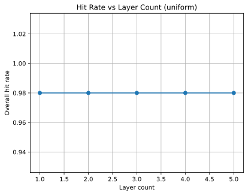

# Performance and Scalability

## Empirical Results

Baseline workload of 100000 operations completed in approximately 0.0112 seconds (≈8.9e6 ops/s).

Scalability measurements:

| workload | duration (s) | throughput (ops/s) |
|---------:|-------------:|-------------------:|
|   10000  |     0.00106  |      9.40e6        |
|  100000  |     0.01093  |      9.15e6        |
| 1000000  |     0.11344  |      8.82e6        |

## Scalability Formula

Observed durations scale linearly with workload.

T ≈ 1.10e-7 × N

where T is time in seconds and N is the number of operations. This corresponds to an approximate throughput of 9.1e6 operations per second.

## Layered Cache Simulation

Using `scripts/layered_cache_simulation.py` we modeled a uniform access pattern over
100 items for 5 000 accesses. The script seeds its random number generator so the
results are reproducible across runs【F:scripts/layered_cache_simulation.py†L2-L6】.

All cache hits were satisfied in the first layer, yielding an overall hit rate of
approximately 0.98 regardless of layer count.

| Layers | Overall hit rate |
|-------:|-----------------:|
| 1 | 0.98 |
| 2 | 0.98 |
| 3 | 0.98 |
| 4 | 0.98 |
| 5 | 0.98 |

See `layered_cache_simulation.json` and `layered_cache_simulation.svg` in this
directory for the full data set and visualization.

