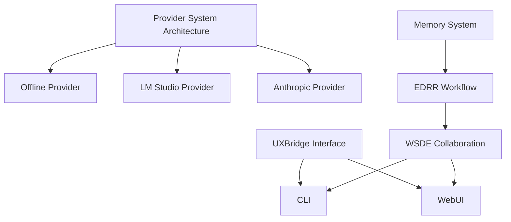

# Core Feature Dependency Graph

This document maps the relationships between major DevSynth features. Understanding these dependencies helps prioritize implementation work and ensures that foundational components are completed before dependent features.

## Key Dependencies

- **Provider System Architecture** &rarr; enables all concrete LLM providers.
  - Offline provider depends on the provider system for deterministic text and embeddings.
  - LM Studio provider builds on the provider system for local model access.
  - Anthropic provider integrates through the provider system for cloud-based completions.
- **Memory System** &rarr; underpins the EDRR workflow and WSDE collaboration.
- **EDRR Workflow** &rarr; orchestrates tasks and is required for WSDE multi‑agent coordination.
- **UXBridge Interface** &rarr; supplies a common UI layer used by both the CLI and WebUI.

## Diagram

The diagram highlights that provider implementations rely on the common provider system, while the memory system enables the EDRR workflow, which in turn supports WSDE collaboration. Both the CLI and WebUI depend on the UXBridge abstraction and the collaboration features implemented by WSDE.
