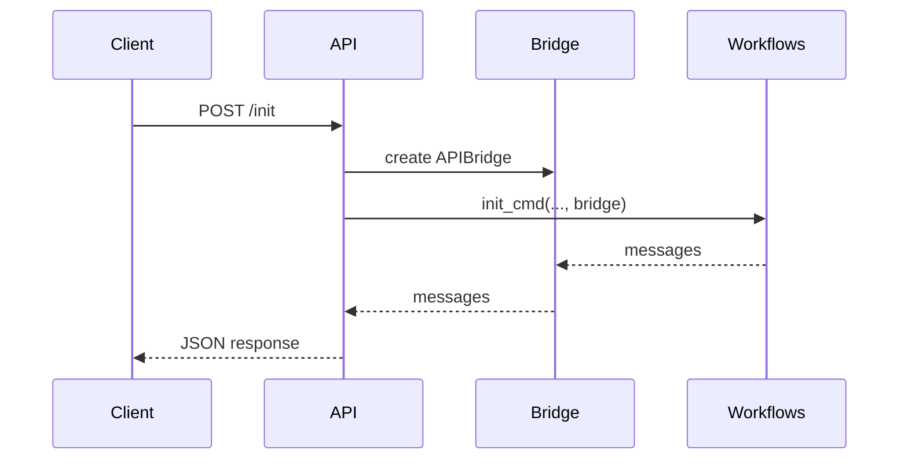

---

author: DevSynth Team
date: '2025-06-19'
last_reviewed: '2025-07-20'
status: draft
tags:

- specification
- api

title: Agent API Stub
version: "0.1.0a1"
---
<div class="breadcrumbs">
<a href="../index.md">Documentation</a> &gt; <a href="index.md">Specifications</a> &gt; Agent API Stub
</div>

# Agent API Stub

This document outlines the minimal HTTP interface for driving DevSynth
workflows programmatically. The API mirrors the CLI and WebUI behaviour
through the `UXBridge` abstraction. The stub is implemented as a
`fastapi.APIRouter` in `src/devsynth/interface/agentapi.py` which can be
mounted into the main application.

## Design Choices

- **REST Style** – A small set of POST endpoints invoke the same workflows as

  the CLI to keep the surface area minimal.

- **Message Queue** – Responses return a list of messages that match those

  printed by the CLI or WebUI allowing clients to display progress.

## Constraints

- The API runs locally and exposes no authentication in this stub version.
- Only JSON payloads are accepted and all errors return HTTP 400 with details.


## Expected Behaviour

- Each endpoint triggers the corresponding workflow via the UXBridge layer.
- Subsequent `GET /status` calls return any accumulated messages until cleared

  by the next workflow invocation.

## Endpoints

### `POST /init`

Initializes or onboards a project.

Example request:

```json
{ "path": ".", "project_root": ".", "language": "python", "goals": "demo" }
```

Example response:

```json
{ "messages": ["Initialized DevSynth project"] }
```

### `POST /gather`

Collects project goals and constraints.

Example request:

```json
{
  "goals": "ai, tests",
  "constraints": "offline",
  "priority": "medium"
}
```

Example response:

```json
{ "messages": ["Requirements saved to requirements_plan.yaml"] }
```

### `POST /synthesize`

Runs the synthesis pipeline.

Example request:

```json
{ "target": "unit-tests" }
```

Example response:

```json
{ "messages": ["Execution complete."] }
```

### `GET /status`

Returns the messages from the most recent workflow invocation.

Example response:

```json
{ "messages": ["Execution complete."] }
```

## Request and Response Schemas

```json
// InitRequest
{
  "path": "string",
  "project_root": "string?",
  "language": "string?",
  "goals": "string?"
}
```

```json
// GatherRequest
{
  "goals": "string",
  "constraints": "string",
  "priority": "string"
}
```

```json
// SynthesizeRequest
{
  "target": "string?"
}
```

```json
// WorkflowResponse
{
  "messages": ["string", "..."]
}
```

## Sequence Diagram

<!-- Diagram: API initialization sequence -->



## Pseudocode

```pseudocode
function handle_request(path, body):
    bridge = APIBridge()
    if path == "/init":
        init_cmd(**body, bridge=bridge)
    elif path == "/gather":
        gather_requirements_via_bridge(bridge, **body)
    elif path == "/synthesize":
        run_pipeline_cmd(target=body.target, bridge=bridge)
    elif path == "/status":
        pass  # messages already collected in bridge
    return {"messages": bridge.messages}
```

## Implementation Status

This feature is **implemented**. The API routes are defined in `src/devsynth/interface/agentapi.py` and expose the CLI workflows over HTTP.

## What proofs confirm the solution?
- BDD scenarios in [`tests/behavior/features/agent_api_stub.feature`](../../tests/behavior/features/agent_api_stub.feature) ensure termination and expected outcomes.
- Finite state transitions and bounded loops guarantee termination.
