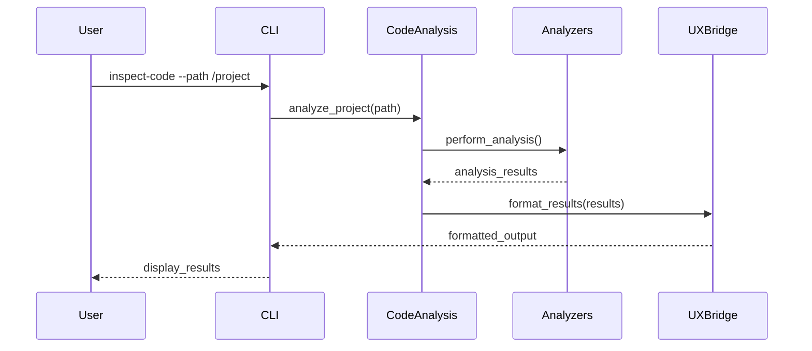

<div class="breadcrumbs">
<a href="../index.md">Documentation</a> &gt; <a href="index.md">Specifications</a> &gt; Code Analysis
</div>

# Code Analysis

## Summary

The Code Analysis feature provides comprehensive inspection capabilities for understanding codebase architecture, structure, and quality metrics. It enables developers to gain insights into project composition, dependencies, and potential improvement areas through automated analysis.

## Socratic Checklist

### What is the problem?
- Developers need to understand complex codebases quickly
- Architecture decisions and patterns are not always documented
- Code quality issues may be hidden without systematic analysis
- Onboarding new team members requires understanding project structure

### What proofs confirm the solution?
- BDD scenarios in [`tests/behavior/features/code_analysis.feature`](../../tests/behavior/features/code_analysis.feature) ensure termination and expected outcomes.
- Finite state transitions and bounded loops guarantee termination.
- Integration with existing CLI and WebUI interfaces provides consistent user experience.

## Motivation

Code analysis is fundamental to:
- **Architecture Understanding**: Quickly comprehend how components interact
- **Quality Assurance**: Identify potential issues and improvement opportunities
- **Onboarding**: Help new developers understand project structure
- **Maintenance**: Support refactoring and modernization efforts
- **Documentation**: Generate insights that can inform documentation updates

## Specification

### Core Capabilities

#### 1. Project Structure Analysis
- **File Organization**: Analyze directory structure and file distribution
- **Module Dependencies**: Map import relationships and dependency graphs
- **Language Detection**: Identify primary programming languages used
- **Size Metrics**: Calculate lines of code, file counts, and complexity metrics

#### 2. Code Quality Assessment
- **AST Analysis**: Parse and analyze abstract syntax trees for patterns
- **Import Analysis**: Identify unused imports, circular dependencies
- **Function/Method Analysis**: Assess complexity, documentation coverage
- **Class Hierarchy**: Map inheritance relationships and composition

#### 3. Architecture Insights
- **Design Patterns**: Detect common architectural patterns
- **Layer Separation**: Analyze separation of concerns
- **Component Coupling**: Measure interdependencies between modules
- **Entry Points**: Identify main application entry points

### Command Interface

The code analysis feature is exposed through the `devsynth inspect-code` command:

```bash
# Analyze current directory
devsynth inspect-code

# Analyze specific path
devsynth inspect-code --path /path/to/project

# Generate detailed report
devsynth inspect-code --output report.json
```

### Output Formats

#### Console Output
- Rich-formatted tables showing key metrics
- Hierarchical display of project structure
- Color-coded quality indicators
- Progress indicators for long-running analysis

#### JSON Report (Optional)
```json
{
  "project_info": {
    "name": "example-project",
    "language": "python",
    "total_files": 42,
    "total_lines": 1234
  },
  "structure_analysis": {
    "directories": [...],
    "file_types": {...},
    "dependencies": {...}
  },
  "quality_metrics": {
    "complexity_score": 7.2,
    "documentation_coverage": 85.3,
    "test_coverage": 92.1
  }
}
```

### Analysis Components

#### Project State Analyzer
- Scans directory structure
- Counts files by type and language
- Identifies configuration files
- Maps module relationships

#### Self Analyzer
- Performs AST-based analysis
- Extracts function and class definitions
- Analyzes import patterns
- Measures code complexity

#### Repository Analyzer
- Integrates with version control systems
- Analyzes commit patterns and history
- Identifies active development areas
- Tracks code churn metrics

## Acceptance Criteria

### Functional Requirements
- [ ] Must analyze Python codebases with AST parsing
- [ ] Must provide console output with rich formatting
- [ ] Must support custom path specification
- [ ] Must complete analysis within reasonable time bounds (< 5 minutes for typical projects)
- [ ] Must handle common error conditions gracefully

### Quality Requirements
- [ ] Must provide accurate file and module counts
- [ ] Must correctly identify import relationships
- [ ] Must generate reproducible results for same codebase
- [ ] Must not modify analyzed files or directories
- [ ] Must work offline without network dependencies

### User Experience Requirements
- [ ] Must display progress indicators for long operations
- [ ] Must provide clear error messages for failures
- [ ] Must support both CLI and programmatic usage
- [ ] Must integrate with existing DevSynth UX patterns

## Implementation Details

### Architecture
```
CodeAnalysis (Domain Interface)
├── ProjectStateAnalyzer (Structure Analysis)
├── SelfAnalyzer (AST-based Analysis)
├── RepoAnalyzer (Repository Integration)
└── UXBridge (Output Formatting)
```

### Key Classes
- `ProjectStateAnalyzer`: Handles directory traversal and file analysis
- `SelfAnalyzer`: Performs AST parsing and code structure extraction
- `CodeAnalysisResult`: Typed result container for analysis data
- `CLIUXBridge`: Formats results for console display

### Error Handling
- File permission errors are logged and skipped
- Parse errors in individual files don't stop overall analysis
- Network timeouts for repository analysis are handled gracefully
- Invalid paths result in clear error messages

## Sequence Diagram



## References

- [Issue: Code Analysis](../../issues/code-analysis.md)
- [BDD: code_analysis.feature](../../tests/behavior/features/code_analysis.feature)
- [Implementation: inspect_code_cmd.py](../../src/devsynth/application/cli/commands/inspect_code_cmd.py)

## Implementation Status

This feature is **implemented** and available through the `devsynth inspect-code` command. The analysis components are located in `src/devsynth/application/code_analysis/` with CLI integration in `src/devsynth/application/cli/commands/inspect_code_cmd.py`.
