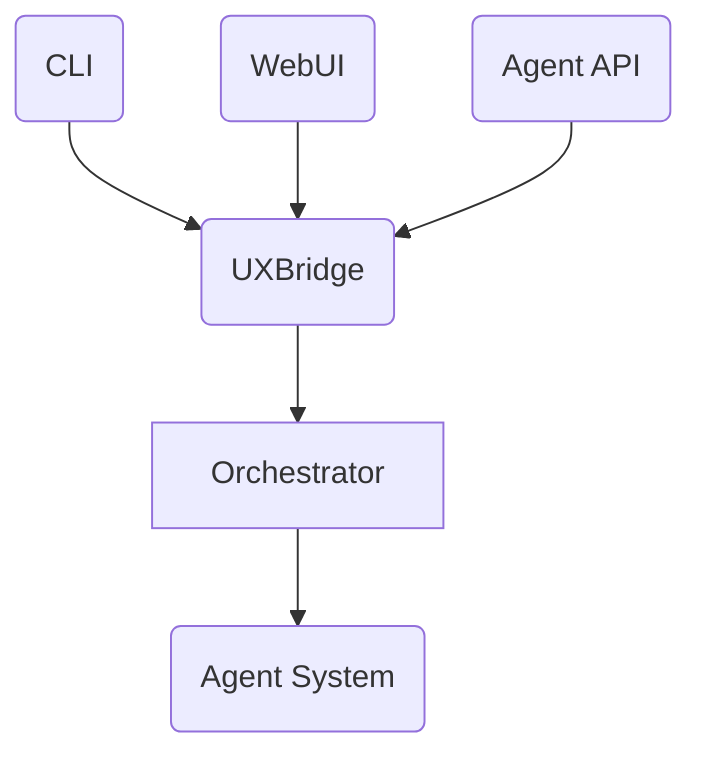

---

author: DevSynth Team
date: '2025-07-07'
last_reviewed: "2025-07-10"
status: published
tags:
- specification
title: DevSynth Application Technical Specification - MVP Version
version: "0.1.0a1"
---
<div class="breadcrumbs">
<a href="../index.md">Documentation</a> &gt; <a href="index.md">Specifications</a> &gt; DevSynth Application Technical Specification - MVP Version
</div>

# Project Naming Conventions

- Python package name: `devsynth` (lowercase)
- Display Name / Project Title: DevSynth (CamelCase)
- GitHub repo name: devsynth (lowercase)
- CLI command name: `devsynth` (lowercase)
- Import example: `import devsynth`

---

# DevSynth Application Technical Specification - MVP Version

## 1. Executive Summary

This document outlines the technical specification for the Minimum Viable Product (MVP) version of the DevSynth application. The MVP focuses on delivering core functionality that provides immediate value to developers while establishing a foundation for future expansion.

DevSynth is designed as a CLI application for a single developer, operating on their local machine. It streamlines software development by providing AI-assisted automation for key phases of the software development lifecycle. The MVP will focus on project initialization, basic requirement analysis, test generation, and simple code generation capabilities, with a clear path for expansion to more advanced features in future iterations.

This specification defines clear MVP boundaries, prioritizes features, simplifies the initial architecture while preserving extension points, and provides concrete implementation guidance for core functionality.

## 2. System Overview and Purpose

### 2.1 Vision Statement

DevSynth aims to enhance developer productivity by providing an AI-assisted command-line tool that automates routine aspects of the software development lifecycle while preserving developer agency and promoting best practices.

**MVP Focus**: Deliver a functional CLI tool for a single developer on their local machine that demonstrates value through basic project setup, requirement analysis, and test/code generation for simple Python modules.

### 2.2 Core Objectives

**MVP Objectives:**
1. Provide a simple, intuitive CLI interface for Python developers on their local machine
2. Automate basic project initialization with standard Python project structure
3. Support requirement analysis and specification generation for simple modules
4. Generate basic unit tests following test-driven development principles
5. Generate functional code that passes the generated tests
6. Maintain a consistent project context across multiple CLI invocations
7. Optimize token usage and implement cost awareness strategies
8. Ensure minimal resource usage, just what's required for each task
9. Provide appropriate security and privacy for a single-developer PoC

**Future Expansion Objectives** (not in MVP):
- Multi-agent collaboration for complex tasks
- Advanced code refactoring and optimization
- Comprehensive documentation generation
- Continuous learning from user feedback

### 2.3 Target Users

**MVP Target Users:**
1. Individual Python developers seeking productivity tools on their local machine
2. Developers familiar with command-line tools and basic DevSynth concepts
3. Developers with access to LM Studio running locally on their machine

The MVP will focus on serving these core users with straightforward use cases, with plans to expand to more diverse user groups in future versions.

### 2.4 Key Use Cases

**MVP Use Cases:**
1. Initialize a new or existing Python project with standard structure and configuration
2. Generate a basic specification from user-provided requirements
3. Create unit tests based on specifications
4. Generate functional code that satisfies the tests
5. Refine generated artifacts through iterative prompting

**Implementation Priority:**
- High: Use cases 1-4 (core project workflow)
- Medium: Use case 5 (iterative refinement)

## 3. Architecture and Component Design

### 3.1 High-Level Architecture

The MVP architecture follows a simplified layered approach with clear separation of concerns, designed to run entirely on a developer's local machine:

```text
┌─────────────────────────────────────────────────────┐
│                  CLI Interface Layer                 │
└───────────────────────────┬─────────────────────────┘
                            │
┌───────────────────────────┴─────────────────────────┐
│               Orchestration Layer                    │
└───────────┬─────────────────────────────┬───────────┘
            │                             │
┌───────────┴───────────┐   ┌─────────────┴───────────┐
│    Agent System       │   │  Memory & Context System │
│    (Single Agent)     │   │                          │
└───────────┬───────────┘   └─────────────┬───────────┘
            │                             │
┌───────────┴─────────────────────────────┴───────────┐
│               LLM Backend Abstraction                │
└─────────────────────────┬───────────────────────────┘
                          │
┌─────────────────────────┴───────────────────────────┐
│                 LM Studio Endpoint                   │
│                (Local to Developer)                  │
└─────────────────────────────────────────────────────┘
```

**MVP Architecture Decisions:**
1. Single-agent design for MVP (multi-agent support as extension point)
2. File-based persistence for project context and memory
3. Simplified orchestration with linear workflows
4. Minimal but extensible LLM backend abstraction
5. Integration with LM Studio endpoint running locally on the developer's machine
6. All resources and operations local to the developer's machine

**Extension Points:**
- Plugin architecture for future command extensions
- Abstraction layer for LLM providers
- Hooks for future multi-agent collaboration
- Interface for alternative persistence mechanisms

### 3.2 Component Descriptions

#### 3.2.1 CLI Interface Layer

**MVP Scope:**
- Command parser using Click or Typer library
 - Core command set: `init`, `spec`, `test`, `code`, `run-pipeline`, `inspect`,
   `refactor`, `retrace`, `doctor`/`check`, `ingest`, `apispec`, `webapp`,
  `dbschema`, `inspect-code`, `EDRR-cycle`, `align`, `alignment-metrics`,
  `inspect-config`, `validate-manifest`,
   `validate-metadata`, `test-metrics`, `generate-docs`, `serve`, and the
   `config` subcommands (including `enable-feature`).
- Simple progress indicators
- Basic error handling with clear messages
- Unified YAML/TOML configuration loader
- Single entry point script for all commands

**Implementation Guidance:**
- Use Click/Typer for argument parsing and command structure
- Implement --help with examples for each command
- Provide clear error messages with suggestions for resolution
- Support basic verbosity levels (--quiet, --verbose)
- Design for installation via pipx for isolated environment

**UXBridge Responsibilities:**
- Provide unified `ask_question`, `confirm_choice`, and `display_result` methods
- Decouple command logic from the presentation layer
- Allow mocking in tests and enable future WebUI integration

**Future Extension Points:**
- Plugin system for additional commands
- Interactive mode with command completion
- Rich terminal UI components

#### 3.2.2 Orchestration Layer

**MVP Scope:**
- Linear workflow execution
- Basic command validation
- Simple dependency checking between commands
- Project state management
- Token usage tracking and reporting

**Implementation Guidance:**
- Implement as a mediator between CLI and agent system
- Use command pattern for workflow steps
- Maintain simple state machine for workflow validation
- Log key actions for debugging and transparency
- Track token usage for cost awareness

**Future Extension Points:**
- Complex workflow orchestration
- Parallel execution of compatible tasks
- Workflow visualization

#### 3.2.3 Agent System

**MVP Scope:**
- Single agent implementation
- Basic prompt templates for core tasks
- Simple prompt construction from templates and context
- Minimal result parsing and validation
- Token optimization strategies

**Implementation Guidance:**
- Implement agent as a class with methods for each core task
- Use Jinja2 templates for prompt construction
- Include system prompts that enforce output formats
- Implement basic retry mechanism for failed LLM calls
- Implement context pruning to minimize token usage
- Add token counting and cost estimation

**Future Extension Points:**
- Multi-agent collaboration framework
- Specialized agents for different DevSynth phases
- Agent performance metrics and optimization

#### 3.2.4 Core Values Subsystem

**MVP Scope:**
- Simplified implementation as part of agent system
- Basic ethical guidelines embedded in system prompts
- Transparency in generated outputs (source attribution)

**Implementation Guidance:**
- Include ethical guidelines in system prompts
- Add comments in generated code indicating AI assistance
- Provide simple configuration for enabling/disabling value features

**Future Extension Points:**
- Dedicated values checking for generated artifacts
- User-configurable value priorities
- Compliance validation for specific domains

#### 3.2.5 Promise System

**Deferred from MVP**

The Promise System will be deferred to a future version. For the MVP, basic validation of outputs against requirements will be handled directly in the agent system.

**Future Implementation Notes:**
- Track as a planned feature with clear interface definition
- Document intended functionality for future implementation

#### 3.2.6 Memory and Context System

**MVP Scope:**
- File-based project context storage
- Basic session persistence
- Simple context retrieval for prompt construction
- Project configuration management
- Context pruning for token optimization

**Implementation Guidance:**
- Use structured JSON/YAML for context storage
- Implement basic versioning of context files
- Provide helper functions for context access and updates
- Include project metadata and command history
- Implement relevance-based context selection
- Add time-based context expiration

**Future Extension Points:**
- Vector database integration for semantic search
- Long-term memory across projects
- Selective context pruning and optimization

#### 3.2.7 LLM Backend Abstraction

**MVP Scope:**
- Support for LM Studio local endpoint
- Simple configuration for endpoint URL and model selection
- Basic error handling and retry logic
- Token usage tracking and cost estimation
- Fallback strategies for connection issues

**Implementation Guidance:**
- Implement as a simple adapter pattern
- Support environment variables for configuration
- Include timeout and retry mechanisms
- Log token usage for transparency
- Implement connection health checks
- Add fallback to smaller models for performance

**Future Extension Points:**
- Support for additional LLM providers
- Cloud model support
- Advanced prompt optimization

### 3.3 Interaction Diagrams

#### 3.3.1 Basic Workflow Sequence

**MVP Workflow:**

```text
┌─────────┐  ┌─────────────┐  ┌─────────────┐  ┌────────────┐  ┌────────────┐
│  User   │  │ CLI Interface│  │Orchestrator │  │   Agent    │  │ LLM Backend│
└────┬────┘  └──────┬──────┘  └──────┬──────┘  └──────┬─────┘  └──────┬─────┘
     │              │                │                │               │
     │ init project │                │                │               │
     │─────────────>│                │                │               │
     │              │ execute init   │                │               │
     │              │───────────────>│                │               │
     │              │                │ create project │               │
     │              │                │───────────────>│               │
     │              │                │                │ generate      │
     │              │                │                │───────────────>
     │              │                │                │ response      │
     │              │                │                │<───────────────
     │              │                │ result         │               │
     │              │                │<───────────────│               │
     │              │ result         │                │               │
     │              │<───────────────│                │               │
     │ result       │                │                │               │
     │<─────────────│                │                │               │
     │              │                │                │               │
```

**Implementation Guidance:**
- Ensure clear error propagation through the layers
- Provide user feedback at each major step
- Maintain context between command invocations
- Track token usage at each LLM interaction
- Implement timeout handling for LLM calls

#### 3.3.2 Error Handling Sequence

```text
┌─────────┐  ┌─────────────┐  ┌─────────────┐  ┌────────────┐  ┌────────────┐
│  User   │  │ CLI Interface│  │Orchestrator │  │   Agent    │  │ LLM Backend│
└────┬────┘  └──────┬──────┘  └──────┬──────┘  └──────┬─────┘  └──────┬─────┘
     │              │                │                │               │
     │ command      │                │                │               │
     │─────────────>│                │                │               │
     │              │ execute        │                │               │
     │              │───────────────>│                │               │
     │              │                │ task           │               │
     │              │                │───────────────>│               │
     │              │                │                │ query LLM     │
     │              │                │                │───────────────>
     │              │                │                │ connection err│
     │              │                │                │<───────────────
     │              │                │                │               │
     │              │                │                │ retry (1)     │
     │              │                │                │───────────────>
     │              │                │                │ timeout       │
     │              │                │                │<───────────────
     │              │                │                │               │
     │              │                │                │ retry (2)     │
     │              │                │                │───────────────>
     │              │                │                │ error         │
     │              │                │                │<───────────────
     │              │                │ error          │               │
     │              │                │<───────────────│               │
     │              │ error          │                │               │
     │              │<───────────────│                │               │
     │ error + help │                │                │               │
     │<─────────────│                │                │               │
     │              │                │                │               │
```

**Implementation Guidance:**
- Implement exponential backoff for retries
- Provide clear error messages with troubleshooting steps
- Log detailed error information for debugging
- Preserve partial results when possible
- Offer suggestions for resolving common errors

#### 3.3.3 Multi-Agent Collaboration

**Deferred from MVP**

Multi-agent collaboration will be deferred to a future version. The MVP will use a single agent approach.

**Future Implementation Notes:**
- Document intended collaboration patterns
- Define interfaces for agent communication

### 3.4 Data Flow

**MVP Data Flow:**

1. **User Input → CLI Interface**
   - Command arguments and options
   - Input files and project paths

2. **CLI Interface → Orchestrator**
   - Validated commands and parameters
   - User preferences

3. **Orchestrator → Agent**
   - Task specifications
   - Project context
   - Previous outputs (when relevant)
   - Token budget constraints

4. **Agent → LLM Backend**
   - Constructed prompts
   - Context information
   - Token usage tracking

5. **LLM Backend → LM Studio Endpoint**
   - API requests
   - Model parameters

6. **LM Studio Endpoint → LLM Backend**
   - Generated text
   - Completion metadata

7. **LLM Backend → Agent**
   - Processed results
   - Token usage statistics

8. **Agent → Orchestrator**
   - Processed results
   - Validation status
   - Token usage report

9. **Orchestrator → CLI Interface**
   - Command results
   - Status information
   - Performance metrics

10. **CLI Interface → User**
    - Formatted output
    - Generated files
    - Error messages
    - Token usage summary

**Implementation Guidance:**
- Use dataclasses or Pydantic models for structured data passing
- Implement clear validation at each transition
- Log data flow for debugging purposes
- Track token usage at each step
- Optimize context size to minimize token usage

### 3.5 Unified UX Layer

DevSynth exposes a common `UXBridge` abstraction so that multiple user
interfaces can share the same workflows. The CLI, WebUI and Agent API all
communicate with the orchestration layer through this bridge.

<!-- Diagram: Unified interface through UXBridge -->



This unified layer ensures feature parity across interfaces and simplifies
testing.

## 4. Functional Requirements and Implementation Details

### 4.1 Project Initialization and Management

#### 4.1.1 Project Creation

**MVP Scope:**
- Initialize standard Python project structure
- Generate basic setup.py/pyproject.toml
- Create README template
- Set up basic .gitignore
- Initialize virtual environment (optional)
- Configure local LM Studio endpoint

**Implementation Guidance:**
- Use cookiecutter-like templates for project structure
- Support common project types (library, application, CLI)
- Validate project name against Python packaging standards
- Provide clear feedback on created artifacts
- Include configuration for LM Studio endpoint
- Minimize resource usage during initialization

**Future Extension Points:**
- Custom project templates
- Integration with additional tools (pre-commit, etc.)
- Advanced dependency specification

#### 4.1.2 `.devsynth/project.yaml`

**MVP Scope:**
- Basic configuration file (`.devsynth/project.yaml`)
- LM Studio endpoint configuration
- Project metadata storage
- Simple user preferences
- Token usage limits and tracking

**Implementation Guidance:**
 - Use YAML or TOML for configuration files. The loader relies on the `toml`
   package to read settings from `pyproject.toml` under `[tool.devsynth]`.
- Support environment variable overrides
- Validate configuration on load
- Provide sensible defaults
- Store configuration in project directory
- Include token usage tracking settings

**Future Extension Points:**
- Team configuration sharing
- Environment-specific configurations
- Integration with CI/CD systems

#### 4.1.3 Session Management

**MVP Scope:**
- Basic session persistence between commands
- Command history tracking
- Simple context management
- Token usage history

**Implementation Guidance:**
- Store session data in project directory
- Implement basic session recovery
- Track command sequence for context building
- Record token usage per session
- Implement context pruning for token optimization

**Future Extension Points:**
- Cloud-based session synchronization
- Session branching and merging
- Advanced session analytics

#### 4.1.4 Interactive Init Workflow

**MVP Scope:**
- Detect existing projects containing `pyproject.toml` or `project.yaml`
- Prompt for project root, structure type, primary language, and constraint file
- Write configuration to `project.yaml` by default
- Optionally embed configuration under `[tool.devsynth]` in `pyproject.toml`

**Implementation Guidance:**
- Use Rich `Prompt` and `Confirm` for interactive questions
- Validate that the provided root exists and is writable
- Support common structures such as `single_package` or `monorepo`
- Store chosen language for later LLM context
- If the user selects the pyproject option, merge settings with existing content

**Future Extension Points:**
- Detect additional configuration formats
- Prepopulate answers from existing files
- **FR-64**: Provide an interactive `init` wizard for onboarding existing projects

#### 4.1.5 CLI Command Updates

- **FR-65**: Rename the `adaptive` command to `refactor`
- **FR-66**: Rename the `analyze` command to `inspect`
- **FR-67**: Replace the `exec` command with `run-pipeline`
- **FR-68**: Replace the `replay` command with `retrace`

#### 4.1.6 Unified Configuration Loader

- **FR-69**: Load project configuration from YAML or TOML using a common parser. The loader merges settings from `project.yaml` or `[tool.devsynth]` in `pyproject.toml` into a single `DevSynthConfig` object for consistent access across commands. Parsing of `pyproject.toml` uses the `toml` library.

#### 4.1.7 CLI/WebUI Bridge Preparation

- **FR-70**: Provide a shared interface layer to enable future WebUI integration with the CLI
- **FR-71**: Add a `doctor` command (alias `check`) for environment diagnostics

### 4.2 Requirement Analysis and Specification

#### 4.2.1 Requirement Gathering

**MVP Scope:**
- Accept requirements as text input
- Parse requirements from markdown files
- Basic requirement validation
- Token-efficient requirement storage

**Implementation Guidance:**
- Support both inline and file-based requirements
- Implement simple parsing for structured requirements
- Provide feedback on ambiguous requirements
- Optimize storage format for token efficiency
- Implement relevance-based filtering

**Future Extension Points:**
- Natural language requirement processing
- Requirement conflict detection
- Integration with requirement management tools

#### 4.2.2 Specification Generation

**MVP Scope:**
- Generate basic functional specifications
- Create interface definitions
- Identify core data structures
- Optimize token usage during generation

**Implementation Guidance:**
- Use templates for specification structure
- Include validation criteria in specifications
- Generate specifications in markdown format
- Implement token budget constraints
- Use incremental generation for large specifications

**Future Extension Points:**
- Advanced specification formats
- Formal specification languages
- Specification visualization

#### 4.2.3 User Story Creation

**Deferred from MVP**

User story creation will be handled as part of basic requirement gathering in the MVP.

**Future Implementation Notes:**
- Document intended user story format
- Plan for integration with agile tools

### 4.3 Test-Driven Development

#### 4.3.1 BDD Test Generation

**Deferred from MVP**

BDD test generation will be deferred to a future version. The MVP will focus on unit test generation.

**Future Implementation Notes:**
- Document intended BDD framework support
- Define interfaces for future implementation

#### 4.3.2 Unit Test Generation

**MVP Scope:**
- Generate pytest-based unit tests
- Create basic test cases from specifications
- Support simple assertions and fixtures
- Optimize token usage during generation

**Implementation Guidance:**
- Generate tests following pytest conventions
- Include docstrings explaining test purpose
- Implement basic parameterization for edge cases
- Support test discovery via standard patterns
- Use token-efficient prompt templates
- Implement incremental test generation

**Future Extension Points:**
- Property-based test generation
- Advanced test parameterization
- Test coverage optimization

#### 4.3.3 Test Execution

**MVP Scope:**
- Run generated tests using pytest
- Capture and display test results
- Basic test failure analysis
- Track resource usage during test execution

**Implementation Guidance:**
- Use pytest's Python API for test execution
- Implement simple result parsing
- Provide clear feedback on test failures
- Monitor and report resource usage
- Implement timeout handling for long-running tests

**Future Extension Points:**
- Continuous test execution
- Advanced test result analysis
- Test performance optimization

### 4.4 Code Generation and Implementation

#### 4.4.1 Code Generation

**MVP Scope:**
- Generate Python code from specifications and tests
- Create function/class implementations
- Generate basic docstrings
- Implement error handling for core functions
- Optimize token usage during generation

**Implementation Guidance:**
- Use type hints in generated code
- Follow PEP 8 style guidelines
- Include explanatory comments
- Generate code that passes the tests
- Implement token budget constraints
- Use incremental generation for large files

**Future Extension Points:**
- Alternative implementation suggestions
- Performance-optimized code generation
- Domain-specific code patterns

#### 4.4.2 Code Refactoring

**Deferred from MVP**

Advanced code refactoring will be deferred to a future version. The MVP will include basic code generation only.

**Future Implementation Notes:**
- Document intended refactoring capabilities
- Define interfaces for future implementation

#### 4.4.3 Code Review

**Deferred from MVP**

Automated code review will be deferred to a future version.

**Future Implementation Notes:**
- Document intended code review criteria
- Define interfaces for future implementation

### 4.5 Documentation Generation

**Deferred from MVP**

Comprehensive documentation generation will be deferred to a future version. The MVP will include basic docstrings and README generation only.

**Future Implementation Notes:**
- Document intended documentation formats
- Define interfaces for future implementation

### 4.6 Validation and Verification

#### 4.6.1 Requirement Validation

**MVP Scope:**
- Basic validation of specifications against requirements
- Simple traceability between tests and requirements
- Token-efficient validation processes

**Implementation Guidance:**
- Implement keyword matching for validation
- Provide feedback on unaddressed requirements
- Generate simple traceability matrix
- Optimize validation prompts for token efficiency
- Use incremental validation for large projects

**Future Extension Points:**
- Semantic validation of requirements
- Advanced requirement coverage analysis
- Formal verification methods

#### 4.6.2 Quality Assurance

**MVP Scope:**
- Basic code quality checks (linting)
- Simple complexity metrics
- Test coverage reporting
- Resource usage monitoring

**Implementation Guidance:**
- Integrate with flake8/pylint for linting
- Use pytest-cov for coverage reporting
- Provide simple quality feedback
- Monitor and report resource usage
- Implement token usage optimization

**Future Extension Points:**
- Advanced static analysis
- Security vulnerability scanning
- Performance profiling

#### 4.6.3 Security Analysis

**MVP Scope:**
- Basic security best practices in generated code
- Simple security checklist for common issues
- Appropriate security for single-developer PoC

**Implementation Guidance:**
- Include security considerations in prompts
- Check for common security issues in generated code
- Provide security recommendations in comments
- Implement secure handling of API keys
- Use local storage for sensitive information

**Future Extension Points:**
- Integration with security scanning tools
- Compliance checking for specific standards
- Threat modeling assistance

### 4.7 Continuous Learning

**Deferred from MVP**

Continuous learning features will be deferred to a future version.

**Future Implementation Notes:**
- Document intended learning mechanisms
- Define interfaces for future implementation

### 4.8 User Interface Extensions

- **FR-72**: Provide a NiceGUI-based WebUI for executing DevSynth workflows.
- **FR-73**: Implement interactive requirement gathering available from both CLI and WebUI.
- **FR-74**: Offer an HTTP Agent API stub exposing `/init`, `/gather`, `/synthesize` and `/status` endpoints.
- **FR-75**: Organize WebUI pages in a sidebar for onboarding, requirements, analysis, synthesis and config.
- **FR-76**: Route WebUI actions through `UXBridge` so workflows are reused across interfaces.
- **FR-77**: Display progress indicators in the WebUI during long running tasks.
- **FR-78**: Provide collapsible sections for optional form details.
- **FR-79**: Mirror CLI commands in WebUI buttons and forms.
- **FR-80**: CLI wizard collects goals, constraints and priority ranking.
- **FR-81**: Wizard responses are saved to `requirements_plan.yaml` and merged into configuration.
- **FR-82**: WebUI offers equivalent forms for requirement collection.
- **FR-83**: Step-wise wizard logic is shared via `UXBridge` across CLI and WebUI.
- **FR-84**: The Agent API uses the same bridge to drive workflows programmatically.

## 5. Non-Functional Requirements

### 5.1 Usability

**MVP Requirements:**
- Clear, concise command-line interface
- Helpful error messages with suggested actions
- Comprehensive --help documentation
- Progressive disclosure of advanced features
- Consistent command structure and naming
- Single entry point script for all commands

**Implementation Guidance:**
- Follow CLI design best practices
- Implement color-coded output for clarity
- Provide examples in help text
- Use sensible defaults for all options
- Include "getting started" documentation
- Design for installation via pipx

**Metrics for Success:**
- New user can complete basic workflow without errors
- Command help provides sufficient information for usage
- Error messages lead to successful resolution
- Installation process takes less than 5 minutes

### 5.2 Performance

**MVP Requirements:**
- Command response time < 2 seconds (excluding LLM calls)
- LLM timeout handling for long-running operations
- Efficient context management to minimize token usage
- Support for projects up to 10,000 lines of code
- Minimal resource usage on developer's machine

**Implementation Guidance:**
- Implement asynchronous LLM calls where appropriate
- Use efficient data structures for context management
- Implement progress indicators for long-running operations
- Optimize prompt construction to minimize tokens
- Implement context pruning and summarization
- Monitor and limit memory usage

**Metrics for Success:**
- Command initialization time < 1 second
- Context loading time < 500ms
- Prompt construction time < 200ms
- Token usage reduction of 30% compared to naive approach
- Peak memory usage < 500MB

### 5.3 Reliability

**MVP Requirements:**
- Graceful handling of LLM API failures
- Consistent state management across command invocations
- Automatic backup of generated artifacts
- Clear error reporting with recovery options
- Resilience to LM Studio endpoint issues

**Implementation Guidance:**
- Implement retry mechanisms with exponential backoff
- Use atomic file operations for state changes
- Create backups before significant modifications
- Log all operations for troubleshooting
- Implement connection health checks
- Provide offline fallback modes

**Metrics for Success:**
- No data loss on command failure
- 99% success rate for LLM operations (with retries)
- Consistent behavior across supported platforms
- Recovery from LM Studio endpoint failures

### 5.4 Security

**MVP Requirements:**
- Secure handling of API keys and credentials
- No execution of generated code without explicit approval
- Clear attribution of AI-generated content
- Protection against prompt injection attacks
- Appropriate security for single-developer PoC

**Implementation Guidance:**
- Use environment variables or secure credential storage
- Implement confirmation prompts for code execution
- Add attribution headers to all generated files
- Sanitize user input before inclusion in prompts
- Follow OWASP secure coding guidelines
- Keep all operations local to developer's machine
- Implement input validation and sanitization

**Metrics for Success:**
- No credentials in plaintext or logs
- All generated content clearly marked as AI-assisted
- Resistance to basic prompt injection attacks
- No network transmission of sensitive data

### 5.5 Maintainability

**MVP Requirements:**
- Modular architecture with clear separation of concerns
- Comprehensive inline documentation
- Consistent coding style and patterns
- Automated tests for core functionality
- Single entry point script for all commands

**Implementation Guidance:**
- Follow SOLID principles in design
- Use type hints throughout the codebase
- Document all public APIs and key internal functions
- Implement unit tests for core components
- Use consistent naming conventions
- Design for easy installation and updates

**Metrics for Success:**
- Test coverage > 80% for core modules
- Documentation coverage > 90% for public APIs
- Static analysis shows no major issues
- Installation and updates can be performed with single commands

### 5.6 Portability

**MVP Requirements:**
- Support for major operating systems (Linux, macOS, Windows)
- Minimal external dependencies
- Clear installation instructions for each platform
- Support for Python 3.12 or higher
- Compatible with LM Studio on all platforms

**Implementation Guidance:**
- Use cross-platform libraries and patterns
- Test on all target platforms
- Package as a standard Python package
- Document platform-specific considerations
- Provide installation via pipx
- Include compatibility checks for LM Studio

**Metrics for Success:**
- Successful installation and operation on all target platforms
- No platform-specific bugs in core functionality
- Installation via single command on all platforms

## 6. Technical Stack and Dependencies

### 6.1 Development Environment

**MVP Requirements:**
- Python 3.12 or higher as the primary language
- Standard virtual environment support
- Simple installation via pip/pipx
- Basic development tools (pytest, black, isort)
- LM Studio running locally

**Implementation Guidance:**
- Use pyproject.toml for modern packaging
- Include dev dependencies in optional extras
- Provide a requirements.txt for simple installation
- Document development setup process
- Include LM Studio setup instructions
- Design for minimal resource usage

**Future Extension Points:**
- Container-based development environment
- Pre-commit hook configuration
- Development environment automation

### 6.2 Core Libraries

**MVP Dependencies:**
- Click/Typer for CLI interface
- Pydantic for data validation
- Jinja2 for templating
- PyYAML for configuration
- Requests for API access
- Rich for terminal formatting (optional)
- tiktoken for token counting

**Implementation Guidance:**
- Minimize dependency footprint
- Pin dependency versions for stability
- Document purpose of each dependency
- Implement abstractions for key dependencies
- Select libraries with minimal resource requirements

**Future Extension Points:**
- Plugin system for additional libraries
- Alternative implementations for core functions

### 6.3 Testing Framework

**MVP Dependencies:**
- pytest for test execution
- pytest-cov for coverage reporting
- pytest-mock for mocking

**Implementation Guidance:**
- Implement fixtures for common test scenarios
- Use parameterized tests for edge cases
- Mock external services in tests
- Include both unit and integration tests
- Design tests to be resource-efficient

**Future Extension Points:**
- Property-based testing with hypothesis
- Performance testing framework
- Mutation testing

### 6.4 Documentation Tools

**MVP Dependencies:**
- Markdown for basic documentation
- README templates for projects

**Implementation Guidance:**
- Use consistent markdown formatting
- Include examples in documentation
- Generate README with usage instructions
- Include token usage guidance

**Future Extension Points:**
- Sphinx for comprehensive documentation
- MkDocs for documentation sites
- Diagram generation tools

### 6.5 External Services

**MVP Dependencies:**
- LM Studio running locally on developer's machine

**Implementation Guidance:**
- Implement service abstraction layer
- Handle API rate limiting and quotas
- Provide clear error messages for service issues
- Include fallback mechanisms
- Document LM Studio setup and configuration
- Implement connection health checks

**Future Extension Points:**
- Support for alternative LLM providers
- Cloud model execution
- Caching and optimization services

## 7. API Specifications

### 7.1 Command-Line Interface

**MVP Commands:**

```text
devsynth init [project_name] [--template=<template>] [--path=<path>]
devsynth inspect [--input=<file>] [--output=<file>]
devsynth run-pipeline [--spec=<file>] [--output=<directory>]
devsynth refactor [--test=<directory>] [--output=<directory>]
devsynth run-pipeline [--test] [--verbose]
devsynth inspect [--input=<file>]
devsynth refactor [--path=<path>]
devsynth retrace <run-id>
devsynth doctor [--config-dir=<dir>]
devsynth config [--set <key=value>] [--get <key>]
devsynth help [command]
devsynth tokens [--report] [--reset]
```

**Implementation Guidance:**
- Use consistent parameter naming across commands
- Implement global options (--verbose, --quiet, etc.)
- Provide examples in help text
- Support both short and long option forms
- Include token usage reporting in all commands
- Design for single entry point script

**Future Extension Points:**
- Plugin command registration
- Command aliases and shortcuts
- Interactive command mode

### 7.2 Python API

**MVP API:**

```python

# Initialize with configuration

from devsynth import DevSynth

# Create a new project

project = DevSynth.init_project("my_project", template="library")

# Generate specifications

spec = project.generate_spec(requirements="Create a function to calculate fibonacci numbers")

# Generate tests

tests = project.generate_tests(spec=spec)

# Generate code

code = project.generate_code(tests=tests)

# Get token usage report

token_report = project.get_token_usage()
```

**Implementation Guidance:**
- Provide complete type hints
- Document all public methods
- Include usage examples
- Implement consistent error handling
- Include token usage tracking in all methods

**Future Extension Points:**
- Event hooks for process steps
- Custom pipeline definition
- Advanced configuration options

## 7.3 Extension API

**Deferred from MVP**

The extension API will be deferred to a future version.

**Future Implementation Notes:**
- Document intended extension points
- Define interfaces for future implementation

### 7.4 Agent Communication Protocol

**Deferred from MVP**

The agent communication protocol will be deferred to a future version.

**Future Implementation Notes:**
- Document intended protocol structure
- Define interfaces for future implementation

## 8. Data Models and Schema

### 8.1 Project Model

**MVP Schema:**

```python
class Project:
    name: str
    path: Path
    created_at: datetime
    updated_at: datetime
    config: ProjectConfig
    metadata: Dict[str, Any]
    token_usage: TokenUsage

class ProjectConfig:
    template: str
    python_version: str
    dependencies: List[str]
    dev_dependencies: List[str]
    llm_endpoint: str
    llm_model: str
    token_budget: Optional[int]

class TokenUsage:
    total_tokens: int
    prompt_tokens: int
    completion_tokens: int
    estimated_cost: float
    last_reset: datetime
```

**Implementation Guidance:**
- Use Pydantic for model definition and validation
- Implement serialization/deserialization methods
- Include version information for schema evolution
- Provide helper methods for common operations
- Include token usage tracking
- Optimize storage format for minimal resource usage

**Future Extension Points:**
- Advanced project metadata
- Project templates and presets
- Collaboration information

### 8.2 Requirement Model

**MVP Schema:**

```python
class Requirement:
    id: str
    description: str
    type: RequirementType  # Enum: functional, non_functional
    priority: Priority  # Enum: must, should, could, won't
    source: str
    created_at: datetime
    token_count: int

class RequirementSet:
    requirements: List[Requirement]
    metadata: Dict[str, Any]
    total_token_count: int
```

**Implementation Guidance:**
- Support basic requirement attributes
- Implement simple validation rules
- Provide methods for requirement filtering and sorting
- Include serialization to/from markdown
- Track token count for optimization
- Implement relevance-based filtering

**Future Extension Points:**
- Requirement relationships and dependencies
- Advanced requirement attributes
- Integration with requirement management tools

### 8.3 Test Model

**MVP Schema:**

```python
class TestCase:
    id: str
    name: str
    description: str
    requirements: List[str]  # Requirement IDs
    function_name: str
    inputs: List[Dict[str, Any]]
    expected_outputs: List[Any]
    setup_code: Optional[str]
    teardown_code: Optional[str]
    token_count: int

class TestSuite:
    name: str
    test_cases: List[TestCase]
    metadata: Dict[str, Any]
    total_token_count: int
```

**Implementation Guidance:**
- Support pytest test structure
- Include requirement traceability
- Implement serialization to/from Python test files
- Provide validation for test case completeness
- Track token count for optimization
- Implement incremental test generation

**Future Extension Points:**
- Support for additional test frameworks
- Advanced test parameterization
- Test dependencies and ordering

### 8.4 Agent Model

**MVP Schema:**

```python
class Agent:
    id: str
    name: str
    description: str
    capabilities: List[str]
    system_prompt: str
    token_usage: TokenUsage

class AgentTask:
    id: str
    agent_id: str
    task_type: str
    inputs: Dict[str, Any]
    outputs: Dict[str, Any]
    status: TaskStatus  # Enum: pending, running, completed, failed
    created_at: datetime
    completed_at: Optional[datetime]
    token_usage: TokenUsage
```

**Implementation Guidance:**
- Implement single agent for MVP
- Support task tracking and history
- Include prompt templates for each task type
- Provide methods for task execution and monitoring
- Track token usage per task
- Implement token budget constraints

**Future Extension Points:**
- Multi-agent collaboration
- Agent specialization and selection
- Learning from past task performance

### 8.5 Workflow Model

**Deferred from MVP**

Advanced workflow modeling will be deferred to a future version. The MVP will use simple linear workflows.

**Future Implementation Notes:**
- Document intended workflow structure
- Define interfaces for future implementation

## 9. Testing Strategy

### 9.1 Testing Levels

#### 9.1.1 Unit Testing

**MVP Approach:**
- Test individual components in isolation
- Mock external dependencies
- Focus on core business logic
- Achieve high coverage of critical paths
- Minimize resource usage during tests

**Implementation Guidance:**
- Use pytest for unit testing
- Implement fixtures for common test scenarios
- Mock LLM responses for deterministic testing
- Test error handling and edge cases
- Design tests to be resource-efficient
- Include token counting tests

**Metrics for Success:**
- >80% code coverage for core modules
- All public APIs have unit tests
- Tests run in <30 seconds
- No external dependencies required for tests

#### 9.1.2 Integration Testing

**MVP Approach:**
- Test component interactions
- Verify data flow between layers
- Test configuration loading and validation
- Verify file system operations
- Test LM Studio endpoint integration

**Implementation Guidance:**
- Use temporary directories for file operations
- Implement test doubles for external services
- Test command sequences that span multiple components
- Verify state persistence between operations
- Include token usage verification
- Test with minimal resource configurations

**Metrics for Success:**
- All component interfaces tested
- Key workflows verified end-to-end
- No regressions in integration points
- Successful LM Studio endpoint integration

#### 9.1.3 Behavior Testing

**Deferred from MVP**

Formal behavior testing will be deferred to a future version.

**Future Implementation Notes:**
- Document intended behavior testing approach
- Define interfaces for future implementation

#### 9.1.4 System Testing

**MVP Approach:**
- Basic end-to-end testing of core workflows
- Verify CLI operation with mock LLM
- Test installation and configuration
- Verify cross-platform operation
- Test resource usage and performance

**Implementation Guidance:**
- Implement simple end-to-end test scripts
- Use recorded LLM responses for deterministic testing
- Test on all supported platforms
- Verify correct file generation and structure
- Monitor resource usage during tests
- Verify token usage optimization

**Metrics for Success:**
- Core workflows function correctly end-to-end
- Installation succeeds on all platforms
- Generated artifacts meet quality standards
- Resource usage within acceptable limits

### 9.2 Testing Techniques

#### 9.2.1 Test-Driven Development

**MVP Approach:**
- Write tests for core components first
- Implement to pass the tests
- Refactor while maintaining test coverage
- Focus on critical functionality

**Implementation Guidance:**
- Start with interface definitions and tests
- Use simple, clear test cases
- Refactor for clarity and maintainability
- Document test purpose and coverage
- Include performance and resource usage tests

**Metrics for Success:**
- Tests written before implementation
- All tests pass consistently
- Code meets quality standards
- Resource usage within acceptable limits

#### 9.2.2 Behavior-Driven Development

**Deferred from MVP**

Formal BDD will be deferred to a future version.

**Future Implementation Notes:**
- Document intended BDD approach
- Define interfaces for future implementation

#### 9.2.3 Property-Based Testing

**Deferred from MVP**

Property-based testing will be deferred to a future version.

**Future Implementation Notes:**
- Document intended property testing approach
- Define interfaces for future implementation

#### 9.2.4 Mutation Testing

**Deferred from MVP**

Mutation testing will be deferred to a future version.

**Future Implementation Notes:**
- Document intended mutation testing approach
- Define interfaces for future implementation

### 9.3 Test Automation

#### 9.3.1 Continuous Integration

**MVP Approach:**
- Basic GitHub Actions workflow
- Run tests on pull requests
- Verify on supported Python versions
- Check code style and linting
- Verify resource usage constraints

**Implementation Guidance:**
- Implement simple CI configuration
- Run tests in parallel where possible
- Fail fast on critical errors
- Report test results clearly
- Include resource usage monitoring
- Verify token optimization effectiveness

**Metrics for Success:**
- CI runs on every pull request
- Tests complete in <5 minutes
- Clear reporting of test failures
- Resource usage within acceptable limits

#### 9.3.2 Test Data Management

**MVP Approach:**
- Use fixtures for test data
- Generate test data programmatically
- Store reference data in repository
- Mock LLM responses
- Minimize test data size

**Implementation Guidance:**
- Implement fixtures for common scenarios
- Use factory patterns for test data generation
- Version control reference data
- Implement LLM response recording/playback
- Optimize test data for minimal resource usage

**Metrics for Success:**
- Tests are deterministic
- Test data is maintainable
- Tests run without external dependencies
- Test data storage is minimal

#### 9.3.3 Test Environment Management

**MVP Approach:**
- Use virtual environments for isolation
- Support local test execution
- Provide clear setup instructions
- Use temporary directories for file operations
- Minimize resource requirements

**Implementation Guidance:**
- Document test environment setup
- Clean up test artifacts after execution
- Support running tests in isolation
- Verify environment independence
- Include resource usage monitoring
- Test with minimal configurations

**Metrics for Success:**
- Tests run in clean environment
- No interference between test runs
- Clear documentation for test setup
- Tests run with minimal resources

## 10. Implementation Roadmap

### 10.1 Phase 1: Foundation (Weeks 1-2)

**MVP Deliverables:**
1. Project structure and basic CLI framework
2. Configuration management
3. LLM backend abstraction for LM Studio
4. Basic project initialization
5. Simple context management
6. Token usage tracking

**Implementation Priority:**
- High: Items 1-3 (core infrastructure)
- Medium: Items 4-6 (basic functionality)

**Success Criteria:**
- CLI framework accepts commands
- Configuration can be loaded and saved
- LLM can be called with basic prompts
- Project can be initialized with standard structure
- Token usage is tracked and reported
- All operations work with minimal resources

### 10.2 Phase 2: Core Functionality (Weeks 3-4)

**MVP Deliverables:**
1. Requirement parsing and specification generation
2. Basic unit test generation
3. Simple code generation
4. Test execution integration
5. Project context persistence
6. Token optimization strategies

**Implementation Priority:**
- High: Items 1-3 (core DevSynth functionality)
- Medium: Items 4-6 (integration features)

**Success Criteria:**
- Requirements can be parsed from text
- Specifications can be generated from requirements
- Unit tests can be generated from specifications
- Code can be generated that passes tests
- Context persists between command invocations
- Token usage is optimized by at least 30%
- All operations use minimal resources

### 10.3 Phase 3: Refinement and Testing (Weeks 5-6)

**MVP Deliverables:**
1. Error handling and validation
2. Documentation and help system
3. Unit and integration tests
4. Performance optimization
5. Security review and hardening
6. Token usage reporting

**Implementation Priority:**
- High: Items 1-3 (quality and stability)
- Medium: Items 4-6 (non-functional requirements)

**Success Criteria:**
- Robust error handling for common failures
- Comprehensive help documentation
- Test coverage >80% for core modules
- Performance meets requirements
- Security review completed
- Token usage reporting is accurate and useful
- Resource usage is within acceptable limits

### 10.4 Phase 4: Release Preparation (Weeks 7-8)

**MVP Deliverables:**
1. Packaging and distribution
2. User documentation
3. Example projects and tutorials
4. Final testing and bug fixes
5. Release preparation
6. Installation via pipx

**Implementation Priority:**
- High: Items 1, 4-5 (release readiness)
- Medium: Items 2-3, 6 (user enablement)

**Success Criteria:**
- Package can be installed via pip/pipx
- Documentation covers all features
- Examples demonstrate key workflows
- No critical bugs or issues
- Release candidate prepared
- Installation process is simple and reliable
- All operations work with minimal resources

### 10.5 Future Phases (Post-MVP)

**Planned Enhancements:**
1. Multi-agent collaboration
2. Advanced code generation and refactoring
3. Comprehensive documentation generation
4. BDD and property-based testing
5. Continuous learning from feedback
6. Plugin system for extensions
7. Integration with development tools and CI/CD

**Implementation Strategy:**
- Prioritize based on user feedback
- Maintain backward compatibility
- Implement extension points in MVP
- Follow semantic versioning for releases
- Continue focus on minimal resource usage

## 11. Assumptions, Known Knowns, and Known Unknowns

### 11.1 Assumptions

**MVP Assumptions:**
1. Users have basic Python development experience
2. Users have LM Studio installed and running locally
3. Projects will be of moderate complexity (suitable for single-agent approach)
4. Generated code will require some manual refinement
5. Users will provide clear, specific requirements
6. Command-line interface is sufficient for target users
7. File-based persistence is adequate for MVP context needs
8. Users have sufficient local resources to run LM Studio

**Validation Strategy:**
- Document assumptions clearly
- Validate with early user testing
- Adjust scope based on feedback
- Monitor assumption validity during development
- Verify resource requirements

### 11.2 Known Knowns

**MVP Certainties:**
1. LLM capabilities and limitations for code generation
2. Python project structure best practices
3. Test-driven development methodology
4. Command-line interface design patterns
5. Basic security considerations for generated code
6. Performance characteristics of LLM API calls
7. Token limitations and context management needs
8. Resource requirements for local LM Studio operation

**Implementation Strategy:**
- Leverage established best practices
- Document known constraints
- Design within known limitations
- Provide clear guidance to users
- Optimize for minimal resource usage

### 11.3 Known Unknowns

**MVP Uncertainties:**
1. Optimal prompt engineering for consistent results
2. User expectations for code quality and style
3. Performance at scale with larger projects
4. Effectiveness across different domains and project types
5. Integration challenges with existing workflows
6. Long-term token usage and cost implications
7. Evolution of LLM capabilities during development
8. Variability in local machine resources and performance

**Risk Mitigation:**
- Implement early proof-of-concept for critical features
- Gather user feedback on key uncertainties
- Design for flexibility where unknowns exist
- Document limitations clearly
- Plan for iterative improvement
- Include resource usage monitoring
- Implement adaptive token optimization

### 11.4 Remaining Ambiguities

**MVP Ambiguities to Resolve:**
1. Specific output formats for generated artifacts
2. Error handling and recovery strategies
3. Exact boundaries of MVP vs. future features
4. Metrics for measuring success
5. Specific ethical guidelines for generated content
6. Optimal token budget for different operations

**Resolution Approach:**
- Make explicit decisions for MVP implementation
- Document decisions and rationales
- Establish clear success criteria
- Create concrete ethical guidelines
- Review and validate with stakeholders
- Implement adaptive token budgeting

## 12. Glossary of Terms

**Agent**: A software component that interacts with the LLM to perform specific tasks.

**CLI**: Command-Line Interface, the primary user interface for the application.

**Context**: The information maintained between commands to provide continuity.

**LLM**: Large Language Model, the AI system used for generating content.

**LM Studio**: A local application for running LLM models on a developer's machine.

**MVP**: Minimum Viable Product, the initial version with core functionality.

**Orchestrator**: The component that coordinates workflow execution.

**Prompt**: The input provided to the LLM to guide its response.

**DevSynth**: Software Development Life Cycle, the process of planning, creating, testing, and deploying software.

**Specification**: A detailed description of what a software component should do.

**TDD**: Test-Driven Development, a development process where tests are written before code.

**Token**: The basic unit of text processed by an LLM, affecting context limits and costs.

**Token Budget**: The maximum number of tokens allocated for a specific operation.

**Token Optimization**: Strategies to reduce token usage while maintaining quality.

**Workflow**: A sequence of operations performed to accomplish a task.

## 13. Success Criteria for MVP Features

### 13.1 Project Initialization

**Functional Requirements:**
- [ ] Successfully create project directory structure
- [ ] Generate all required configuration files
- [ ] Set up LM Studio endpoint configuration
- [ ] Initialize version control (optional)
- [ ] Create virtual environment (optional)

**Performance Requirements:**
- [ ] Command execution time < 2 seconds
- [ ] Resource usage < 100MB RAM
- [ ] No LLM tokens used for initialization

**Quality Requirements:**
- [ ] Generated project structure follows Python best practices
- [ ] Configuration files are valid and well-formatted
- [ ] Clear success/error messages provided to user

### 13.2 Specification Generation

**Functional Requirements:**
- [ ] Parse requirements from text or file input
- [ ] Generate structured specification document
- [ ] Include interface definitions and data structures
- [ ] Provide traceability to original requirements

**Performance Requirements:**
- [ ] Token usage < 2000 tokens for typical specification
- [ ] Response time < 10 seconds for typical specification
- [ ] Resource usage < 200MB RAM

**Quality Requirements:**
- [ ] Specifications are clear and unambiguous
- [ ] Generated interfaces are valid Python
- [ ] All requirements are addressed in specification
- [ ] Token optimization reduces usage by at least 30%

### 13.3 Test Generation

**Functional Requirements:**
- [ ] Generate pytest-compatible unit tests
- [ ] Create test cases covering normal and edge cases
- [ ] Include appropriate assertions
- [ ] Generate test fixtures when needed

**Performance Requirements:**
- [ ] Token usage < 3000 tokens for typical test suite
- [ ] Response time < 15 seconds for typical test suite
- [ ] Resource usage < 200MB RAM

**Quality Requirements:**
- [ ] Tests follow pytest best practices
- [ ] Test coverage > 80% for generated code
- [ ] Tests are deterministic and repeatable
- [ ] Token optimization reduces usage by at least 30%

### 13.4 Code Generation

**Functional Requirements:**
- [ ] Generate Python code that passes tests
- [ ] Include appropriate error handling
- [ ] Generate docstrings and comments
- [ ] Follow PEP 8 style guidelines

**Performance Requirements:**
- [ ] Token usage < 4000 tokens for typical implementation
- [ ] Response time < 20 seconds for typical implementation
- [ ] Resource usage < 250MB RAM

**Quality Requirements:**
- [ ] Generated code passes all tests
- [ ] Code follows Python best practices
- [ ] Includes appropriate type hints
- [ ] Token optimization reduces usage by at least 30%

### 13.5 Token Usage Tracking

**Functional Requirements:**
- [ ] Track tokens used per operation
- [ ] Provide token usage summary
- [ ] Estimate cost based on token usage
- [ ] Support token usage reporting

**Performance Requirements:**
- [ ] Negligible overhead for token counting
- [ ] Resource usage < 50MB RAM for tracking

**Quality Requirements:**
- [ ] Accurate token counting (within 5%)
- [ ] Clear and useful token usage reports
- [ ] Token optimization strategies are effective

### 13.6 Error Handling

**Functional Requirements:**
- [ ] Detect and handle LM Studio connection issues
- [ ] Provide clear error messages for all failure modes
- [ ] Implement retry with backoff for transient errors
- [ ] Preserve state on error when possible

**Performance Requirements:**
- [ ] Error detection time < 1 second
- [ ] Resource usage < 100MB RAM during error handling

**Quality Requirements:**
- [ ] Error messages are clear and actionable
- [ ] Recovery succeeds in > 90% of recoverable errors
- [ ] System state remains consistent after errors

## 14. Deployment and Installation

### 14.1 Installation Methods

**MVP Requirements:**
- Installation via pip for standard installation
- Installation via pipx for isolated environment
- Support for installation from source
- Minimal dependencies

**Implementation Guidance:**
- Use pyproject.toml for modern packaging
- Include console_scripts entry point
- Verify dependencies during installation
- Provide clear error messages for missing dependencies
- Include LM Studio compatibility check

**Success Criteria:**
- Installation succeeds with a single command
- All dependencies are correctly installed
- Entry point script is properly registered
- Installation works on all supported platforms

### 14.2 Configuration

**MVP Requirements:**
- User-level configuration (~/.devsynth/project.yaml)
- Project-level configuration (`.devsynth/project.yaml`)
- Environment variable overrides
- LM Studio endpoint configuration

**Implementation Guidance:**
- Use clear configuration file format
- Provide sensible defaults
- Validate configuration on load
- Include configuration migration for updates
- Provide a `doctor` command for environment validation
- Document all configuration options

**Success Criteria:**
- Configuration is correctly loaded from all sources
- Configuration validation provides clear error messages
- Default configuration works out of the box
- LM Studio endpoint is correctly configured

### 14.3 Updates

**MVP Requirements:**
- Update via pip/pipx
- Configuration preservation during updates
- Backward compatibility with existing projects

**Implementation Guidance:**
- Follow semantic versioning
- Include update checks in CLI
- Provide clear update instructions
- Implement configuration migration when needed

**Success Criteria:**
- Updates succeed with a single command
- Existing configurations are preserved
- Existing projects continue to work after updates
- Clear messaging about breaking changes (if any)

### 14.4 Uninstallation

**MVP Requirements:**
- Clean uninstallation via pip/pipx
- Option to preserve or remove user data

**Implementation Guidance:**
- Register cleanup procedures
- Provide clear uninstallation instructions
- Include option to preserve configuration

**Success Criteria:**
- Uninstallation succeeds with a single command
- No orphaned files or configurations remain
- User data is preserved or removed as requested
## Implementation Status

.

## References

- [src/devsynth/api.py](../../src/devsynth/api.py)
- [tests/behavior/features/workflow_execution.feature](../../tests/behavior/features/workflow_execution.feature)

## What proofs confirm the solution?
- BDD scenarios in [`tests/behavior/features/devsynth_specification_mvp_updated.feature`](../../tests/behavior/features/devsynth_specification_mvp_updated.feature) ensure termination and expected outcomes.
- Finite state transitions and bounded loops guarantee termination.
