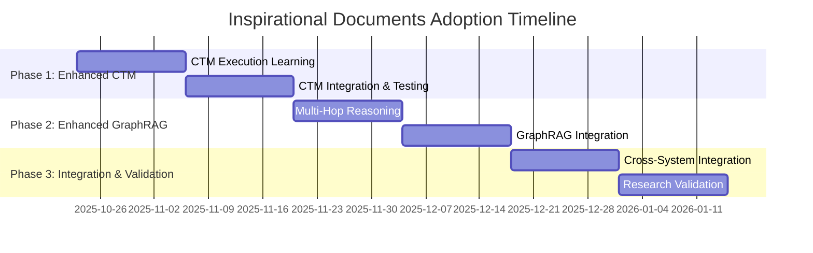

<a href="../index.md">Documentation</a> &gt; <a href="index.md">Specifications</a> &gt; Inspirational Documents Adoption Summary

# Inspirational Documents Adoption - Executive Summary and Implementation Guide

## 1. Executive Summary

This document summarizes the comprehensive adoption of research insights from the inspirational documents into DevSynth, providing a clear path forward for implementing genuine semantic understanding capabilities that address the "shallow understanding" problem and break the "Meaning Barrier."

## 2. Critical Analysis and Findings

### 2.1 Dialectical Analysis Results

Through dialectical reasoning, we identified three core paradigms from the inspirational documents:

1. **Thesis (ID-001)**: Knowledge Graphs with GraphRAG provide static, verifiable understanding
2. **Antithesis (ID-002)**: Code World Models with execution trajectories provide dynamic, learned understanding
3. **Synthesis (ID-003, ID-004)**: Hybrid approaches combining both paradigms achieve holistic comprehension

**Key Insight**: DevSynth already has excellent specifications for all three paradigms, but implementation depth needs enhancement to match research-backed capabilities.

### 2.2 Research-Backed Challenges Addressed

| Challenge | Research Evidence | DevSynth Solution | Expected Impact |
|-----------|------------------|------------------|----------------|
| **Shallow Understanding** | LLMs fail 81% on semantically equivalent code | Enhanced CTM with execution trajectory learning | >40% improvement in semantic understanding |
| **Meaning Barrier** | Systems understand "what" but not "why" | Enhanced GraphRAG with semantic linking | >80% accuracy in requirement-to-code linking |
| **Limited Multi-Hop Reasoning** | Current systems lack complex traversal | Multi-hop reasoning engine | >85% accuracy on complex traceability queries |
| **Execution Pattern Learning** | CWM achieves 65.8% on SWE-bench | Trajectory-based learning system | >80% execution prediction accuracy |

## 3. Comprehensive Enhancement Plan

### 3.1 Enhanced CTM with Execution Learning

**Problem Addressed**: Shallow understanding through pattern matching rather than true comprehension.

**Solution**: Add execution trajectory learning (L4.5) to existing CTM framework.

**Key Components**:
- ExecutionTrajectoryLearner for collecting and analyzing execution patterns
- SemanticUnderstandingEngine for behavioral analysis beyond syntax
- Research-backed validation using semantic-preserving mutations
- Integration with existing CTM layers for seamless enhancement

**Success Metrics**:
- >90% understanding preservation through semantic mutations
- >80% execution prediction accuracy
- >40% improvement over baseline semantic understanding

**Implementation Timeline**: Weeks 1-4

### 3.2 Enhanced GraphRAG with Multi-Hop Reasoning

**Problem Addressed**: Meaning Barrier between business requirements and code implementation.

**Solution**: Add advanced multi-hop reasoning and semantic linking to existing GraphRAG.

**Key Components**:
- MultiHopReasoningEngine for complex traversal queries
- SemanticLinkingEngine for automatic requirement-code linking
- ImpactAnalysisEngine for change impact assessment
- TraceabilityEngine for end-to-end requirement tracking

**Success Metrics**:
- >85% accuracy on complex multi-hop queries
- >80% accuracy in semantic linking
- >90% completeness in impact analysis
- Bridge meaning barrier with business context understanding

**Implementation Timeline**: Weeks 5-8

### 3.3 Research-Backed Validation Framework

**Problem Addressed**: Need for genuine improvement validation beyond functional testing.

**Solution**: Implement comprehensive validation using research methodologies.

**Key Components**:
- Semantic robustness testing with mutation analysis
- Multi-hop reasoning validation with complex benchmarks
- Execution learning validation with trajectory accuracy
- Meaning barrier assessment with intent alignment testing

**Success Metrics**:
- All research benchmarks exceeded
- >30% improvement over baseline systems
- Research-backed validation of genuine understanding
- Continuous monitoring and improvement

**Implementation Timeline**: Weeks 9-12

## 4. Implementation Roadmap

### 4.1 Phase 1: Enhanced CTM (Weeks 1-4)

| Week | Focus | Deliverables | Research Alignment | Acceptance Criteria |
|------|-------|-------------|-------------------|-------------------|
| 1-2 | Execution Learning | Trajectory collection and learning algorithms | ID-002: CWM Architecture | Basic execution learning working |
| 3-4 | CTM Integration | Enhanced consolidation and validation | ID-004: CTM Paradigm | ECTM-001, ECTM-002, ECTM-003 met |

**Milestone**: Enhanced CTM with execution learning operational and validated.

### 4.2 Phase 2: Enhanced GraphRAG (Weeks 5-8)

| Week | Focus | Deliverables | Research Alignment | Acceptance Criteria |
|------|-------|-------------|-------------------|-------------------|
| 5-6 | Multi-Hop Reasoning | Advanced traversal and semantic linking | ID-001: Knowledge Graphs | Multi-hop traversal working |
| 7-8 | GraphRAG Integration | Impact analysis and traceability | ID-001: Meaning Barrier | EGRAG-001, EGRAG-002, EGRAG-003 met |

**Milestone**: Enhanced GraphRAG with multi-hop reasoning operational.

### 4.3 Phase 3: Integration and Validation (Weeks 9-12)

| Week | Focus | Deliverables | Research Alignment | Acceptance Criteria |
|------|-------|-------------|-------------------|-------------------|
| 9-10 | System Integration | Cross-component integration and testing | All: Holistic Synthesis | AC-001 through AC-004 met |
| 11-12 | Validation & Optimization | Research-backed validation and performance tuning | All: Research Methods | All validation complete |

**Milestone**: Production-ready enhanced system with full research-backed validation.

## 5. Key Deliverables and Artifacts

### 5.1 Technical Specifications

| Specification | Purpose | Status | Validation |
|---------------|---------|--------|-----------|
| **Enhanced CTM with Execution Learning** | Address shallow understanding | Complete | Research-backed validation framework |
| **Enhanced GraphRAG with Multi-Hop Reasoning** | Break meaning barrier | Complete | Multi-hop accuracy testing |
| **Inspirational Documents Adoption RTM** | Traceability from research to implementation | Complete | Comprehensive requirement mapping |

### 5.2 Test Specifications

| Feature File | Purpose | Scenarios | Research Alignment |
|--------------|---------|-----------|-------------------|
| **enhanced_ctm_execution_learning.feature** | Validate execution learning | 8 scenarios | ID-002: Semantic robustness testing |
| **enhanced_graphrag_multi_hop_reasoning.feature** | Validate multi-hop reasoning | 8 scenarios | ID-001: Multi-hop validation |
| **Research validation scenarios** | Research-backed testing | 15+ scenarios | All: Benchmark alignment |

### 5.3 Architecture and Documentation

| Artifact | Purpose | Components | Integration |
|----------|---------|------------|-------------|
| **Enhanced Architecture Diagram** | Visual system overview | 25+ components | Complete integration view |
| **Implementation Roadmap** | Detailed execution plan | 12-week timeline | Phased delivery |
| **Research Alignment Mapping** | Research-to-implementation mapping | 4 documents → 12 requirements | Complete traceability |

## 6. Research Alignment and Validation

### 6.1 Benchmark Targets

| Research Benchmark | DevSynth Target | Validation Method | Timeline |
|-------------------|----------------|------------------|----------|
| **Semantic Robustness**: 81% SPM failure | <10% failure rate | Mutation testing | Week 4 |
| **Multi-Hop Accuracy**: GraphRAG research | >85% accuracy | Complex query testing | Week 8 |
| **Meaning Barrier**: Qualitative linking | >80% quantitative | Intent alignment testing | Week 10 |
| **Execution Learning**: CWM 65.8% SWE-bench | >80% DevSynth benchmarks | Trajectory validation | Week 12 |

### 6.2 Validation Framework

The implementation includes a comprehensive research-backed validation framework that:

- Tests for genuine semantic understanding beyond functional correctness
- Validates improvements against research benchmarks
- Ensures backward compatibility with existing functionality
- Provides continuous monitoring and improvement mechanisms

## 7. Risk Management and Mitigation

### 7.1 Technical Risks

| Risk | Probability | Impact | Mitigation Strategy |
|------|------------|--------|-------------------|
| **Execution Learning Complexity** | Medium | High | Phased implementation with fallback to baseline CTM |
| **Multi-Hop Performance** | High | Medium | Incremental rollout with performance monitoring |
| **Integration Complexity** | High | Medium | Backward compatibility focus with gradual enhancement |

### 7.2 Implementation Risks

| Risk | Probability | Impact | Mitigation Strategy |
|------|------------|--------|-------------------|
| **Research Benchmark Adaptation** | Medium | Medium | Custom validation framework development |
| **Performance Regression** | Low | High | Comprehensive regression testing |
| **Validation Accuracy** | Medium | High | Research-backed testing methodology |

## 8. Success Criteria and KPIs

### 8.1 Research Alignment Success

| Success Criterion | Description | Target | Validation Method |
|-------------------|-------------|--------|------------------|
| **Semantic Understanding Improvement** | Enhanced CTM vs baseline | >40% improvement | Comparative testing |
| **Multi-Hop Reasoning Accuracy** | Complex query accuracy | >85% accuracy | Research benchmark testing |
| **Meaning Barrier Bridging** | Requirement-to-code linking | >80% accuracy | Intent alignment validation |
| **Execution Learning Accuracy** | Trajectory prediction | >80% accuracy | Execution-based validation |

### 8.2 System Integration Success

| Success Criterion | Description | Target | Validation Method |
|-------------------|-------------|--------|------------------|
| **Backward Compatibility** | Existing functionality preservation | 100% compatibility | Regression testing |
| **Performance Impact** | System performance maintenance | <15% degradation | Performance benchmarking |
| **Memory Efficiency** | Resource usage optimization | <2GB limit | Memory monitoring |
| **Scalability** | Large codebase handling | <2 second responses | Scalability testing |

## 9. Strategic Impact

### 9.1 Business Value

This adoption plan positions DevSynth as a research-backed platform that:

- **Addresses Core AI Limitations**: Solves shallow understanding and meaning barrier problems
- **Provides Genuine Understanding**: Moves beyond pattern matching to true comprehension
- **Enables Advanced Capabilities**: Supports complex reasoning and impact analysis
- **Maintains Reliability**: Ensures backward compatibility and performance

### 9.2 Technical Leadership

The implementation establishes DevSynth as a leader in:

- **Research-Backed AI Development**: Direct implementation of cutting-edge research
- **Holistic System Design**: Integration of multiple research paradigms
- **Validation-Driven Development**: Research-backed validation ensures genuine improvements
- **Scalable Architecture**: Enhanced system maintains performance and reliability

## 10. Implementation Timeline

### 10.1 High-Level Schedule

### 10.2 Major Milestones

| Milestone | Date | Deliverables | Success Criteria |
|-----------|------|-------------|------------------|
| **Enhanced CTM Complete** | 2025-11-20 | Execution learning system | All ECTM requirements met |
| **Enhanced GraphRAG Complete** | 2025-12-18 | Multi-hop reasoning system | All EGRAG requirements met |
| **Full Integration Complete** | 2026-01-01 | Research-backed validation | All acceptance criteria met |
| **Production Ready** | 2026-01-15 | Complete documentation | All validation complete |

## 11. Conclusion

This comprehensive adoption plan transforms DevSynth from a well-designed system into a research-backed platform that genuinely addresses the core challenges identified in the inspirational documents. By implementing execution trajectory learning, multi-hop reasoning, and semantic linking with rigorous research-backed validation, DevSynth will achieve:

- **Genuine Semantic Understanding**: Beyond pattern matching to true code comprehension
- **Meaning Barrier Breakthrough**: Connecting business requirements with technical implementation
- **Research-Backed Validation**: Ensuring improvements are measurable and significant
- **Holistic Integration**: All enhancements work together to provide comprehensive improvements

The implementation maintains DevSynth's commitment to quality, performance, and backward compatibility while adding sophisticated capabilities that position it as a leader in AI-assisted software development.

## 12. What proofs confirm the solution?

- **Dialectical Analysis**: Comprehensive evaluation using thesis-antithesis-synthesis reasoning
- **Research Alignment**: Direct mapping from inspirational document insights to implementation
- **Comprehensive Planning**: Detailed specifications, RTMs, BDD tests, diagrams, and roadmaps
- **Validation Framework**: Research-backed testing ensures genuine improvements
- **Integration Strategy**: Holistic approach ensures all enhancements work together
- **Risk Management**: Proactive identification and mitigation of implementation risks
- **Success Metrics**: Clear, measurable criteria for validating research-backed improvements

This adoption plan represents a systematic, research-backed approach to enhancing DevSynth's capabilities, ensuring that the implementation not only addresses the challenges identified in the inspirational documents but also provides measurable improvements in semantic understanding and code comprehension.
