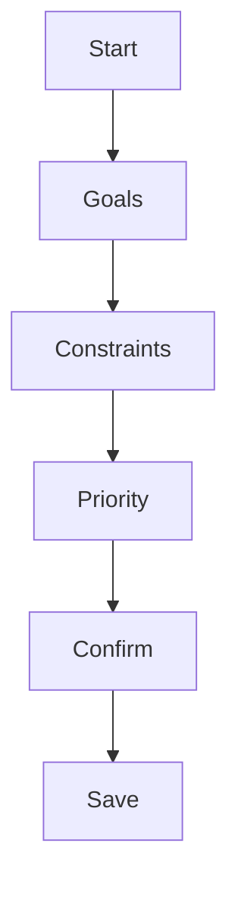
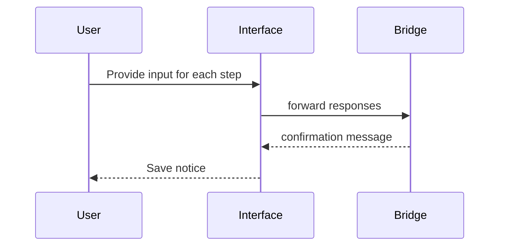

# Interactive Requirements Gathering

This specification defines the prompts, data model and storage format for a guided wizard that collects project goals, constraints and priority rankings. The wizard is available from both the CLI and the Streamlit WebUI via the `UXBridge` abstraction.

## Prompts

1. **Goals** – comma separated list of project goals.
2. **Constraints** – comma separated list of limitations or external requirements.
3. **Priority** – overall project priority (`low`, `medium`, `high`).
4. **Confirmation** – save responses to disk.


Users may type `back` in the CLI or use the *Back* button in the WebUI to revisit previous steps.

## Data Model

```yaml

# requirements_plan.yaml

 goals:
   - example goal 1
   - example goal 2

 constraints:
   - must run offline
   - use Python

 priority: medium
```

The same structure can be saved as JSON if the file extension is `.json`.

## Storage Format

Responses are written to `requirements_plan.yaml` (or `.json`) in the project root. The current project configuration (`devsynth.yml` or `pyproject.toml`) is updated with the fields:

- `goals` – original comma separated string
- `constraints` – original comma separated string
- `priority` – single value


## User Flow





## Pseudocode

```pseudocode
function gather_requirements(output_file="requirements_plan.yaml"):
    steps = ["goals", "constraints", "priority"]
    responses = {}
    index = 0
    while index < len(steps):
        key = steps[index]
        message = prompt_for(key)
        reply = bridge.ask_question(message, choices=choices_for(key))
        if reply == "back":
            index = max(0, index - 1)
            continue
        responses[key] = reply
        index += 1
    write_yaml_or_json(output_file, responses)
    update_project_config(responses)
```

```pseudocode

# WebUI wrapper

if st.button("Start Wizard"):
    gather_requirements_via_bridge(WebUI())
```

The CLI and WebUI share the same workflow implementation through `UXBridge` ensuring consistent behavior across interfaces.