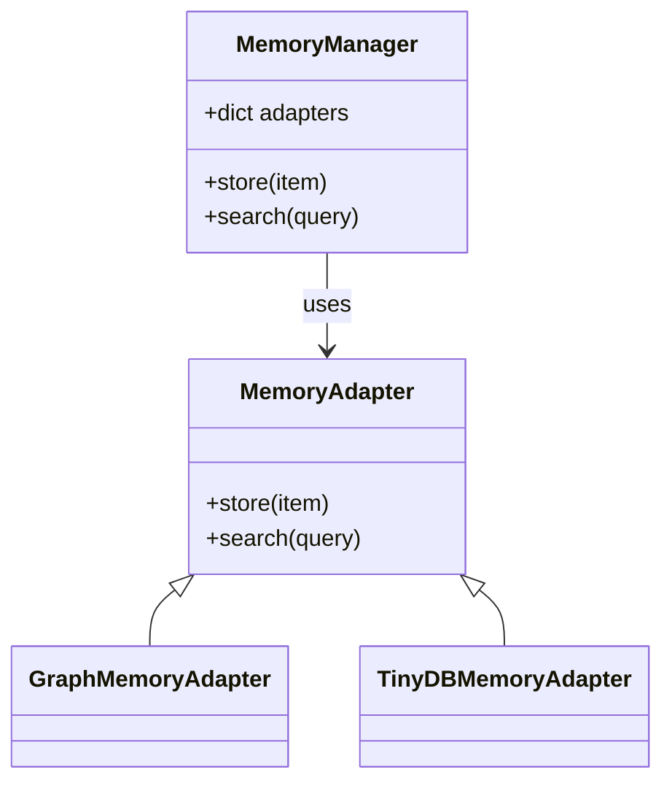

<!--
Required metadata fields:
- author: document author
- date: creation date
- last_reviewed: last review date
- status: draft | review | published
- tags: search keywords
- title: short descriptive name
- version: specification version
-->

# Summary

## Socratic Checklist
- What is the problem?
  - DevSynth requires a unified memory manager that can coordinate heterogeneous storage backends while guaranteeing consistent reads and writes.
- What proofs confirm the solution?
  - Architecture diagrams illustrate how the manager delegates to adapters.
  - Complexity analysis demonstrates linear scalability with the number of adapters.
  - Property‑based simulations verify invariants across randomized operation sequences.

## Motivation

## What proofs confirm the solution?
- BDD scenarios in [`tests/behavior/features/memory_manager_and_adapters.feature`](../../tests/behavior/features/memory_manager_and_adapters.feature) ensure termination and expected outcomes.
- Finite state transitions and bounded loops guarantee termination.

## Specification

### Architecture

### Complexity Analysis

- **Store**: `O(a)` where `a` is the number of registered adapters.
- **Search**: `O(a × c)` where `c` is the adapter‑specific search cost.
- **Adapter registration**: `O(1)` insertion into the manager's adapter map.

### Invariants

- Every adapter implements `store` and `search` with identical semantics.
- Adapter operations are idempotent and never mutate another adapter's state.
- Memory items maintain unique identifiers across adapters.
- Failures are isolated so a malfunctioning adapter does not compromise others.

## Acceptance Criteria
- Architecture diagram reflects the implemented classes and relationships.
- Hypothesis property‑based tests in `tests/behavior/features/memory_adapter_integration.feature`
  execute randomized store/search sequences across adapters and uphold all invariants for
  at least 100 generated examples.
- Empirical benchmarking shows managing two adapters stores and retrieves 100 items in
  under 50 ms per operation, confirming linear scaling.
- Code review and tests demonstrate that invariants remain intact as new adapters are added.
