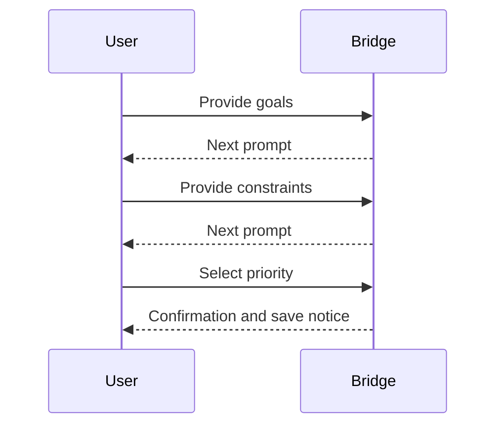

---

title: "Requirements Gathering Workflow"
date: "2025-07-20"
last_reviewed: "2025-07-20"
version: "0.1.0a1"
tags:
  - "specification"
  - "requirements"

status: "draft"
author: "DevSynth Team"
---
<div class="breadcrumbs">
<a href="../index.md">Documentation</a> &gt; <a href="index.md">Specifications</a> &gt; Requirements Gathering Workflow
</div>

# Requirements Gathering Workflow

This document describes the step-wise process for collecting project goals,
constraints and a priority ranking. The workflow is reused by both the CLI and
WebUI through the `UXBridge` abstraction so the same logic can serve different
interfaces.

## Sequence Diagram

<!-- Diagram: Requirements collection sequence -->



## Pseudocode

```pseudocode
function gather_requirements(output_file="requirements_plan.yaml"):
    steps = ["goals", "constraints", "priority"]
    responses = {}
    index = 0
    while index < len(steps):
        key = steps[index]
        message = prompt_for(key)
        reply = bridge.ask_question(message, choices=choices_for(key))
        if reply == "back":
            index = max(0, index - 1)
            continue
        responses[key] = reply
        index += 1
    write_yaml_or_json(output_file, responses)
    update_project_config(responses)

def gather_requirements_via_bridge(bridge, output="requirements_plan.yaml"):
    answers = gather_requirements(output)
    bridge.display_result("Requirements saved", answers)
```

The CLI exposes this via `devsynth requirements gather` while the WebUI
presents a button that runs the same function through its bridge.
## Implementation Status

This feature is **implemented**. Interactive gathering is provided by `src/devsynth/application/requirements/interactions.py` and is accessible via the CLI and WebUI.

## What proofs confirm the solution?
- BDD scenarios in [`tests/behavior/features/requirements_gathering.feature`](../../tests/behavior/features/requirements_gathering.feature) ensure termination and expected outcomes.
- Finite state transitions and bounded loops guarantee termination.
