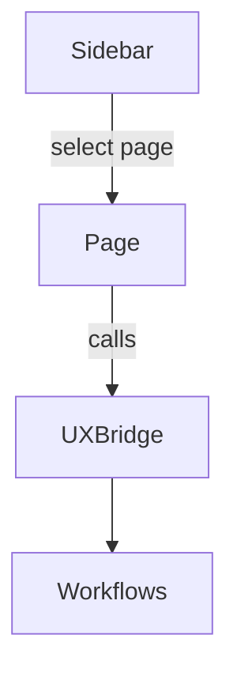
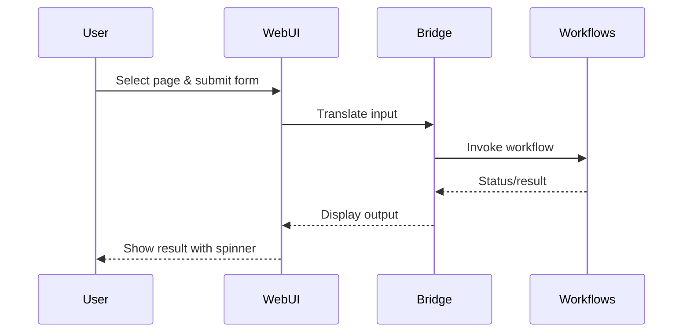

# WebUI Detailed Specification

This document details the features, constraints and interaction flow for the Streamlit based WebUI. The interface builds upon the `UXBridge` abstraction to reuse the same workflow functions as the CLI.

## Features

- Sidebar navigation with pages:
  1. **Project Onboarding** – initialize or onboard a project.
  2. **Requirements** – generate specifications and inspect existing requirements.
  3. **Code Analysis** – analyze the code base for issues.
  4. **Synthesis Execution** – generate tests and code then run the pipeline.
  5. **Configuration Editor** – view and update configuration values.
- Progress spinners and status messages during long running tasks.
- Collapsible sections for optional details to keep the layout tidy.
- Interaction through the `UXBridge` ensures parity with CLI commands.

## Constraints

- Must run locally via `streamlit run src/devsynth/interface/webui.py`.
- Shares the same environment and configuration files as the CLI.
- Requires the user to have Python and dependencies installed.

## Interaction Flow

## Future Improvements

- Live log streaming to the browser.
- Custom theming options.
- Multi‑project dashboard view.
