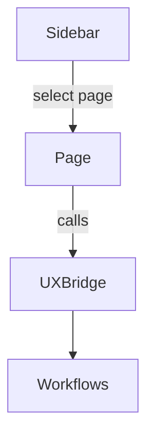
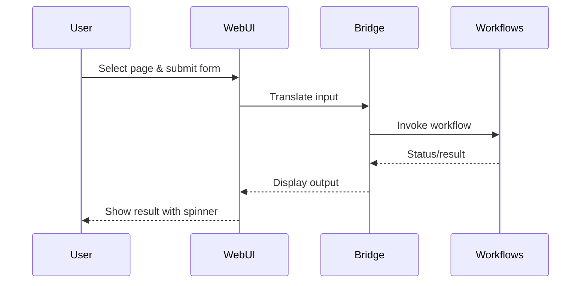

---

title: "WebUI Detailed Specification"
date: "2025-06-18"
last_reviewed: "2025-07-20"
version: "0.1.0a1"
tags:
  - "specification"
  - "webui"
  - "ux"
status: "draft"
author: "DevSynth Team"
---

<a href="../index.md">Documentation</a> &gt; <a href="index.md">Specifications</a> &gt; WebUI Detailed Specification

# WebUI Detailed Specification

This document details the features, constraints and interaction flow for the NiceGUI based WebUI. The interface builds upon the `UXBridge` abstraction to reuse the same workflow functions as the CLI.

## Design Choices

- **NiceGUI Framework** – Chosen for its rapid prototyping capability and
  simple state management.
- **Bridge-Centric** – All workflow calls pass through `UXBridge` so new
  interfaces (e.g., the Agent API) behave identically.
- **Sidebar Navigation** – Pages are organized in a sidebar to mirror the CLI
  command structure.

## Features

- Sidebar navigation with pages:
  1. **Project Onboarding** – initialize or onboard a project.
  2. **Requirements** – generate specifications and inspect existing requirements.
  3. **Code Analysis** – analyze the code base for issues.
  4. **Synthesis Execution** – generate tests and code then run the pipeline.
  5. **Configuration Editor** – view and update configuration values.
- Progress spinners and status messages during long running tasks.
- Collapsible sections for optional details to keep the layout tidy.
- Interaction through the `UXBridge` ensures parity with CLI commands.

<!-- Diagram: WebUI page selection flow -->

## Constraints

- Must run locally via `devsynth webui`.
- Shares the same environment and configuration files as the CLI.
- Requires the user to have Python and dependencies installed.

## Interaction Flow

<!-- Diagram: WebUI interaction sequence -->

## Future Improvements

- Live log streaming to the browser.
- Custom theming options.
- Multi‑project dashboard view.
## Implementation Status

This feature is **implemented**. The NiceGUI UI resides in `src/devsynth/interface/webui.py`.

## What proofs confirm the solution?
- BDD scenarios in [`tests/behavior/features/webui_detailed_spec.feature`](../../tests/behavior/features/webui_detailed_spec.feature) ensure termination and expected outcomes.
- Finite state transitions and bounded loops guarantee termination.
