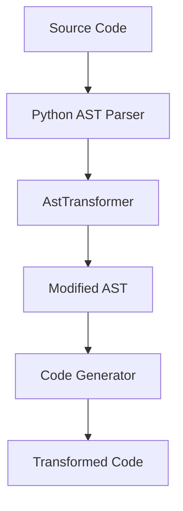

---

author: DevSynth Team
date: '2025-07-23'
last_reviewed: '2025-07-23'
status: draft
tags:
- technical-reference
- ast
- code-transformation
title: AST Transformer Overview
version: "0.1.0a1"
---
<div class="breadcrumbs">
<a href="../index.md">Documentation</a> &gt; <a href="index.md">Technical Reference</a> &gt; AST Transformer Overview
</div>

# AST Transformer Overview

This document describes the `AstTransformer` used in DevSynth to perform automated code refactoring.

## Diagram



*Implementation status: Basic transformations such as renaming identifiers and extracting functions are fully implemented.*

## Pseudocode Example

```python
from devsynth.application.code_analysis.ast_transformer import AstTransformer

code = "def greet(name):\n    print('Hello ' + name)"
transformer = AstTransformer()
new_code = transformer.rename_identifier(code, "name", "username")
```

The transformer can be extended with additional refactoring patterns and code generation utilities.
